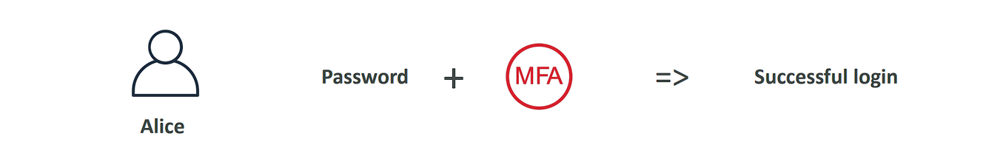

# IAM: Users & Groups

• IAM = Identity and Access Management, Global service
• Root account created by default, shouldn’t be used or shared
• Users are people within your organization, and can be grouped
• Groups only contain users, not other groups
• Users don’t have to belong to a group, and user can belong to multiple groups


# IAM: Permissions

• Users or Groups can be assigned JSON documents called policies
• These policies define the permissions of the users
• In AWS you apply the least privilege principle: don’t give more permissions than a user needs
• In AWS you apply the least privilege principle: don’t give more permissions than a user needs

```json
{
  "Version": "2012-10-17",
  "Statement": [
    {
      "Effect": "Allow",
      "Action": "ec2:Describe*",
      "Resource": "*"
    },
    {
      "Effect": "Allow",
      "Action": "elasticloadbalancing:Describe*",
      "Resource": "*"
    },
    {
      "Effect": "Allow",
      "Action": [
        "cloudwatch:ListMetrics",
        "cloudwatch:GetMetricStatistics",
        "cloudwatch:Describe*"
      ],
      "Resource": "*"
    }
  ]
}
```

## Thực hành (IAM Users & Groups Hands On)

- IAM is a global service
  (IAM => User => Create User => Username: viettu => tích Provide => tích I want to create an IAM user => Custom password => create group => Name: admin => policy: AdminstratorAccess => add that group for user => create > Tag -> Key: Department -> Value: Enineering => create user)

(Dasboard => Account alias => create => alias: aws-viettu-1 => create)


# IAM Policies inheritance


# IAM Policies Structure

- Consists of
  • Version: policy language version, always include “2012-10-17”
  • Id: an identifier for the policy (optional) • Statement: one or more individual statements (required)
  • Statements consists of • Sid: an identifier for the statement (optional) • Effect: whether the statement allows or denies acces (Allow, Deny)
- Principal: `account/user/role` to which this policy applied to
  • Action: list of actions this policy allows or denies
  • Resource: list of resources to which the actions applied to
  • Condition: conditions for when this policy is in effect (optional)

# IAM Policies Hand On (thực hành)

(Đầu tiên đăng nhập 2 account 1 user root và 1 user vừa mới tạo truy cập vào Iam User)
(Tiếp theo xóa User đó ra khỏi group, và kiểm tra xem User có quyền get User ở tab User hay không)

(IAM => User => viettu => Add permision => Attach policy directly: IAMReadOnlyAccess (Read anything on IAM) => add)

(IAM => Groups => Create group => name: developer => add user: viettu => Add quyền bất kỳ)


(IAM => Policy => Create => chọn bất ký quyền => MYAIMPolicy => create)


# IAM – Password Policy (Protect User)

```plaintext
-  Strong passwords = higher security for your account
- In AWS, you can setup a password policy:
    • Set a minimum password length
    • Require specific character types:
        • including uppercase letters
        • lowercase letters
        • numbers
        • non-alphanumeric characters
    • Allow all IAM users to change their own passwords
    • Require users to change their password after some time (password expiration)
    • Prevent password re-use
```

# Multi Factor Authentication - MFA

• Users have access to your account and can possibly change configurations or delete resources in your AWS account
• You want to protect your Root Accounts and IAM users
• MFA = password you know + security device you own

• Main benefit of MFA: if a password is stolen or hacked, the account is not compromised

# How can users access AWS ?

```plaintext
• To access AWS, you have three options:
    • AWS Management Console (protected by password + MFA)
    • AWS Command Line Interface (CLI): protected by access keys
    • AWS Software Developer Kit (SDK) - for code: protected by access keys
• Access Keys are generated through the AWS Console
• Users manage their own access keys
• Access Keys are secret, just like a password. Don’t share them
• Access Key ID ~= username
• Secret Access Key ~= password
```

## What’s the AWS SDK?

```plain text
• AWS Software Development Kit (AWS SDK)
• Language-specific APIs (set of libraries)
• Enables you to access and manage AWS services
programmatically
• Embedded within your application
• Supports
    • SDKs (JavaScript, Python, PHP, .NET, Ruby, Java, Go, Node.js,
    C++)
    • Mobile SDKs (Android, iOS, …)
    • IoT Device SDKs (Embedded C, Arduino, …)
• Example: AWS CLI is built on AWS SDK for Python
```

# AWS CLI Hand On (Thực hành)

(Tạo Acces key)

```bash
aws iam list-users
```


# IAM Roles for Services

```plaintext
• Some AWS service will need to perform actions on your behalf
• To do so, we will assign permissions to AWS services with IAM Roles
• Common roles:
 • EC2 Instance Roles
 • Lambda Function Roles
 • Roles for CloudFormation
```

# IAM Roles Hands On (Thực hành)

(IAM => Role => Create => ec2 => IAMReadOnlyAccess => name: DemoRoleForEC2 => create role)

# IAM Security Tools (Báo cao)

(Và cuối cùng, chúng tôi có thể kiểm tra việc sử dụng IAM của mình bằng cách tạo báo cáo thông tin đăng nhập IAM và cũng sử dụng dịch vụ tư vấn truy cập IAM.)

```plantext
• IAM Credentials Report (account-level)
    • a report that lists all your account's users and the status of their various credentials
• IAM Access Advisor (user-level)
    • Access advisor shows the service permissions granted to a user and when those services were last accessed.
    • You can use this information to revise your policies.
```
