# Amazon S3 – Advanced

# Amazon S3 – Moving between Storage Classes

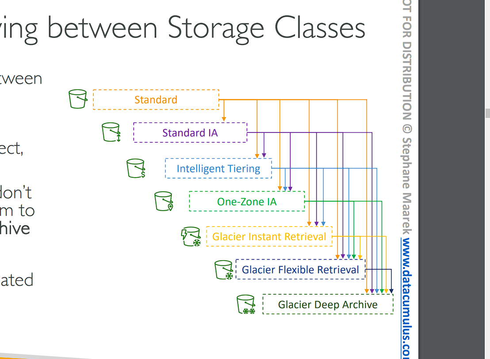
• You can transition (chuyển đổi) objects between storage classes
• For infrequently accessed object, move them to Standard IA
• For archive objects that you don’t need fast access to, move them to Glacier or Glacier Deep Archive
• Moving objects can be automated using a Lifecycle Rules

# Amazon S3 – Lifecycle Rules

```
• Transition Actions – configure objects to transition to another storage class
    • Move objects to Standard IA class 60 days after creation
    • Move to Glacier for archiving after 6 months
• Expiration actions (hành động hết hạn) – configure objects to expire (delete) after some time
    • Access log files can be set to delete after a 365 days
    • Can be used to delete old versions of files (if versioning is enabled)
    • Can be used to delete incomplete Multi-Part uploads (xóa các upload chưa hoàn chỉnh)
• Rules can be created for a certain prefix (tiền tố nhất định) (example: s3://mybucket/mp3/*)
• Rules can be created for certain objects Tags (example: Department: Finance)
```

# Amazon S3 – Lifecycle Rules (Scenario 1)

• Your application on EC2 creates images thumbnails after profile photos are uploaded to Amazon S3. These thumbnails can be easily recreated, and only need to be kept for 60 days. The source images should be able to be immediately retrieved for these 60 days, and afterwards, the user can wait up to 6 hours. How would you design this?
• S3 source images can be on Standard, with a lifecycle configuration to transition them to Glacier after 60 days
• S3 thumbnails can be on One-Zone IA, with a lifecycle configuration to expire them (delete them) after 60 days

# Amazon S3 – Lifecycle Rules (Scenario 2)

• A rule in your company states that you should be able to recover your deleted S3 objects immediately for 30 days, although this may happen rarely (hiếm khi xảy ra). After this time, and for up to 365 days, deleted objects should be recoverable within 48 hours.
• Enable S3 Versioning in order to (để) have object versions, so that “deleted objects” are in fact hidden by a “delete marker” and can be recovered
• Transition the “noncurrent versions” of the object to Standard IA
• Transition afterwards (sau đó) the “noncurrent versions” to Glacier Deep Archive

# Amazon S3 Analytics – Storage Class Analysis

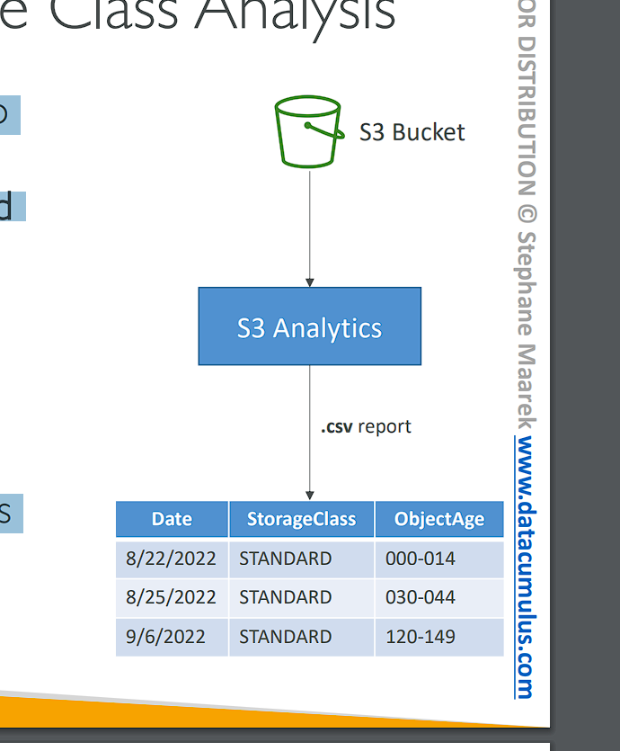
• Help you decide when to transition objects to the right storage class (Help you decide when to transition objects to the right storage class)
• Recommendations for Standard and Standard IA
• Does NOT work for One-Zone IA or Glacier
• Report is updated daily
• 24 to 48 hours to start seeing data analysis
• Good first step to put together Lifecycle Rules (or improve them)!

# S3 Lifecycle Rules - Hands On

(S3 => "viettu-s3-demo" => Management => Lifecycle rules => create lifecyle rule => rule name: DemoRule => chọn Apply to all objects in the bucket => Lifecycle rule actions -> tích Move current version of object between classes => class transitions: Standard-IA -> Days after: 30 => Add transition -> class transitions: Intelligent-Tiering -> days after: 60 => Add transition -> class transitions: Glacier Instant Retrieval => day after: 90 => Add transition -> Glacier Flexible Retrival -> days after: 180 => Add transition -> Glacier Deep Archive -> days after: 365 => Tích Move nonncurrent version of object between storage class -> storage class: Glacier Flexible Retriva -> day after: 90 => Tích Expire curent version of object -> day after: 700 => Tích Permanetly delete noncurrent version of object -> days after: 700 => create rule)

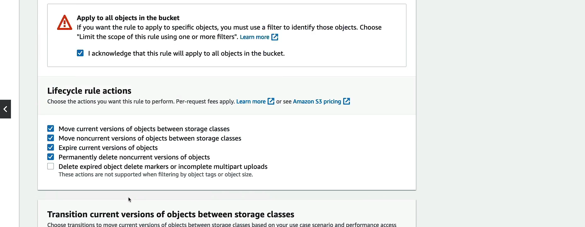
Trong bối cảnh Amazon S3 (Simple Storage Service) của AWS, "noncurrent" đề cập đến các phiên bản cũ của một đối tượng khi Versioning (phiên bản) được kích hoạt. Cụ thể, S3 cung cấp tính năng quản lý nhiều phiên bản của đối tượng, và khi một phiên bản mới của đối tượng được tải lên, phiên bản cũ hơn sẽ trở thành "noncurrent" (không phải phiên bản hiện tại).

# S3 – Requester Pays

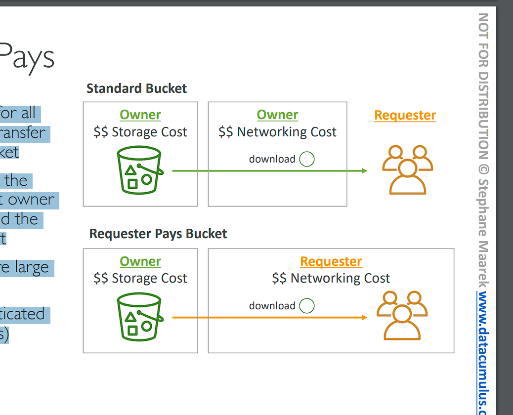

• In general, bucket owners pay for all Amazon S3 storage and data transfer costs associated (liên quan đến) with their bucket
• With Requester Pays buckets, the requester instead of (thay vì) the bucket owner pays the cost of the request and the data download from the bucket
• Helpful when you want to share large datasets with other accounts
• The requester must be authenticated in AWS (cannot be anonymous)

```
S3 – Requester Pays là một tùy chọn trong Amazon S3 cho phép chủ sở hữu bucket chuyển chi phí truy cập và tải dữ liệu cho người yêu cầu (requester) thay vì chính chủ bucket. Đây là cách hoạt động và ý nghĩa của tính năng này:

1. Thông thường (bucket thông thường): Chủ sở hữu bucket (bucket owner) chịu tất cả các chi phí liên quan đến lưu trữ và truy xuất dữ liệu trong S3, bao gồm cả chi phí tải xuống dữ liệu.

2. Requester Pays Buckets: Khi kích hoạt tùy chọn Requester Pays, mọi chi phí liên quan đến việc yêu cầu (request) và tải dữ liệu từ bucket sẽ được chuyển cho người yêu cầu (requester), tức là người thực hiện yêu cầu truy cập và tải dữ liệu.

- Chi phí này bao gồm phí yêu cầu dữ liệu và phí truyền tải dữ liệu ra khỏi S3 (data transfer).
3. Mục đích:

- Tính năng này rất hữu ích khi chủ sở hữu bucket muốn chia sẻ các bộ dữ liệu lớn với nhiều tài khoản AWS khác mà không muốn gánh chịu chi phí truy xuất dữ liệu.
- Thay vì chủ sở hữu bucket phải trả tiền cho mọi yêu cầu tải xuống từ nhiều người khác nhau, chi phí này được chuyển cho người thực hiện yêu cầu tải dữ liệu.
4. Yêu cầu:

- Để sử dụng tính năng Requester Pays, người yêu cầu cần phải được xác thực trong AWS, tức là họ phải có tài khoản AWS. Điều này đảm bảo rằng không có yêu cầu ẩn danh nào có thể tải dữ liệu mà không thanh toán.
## Tình huống sử dụng:
Ví dụ, nếu một tổ chức cung cấp bộ dữ liệu công khai lớn (như dữ liệu nghiên cứu khoa học), họ có thể sử dụng Requester Pays để cho phép người dùng tải xuống dữ liệu, nhưng yêu cầu người dùng trả phí truy xuất thay vì tổ chức phải chịu chi phí.
```

# S3 Event Notifications

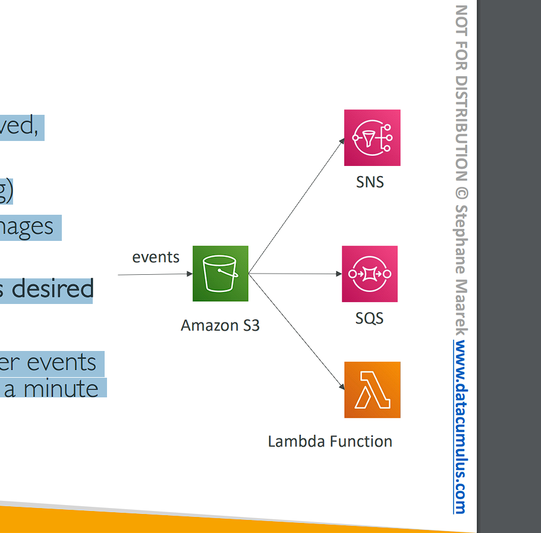
• S3:ObjectCreated, S3:ObjectRemoved, S3:ObjectRestore, S3:Replication…
• Object name filtering possible (\*.jpg)
• Use case: generate thumbnails of images uploaded to S3
• Can create as many “S3 events” as desired
• S3 event notifications typically deliver events in seconds but can sometimes take a minute or longer

# S3 Event Notifications – IAM Permissions

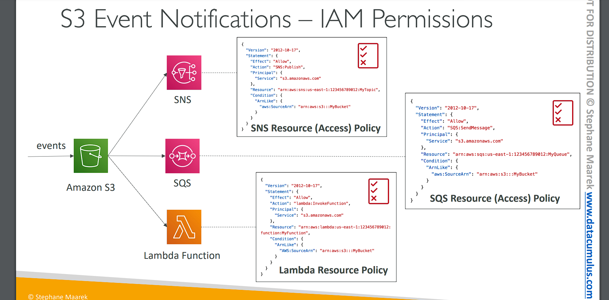
SNS phải tạo IAM policy attach to SNS, cho phép S3 bucket send message directly into the SNS topic

# S3 Event Notifications with Amazon EventBridge

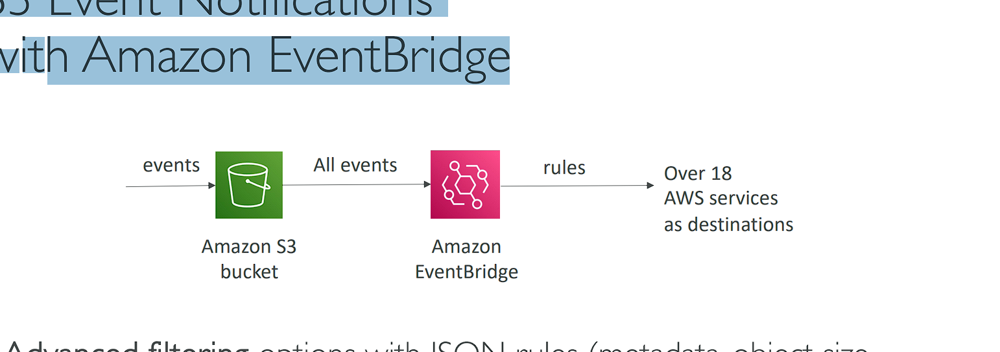

Advanced filtering options with JSON rules (metadata, object size, name...)
• Multiple Destinations – ex Step Functions, Kinesis Streams / Firehose…
• EventBridge Capabilities – Archive (lưu trữ sự kiện), Replay Events (phát lại sự kiện), Reliable delivery

# S3 Event Notifications - Hands On

(S3 => create bucket => name: "demo-viettu-v3-event-notification" => create bucket)
(chọn bucket đó => Properties => Amazon EventBridge => Edit => send notification to amazon EventBridge for all events in this bucket: On => save change)
(SQS => create sqs => name: "DemoS3Notification" => create queue => Access policy => edit => policy generator -> Principal: \* -> Action: SendMessage -> Resource: xxx => paste policy vô => save)

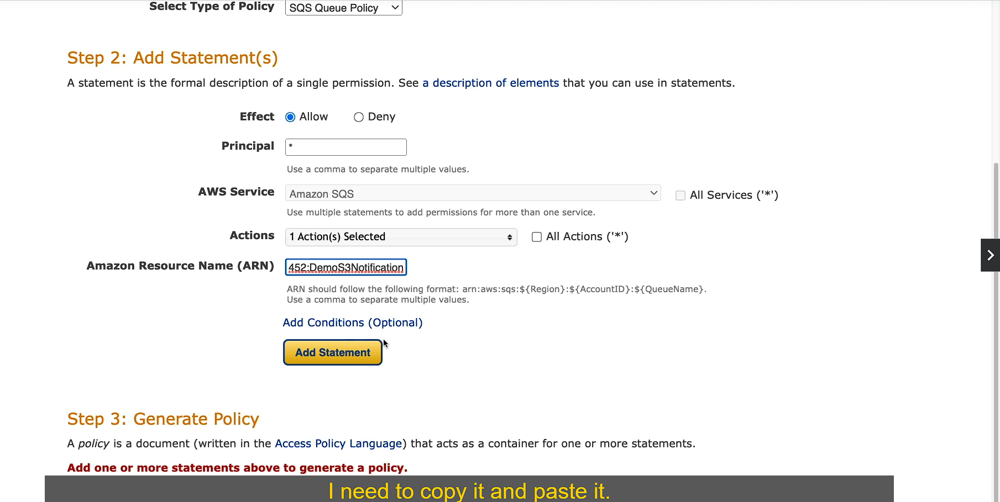
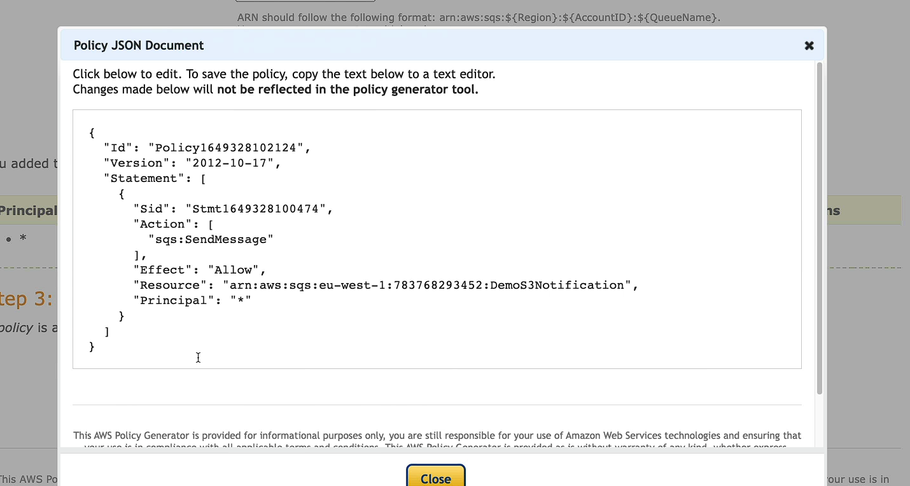
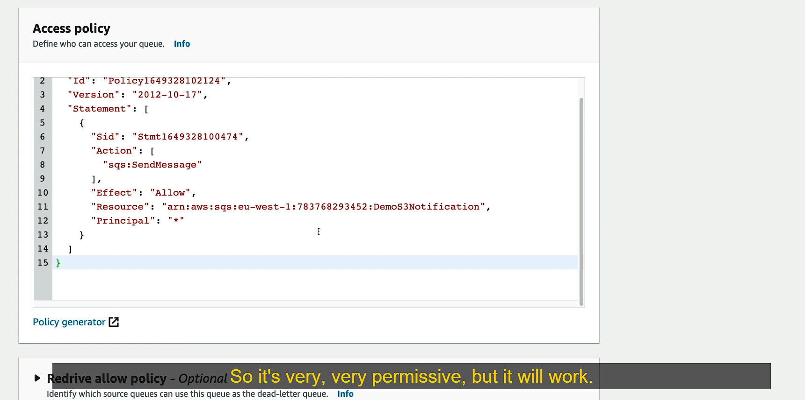
(Event notifications => create event => event name:
"DemoEventNotification" => Event types: tích All Object create event => Destination: SQS queue => Specify SQS queue: tích Choose from your SQS queue => SQS queue: "DemoS3Notification" => save change)
(Từ bucket vừa tạo upload file lên)
Kiểm tra SQS thì sẽ thấy một mesage khi vừa upload lên S3
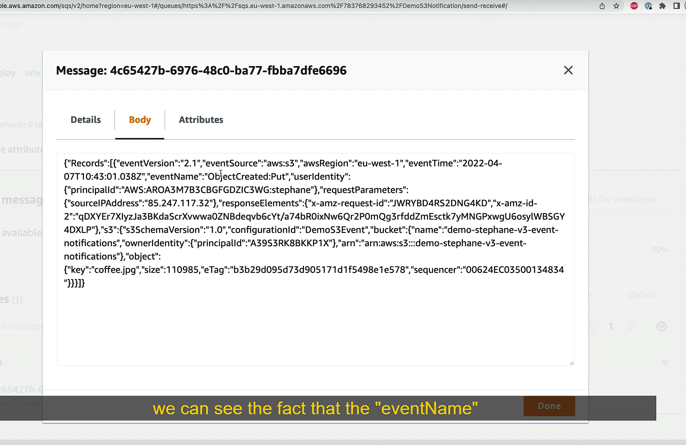

# S3 – Baseline Performance

```
• Amazon S3 automatically scales to high request rates, latency 100-200 ms
• Your application can achieve at least 3,500 PUT/COPY/POST/DELETE or 5,500 GET/HEAD requests per second per prefix in a bucket.
• There are no limits to the number of prefixes in a bucket.
• Example (object path => prefix):
    • bucket/folder1/sub1/file => /folder1/sub1/
    • bucket/folder1/sub2/file => /folder1/sub2/
    • bucket/1/file => /1/
    • bucket/2/file => /2/
• If you spread reads across all four prefixes evenly, you can achieve 22,000
requests per second for GET and HEAD
```

```

Hãy để tôi giải thích chi tiết hơn với cách tiếp cận từng phần:

1. Hiệu suất mặc định của S3:
- Amazon S3 có thể tự động xử lý nhiều yêu cầu truy cập dữ liệu cùng lúc. Ví dụ: bạn có thể gửi hàng nghìn yêu cầu tải dữ liệu, thêm dữ liệu, hoặc xóa dữ liệu mà S3 vẫn có thể xử lý mà không bị chậm.
- Thời gian trả lời cho mỗi yêu cầu (latency) thường khoảng 100-200 ms, tức là khá nhanh.
2. Giới hạn yêu cầu theo prefix:
- Một prefix là phần đầu của đường dẫn của đối tượng trong bucket. Ví dụ:
    - Đối tượng có đường dẫn bucket/folder1/sub1/file có prefix là /folder1/sub1/.
    - Đối tượng bucket/1/file có prefix là /1/.
- S3 có thể xử lý tối đa 5,500 yêu cầu GET/HEAD mỗi giây và 3,500 yêu cầu PUT/COPY/POST/DELETE mỗi giây cho mỗi prefix.
3. Không giới hạn số lượng prefix:
- Bạn có thể tạo bao nhiêu prefix tùy thích trong một bucket. Ví dụ: bạn có thể có 1000 prefix khác nhau nếu cần.
- Mỗi prefix sẽ có thể xử lý số lượng yêu cầu độc lập với các prefix khác. Điều này có nghĩa là nếu bạn sử dụng nhiều prefix, bạn có thể tăng hiệu suất tổng thể của bucket.
4. Ví dụ cụ thể:
- Giả sử bạn có 4 prefix:
/folder1/sub1/
/folder1/sub2/
/1/
/2/
- Mỗi prefix có thể xử lý tối đa 5,500 yêu cầu GET/HEAD mỗi giây. Vậy nếu bạn phân phối đều các yêu cầu GET/HEAD lên cả 4 prefix, bạn có thể đạt tới 22,000 yêu cầu GET/HEAD mỗi giây (5,500 * 4).
5. Tóm tắt:
- Nếu bạn chỉ có 1 prefix, bạn bị giới hạn ở mức 5,500 yêu cầu GET/HEAD mỗi giây.
- Nhưng nếu bạn có 4 prefix, mỗi prefix có thể xử lý 5,500 yêu cầu, bạn có thể tăng số yêu cầu lên 22,000.
- Nhiều prefix giúp tăng khả năng xử lý yêu cầu của bạn lên rất nhiều.


```

# S3 Performance

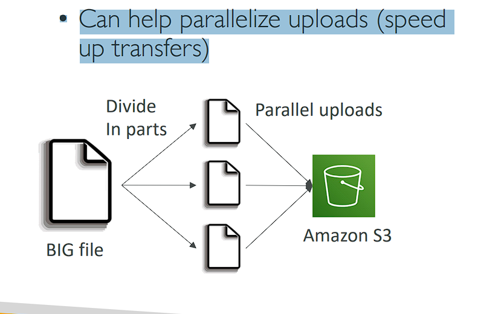

```
• Multi-Part upload:
    • recommended for files > 100MB, must use for files > 5GB
    • Can help parallelize (song song) uploads (speed up transfers)
```

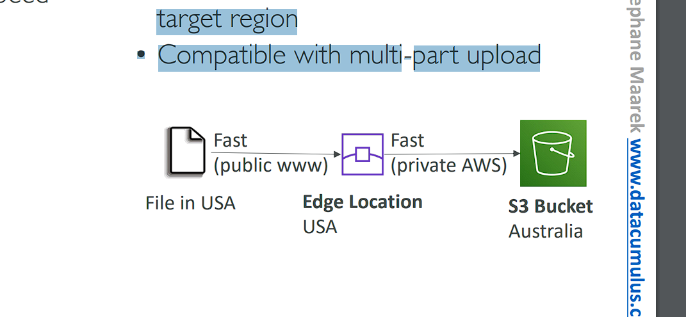

```
• S3 Transfer Acceleration (gia tốc)
    • Increase transfer speed by transferring file to an AWS edge location which will forward the data to the S3 bucket in the target region
    • Compatible (tương thích) with multi-part upload
```

1. Tăng tốc độ truyền tải:

- Khi bạn sử dụng S3 Transfer Acceleration, dữ liệu không được gửi trực tiếp đến S3 bucket mà thay vào đó sẽ được chuyển tới một AWS edge location gần người dùng nhất.
- AWS edge location là các trung tâm dữ liệu toàn cầu của AWS, nằm ở các vị trí gần với người dùng để giảm thiểu độ trễ mạng.
- Từ đó, AWS edge location sẽ chuyển tiếp dữ liệu nhanh chóng đến S3 bucket trong vùng mục tiêu (target region).

Ví dụ:

- Nếu bạn đang ở Việt Nam và S3 bucket của bạn nằm ở US East (N. Virginia), thông thường dữ liệu sẽ phải di chuyển một khoảng cách lớn, có thể mất nhiều thời gian. Khi sử dụng S3 Transfer Acceleration, dữ liệu của bạn sẽ được gửi đến AWS edge location gần bạn (có thể ở Singapore hoặc Tokyo) trước, và từ đó chuyển nhanh đến bucket ở N. Virginia thông qua mạng `Private AWS`, giúp tăng tốc quá trình tải lên.

Tóm lại, S3 Transfer Acceleration là giải pháp tăng tốc truyền tải dữ liệu trên toàn cầu thông qua mạng lưới các edge location của AWS.

# S3 Performance – S3 Byte-Range Fetches (tìm nạp phạm vi S3)

• Parallelize GETs by requesting specific byte ranges
• Better resilience in case of failures Can be used to speed up downloads
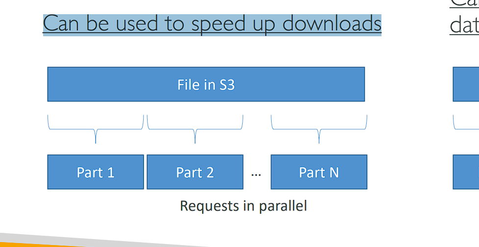

Can be used to retrieve only partial data (phần đầu tập tin) (for example the head of a file)
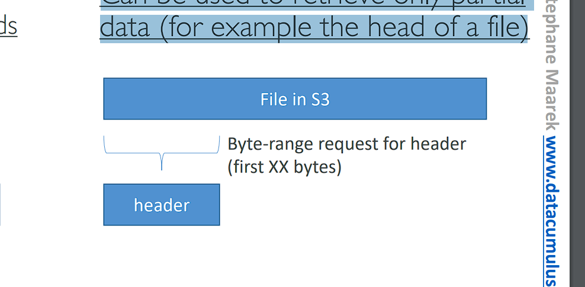

```
S3 Byte-Range Fetches (Tìm nạp phạm vi S3) là kỹ thuật sử dụng trong Amazon S3 để tăng tốc tải xuống và cải thiện khả năng kháng lỗi bằng cách tải dữ liệu từ các byte cụ thể của một tệp. Dưới đây là cách giải thích chi tiết từng ý:

1. Parallelize GETs by requesting specific byte ranges (Song song hóa GET bằng cách yêu cầu các phạm vi byte cụ thể):
- Thay vì tải toàn bộ tệp trong một lần tải (GET request), bạn có thể yêu cầu các phạm vi byte cụ thể.
- Điều này cho phép bạn tải các phần khác nhau của tệp song song, giúp tăng tốc độ tải xuống so với việc tải toàn bộ tệp chỉ qua một yêu cầu.
- Ví dụ: Bạn có thể yêu cầu byte từ 0–25MB và 25–50MB đồng thời từ một tệp 50MB.
2. Better resilience in case of failures (Kháng lỗi tốt hơn trong trường hợp có sự cố):
- Nếu quá trình tải một phạm vi byte gặp lỗi, bạn chỉ cần tải lại phần đó thay vì phải tải lại toàn bộ tệp.
- Điều này giúp tiết kiệm thời gian và băng thông, đặc biệt là khi tải các tệp lớn qua mạng không ổn định.
3. Can be used to speed up downloads (Có thể được sử dụng để tăng tốc tải xuống):
- Tính năng này rất hiệu quả khi bạn cần tải các tệp lớn. Bằng cách chia tệp thành nhiều phần nhỏ và tải song song, bạn có thể tận dụng tối đa băng thông mạng, giúp giảm thời gian tải xuống tổng thể.
4. Can be used to retrieve only partial data (Có thể dùng để chỉ lấy một phần dữ liệu):
- Bạn không cần phải tải toàn bộ tệp. Có thể chỉ cần tải một phần, chẳng hạn như phần đầu của tệp hoặc một đoạn cụ thể, để xử lý nhanh chóng.
- Ví dụ: Nếu bạn chỉ cần đọc phần đầu của một tệp log lớn, bạn có thể yêu cầu tải về chỉ vài MB đầu tiên của tệp đó mà không phải tải toàn bộ tệp.
## Ví dụ thực tế:
- Khi bạn có một tệp rất lớn và chỉ cần kiểm tra phần đầu, bạn có thể chỉ cần tải xuống phạm vi byte tương ứng với phần đó, tiết kiệm thời gian và chi phí.
- Nếu mạng gặp sự cố khi tải một phần, chỉ cần tải lại phạm vi byte bị lỗi mà không ảnh hưởng đến các phần đã tải thành công.
## Tóm lại:
S3 Byte-Range Fetches giúp tăng tốc độ tải xuống, cải thiện khả năng xử lý lỗi, và tiết kiệm băng thông bằng cách chỉ tải những phần cần thiết của tệp từ S3.
```

# S3 Select & Glacier Select

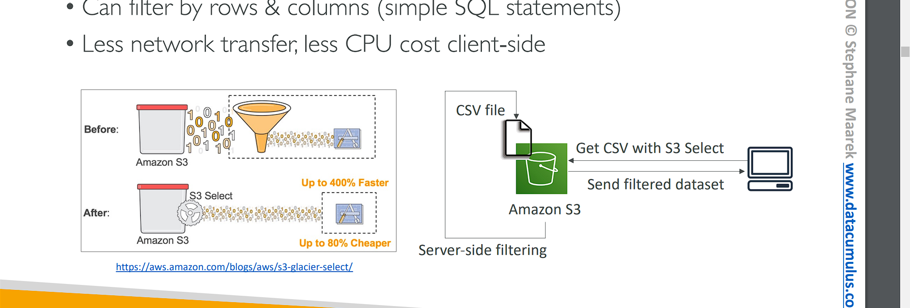
• Retrieve less data using SQL by performing server-side filtering
• Can filter by rows & columns (simple SQL statements)
• Less network transfer, less CPU cost client-side

# S3 Batch Operations

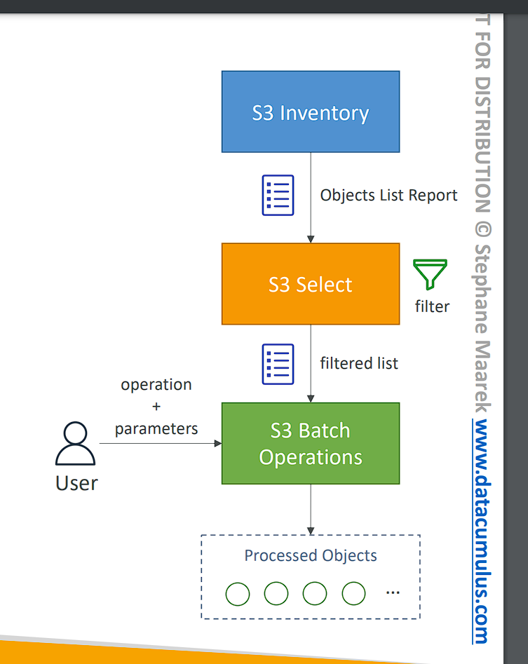

```
• Perform bulk operations on existing S3 objects with a single request, example: (thực hiện các hoạt động hàng loạt trên object s3 hiện có)
    • Modify object metadata & properties
    • Copy objects between S3 buckets
    • Encrypt un-encrypted objects
    • Modify ACLs, tags
    • Restore objects from S3 Glacier
    • Invoke Lambda function (gọi hàn lambda) to perform (thực hiện) custom action on each object
• A job consists of a list of objects, the action to perform, and optional parameters
• S3 Batch Operations manages retries, tracks progress, sends completion notifications, generate reports …
• You can use S3 Inventory to get object list and use S3 Select to filter your objects
```

```
S3 Batch Operations là một tính năng của Amazon S3 cho phép bạn thực hiện các thao tác hàng loạt trên các đối tượng hiện có trong S3 một cách dễ dàng chỉ với một yêu cầu. Dưới đây là giải thích chi tiết:

1. Thực hiện các thao tác hàng loạt (Bulk Operations):
- S3 Batch Operations cho phép bạn thực hiện các thao tác trên nhiều đối tượng S3 cùng lúc. Thay vì gửi yêu cầu riêng lẻ cho từng đối tượng, bạn có thể thao tác trên hàng ngàn hoặc hàng triệu đối tượng với một yêu cầu duy nhất.

- Ví dụ các thao tác có thể thực hiện:

    - Sửa đổi metadata và thuộc tính của đối tượng: Thay đổi thông tin như loại nội dung (content type), thời gian tồn tại (TTL), v.v.
    - Sao chép đối tượng giữa các bucket S3: Chuyển dữ liệu từ một bucket này sang bucket khác.
    - Mã hóa các đối tượng chưa được mã hóa: Thêm mã hóa cho các đối tượng hiện tại chưa được mã hóa.
    - Sửa đổi ACLs và tags: Thay đổi quyền truy cập (Access Control Lists - ACL) và thẻ metadata của đối tượng.
    - Khôi phục các đối tượng từ S3 Glacier: Nếu đối tượng được lưu trữ trong Glacier, bạn có thể khôi phục chúng.
2. Tích hợp Lambda để thực hiện các hành động tùy chỉnh:
- Bạn có thể kích hoạt hàm Lambda để thực hiện hành động tùy chỉnh cho từng đối tượng. Ví dụ, khi bạn cần xử lý dữ liệu hoặc chuyển đổi đối tượng theo cách tùy chỉnh, bạn có thể sử dụng Lambda.
3. Quản lý tự động:
- S3 Batch Operations quản lý toàn bộ quá trình thực thi, bao gồm:
    - Retry: Tự động thử lại nếu yêu cầu gặp lỗi.
    - Theo dõi tiến trình: Giúp bạn theo dõi trạng thái và tiến độ của công việc.
    - Gửi thông báo khi hoàn thành: Thông báo kết quả sau khi hoàn thành qua SNS hoặc các dịch vụ khác.
    - Tạo báo cáo: Tạo báo cáo chi tiết về kết quả của các thao tác.
4. Sử dụng S3 Inventory và S3 Select:
- Bạn có thể sử dụng S3 Inventory để liệt kê tất cả các đối tượng trong một bucket. Đây là một cách hiệu quả để tạo danh sách đối tượng trước khi thực hiện các thao tác hàng loạt.
- Sau đó, bạn có thể dùng S3 Select để lọc các đối tượng bạn muốn thực hiện thao tác dựa trên các điều kiện nhất định (như metadata, tags).
5. Cấu trúc của một công việc (Job):
- Một công việc trong S3 Batch Operations bao gồm:
    - Danh sách đối tượng (list of objects): Các đối tượng mà bạn muốn thao tác.
    - Hành động thực hiện: Ví dụ như sao chép đối tượng, thay đổi metadata, mã hóa, v.v.
    - Các tham số tùy chọn (optional parameters): Các cấu hình bổ sung cần thiết để thực hiện công việc.
##  Tóm lại:
S3 Batch Operations là công cụ mạnh mẽ để quản lý hàng loạt đối tượng trong S3. Bạn có thể thực hiện các thao tác phức tạp và số lượng lớn chỉ với một yêu cầu, giúp tiết kiệm thời gian và công sức.
```

# S3 – Storage Lens

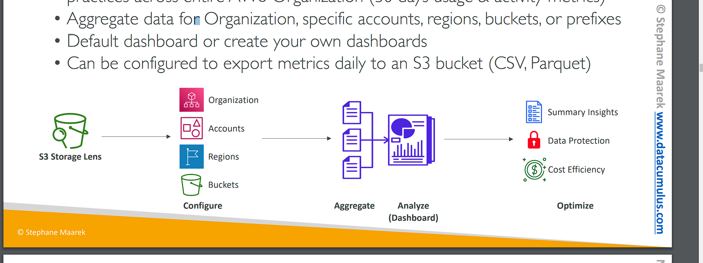
• Understand, analyze, and optimize storage across entire (toàn bộ) AWS Organization
• Discover anomalies (phát hiện bất thường), identify cost efficiencies (xác định hiệu quả chi phí), and apply data protection best practices across entire AWS Organization (30 days usage & activity metrics (số liệu hoạt động))
• Aggregate data (tổng hợp dữ liệu) for Organization, specific accounts, regions, buckets, or prefixes
• Default dashboard or create your own dashboards
• Can be configured to export metrics daily to an S3 bucket (CSV, Parquet)

```
S3 Storage Lens là một công cụ giám sát và phân tích mạnh mẽ của AWS, cung cấp các thông tin chi tiết về việc sử dụng và hiệu suất lưu trữ trong Amazon S3. Dưới đây là giải thích chi tiết về các tính năng của nó:

1. Understand, analyze, and optimize storage across entire AWS Organization:

- S3 Storage Lens cho phép bạn hiểu, phân tích và tối ưu hóa việc sử dụng lưu trữ của toàn bộ tổ chức AWS. Nó không chỉ giới hạn ở một tài khoản AWS mà còn có thể mở rộng để quản lý tất cả tài khoản trong một tổ chức AWS.
2. Discover anomalies, identify cost efficiencies, and apply data protection best practices across entire AWS Organization (30 days usage & activity metrics):

- Nó giúp bạn phát hiện các bất thường, xác định các cơ hội tiết kiệm chi phí và áp dụng các phương pháp bảo vệ dữ liệu tốt nhất dựa trên 30 ngày sử dụng và số liệu hoạt động. Điều này rất hữu ích trong việc giảm chi phí lưu trữ và tăng tính bảo mật cho dữ liệu.
3. Aggregate data for Organization, specific accounts, regions, buckets, or prefixes:

- Bạn có thể tổng hợp dữ liệu ở nhiều cấp độ khác nhau như: toàn bộ tổ chức, từng tài khoản cụ thể, khu vực (regions), bucket hoặc tiền tố (prefixes) để có cái nhìn chi tiết về việc sử dụng lưu trữ.
4. Default dashboard or create your own dashboards:

- AWS cung cấp một bảng điều khiển mặc định, hoặc bạn có thể tự tạo các bảng điều khiển của riêng mình để giám sát các thông số lưu trữ quan trọng theo nhu cầu.
5. Can be configured to export metrics daily to an S3 bucket (CSV, Parquet):

Bạn có thể cấu hình để xuất các số liệu hàng ngày sang một bucket S3 dưới các định dạng như CSV hoặc Parquet, giúp dễ dàng phân tích dữ liệu bằng các công cụ khác.
```

# Storage Lens – Default Dashboard

• Visualize summarized insights and trends for both free and advanced metrics
• Default dashboard shows Multi-Region and Multi-Account data
• Preconfigured by Amazon S3
• Can’t be deleted, but can be disabled

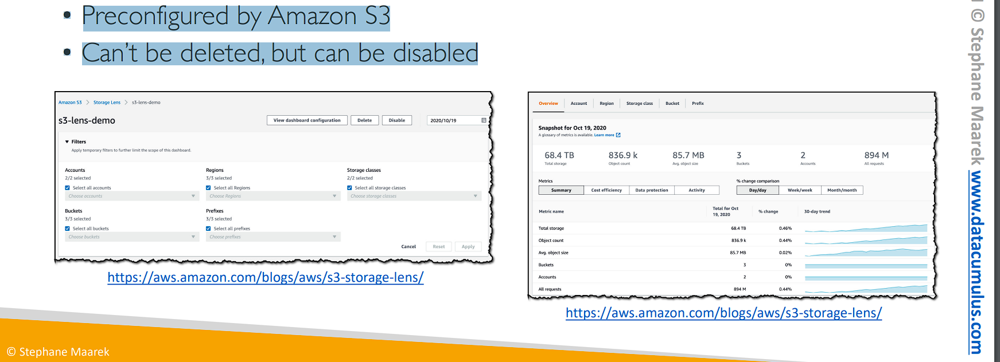

```

Amazon S3 Storage Lens là một công cụ cho phép bạn theo dõi và phân tích việc sử dụng dữ liệu và hoạt động của Amazon S3. Đây là một số điểm chính về Storage Lens Default Dashboard:

1. Tổng quan tóm tắt và xu hướng (Summarized Insights and Trends):

- Bảng điều khiển mặc định hiển thị các thông tin tóm tắt về việc sử dụng dung lượng S3 và xu hướng theo thời gian.
- Bạn có thể theo dõi cả các chỉ số cơ bản (miễn phí) và chỉ số nâng cao (phải trả phí).
2. Dữ liệu Multi-Region và Multi-Account:

- Bảng điều khiển mặc định hiển thị dữ liệu trên nhiều vùng (Multi-Region) và nhiều tài khoản (Multi-Account), giúp bạn có cái nhìn tổng thể về tất cả dữ liệu của mình trong các tài khoản AWS khác nhau.
3. Cấu hình sẵn bởi Amazon S3 (Preconfigured):

Bảng điều khiển mặc định này được cấu hình sẵn bởi Amazon S3, vì vậy người dùng không cần thiết lập thủ công các chỉ số hay hiển thị.
4. Không thể xóa, nhưng có thể vô hiệu hóa:

Bảng điều khiển mặc định này không thể bị xóa. Tuy nhiên, nếu không muốn sử dụng, bạn có thể vô hiệu hóa nó.
```

# Storage Lens – Metrics

```
• Summary Metrics
    • General insights about your S3 storage
    • StorageBytes, ObjectCount…
    • Use cases: identify the fastest-growing (or not used) buckets and prefixes
• Cost-Optimization Metrics
    • Provide insights to manage and optimize your storage costs
    • NonCurrentVersionStorageBytes, IncompleteMultipartUploadStorageBytes…
    • Use cases: identify buckets with incomplete multipart uploaded older than 7 days, Identify which objects could be transitioned to lower-cost storage class

• Data-Protection Metrics
    • Provide insights for data protection features
    • VersioningEnabledBucketCount, MFADeleteEnabledBucketCount, SSEKMSEnabledBucketCount, CrossRegionReplicationRuleCount…
    • Use cases: identify buckets that aren’t following data-protection best practices
• Access-management Metrics
    • Provide insights for S3 Object Ownership
    • ObjectOwnershipBucketOwnerEnforcedBucketCount…
    • Use cases: identify which Object Ownership settings your buckets use
• Event Metrics
    • Provide insights for S3 Event Notifications
    • EventNotificationEnabledBucketCount (identify which buckets have S3 Event Notifications configured)

• Performance Metrics
    • Provide insights for S3 Transfer Acceleration
    • TransferAccelerationEnabledBucketCount (identify which buckets have S3 Transfer Acceleration enabled)
• Activity Metrics
    • Provide insights about how your storage is requested
    • AllRequests, GetRequests, PutRequests, ListRequests, BytesDownloaded…
• Detailed Status Code Metrics
    • Provide insights for HTTP status codes
    • 200OKStatusCount, 403ForbiddenErrorCount, 404NotFoundErrorCount…
```

# Storage Lens – Free vs . Paid

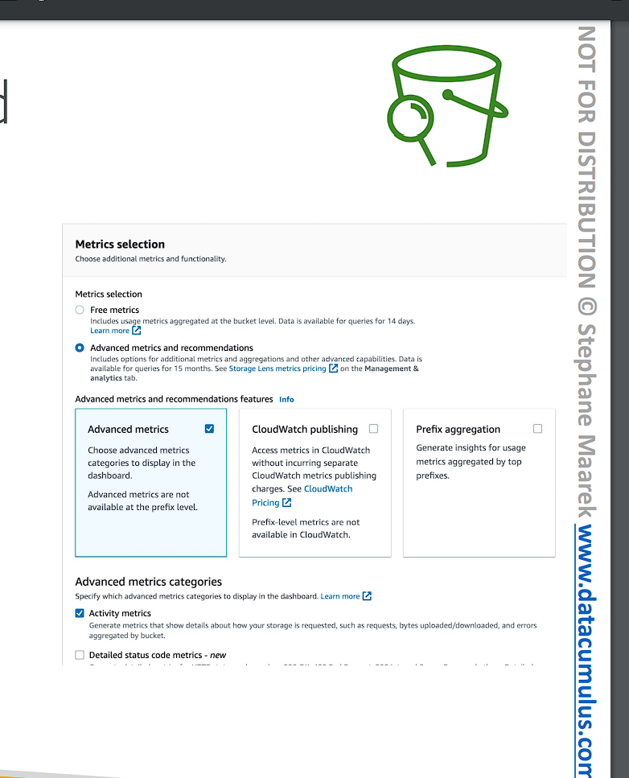

```
• Free Metrics
    • Automatically available for all customers
    • Contains around 28 usage metrics
    • Data is available for queries for 14 days
• Advanced Metrics and Recommendations
    • Additional paid metrics and features
    • Advanced Metrics – Activity, Advanced Cost Optimization, Advanced Data Protection, Status Code
    • CloudWatch Publishing – Access metrics in CloudWatch without additional charges
    • Prefix Aggregation – Collect metrics at the prefix level
    • Data is available for queries for 15 months
```
