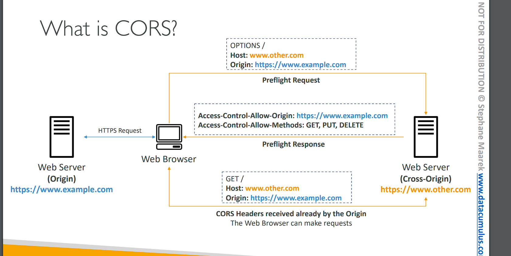
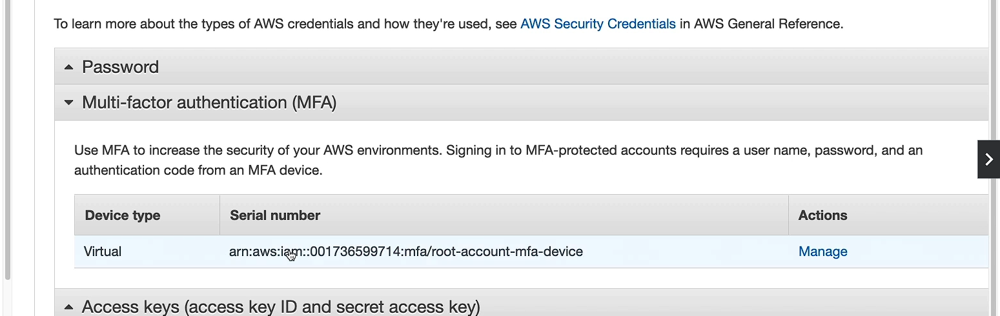

# Amazon S3 – Security

# Amazon S3 – Object Encryption

```
• You can encrypt objects in S3 buckets using one of 4 methods
    • Server-Side Encryption (SSE)
    • Server-Side Encryption with Amazon S3-Managed Keys (SSE-S3) – Enabled by Default
        • Encrypts S3 objects using keys handled, managed, and owned by AWS
    • Server-Side Encryption with KMS Keys stored in AWS KMS (SSE-KMS)
        • Leverage AWS Key Management Service (AWS KMS) to manage encryption keys
    • Server-Side Encryption with Customer-Provided Keys (SSE-C)
        • When you want to manage your own encryption keys
• Client-Side Encryption
• It’s important to understand which ones are for which situation for the exam (dùng cái nào cho tình huống nào cho bài thi)
```

```

Amazon S3 cung cấp 4 phương pháp mã hóa đối tượng để bảo vệ dữ liệu trong các S3 bucket. Dưới đây là giải thích chi tiết từng phương pháp:

1. Server-Side Encryption (SSE):

- Đây là mã hóa được thực hiện bởi Amazon S3 khi dữ liệu được lưu trữ trong bucket.
- S3 tự động mã hóa đối tượng sau khi tải lên và giải mã khi tải xuống.
2. Server-Side Encryption với Amazon S3-Managed Keys (SSE-S3):

- Mã hóa SSE-S3 được kích hoạt mặc định.
- Dữ liệu S3 sẽ được mã hóa bằng các khóa do AWS tạo, quản lý và sở hữu.
- Đây là tùy chọn dễ sử dụng nhất vì người dùng không cần phải quản lý khóa mã hóa.
3. Server-Side Encryption với KMS Keys trong AWS Key Management Service (SSE-KMS):

- Sử dụng AWS Key Management Service (KMS) để tạo và quản lý các khóa mã hóa.
- Người dùng có thể kiểm soát và theo dõi việc sử dụng khóa qua AWS KMS.
- Tính năng này cũng hỗ trợ key rotation (thay đổi định kỳ khóa mã hóa).
4. Server-Side Encryption với Customer-Provided Keys (SSE-C):

- Người dùng có thể sử dụng các khóa mã hóa của riêng mình.
- AWS sẽ không quản lý các khóa này, mà người dùng phải gửi khóa của họ mỗi khi truy cập dữ liệu.
5. Client-Side Encryption:

- Dữ liệu được mã hóa trước khi tải lên S3, và chỉ có người dùng mới có thể giải mã dữ liệu khi tải xuống.
- Phương pháp này yêu cầu người dùng quản lý toàn bộ quá trình mã hóa và giải mã, cũng như các khóa mã hóa.
```

# Amazon S3 Encryption – SSE -S3


• Encryption using keys handled, managed, and owned by AWS
• Object is encrypted server-side
• Encryption type is AES-256
• Must set header "x-amz-server-side-encryption": "AES256"
• Enabled by default for new buckets & new objects

```
Amazon S3 Server-Side Encryption with S3-Managed Keys (SSE-S3) là phương pháp mã hóa trong đó Amazon S3 tự động mã hóa các đối tượng bằng các khóa do AWS quản lý. Đây là cách đơn giản và phổ biến nhất để mã hóa dữ liệu trong S3, và sau đây là các điểm chính:

1. Mã hóa sử dụng khóa do AWS quản lý:

- Với SSE-S3, quá trình mã hóa và quản lý khóa hoàn toàn do AWS xử lý. Người dùng không cần phải tạo, lưu trữ, hoặc quản lý bất kỳ khóa mã hóa nào.
- AWS sở hữu và quản lý các khóa mã hóa đó.
2. Đối tượng được mã hóa ở phía server (server-side encryption):

- Dữ liệu được mã hóa ngay trên server của Amazon S3 sau khi nó được tải lên.
- Khi dữ liệu được truy xuất, S3 sẽ tự động giải mã nó.
3. Loại mã hóa là AES-256:

- AES-256 (Advanced Encryption Standard với khóa dài 256 bit) là thuật toán mã hóa mạnh mẽ và an toàn được sử dụng để bảo vệ dữ liệu.
4. Cần thiết lập header khi tải lên (Upload):

- Khi tải lên đối tượng, nếu muốn kích hoạt mã hóa SSE-S3 (nếu nó chưa tự động được kích hoạt), cần phải thêm HTTP header: "x-amz-server-side-encryption": "AES256"

- Điều này báo cho S3 biết rằng dữ liệu cần được mã hóa bằng AES-256.

5 Kích hoạt mặc định:

- SSE-S3 được kích hoạt mặc định cho các bucket và object mới. Điều này có nghĩa là các đối tượng mới trong các bucket mới sẽ tự động được mã hóa bằng SSE-S3.
Tóm tắt:
```

# Amazon S3 Encryption – SSE-KMS


• Encryption using keys handled and managed by AWS KMS (Key Management Service)
• KMS advantages: user control + audit (kiểm tra) key usage using CloudTrail
• Object is encrypted server side
• Must set header "x-amz-server-side-encryption": "aws:kms"

# SSE-KMS Limitation


• If you use SSE-KMS, you may be impacted by the KMS limits
• When you upload, it calls the GenerateDataKey KMS API
• When you download, it calls the Decrypt KMS API
• Count towards the KMS quota per second (5500, 10000, 30000 req/s based on region)
• You can request a quota increase using the Service Quotas Console

```
Server-Side Encryption with AWS Key Management Service (SSE-KMS) có một số hạn chế liên quan đến việc sử dụng KMS API, chủ yếu do các giới hạn về số lượng yêu cầu (request quota) mà KMS có thể xử lý mỗi giây. Dưới đây là các điểm quan trọng về những hạn chế này:

1. KMS limits có thể ảnh hưởng đến hiệu suất:

- Nếu bạn sử dụng SSE-KMS để mã hóa hoặc giải mã đối tượng trong S3, các thao tác này sẽ phụ thuộc vào các API của AWS KMS.
- Do KMS có giới hạn về số lượng yêu cầu mà nó có thể xử lý mỗi giây, điều này có thể ảnh hưởng đến hiệu suất của ứng dụng nếu bạn tải lên hoặc tải xuống một lượng lớn đối tượng trong một khoảng thời gian ngắn.
2. Khi tải lên (upload):

- Khi bạn tải lên một đối tượng sử dụng SSE-KMS, Amazon S3 sẽ gọi API GenerateDataKey của KMS để tạo một khóa mã hóa dữ liệu tạm thời cho đối tượng đó.
- Mỗi lần tải lên sẽ tăng số lượng yêu cầu API GenerateDataKey, ảnh hưởng đến giới hạn yêu cầu của KMS.
3. Khi tải xuống (download):

- Khi bạn truy xuất (download) một đối tượng được mã hóa bằng SSE-KMS, S3 sẽ gọi API Decrypt của KMS để giải mã khóa dữ liệu và sử dụng nó để giải mã đối tượng.
- Mỗi lần truy xuất đối tượng sẽ thêm vào số lượng yêu cầu API Decrypt.
4. Giới hạn yêu cầu KMS (KMS quota):

- Mỗi khu vực (region) có một giới hạn khác nhau về số lượng yêu cầu mà KMS có thể xử lý mỗi giây:
    - 5,500 yêu cầu/giây
    - 10,000 yêu cầu/giây
    - 30,000 yêu cầu/giây
- Tùy thuộc vào mức độ sử dụng và khu vực của bạn, nếu lượng yêu cầu vượt quá giới hạn này, bạn có thể gặp hiện tượng chậm trễ hoặc gián đoạn dịch vụ.
5. Tăng giới hạn (Request Quota Increase):

- Nếu bạn cần vượt qua giới hạn mặc định của KMS, bạn có thể yêu cầu tăng quota thông qua Service Quotas Console.
- AWS cung cấp công cụ để người dùng gửi yêu cầu tăng giới hạn số lượng yêu cầu KMS mà họ có thể thực hiện mỗi giây.
```

# Amazon S3 Encryption – SSE-C


• Server-Side Encryption using keys fully managed by the customer outside of AWS
• Amazon S3 does NOT store the encryption key you provide
• HTTPS must be used
• Encryption key must provided in HTTP headers, for every HTTP request made

# Amazon S3 Encryption – Client-Side Encryption


• Use client libraries such as Amazon S3 Client-Side Encryption Library
• Clients must encrypt data themselves before sending to Amazon S3
• Clients must decrypt data themselves when retrieving from Amazon S3
• Customer fully manages the keys and encryption cycle

# Amazon S3 – Encryption in transit (SSL/TLS) (truyền tải)

```
• Encryption in flight is also called SSL/TLS
• Amazon S3 exposes two endpoints:
    • HTTP Endpoint – non encrypted
    • HTTPS Endpoint – encryption in flight
• HTTPS is recommended
• HTTPS is mandatory for SSE-C (HTTPS là bắt buộc đối với SSE-C)
• Most clients would use the HTTPS endpoint by default
```

# Amazon S3 – Force (buộc) Encryption in Transit aws:SecureTransport


## S3 Encryption - Hands On

(S3 => Create bucket => name: "demo-encyption-viettu-v2" => Bucket Versioning: Enable => Data encryption -> encryption type: SSE-S3 => create bucket)
(Upload file lên bucket vừa tạo)


(click vào file vừa upload => properties => server-side encryption settings => edit => Encyption settings => chọn Overide bucket setting for default encyption -> Encyption type: SSE-KMS => AWS KMS Key: Choose from your AWS keys -> Avaialable AWS KMS keys: aws/s3 => save change )
Nó sẽ tạo ra một version mới sau khi edit encyptions trên


# Amazon S3 – Default Encryption vs. Bucket Policies

• SSE-S3 encryption is automatically applied to new objects stored in S3 bucket
• Optionally, you can “force encryption” using a bucket policy and refuse (từ chối) any API call to PUT an S3 object without encryption headers (SSE-KMS or SSE-C)


• Note: Bucket Policies are evaluated (đánh giá) before “Default Encryption”

==> default encyption được bật theo mặc định với SSC-S3 và có thể thay đổi nó

# What is CORS?

```
• Cross-Origin Resource Sharing (CORS)
• Origin = scheme (protocol) + host (domain) + port
    • example: https://www.example.com (implied port is 443 for HTTPS, 80 for HTTP)
• Web Browser based mechanism (cơ chế) to allow requests to other origins while visiting the main origin
• Same origin: http://example.com/app1 & http://example.com/app2
• Different origins: http://www.example.com & http://other.example.com
• The requests won’t be fulfilled (yêu cầu sẽ không được thực hiện) unless the other origin allows (trừ khi nguồn gốc được cho phép) for the requests, using CORS Headers (example: Access-Control-Allow-Origin)
```

```
CORS (Cross-Origin Resource Sharing) là một cơ chế bảo mật được trình duyệt web sử dụng để cho phép hoặc chặn các yêu cầu giữa các nguồn gốc khác nhau (cross-origin requests). Đây là cách mà một trang web có thể yêu cầu tài nguyên từ một miền (origin) khác mà không bị trình duyệt chặn, miễn là nguồn gốc kia cho phép bằng cách cung cấp các CORS headers. Sau đây là giải thích chi tiết:

1. Origin (Nguồn gốc):

- Một origin được xác định bởi 3 yếu tố: scheme (protocol), host (domain), và port.
- Ví dụ: https://www.example.com có protocol là https, domain là www.example.com, và port là 443 (implied cho HTTPS).

2. CORS là cơ chế dựa trên trình duyệt web:

- Khi một trang web được truy cập từ một origin, nó có thể gửi yêu cầu tới các tài nguyên nằm trên một origin khác.
- Tuy nhiên, để bảo vệ dữ liệu và quyền riêng tư của người dùng, trình duyệt sẽ chặn các yêu cầu đó trừ khi nguồn gốc khác (other origin) cho phép truy cập qua CORS headers.
3. Same origin vs. Different origins:

- Same origin: Hai URL có cùng scheme, host, và port. Ví dụ: http://example.com/app1 và http://example.com/app2 đều thuộc cùng một origin.
- Different origins: Hai URL có khác nhau về scheme, host, hoặc port. Ví dụ: http://www.example.com và http://other.example.com thuộc hai origin khác nhau (do khác domain).

4. CORS cho phép hoặc chặn các yêu cầu:

- Khi bạn đang ở trên trang web www.example.com và muốn gửi yêu cầu đến other.example.com, trình duyệt cần kiểm tra xem server other.example.com có cho phép yêu cầu từ www.example.com hay không.
- Điều này được thực hiện qua CORS Headers. Ví dụ:
    - Access-Control-Allow-Origin: https://www.example.com nghĩa là other.example.com cho phép yêu cầu từ www.example.com.
## Ví dụ đơn giản:
Giả sử bạn đang truy cập một trang web https://news.com và trang này cần lấy dữ liệu từ https://api.weather.com để hiển thị thời tiết. Vì news.com và weather.com là hai nguồn khác nhau, weather.com cần cấu hình CORS để cho phép news.com lấy dữ liệu. Nếu weather.com không cấu hình CORS, trình duyệt sẽ chặn yêu cầu và bạn sẽ không thấy thông tin thời tiết.
```



```
## CORS (Cross-Origin Resource Sharing) là một cơ chế bảo mật trên trình duyệt để ngăn chặn việc các trang web khác nhau truy cập dữ liệu của nhau nếu không được cho phép. Nó hoạt động bằng cách kiểm tra xem máy chủ mà bạn muốn gửi yêu cầu có cho phép trang web của bạn truy cập dữ liệu của nó hay không.

## Tại sao trình duyệt lại gửi yêu cầu đến cross-origin?
- Thông thường, một trang web (ví dụ https://www.example.com) có thể cần dữ liệu từ một nguồn khác (ví dụ https://www.other.com). Điều này rất phổ biến trong các ứng dụng web hiện đại. Các trang web thường không lưu trữ toàn bộ dữ liệu hoặc dịch vụ trên cùng một server. Ví dụ:

    - Trang web news.com hiển thị bài báo, nhưng muốn hiển thị thời tiết từ trang weather.com.
    - Trang thương mại điện tử có thể hiển thị bản đồ giao hàng từ Google Maps (maps.google.com).
- Như vậy, mặc dù bạn đang duyệt https://www.example.com, trang này cần gửi yêu cầu đến một server khác, ví dụ https://www.other.com để lấy dữ liệu cần thiết.

## Ví dụ thực tế:
1. Khi bạn truy cập https://www.example.com, trình duyệt sẽ gửi một yêu cầu đến Web Server (Origin) là www.example.com.

- Đây là yêu cầu bình thường để tải nội dung của trang chính.
2. Trang web www.example.com cần dữ liệu từ server khác:

- Giả sử trang example.com hiển thị thông tin thời tiết và nó cần dữ liệu từ www.other.com (máy chủ thời tiết). Do đó, trang example.com sẽ cố gửi một yêu cầu đến other.com từ trình duyệt của bạn.
3. Khi trình duyệt gửi yêu cầu đến server khác (cross-origin):

- Vì other.com là một nguồn khác (cross-origin), nên trình duyệt sẽ kiểm tra xem other.com có cho phép trang example.com truy cập hay không. Nếu không, yêu cầu sẽ bị từ chối.
4. Lý do gửi Preflight Request:

- Nếu yêu cầu từ example.com đến other.com là một yêu cầu phức tạp (dùng các phương thức như PUT, DELETE, hoặc có các headers tùy chỉnh), trình duyệt sẽ gửi một Preflight Request trước. Đây là một yêu cầu kiểm tra để hỏi other.com xem có cho phép yêu cầu từ example.com hay không.
## Tóm lại:
- Web Browser gửi yêu cầu đến cross-origin (server khác nguồn) vì trang web bạn đang truy cập cần dữ liệu hoặc dịch vụ từ một máy chủ khác.
- Ví dụ thực tế: Trang web thương mại điện tử (www.example.com) cần hiển thị bản đồ Google Maps, nên phải gửi yêu cầu đến maps.google.com để lấy dữ liệu bản đồ.

```

# Amazon S3 – CORS


```
• If a client makes a cross-origin request on our S3 bucket, we need to enable the correct CORS headers
• It’s a popular exam question
• You can allow for a specific origin or for * (all origins)
```

## S3 CORS Hands On

(S3 => bucket: "viettu-demo-s3" => Upload: extra-page.html, index.html)


(Properties => Static website hosting: try cập endpoint) => fetch request đã hoạt động from within the same origin


(Create bucket => name: "demo-other-origin-viettu" => region: chọn một region khác với region chứa bucket trên => bỏ tích block all public acess => create bucket => Properties => Static website hosting: edit => Enable => index document: index.html => save change => Permision => bucket policy: edit => paste bucket policy => save change)
(demo-other-origin-viettu => upload: extra-page.html => upload)


Truy cập bằng object url


(viettu-demo-s3 => remove extra-page.html)

Lúc này truy cập index của bucket "viettu-demo-s3" => báo lỗi Not Found do vừa xóa file index trên

File index.html sửa url thành enpoint static của bucket "demo-other-origin-viettu"

(viettu-demo-s3 => upload lại file: index.html => upload)

Lúc này khi truy cập endpoint static của bucket "viettu-demo-s3" => thì báo lỗi cross origin blocked

Để khắc phục
("demo-other-origin-viettu" => Permision => Cross-origin resource sharing => edit => paste file: CORS_CONFIG.json (sửa url thành endpoint bucket viettu-demo-s3, chý có xóa "/" cuối url) => save change)

Truy cập lại endpoint "viettu-demo-s3" => get được data thành công


# Amazon S3 – MFA Delete

```
• MFA (Multi-Factor Authentication) – force users to generate a code on a device (usually a mobile phone or hardware) before doing important operations on S3 (trước khi thực hiện thao tác quan trọng trên s3)
• MFA will be required to: (MFA sẽ được yêu cầu)
    • Permanently delete (xóa vĩnh viễn) an object version
    • Suspend Versioning (tạm dừng phiên bản) on the bucket
• MFA won’t be required to:
    • Enable Versioning
    • List deleted versions
• To use MFA Delete, Versioning must be enabled on the bucket
• Only the bucket owner (root account) can enable/disable MFA Delete
```

## S3 MFA Delete Hands On

(create bucket => name: "demo-viettu-mfa-delete" => bucket versioning: Enable => create bucket => Properties => Bucket Versioning: Edit => Amazone không cho phép Enable MFA bằng UI, chỉ có thể sử dụng CLI)
(File `mfa_delete.sh`)


Kích hoạt mfa delete, chú ý: thay arn thành arn của MFA tài khoản mình, và số mfa

```bash
aws s3api put-bucket-versioning --bucket demo-viettu-mfa-delete --versioning-configuration Status=Enabled,MFADelete=Enabled --mfa "arn-of-mfa-device mfa-code" --profile root-mfa-delete-demo
```




Kiểm tra MFA delete của bucket thì thấy đã được Enable

Thủ upload file lên bucket đó => upload thành công

Delete file vừa upload lên => thay vì xóa hẳn thì gán nhãn "Delete marker"

Xóa file không được đánh nhãn => không thể xóa vì MFA đã được bật cho bucket này

Sử dụng CLI để tắt MFA

```bash
# disable mfa delete
aws s3api put-bucket-versioning --bucket mfa-demo-stephane --versioning-configuration Status=Enabled,MFADelete=Disabled --mfa "arn-of-mfa-device mfa-code" --profile root-mfa-delete-demo
```


MFA đã được tắt


# S3 Access Logs


• For audit purpose, you may want to log all access to S3 buckets (Đối với mục đích kiểm tra, bạn có thể muốn ghi lại tất cả quyền truy cập vào thùng S3)
• Any request made to S3, from any account, authorized or denied, will be logged into another S3 bucket
• That data can be analyzed using data analysis tools…
• The target logging bucket must be in the same AWS region
• The log format is at: https://docs.aws.amazon.com/AmazonS3/latest/dev/LogFormat.html

# S3 Access Logs: Warning

• Do not set your logging bucket to be the monitored bucket
• It will create a logging loop, and your bucket will grow exponentially


```
Cảnh báo về S3 Access Logs trong AWS mà bạn đang gặp phải liên quan đến việc cấu hình ghi nhật ký (logging) cho các bucket S3. Dưới đây là giải thích chi tiết về nội dung cảnh báo:

1. Do not set your logging bucket to be the monitored bucket:
- Khi bạn bật tính năng S3 Access Logs, bạn cần chỉ định một bucket ghi nhật ký để lưu trữ các bản ghi truy cập (logs) của một bucket được theo dõi. Tuy nhiên, bạn không được phép chỉ định chính bucket đó làm bucket ghi nhật ký. Nói cách khác, bucket chứa dữ liệu không thể là nơi lưu trữ bản ghi truy cập của chính nó.

- Nếu bạn làm điều này, các yêu cầu ghi nhật ký (log requests) vào chính bucket đó cũng sẽ được ghi lại, dẫn đến tình trạng "logging the logging", tạo ra một vòng lặp lặp đi lặp lại.

2. It will create a logging loop:
- Nếu bạn chỉ định bucket được theo dõi cũng là bucket ghi nhật ký, mỗi lần một bản ghi được ghi vào bucket, việc ghi này cũng được theo dõi, tạo ra một vòng lặp vô hạn (loop) của các hoạt động ghi nhật ký. Mỗi lần thêm bản ghi vào bucket, nó lại kích hoạt một bản ghi truy cập mới, và điều này sẽ tiếp diễn không ngừng.
3. Your bucket will grow exponentially:
- Do vòng lặp ghi nhật ký này, kích thước của bucket sẽ tăng trưởng theo cấp số nhân. Mỗi yêu cầu ghi nhật ký lại tạo ra một bản ghi mới, và kích thước của bucket sẽ liên tục tăng, dẫn đến việc tiêu tốn không gian lưu trữ và chi phí AWS nhanh chóng tăng cao.
```

## S3 Access Logs - Hands On

(S3 => Create bucket => name: "s3-access-logs-viettu-v3" => create bucket)
(bucket: "demo-viettu-v3-event-notificaion" => Properties => Server access logging => Edit => Enable (Server access logging) => Destination -> Browse S3 -> "s3-access-logs-viettu-v3" -> choose destination => save change)
("demo-viettu-v3-event-notificaion" => upload file lên => Sẽ tạo ra hành động và lưu vào trong log) => Nhưng lỗi: phải update bucket policy

Sửa lại bucket policy ở bucket "s3-access-logs-viettu-v3"

Kiểm tra xem log có được ghi vào bucket "3-access-logs-viettu-v3" không


# Amazon S3 – Pre-Signed URLs

```
• Generate pre-signed URLs using the S3 Console, AWS CLI or SDK
• URL Expiration
    • S3 Console – 1 min up to 720 mins (12 hours)
    • AWS CLI – configure expiration with --expires-in parameter in seconds (default 3600 secs, max. 604800 secs ~ 168 hours)
• Users given a pre-signed URL inherit the permissions of the user that generated the URL for GET / PUT
• Examples:
    • Allow only logged-in users to download a premium video from your S3 bucket
    • Allow an ever-changing list of users to download files by generating URLs dynamically
    • Allow temporarily a user to upload a file to a precise (chính xác) location in your S3 bucket
```

# S3 Pre-signed URLs - Hands On

(S3 => bucket => file => Object Action => share with a presigned URL)


# S3 Glacier Vault Lock


```
• Adopt a WORM (Write Once Read Many) model (Áp dụng mô hình WORM)
• Create a Vault Lock Policy
• Lock the policy for future edits (can no longer be changed or deleted)
• Helpful for compliance and data retention (tuân thủ và lưu dữ liệu)
```

```
S3 Glacier Vault Lock là một tính năng của Amazon S3 Glacier cho phép bạn tạo một chính sách bảo mật và khóa nó để đảm bảo tuân thủ các yêu cầu pháp lý hoặc quy định về lưu trữ dữ liệu. Tính năng này được thiết kế theo mô hình WORM (Write Once Read Many), tức là dữ liệu có thể được ghi một lần nhưng có thể đọc nhiều lần, và không thể chỉnh sửa hoặc xóa bỏ sau khi chính sách được khóa. Dưới đây là giải thích chi tiết:

- Ghi một lần, đọc nhiều lần: Bạn có thể ghi dữ liệu vào một lần, nhưng không thể thay đổi hay xóa sau đó.
- Bạn có thể tạo một chính sách bảo vệ dữ liệu, sau đó khóa chính sách này để không ai có thể chỉnh sửa hoặc xóa nó trong tương lai.
- Tính năng này rất hữu ích cho việc tuân thủ các quy định về bảo vệ và lưu trữ dữ liệu lâu dài, đặc biệt là những dữ liệu nhạy cảm cần được giữ nguyên trạng thái trong nhiều năm.
```

# S3 Object Lock (versioning must be enabled)

```
• Adopt a WORM (Write Once Read Many) model
• Block an object version deletion for a specified amount of time (Chặn xóa phiên bản đối tượng trong một khoảng thời gian nhất định)
• Retention mode - Compliance:
    • Object versions can't be overwritten or deleted by any user, including the root user
    • Objects retention modes can't be changed, and retention periods can't be shortened (không thể rút ngắn)
• Retention mode - Governance:
    • Most users can't overwrite or delete an object version or alter its lock settings
    • Some users have special permissions to change the retention or delete the object (có thể kéo dài tức gia hạn)
• Retention Period: protect the object for a fixed period (thời gian cố định), it can be extended
• Legal Hold:
    • protect the object indefinitely (vô thời hạn), independent from retention period
    • can be freely placed and removed using the s3:PutObjectLegalHold IAM permission (có thể được đặt và xóa tự do bằng cách sử dụng quyền s3:PutObjectLegalHold IAM)
```

```
## Amazon S3 Object Lock cho phép bạn áp dụng mô hình WORM (Write Once Read Many), giúp bảo vệ các đối tượng lưu trữ trong S3 bằng cách ngăn chặn việc xóa hoặc thay đổi phiên bản của các đối tượng đó trong một khoảng thời gian nhất định. Điều này đảm bảo dữ liệu không bị xóa hoặc sửa đổi, ngay cả bởi những người dùng có quyền cao nhất.

## Các thành phần chính của S3 Object Lock:
1. Versioning must be enabled:

- Versioning phải được bật trong S3 để theo dõi nhiều phiên bản của đối tượng. Điều này là yêu cầu cần thiết để sử dụng Object Lock vì mỗi phiên bản của đối tượng sẽ có chính sách khóa riêng biệt.
2. WORM Model (Write Once Read Many):

- Dữ liệu có thể được ghi một lần, nhưng có thể đọc nhiều lần. Điều này có nghĩa là sau khi được ghi vào S3, đối tượng không thể bị chỉnh sửa hoặc xóa trong thời gian khóa.
3. Retention Modes (Chế độ giữ lại):

- Object Lock có hai chế độ khóa khác nhau để xác định quyền kiểm soát việc chỉnh sửa và xóa đối tượng.

- Compliance Mode (Chế độ tuân thủ):

    - Ngăn cản mọi người dùng, bao gồm cả root user, chỉnh sửa hoặc xóa đối tượng.
    - Không thể thay đổi chế độ khóa hoặc rút ngắn thời gian giữ đối tượng. Điều này đảm bảo tuân thủ nghiêm ngặt các quy định lưu trữ.
- Governance Mode (Chế độ quản trị):

    - Phần lớn người dùng bị ngăn chặn việc chỉnh sửa hoặc xóa đối tượng, nhưng một số người dùng có quyền đặc biệt (có quyền s3
) có thể thay đổi thời gian giữ hoặc xóa đối tượng.
    - Chế độ này cho phép quản trị viên có quyền hạn kiểm soát cao hơn, tuy nhiên, người dùng thông thường sẽ bị giới hạn.
4. Retention Period (Thời gian giữ):

- Bạn có thể đặt thời gian bảo vệ đối tượng cho một khoảng thời gian cố định. Sau khi thời gian này kết thúc, đối tượng có thể bị xóa hoặc thay đổi.
- Thời gian giữ có thể được gia hạn, nhưng không thể rút ngắn nếu đối tượng đang ở chế độ tuân thủ.
5. Legal Hold (Giữ lại theo yêu cầu pháp lý):

- Giữ lại đối tượng vô thời hạn, độc lập với thời gian giữ cố định.
Có thể tự do đặt và loại bỏ trạng thái giữ lại pháp lý bằng quyền s3
.
- Thường được sử dụng khi có yêu cầu pháp lý cần giữ đối tượng mà không bị xóa.

## Tóm lại:
- S3 Object Lock giúp ngăn chặn chỉnh sửa và xóa dữ liệu trong một khoảng thời gian xác định (Retention Period) hoặc vô thời hạn (Legal Hold).
- Chế độ tuân thủ phù hợp khi muốn đảm bảo dữ liệu không thể bị xóa hoặc sửa đổi bởi bất kỳ ai, trong khi chế độ quản trị cho phép người dùng có quyền đặc biệt thực hiện một số thay đổi.
```

# S3 – Access Points


```
• Access Points simplify (đơn giản hóa) security management for S3 Buckets
• Each Access Point has:
    • its own DNS name (Internet Origin or VPC Origin)
    • an access point policy (similar to bucket policy) – manage security at scale (quản lý bảo mật trên quy mô lơn)
```

# S3 – Access Points –VPC Origin


• We can define the access point to be accessible only from within the VPC
• You must create a VPC Endpoint to access the Access Point (Gateway or Interface Endpoint)
• The VPC Endpoint Policy must allow access to the target bucket and Access Point

# S3 Object Lambda


```
• Use AWS Lambda Functions to change the object before it is retrieved by the caller application
• Only one S3 bucket is needed, on top of which we create S3 Access Point and S3 Object Lambda Access Points.
• Use Cases:
    • Redacting personally identifiable information for analytics or non- production environments.
    • Converting across data formats, such as converting XML to JSON.
    • Resizing and watermarking images on the fly using caller-specific details, such as the user who requested the object
```

```
Bức ảnh mô tả kiến trúc S3 Object Lambda, trong đó sử dụng AWS Lambda để chỉnh sửa các đối tượng trước khi chúng được truy xuất bởi ứng dụng khách. Dưới đây là giải thích chi tiết:

## Thành phần chính:
1. S3 Bucket: Nơi lưu trữ các đối tượng gốc mà các ứng dụng có thể truy cập.

2. S3 Access Point: Tạo ra để quản lý truy cập vào S3 bucket. Có thể thêm nhiều Access Point cho các ứng dụng khác nhau.

3. S3 Object Lambda Access Point:

- Cho phép chỉnh sửa đối tượng khi truy xuất.
- Khi một ứng dụng yêu cầu đối tượng thông qua Object Lambda Access Point, một AWS Lambda Function sẽ được kích hoạt để xử lý đối tượng theo yêu cầu trước khi trả về.
4. Lambda Function:

- Có 2 loại chức năng Lambda:
    - Redacting Lambda Function (Chức năng Lambda Xóa Thông Tin Nhạy Cảm): Xóa hoặc chỉnh sửa thông tin nhạy cảm từ đối tượng gốc (như thông tin cá nhân) trước khi gửi tới ứng dụng phân tích.
    - Enriching Lambda Function (Chức năng Lambda Bổ Sung Dữ Liệu): Bổ sung dữ liệu từ cơ sở dữ liệu (ví dụ, cơ sở dữ liệu khách hàng trung thành) để làm giàu dữ liệu trước khi trả về cho ứng dụng tiếp thị.
## Các ứng dụng:
- E-Commerce Application: Truy xuất đối tượng gốc mà không có bất kỳ thay đổi nào.
- Analytics Application: Truy xuất đối tượng đã được chỉnh sửa, ví dụ xóa thông tin nhạy cảm.
- Marketing Application: Truy xuất đối tượng đã được bổ sung thông tin từ cơ sở dữ liệu để thêm giá trị cho mục đích tiếp thị.
## Use Cases (Trường hợp sử dụng):
- Xóa thông tin nhạy cảm (Redacting PII): Xóa thông tin cá nhân để phân tích dữ liệu trong môi trường không sản xuất hoặc không chứa thông tin nhạy cảm.
Chuyển đổi định dạng: Chuyển đổi định dạng dữ liệu (ví dụ từ XML sang JSON) khi cần thiết.
Chỉnh sửa ảnh theo yêu cầu: Chỉnh sửa, thay đổi kích thước, hoặc thêm watermark vào ảnh dựa trên thông tin của người yêu cầu.

```

Câu hỏi 2:
A company you're working for wants their data stored in S3 to be encrypted. They don't mind the encryption keys stored and managed by AWS, but they want to maintain control over the rotation policy of the encryption keys. You recommend them to use ....................
Giải thích: With SSE-KMS, the encryption happens in AWS, and the encryption keys are managed by AWS but you have full control over the rotation policy of the encryption key. Encryption keys stored in AWS.
