# CloudFront & Global Accelerator

# Amazon CloudFront

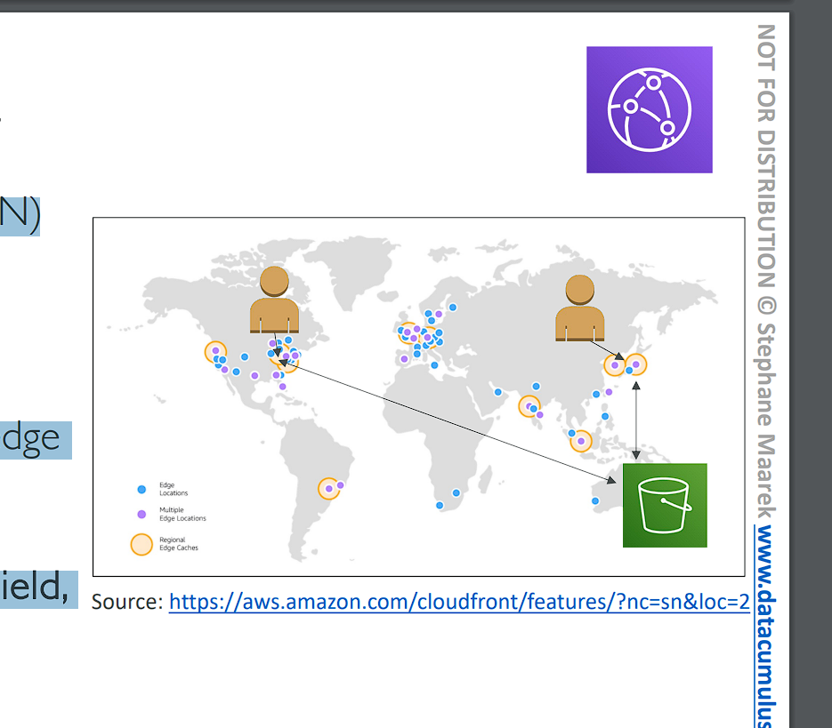
• Content Delivery Network (CDN) (Mạng phân phối nội dung)
• Improves read performance, content is cached at the edge
• Improves users experience
• 216 Point of Presence globally (edge locations)
• DDoS protection (because worldwide), integration with Shield, AWS Web Application Firewall

# CloudFront – Origins

```
• S3 bucket
    • For distributing files and caching them at the edge
    • Enhanced security (nâng cao bảo mật) with CloudFront Origin Access Control (OAC)
    • OAC is replacing Origin Access Identity (OAI)
    • CloudFront can be used as an ingress (to upload files to S3)
• Custom Origin (HTTP)
    • Application Load Balancer
    • EC2 instance
    • S3 website (must first enable the bucket as a static S3 website)
    • Any HTTP backend you want
```

# CloudFront at a high level

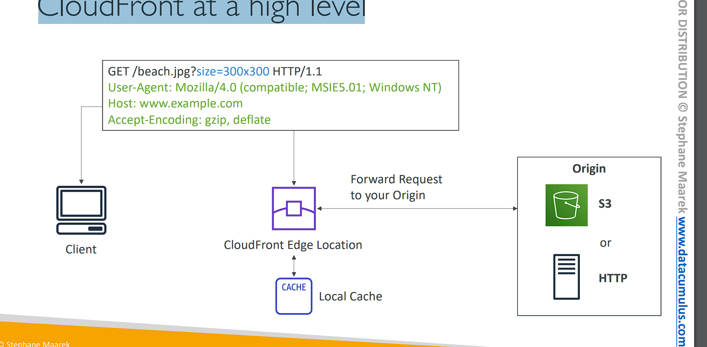

# CloudFront – S3 as an Origin

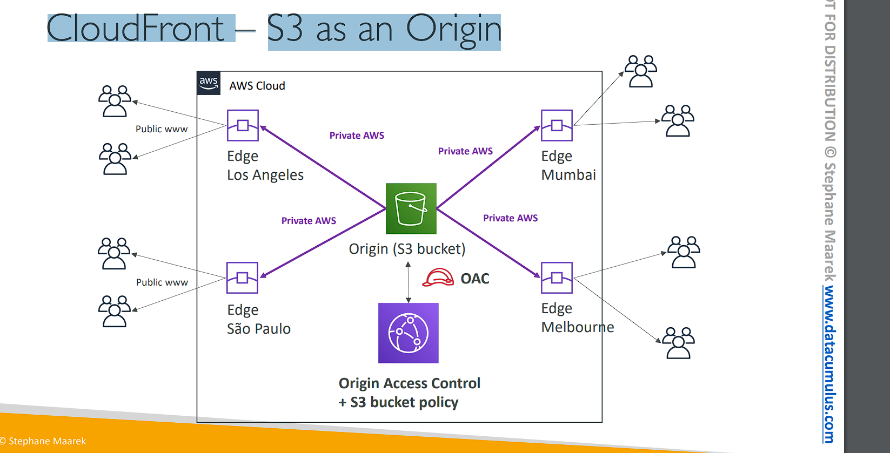

# CloudFront vs S3 Cross Region Replication

```
• CloudFront:
    • Global Edge network
    • Files are cached for a TTL (maybe a day)
    • Great for static content that must be available everywhere
• S3 Cross Region Replication:
    • Must be setup for each region you want replication to happen
    • Files are updated in near real-time
    • Read only
    • Great for dynamic content that needs to be available at low-latency in few regions (độ trễ thấp)
```

# CloudFront with S3 - Hands On

(S3 => create bucket => name: "demo-cloudfront-viettu-v4" => create bucket => upload: file ở folder s3)
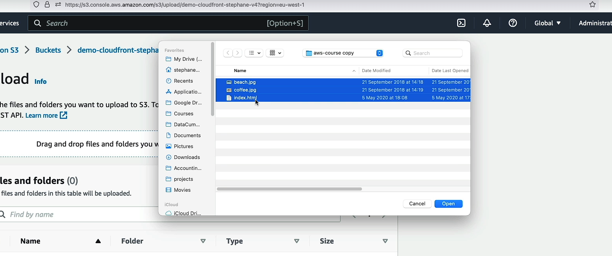
(Cloudfront => create distribution => origin domain: "demo-cloudfront-viettu-v4" => Origin access: Origin access control setting (OAC) => Origin access control: (create control setting => create => update bucket policy s3 ) => WAF: tích do not eable security => default root object: index.html => create )

(Origins => chọn origin: demo-cloudfront-viettu => Bucket policy: Copy policy)
(copy policy => s3 bucket: demo-cloudfront-viettu-v4 => Permissions => bucket policy: edit => paste policy vô => save change )
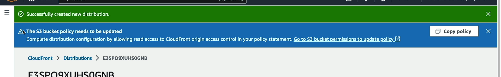
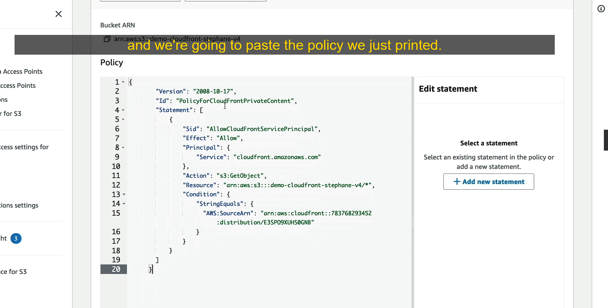

Truy cập bằng distribution domain name thêm index.html ở cuối
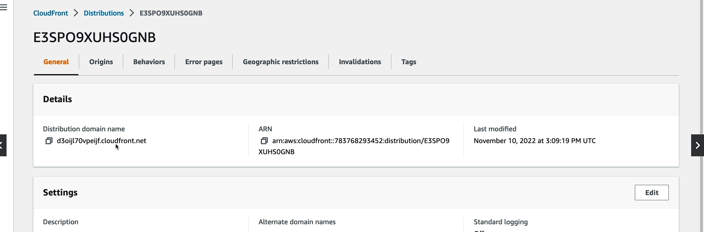


# CloudFront – ALB or EC2 as an origin

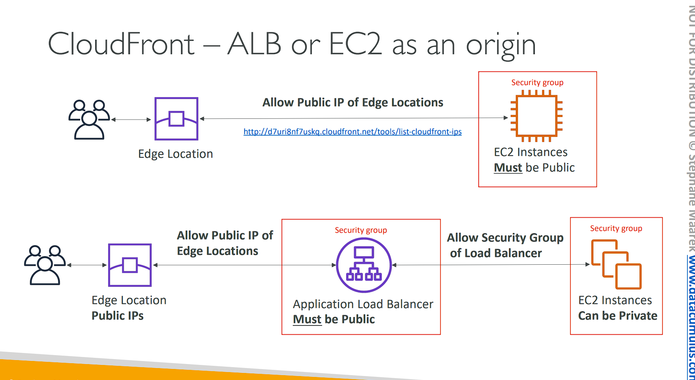

# CloudFront Geo Restriction (hạn chế địa lý)

```
 You can restrict who can access your distribution (hạn chế người truy cập)
    • Allowlist: Allow your users to access your content only if they're in one of the countries on a list of approved countries. (các quốc gia được phê duyệt)
    • Blocklist: Prevent your users from accessing your content if they're in one of the countries on a list of banned countries. (nước bị cấm)
• The “country” is determined (xác định) using a 3rd party Geo-IP database
• Use case: Copyright Laws to control access to content (Luật bản quyền đễ kiểm soát truy cập vào nội dung)
```

(distribute => Security => CloudFront geographic restrictions => edit => restriction type: Allow list => Coutries: ["India", "US"] => save change)

# CloudFront - Pricing

• CloudFront Edge locations are all around the world
• The cost of data out per edge location varies (khác nhau)

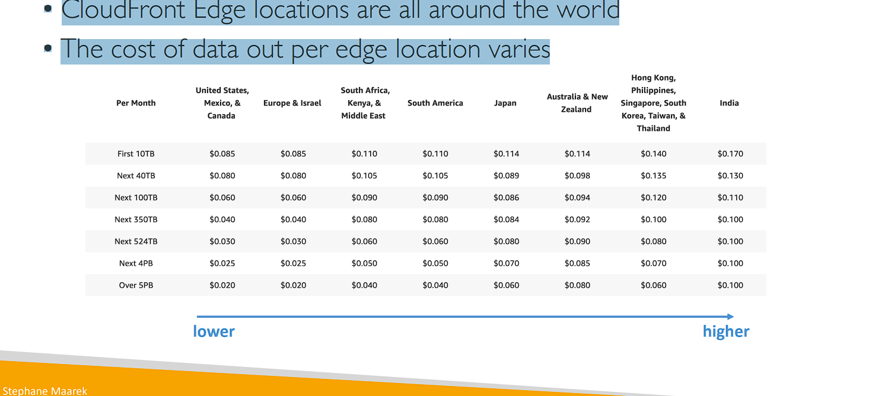

# CloudFront – Price Classes

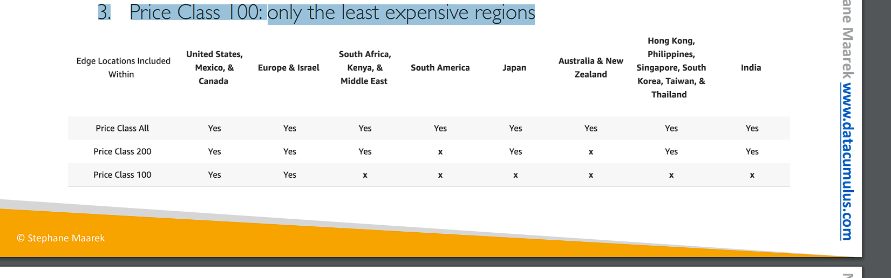

```
• You can reduce the number of edge locations for cost reduction (giảm chi phí)
• Three price classes:
    1. Price Class All: all regions – best performance
    2. Price Class 200: most regions, but excludes the most expensive regions (không bao gồm khu vực đắt nhất)
    3. Price Class 100: only the least expensive regions (khu vực giá thành rẻ nhất)
```

# CloudFront - Price Class

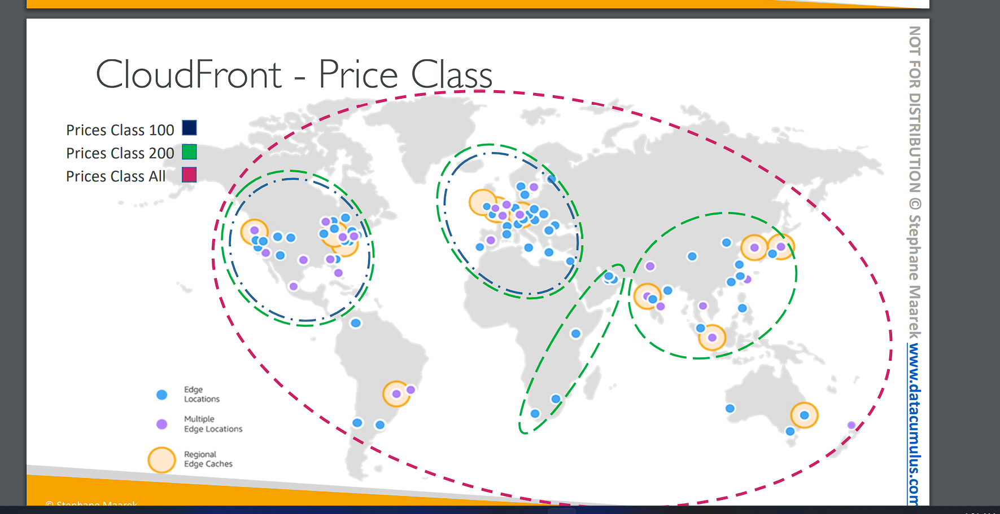

# CloudFront – Cache Invalidations

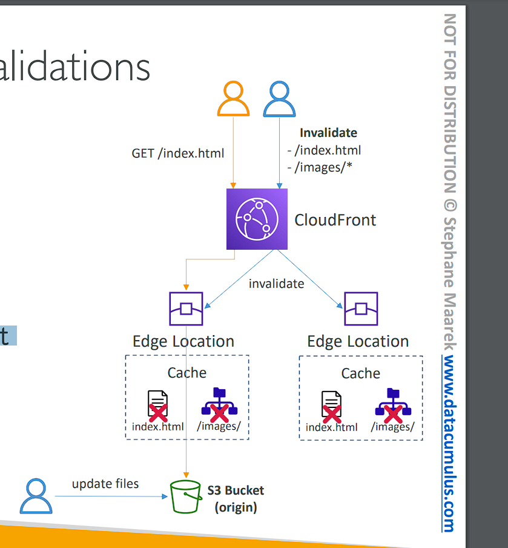

```
• In case you update the back-end origin, CloudFront doesn’t know about it and will only get the refreshed content after the TTL has expired
• However, you can force an entire or partial cache refresh (thus bypassing the TTL) by performing a CloudFront Invalidation (Tuy nhiên, bạn có thể buộc làm mới bộ nhớ đệm toàn bộ hoặc một phần (do đó bỏ qua TTL))
• You can invalidate (vô hiệu hóa) all files (*) or a special path (/images/*)
```

```
CloudFront Cache Invalidations liên quan đến việc làm mới hoặc xóa dữ liệu đã được CloudFront lưu trữ trong bộ nhớ đệm (cache). CloudFront là dịch vụ phân phối nội dung của AWS, giúp phân phối dữ liệu từ origin (nguồn dữ liệu gốc) đến người dùng cuối với tốc độ cao bằng cách sử dụng bộ nhớ đệm tại các vị trí edge trên toàn cầu.

# Cách hoạt động:
1. Cache và TTL (Time-to-Live):

- Khi người dùng yêu cầu một tài nguyên (ví dụ, một tệp hình ảnh), CloudFront sẽ lấy nội dung từ origin (thường là S3 bucket, HTTP server, v.v.) và lưu trữ tài nguyên đó trong bộ nhớ đệm (cache).
- Tài nguyên này sẽ được lưu trong cache cho đến khi TTL (thời gian sống) hết hạn. TTL là khoảng thời gian mà CloudFront sẽ lưu trữ tài nguyên mà không yêu cầu cập nhật từ origin.
- Khi người dùng khác yêu cầu tài nguyên này, CloudFront sẽ trả lại dữ liệu đã lưu trong cache, giúp tăng tốc độ phân phối mà không cần phải lấy dữ liệu lại từ origin.
2. Khi bạn cập nhật dữ liệu tại origin:

- Nếu bạn cập nhật tài nguyên tại origin (ví dụ, thay đổi nội dung của một trang HTML hoặc cập nhật hình ảnh), CloudFront sẽ không nhận biết sự thay đổi này ngay lập tức.
- CloudFront sẽ chỉ tải lại nội dung mới từ origin sau khi TTL của đối tượng trong cache hết hạn.
3. CloudFront Invalidation (Làm mới cache):

- Nếu bạn muốn CloudFront bỏ qua TTL và làm mới nội dung ngay lập tức, bạn có thể thực hiện một CloudFront Invalidation.
- Invalidation cho phép bạn buộc CloudFront xóa dữ liệu trong cache, và khi người dùng yêu cầu dữ liệu đó lần tới, CloudFront sẽ phải lấy nội dung mới nhất từ origin.
4. Loại bỏ cache:

- Bạn có thể thực hiện invalidation cho:
    - Toàn bộ cache: Invalidate tất cả các tệp bằng cách sử dụng ký tự đại diện *, điều này sẽ khiến tất cả các đối tượng trong cache bị xóa.
    - Một phần cụ thể: Invalidate một phần cụ thể của nội dung, ví dụ như /images/*, để chỉ xóa cache cho tất cả các tệp trong thư mục hình ảnh.
```

# Global users for our application

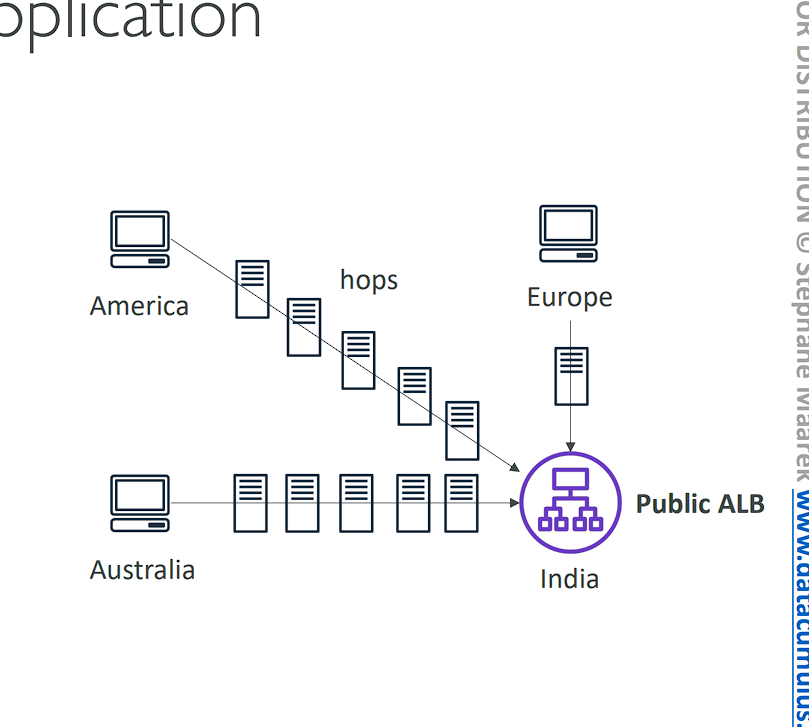
• You have deployed an application and have global users who want to access it directly.
• They go over the public internet (truy cập qua internet), which can add a lot of latency (tăng độ trễ) due to many hops
• We wish to go as fast as possible through AWS network to minimize latency

```
## Giải thích chi tiết:
1. Người dùng toàn cầu (Global users):

- Ứng dụng của bạn có người dùng từ nhiều khu vực khác nhau trên thế giới, và họ muốn truy cập ứng dụng của bạn.
2. Truy cập qua mạng internet công cộng:

- Người dùng sẽ truy cập ứng dụng của bạn qua mạng internet công cộng. Điều này có nghĩa là dữ liệu di chuyển từ thiết bị của người dùng tới máy chủ ứng dụng phải qua nhiều thiết bị mạng trung gian (các router, switch) được gọi là hops.
- Mỗi hop làm tăng độ trễ (latency), khiến ứng dụng của bạn phản hồi chậm hơn, đặc biệt là khi người dùng ở xa trung tâm dữ liệu của bạn.
3. Latency và hops:

- Latency là thời gian cần thiết để một gói dữ liệu di chuyển từ điểm A đến điểm B. Nhiều hops có thể làm gia tăng độ trễ.
- Ví dụ, nếu một người dùng ở châu Âu truy cập một máy chủ được đặt ở Bắc Mỹ, dữ liệu có thể phải đi qua nhiều hops, làm tăng thời gian phản hồi.
4. Giải pháp mong muốn:

- Bạn muốn giảm thiểu độ trễ bằng cách cho dữ liệu di chuyển qua mạng AWS càng sớm càng tốt thay vì phải đi qua nhiều hops trên mạng internet công cộng.
- AWS có mạng lưới toàn cầu với nhiều trung tâm dữ liệu, và các dịch vụ của AWS như Amazon CloudFront hay AWS Global Accelerator có thể giúp người dùng từ khắp nơi trên thế giới truy cập ứng dụng của bạn nhanh hơn bằng cách đưa họ vào mạng AWS gần nhất.

## Mục tiêu:
Sử dụng mạng AWS để giảm thiểu số lượng hops mà dữ liệu phải đi qua, từ đó giảm độ trễ và tăng tốc độ truy cập cho người dùng toàn cầu.
```

# Unicast IP vs Anycast IP

• Unicast IP: one server holds one IP address
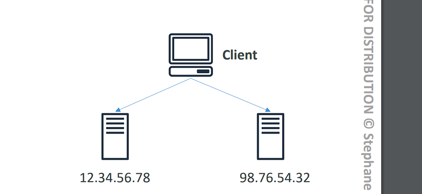
• Anycast IP: all servers hold the same IP address and the client is routed to the nearest one
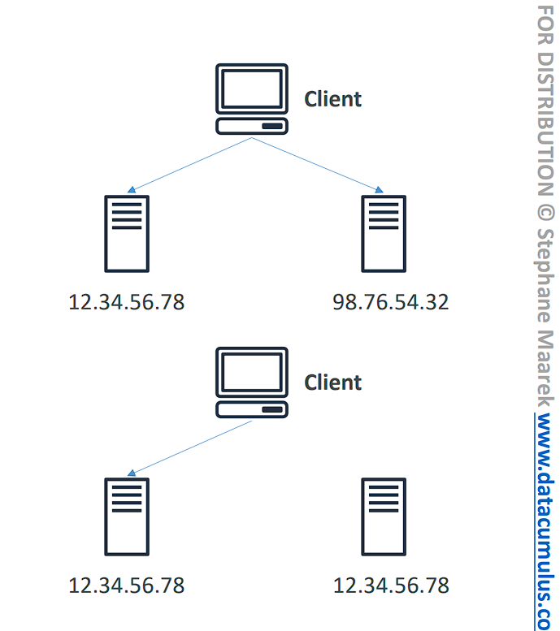

```
1. Unicast IP:
- Unicast IP có nghĩa là một địa chỉ IP chỉ gán cho một máy chủ duy nhất.
- Khi một người dùng (client) gửi yêu cầu đến IP đó, yêu cầu sẽ luôn đến một máy chủ cụ thể.
- Ví dụ: Bạn có một trang web, và tất cả các yêu cầu từ người dùng sẽ luôn đến cùng một máy chủ chứa trang web đó.
2. Anycast IP:
- Anycast IP có nghĩa là nhiều máy chủ (trên toàn cầu) chia sẻ cùng một địa chỉ IP.
- Khi người dùng gửi yêu cầu đến địa chỉ IP đó, yêu cầu sẽ tự động được gửi đến máy chủ gần nhất (về mặt khoảng cách địa lý hoặc tốc độ kết nối).
- Ví dụ: Nếu bạn truy cập một dịch vụ lớn như Google hoặc Facebook, yêu cầu của bạn sẽ được chuyển đến máy chủ gần bạn nhất, giúp trang tải nhanh hơn.
```

# AWS Global Accelerator

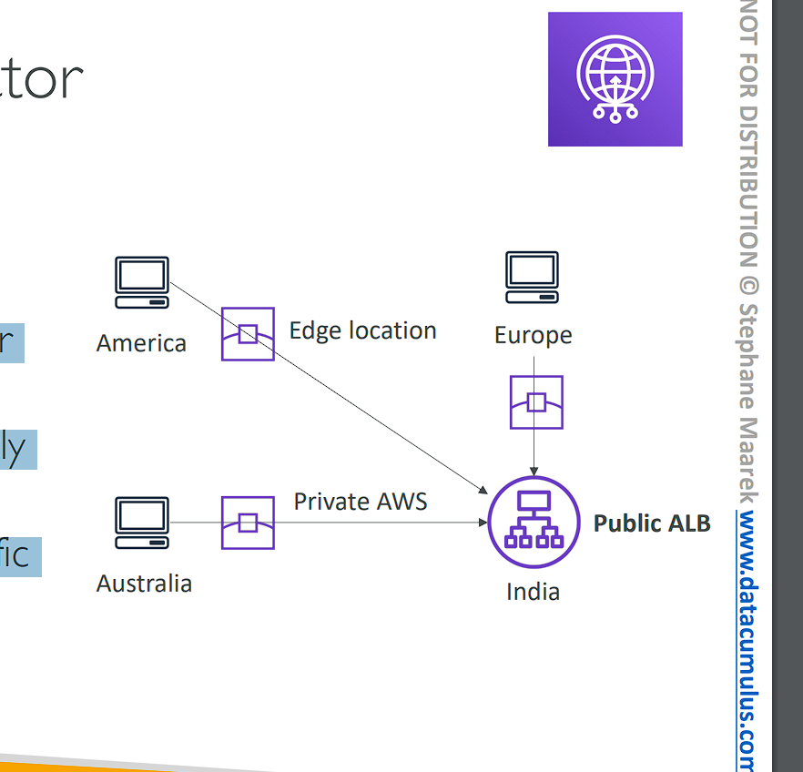
• Leverage the AWS internal network to route to your application ( (Sử dụng mạng nội bộ của AWS để định tuyến tới ứng dụng của bạn):)
• 2 Anycast IP are created for your application ((2 địa chỉ IP Anycast được tạo cho ứng dụng của bạn):)
• The Anycast IP send traffic directly to Edge Locations (Các địa chỉ IP Anycast gửi lưu lượng trực tiếp đến Edge Locations)
• The Edge locations send the traffic to your application (Các Edge Locations chuyển lưu lượng đến ứng dụng của bạn)

```
1. Sử dụng mạng nội bộ của AWS
- Vấn đề: Khi người dùng ở khắp nơi trên thế giới truy cập vào ứng dụng của bạn, dữ liệu phải đi qua internet công cộng, dẫn đến độ trễ cao và đôi khi gặp sự cố.
- Giải pháp: AWS Global Accelerator sử dụng mạng nội bộ của Amazon (AWS) – một mạng lưới máy chủ và đường truyền tốc độ cao, trải rộng toàn cầu. Điều này giúp dữ liệu được truyền nhanh hơn, ổn định hơn, vì nó đi qua "đường riêng" của AWS thay vì qua internet thông thường.
2. Hai địa chỉ IP Anycast
- Địa chỉ IP Anycast: Đây là loại địa chỉ IP đặc biệt, cho phép một IP được sử dụng ở nhiều vị trí khác nhau trên toàn thế giới. AWS Global Accelerator cung cấp hai địa chỉ IP Anycast cho ứng dụng của bạn.
- Ý nghĩa: Người dùng từ bất kỳ nơi nào trên thế giới khi truy cập vào địa chỉ IP Anycast này sẽ được kết nối đến vị trí gần nhất với họ (trên mạng của AWS). Điều này giảm thiểu độ trễ và cải thiện tốc độ truy cập.
3. Các địa chỉ IP Anycast gửi dữ liệu đến các "Edge Locations" (Vị trí biên)
- Edge Locations: Đây là các vị trí trung gian của AWS, được đặt gần với người dùng khắp nơi trên thế giới. Mục đích là để nhận dữ liệu từ người dùng và chuyển tiếp nó đến ứng dụng của bạn một cách nhanh chóng.
- Ý nghĩa: Khi người dùng truy cập ứng dụng của bạn, họ sẽ kết nối đến Edge Location gần nhất. Điều này giảm thời gian chờ đợi và tăng tốc độ xử lý.
4. Edge Locations chuyển dữ liệu đến ứng dụng của bạn
- Bước cuối cùng: Sau khi Edge Location nhận được yêu cầu từ người dùng, nó sẽ chuyển tiếp yêu cầu này qua mạng nội bộ của AWS đến ứng dụng của bạn (đặt tại các dịch vụ AWS như EC2, load balancer, v.v.). Nhờ vậy, việc truyền tải dữ liệu luôn được bảo đảm tốc độ và độ ổn định cao.
## Tóm tắt lại:
- AWS Global Accelerator giúp tăng tốc và tăng độ ổn định cho ứng dụng của bạn bằng cách:
- Sử dụng mạng riêng của AWS để truyền dữ liệu nhanh hơn.
- Cung cấp 2 địa chỉ IP Anycast, cho phép định tuyến đến vị trí gần người dùng nhất.
- Sử dụng các Edge Locations để xử lý và chuyển tiếp dữ liệu từ người dùng về ứng dụng của bạn một cách hiệu quả.
```

```
## AWS Global Accelerator cung cấp 2 địa chỉ IP Anycast vì lý do sau:

1. Tính sẵn sàng cao (High Availability):

- Việc cung cấp hai địa chỉ IP Anycast đảm bảo tính dự phòng. Nếu một trong hai địa chỉ gặp sự cố (do vấn đề về mạng, sự cố tại khu vực địa lý, hoặc bất kỳ lý do nào khác), địa chỉ còn lại sẽ tiếp tục hoạt động, giúp tránh tình trạng ngừng dịch vụ.
- Điều này tăng cường khả năng phục hồi, đảm bảo rằng ứng dụng của bạn luôn sẵn sàng cho người dùng mà không bị gián đoạn.
2. Phân tán lưu lượng (Load Distribution):

- Hai địa chỉ IP Anycast có thể giúp phân phối lưu lượng giữa các đường dẫn mạng khác nhau trên toàn cầu. Điều này cải thiện hiệu suất và đảm bảo lưu lượng luôn được định tuyến qua tuyến đường nhanh và hiệu quả nhất, dựa trên vị trí của người dùng và tình trạng mạng.
C3. ân bằng giữa các vùng địa lý:

- Mỗi địa chỉ IP Anycast sẽ định tuyến lưu lượng tới các Edge Locations khác nhau dựa trên vị trí địa lý của người dùng. Điều này giúp tối ưu hóa việc phục vụ người dùng từ những máy chủ gần nhất với họ, giảm thiểu độ trễ.
Tóm lại, việc cung cấp 2 địa chỉ IP Anycast giúp tăng tính sẵn sàng, đảm bảo tính dự phòng, và tối ưu hóa hiệu suất cho ứng dụng của bạn trên phạm vi toàn cầu.
```

# AWS Global Accelerator

```
• Works with Elastic IP, EC2 instances, ALB, NLB, public or private
• Consistent Performance
    • Intelligent routing to lowest latency and fast regional failover
    • No issue with client cache (because the IP doesn’t change)
    • Internal AWS network
• Health Checks
    • Global Accelerator performs a health check of your applications
    • Helps make your application global (failover less than 1 minute for unhealthy)
    • Great for disaster recovery (thanks to the health checks)
• Security
    • only 2 external IP need to be whitelisted
    • DDoS protection thanks to AWS Shield
```

```
1. Hoạt động với Elastic IP, EC2 instances, ALB, NLB, public hoặc private
- AWS Global Accelerator có thể tích hợp với nhiều loại tài nguyên khác nhau của AWS như:
    - Elastic IP, EC2 instances: Máy chủ ảo và IP tĩnh trên AWS.
    - ALB (Application Load Balancer), NLB (Network Load Balancer): Các dịch vụ cân bằng tải của AWS, giúp phân phối lưu lượng đến nhiều máy chủ.
    - Public hoặc private resources: Dịch vụ có thể định tuyến đến cả tài nguyên công khai và riêng tư, giúp bảo vệ và tối ưu hóa cả ứng dụng internet-facing và nội bộ.
2. Hiệu suất ổn định (Consistent Performance)
- AWS Global Accelerator sử dụng mạng toàn cầu của AWS, đảm bảo tốc độ và độ ổn định cao khi truyền tải dữ liệu giữa các vùng khác nhau trên thế giới, bất kể tình trạng mạng internet bên ngoài.
3. Định tuyến thông minh đến nơi có độ trễ thấp nhất và khả năng failover nhanh (Intelligent routing to lowest latency and fast regional failover)
- AWS Global Accelerator định tuyến lưu lượng đến máy chủ hoặc vùng gần nhất với người dùng, dựa trên độ trễ thấp nhất.
- Nếu một vùng hoặc máy chủ gặp sự cố, dịch vụ sẽ tự động chuyển hướng (failover) đến vùng khác trong chưa đầy 1 phút, giúp đảm bảo tính liên tục của ứng dụng.
4. Không gặp vấn đề với bộ nhớ đệm của khách hàng (No issue with client cache)
- Vì 2 địa chỉ IP Anycast của Global Accelerator không thay đổi, nên không có vấn đề gì với cache (bộ nhớ đệm) của người dùng. Các IP cố định này giúp duy trì kết nối ổn định mà không cần cập nhật liên tục từ phía người dùng.
5. Sử dụng mạng nội bộ của AWS (Internal AWS network)
- AWS Global Accelerator định tuyến lưu lượng thông qua mạng nội bộ của AWS, giúp giảm độ trễ, cải thiện tốc độ và tăng tính ổn định so với việc sử dụng mạng internet công cộng.
6. Health Checks
- AWS Global Accelerator thực hiện các health check (kiểm tra sức khỏe) tự động để kiểm tra tình trạng của các tài nguyên phía sau như EC2 instances, Load Balancer. Nếu phát hiện ra tài nguyên nào không hoạt động tốt, dịch vụ sẽ chuyển lưu lượng đến tài nguyên khỏe mạnh.
7. Giúp ứng dụng trở thành ứng dụng toàn cầu (failover trong dưới 1 phút nếu không khỏe)
- Nếu một tài nguyên hoặc một vùng bị lỗi hoặc không phản hồi, AWS Global Accelerator sẽ thực hiện failover (chuyển vùng) trong vòng dưới 1 phút để đảm bảo ứng dụng của bạn luôn hoạt động.
- Điều này rất hữu ích cho disaster recovery (khôi phục sau thảm họa), khi một phần của hệ thống gặp sự cố.
8. Bảo mật (Security)
- Chỉ cần whitelist 2 địa chỉ IP: Với Global Accelerator, chỉ cần cho phép (whitelist) 2 địa chỉ IP Anycast, giúp giảm thiểu rủi ro bảo mật và đơn giản hóa quá trình quản lý.
- Bảo vệ chống lại DDoS nhờ AWS Shield: Global Accelerator được tích hợp sẵn với AWS Shield, một dịch vụ bảo vệ khỏi các cuộc tấn công DDoS (Distributed Denial of Service), giúp bảo vệ ứng dụng của bạn khỏi các cuộc tấn công từ chối dịch vụ phân tán.

## Tóm tắt:
AWS Global Accelerator giúp cải thiện hiệu suất, khả năng phục hồi, và bảo mật của ứng dụng toàn cầu thông qua mạng nội bộ của AWS, hỗ trợ failover nhanh, kiểm tra sức khỏe tự động và bảo vệ chống lại DDoS, đồng thời đơn giản hóa việc quản lý bảo mật với chỉ 2 địa chỉ IP cố định.

```

# AWS Global Accelerator vs CloudFront

```
• They both use the AWS global network and its edge locations around the world
• Both services integrate with AWS Shield for DDoS protection.
• CloudFront
    • Improves performance for both cacheable content (such as images and videos) (cả nội dung có thể lưu vào bộ nhớ đệm)
    • Dynamic content (such as API acceleration and dynamic site delivery) (ví dụ: tăng tốc API hoặc phân phối trang web động).
    • Content is served at the edge
• Global Accelerator
    • Improves performance for a wide range of applications over TCP or UDP
    • Proxying packets (Chuyển tiếp gói tin) at the edge to applications running in one or more AWS Regions.
    • Good fit for non-HTTP use cases, such as gaming (UDP), IoT (MQTT), or Voice over IP
    • Good for HTTP use cases that require static IP addresses
    • Good for HTTP use cases that required deterministic, fast regional failover
```

```

## So sánh giữa AWS Global Accelerator và CloudFront:
- Cả AWS Global Accelerator và CloudFront đều sử dụng mạng toàn cầu của AWS với các edge locations (điểm biên) phân bố trên khắp thế giới và có tích hợp với AWS Shield để bảo vệ khỏi tấn công DDoS. Tuy nhiên, hai dịch vụ này có những đặc điểm và trường hợp sử dụng khác nhau.

1. CloudFront:
- Loại nội dung:

    - Cacheable Content: Thích hợp cho các nội dung có thể lưu trữ đệm (cache) như hình ảnh, video.
    - Dynamic Content: Thích hợp cho nội dung động như API hoặc nội dung trang web động.
- Cách thức hoạt động:

    - CloudFront phân phối nội dung từ edge locations (tại các vị trí gần người dùng nhất). Điều này giúp giảm độ trễ (latency) và cải thiện tốc độ tải trang.
- Use case (trường hợp sử dụng):

    - Thích hợp với các ứng dụng web, các dịch vụ cung cấp nội dung (như trang web, video, hình ảnh) cần tăng tốc độ phân phối cho người dùng cuối bằng cách caching tại các điểm biên (edge).

2. AWS Global Accelerator:
- Loại ứng dụng:

    - Cải thiện hiệu năng cho các ứng dụng sử dụng TCP hoặc UDP, không chỉ giới hạn trong các ứng dụng HTTP/HTTPS. Điều này bao gồm các giao thức không thuộc HTTP như:
        - Gaming (trò chơi trực tuyến sử dụng UDP)
        - IoT (sử dụng MQTT)
        - Voice over IP (VoIP)
- Cách thức hoạt động:

    - AWS Global Accelerator định tuyến các gói tin từ người dùng đến các ứng dụng chạy trong một hoặc nhiều khu vực (AWS Regions). Nó sử dụng các địa chỉ IP tĩnh (static IP) và cung cấp khả năng chuyển đổi khu vực nhanh chóng trong trường hợp có sự cố (failover).
- Use case (trường hợp sử dụng):

    - Phù hợp với các trường hợp không phải HTTP, chẳng hạn như trò chơi (UDP), IoT, hoặc dịch vụ thoại qua IP (VoIP).
    - Dùng tốt cho các ứng dụng HTTP khi bạn cần:
        - Địa chỉ IP tĩnh (static IP) cho các yêu cầu.
        - Failover nhanh chóng giữa các khu vực để đảm bảo khả năng chịu lỗi tốt hơn.

```

# AWS Accesslerator - Hands On

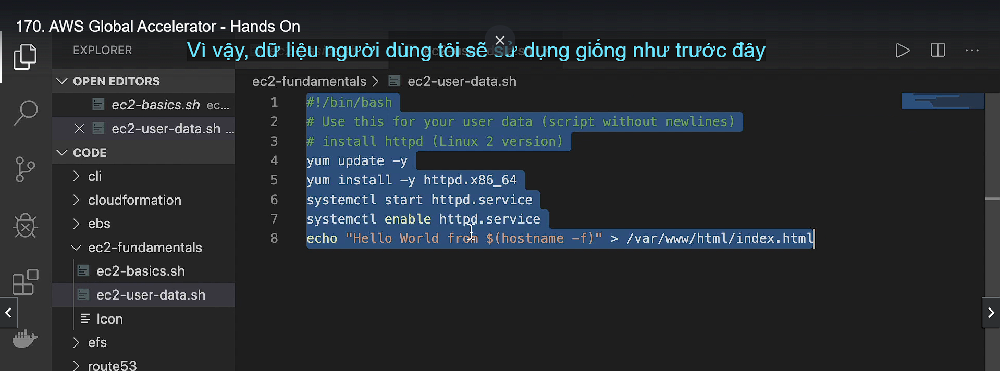
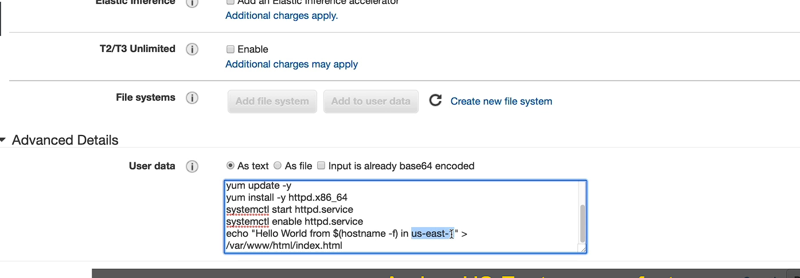
(region: N.Virginia => EC2 => launch instance => User data: paste ec2-user-data.sh (thên nội dung "us-east-1") => launch) => Chú ý: security group mở port HTTP, source: anywhere
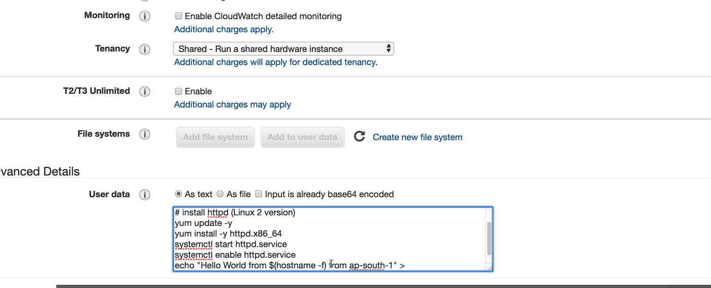
(region: Mumbai => EC2 => launch instance => User data: bổ sung "ap-south-1" => launch )
Truy cập
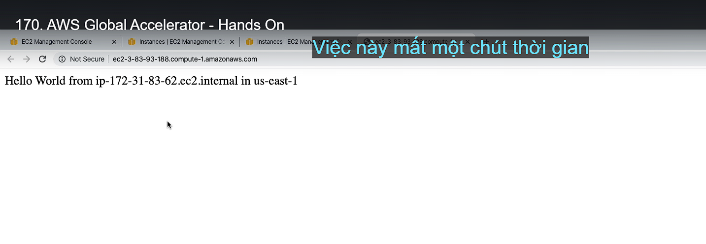
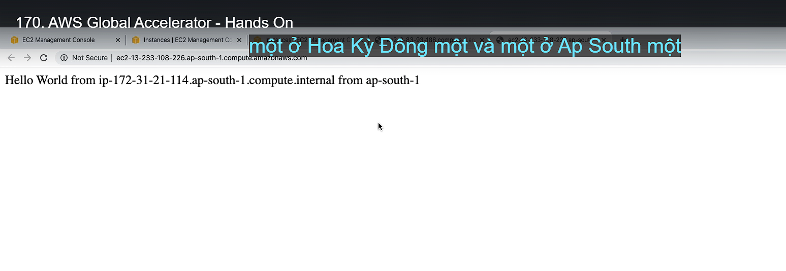

(AWS Global Accelerator => Create accelertor => name: "MyFirstAcceleratore" => next => Listeners -> Ports: 80 -> Protocol: TCP (bở vì lưu lượng HTTP dược xây dựng trên TCP) -> client affinity: None => next => Add endpoint groups -> Region: us-east-1 (Virginia) -> Traffic dial: 100 -> Health check -> protocol: HTTP => Add enpoint group -> Region: ap-south-1 (Mumbai) -> Traffic dial: 100 -> Health check -> protocol: HTTP => next => Endpoint group: us-east-1 -> Endpoint type: EC2 instance -> Endpoint: chọn endpoint của EC2 -> Weight: 128 => Add Endpoint => Endpoint type: EC2 instance -> Endpoint: chọn endpoint của EC2 => Weight: 128 => create accelertor )
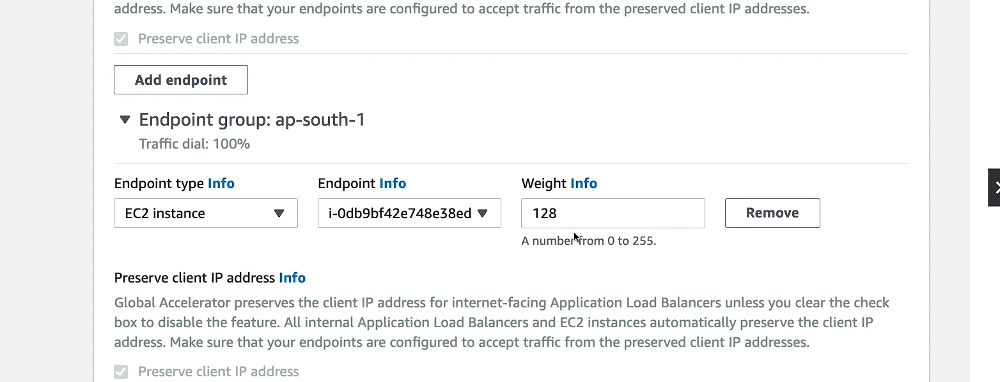

Có 2 static IP address
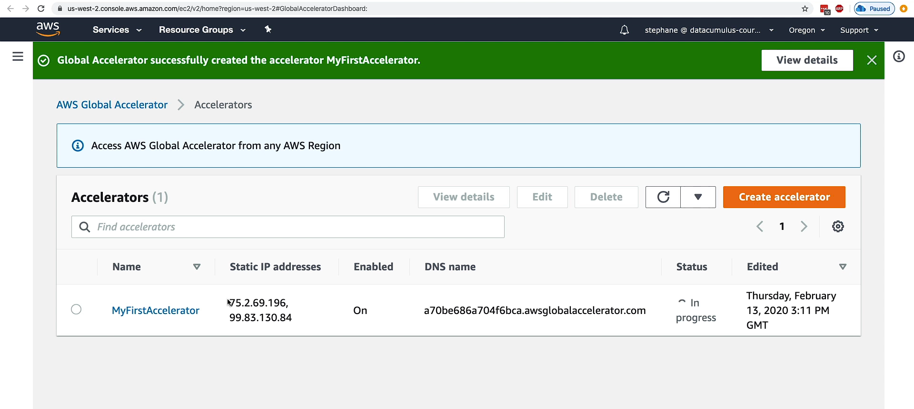
Try cập bằng DNS name => ra region: us-east-1 (bởi vì ông tác giả đang ở bên châu âu lên gần mĩ nhất)
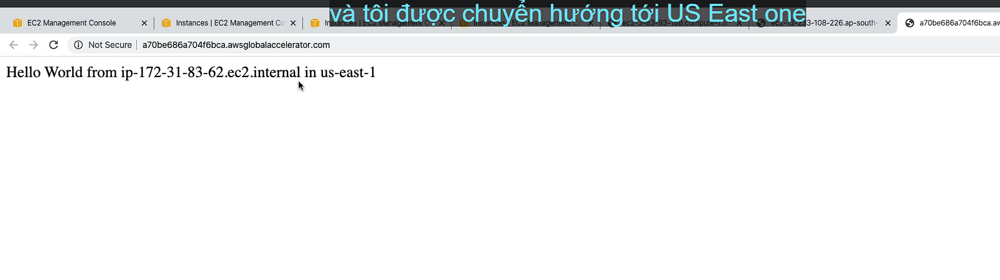
Bật VPN đến Indonesia (indonesia gần india hơn mĩ) => truy cập region ở india
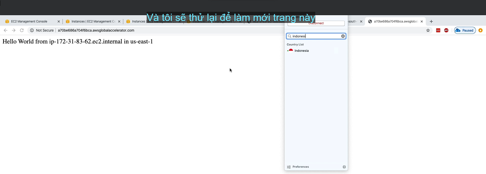
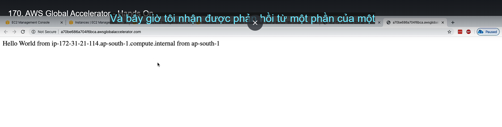

(region: Mumbai => edit security group => remove rule HTTP => save)
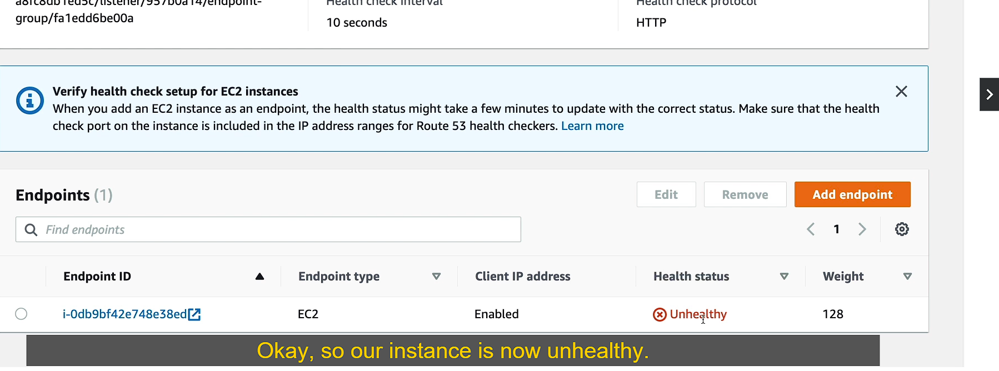
Website sẽ tìm khu vực gần nhất là Mĩ vì region Mumbai unhealth => chuyển đến region Virginia
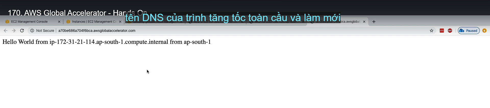
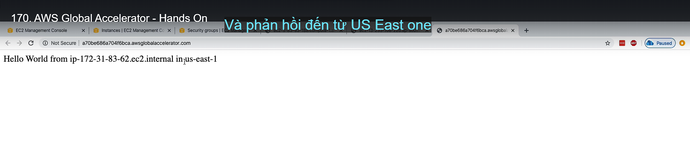

```
Để giải thích một cách dễ hiểu hơn về Client Affinity trong AWS Global Accelerator, bạn có thể nghĩ đến các tình huống thực tế như sau:

1. Vấn đề cần giải quyết:
- Trong một hệ thống đa máy chủ (nhiều endpoint), khi người dùng gửi nhiều yêu cầu, các yêu cầu đó có thể được chuyển đến nhiều server khác nhau. Điều này có thể gây ra vấn đề nếu ứng dụng của bạn cần giữ lại trạng thái (stateful) giữa các yêu cầu.

- Ví dụ:

    - Bạn đang mua sắm online, bạn thêm một sản phẩm vào giỏ hàng. Nếu yêu cầu tiếp theo của bạn (như bấm thanh toán) được chuyển đến server khác, giỏ hàng của bạn có thể không còn đúng nữa vì server mới không biết trạng thái của giỏ hàng bạn ở server trước.
2. Client Affinity giúp gì?
- Client Affinity giúp đảm bảo rằng mọi yêu cầu từ một người dùng cụ thể (dựa trên địa chỉ IP của họ) đều được gửi đến cùng một server (endpoint).
- Điều này đảm bảo rằng trạng thái của người dùng (ví dụ: phiên giao dịch, giỏ hàng) sẽ không bị mất hoặc thay đổi giữa các yêu cầu, vì tất cả các yêu cầu đều đi đến cùng một server.
3. Hoạt động như thế nào?
- Mặc định, khi tính năng Client Affinity chưa được bật, Global Accelerator sẽ phân phối lưu lượng truy cập đều đến các server (endpoint) khác nhau.
- Khi Client Affinity được bật, Global Accelerator sẽ theo dõi địa chỉ IP của người dùng và gửi tất cả các yêu cầu từ địa chỉ IP đó đến cùng một server.
## Ví dụ dễ hiểu hơn:
- Bạn vào một trang web thương mại điện tử. Lần đầu, bạn thêm sản phẩm vào giỏ hàng và yêu cầu được gửi đến server A. Lần tiếp theo bạn bấm thanh toán, yêu cầu này cũng sẽ được gửi đến server A, đảm bảo giỏ hàng của bạn vẫn còn đúng.
- Client Affinity giữ cho các yêu cầu từ một người dùng cụ thể luôn đến cùng một server để tránh mất trạng thái.
```

```
Để giúp bạn dễ hiểu hơn, hãy tưởng tượng Traffic Dial như một nút điều chỉnh lưu lượng (giống như nút vặn âm lượng), cho phép bạn tăng hoặc giảm lưu lượng gửi đến một nhóm endpoint trong AWS Global Accelerator.

## Cách hoạt động của Traffic Dial:
1. Endpoint Group: Trong Global Accelerator, một endpoint group bao gồm nhiều máy chủ (endpoint) đặt ở các khu vực khác nhau. Ví dụ, bạn có một nhóm máy chủ ở Mỹ và một nhóm ở Châu Âu.

2. Phân phối lưu lượng: Global Accelerator có thể phân phối lưu lượng (traffic) từ người dùng đến các nhóm endpoint khác nhau dựa trên nhu cầu và cấu hình.

3. Traffic Dial: Đây là cách bạn điều chỉnh lượng traffic (lưu lượng) đến một nhóm endpoint cụ thể. Nó giúp bạn giảm hoặc tăng phần trăm lưu lượng mà một nhóm máy chủ nhận được.

- Mặc định là 100%: Nghĩa là nhóm đó nhận toàn bộ lưu lượng mà nó được phân bổ.
- Giảm xuống 50%: Chỉ 50% của lưu lượng ban đầu mà nhóm đó được phân bổ sẽ được gửi đến nhóm.

## Tỷ lệ phần trăm được áp dụng cho traffic đã được chỉ định đến endpoint group
- Traffic Dial không áp dụng cho toàn bộ traffic của listener (trình nghe) mà chỉ áp dụng cho phần lưu lượng đã được định tuyến đến endpoint group. Điều này có nghĩa là sau khi lưu lượng đã được phân phối đến các nhóm, bạn có thể điều chỉnh tỷ lệ phần trăm traffic trong một nhóm cụ thể.
- Ví dụ: Nếu một endpoint group đang nhận 50% lưu lượng từ listener và traffic dial của bạn được đặt ở mức 50%, chỉ 25% tổng lưu lượng listener sẽ đến endpoint group đó (50% của 50%).

## Ví dụ đơn giản:

Giả sử bạn có một ứng dụng phân tán ở 2 vùng địa lý:

Endpoint group A: Ứng dụng ở Hoa Kỳ.
Endpoint group B: Ứng dụng ở Châu Âu.

## Tình huống : Đặt Traffic Dial của Group A là 50%
Traffic Dial không áp dụng cho tổng lưu lượng mà chỉ áp dụng cho lưu lượng mà Group A lẽ ra nhận được từ listener (là 50%).

Khi bạn đặt Traffic Dial của Group A là 50%, điều này có nghĩa là Group A chỉ nhận 50% của lượng lưu lượng mà nó đã được chỉ định (tức là 50% của 50%).

## Tính toán cụ thể:
Group A ban đầu được chỉ định 50% traffic từ listener.

Nhưng do Traffic Dial của Group A được đặt là 50%, chỉ 50% của 50% đó sẽ thực sự được gửi đến Group A.

Kết quả: Group A sẽ chỉ nhận 25% tổng traffic (vì 50% của 50% = 25%).

## Nếu bạn đặt Traffic Dial cho cả Group A và Group B đều là 100%, thì cả hai endpoint group sẽ nhận toàn bộ phần lưu lượng mà listener đã phân phối cho chúng.

## Cụ thể:
- Listener phân phối lưu lượng như sau:
    - Group A nhận 50% tổng lưu lượng.
    - Group B nhận 50% tổng lưu lượng.
- Khi bạn đặt Traffic Dial cho cả Group A và Group B là 100%:
    - Group A sẽ nhận toàn bộ 50% lưu lượng mà nó được chỉ định.
    - Group B cũng sẽ nhận toàn bộ 50% lưu lượng mà nó được chỉ định.
Tóm lại:
Nếu bạn đặt Traffic Dial là 100 cho cả hai group, thì Group A sẽ nhận 50% và Group B cũng nhận 50% của tổng traffic (tức là lưu lượng không thay đổi).
Lưu ý: Traffic Dial chỉ điều chỉnh phần trăm lưu lượng được phân phối sau khi listener đã chia đều. Do đó, nếu bạn không thay đổi gì mà giữ mức 100%, các nhóm sẽ nhận được đúng phần lưu lượng đã định sẵn.
```

```
Endpoint Weights trong AWS Global Accelerator là cách để bạn điều chỉnh tỷ lệ lưu lượng được gửi đến các endpoint (máy chủ) trong một endpoint group. Bạn có thể sử dụng weights (trọng số) để kiểm soát lưu lượng đến từng endpoint, giúp hỗ trợ cân bằng tải (load balancing) hoặc kiểm thử phiên bản mới của ứng dụng.

## Cách hoạt động của Endpoint Weights:
- Weights xác định tỷ lệ lưu lượng gửi đến mỗi endpoint trong một endpoint group.
- Bạn chỉ định trọng số cho mỗi endpoint để phân chia lưu lượng giữa các endpoint đó.
- Lưu lượng sẽ được phân phối dựa trên tỷ lệ trọng số của mỗi endpoint.
## Ví dụ đơn giản:
- Giả sử bạn có hai endpoint:

    - Endpoint A với trọng số là 10.
    - Endpoint B với trọng số là 245.
    - Tổng trọng số sẽ là 10 + 245 = 255.

- Cách tính toán phân phối lưu lượng:
    - Endpoint A sẽ nhận 10/255 lưu lượng, tức là khoảng 3.92% tổng lưu lượng.
    - Endpoint B sẽ nhận 245/255 lưu lượng, tức là khoảng 96.08% tổng lưu lượng.
## Lợi ích của việc sử dụng Endpoint Weights:
1. Cân bằng tải: Bạn có thể sử dụng các trọng số để chia đều hoặc không đều lưu lượng giữa các endpoint. Ví dụ:

    - Nếu bạn muốn chia đều lưu lượng giữa hai endpoint, bạn có thể đặt weights bằng nhau, ví dụ như 100 và 100.
2. Triển khai thử nghiệm: Nếu bạn muốn thử nghiệm phiên bản mới của ứng dụng, bạn có thể gửi một phần nhỏ lưu lượng đến endpoint mới. Ví dụ:

    - Đặt trọng số của phiên bản mới là 10 và phiên bản cũ là 245. Khi đó, bạn chỉ gửi khoảng 3.92% lưu lượng đến phiên bản mới, trong khi phần còn lại vẫn đến phiên bản cũ.
3. Tắt lưu lượng đến một endpoint: Nếu bạn không muốn gửi lưu lượng đến một endpoint, bạn có thể đặt weight là 0. Khi đó, không có lưu lượng nào sẽ được gửi đến endpoint đó.

## Ví dụ cụ thể:
- Bạn có hai server:
    - Server A đang chạy phiên bản cũ của ứng dụng.
    - Server B chạy phiên bản mới của ứng dụng mà bạn muốn thử nghiệm.
- Bạn muốn gửi 10% lưu lượng đến Server B và 90% đến Server A:

    - Đặt weight của Server A là 90.
    - Đặt weight của Server B là 10.
- Kết quả:

    - Server A sẽ nhận 90/100 = 90% tổng lưu lượng.
    - Server B sẽ nhận 10/100 = 10% tổng lưu lượng.
## Tóm lại:
- Weights giúp bạn điều chỉnh lưu lượng giữa các endpoint trong cùng một nhóm.
- Bạn có thể dễ dàng thay đổi trọng số để tăng hoặc giảm lưu lượng đến một endpoint, hoặc tắt hẳn một endpoint bằng cách đặt trọng số của nó về 0.
```

Câu hỏi 6:
A company is migrating a web application to AWS Cloud and they are going to use a set of EC2 instances in an EC2 Auto Scaling Group. The web application is made of multiple components so they will need a host-based routing feature to route to specific web application components. This web application is used by many customers and therefore the web application must have a static IP address so it can be whitelisted by the customers’ firewalls. As the customers are distributed around the world, the web application must also provide low latency to all customers. Which AWS service can help you to assign a static IP address and provide low latency across the globe?

```
## Giải thích câu hỏi:
Công ty đang di chuyển (migrating) ứng dụng web của mình lên AWS Cloud và có các yêu cầu sau:

1. EC2 Auto Scaling Group:

- Họ sẽ sử dụng EC2 instances trong một EC2 Auto Scaling Group để tự động tăng hoặc giảm số lượng máy chủ dựa trên nhu cầu của ứng dụng.
2. Nhiều thành phần ứng dụng:

- Ứng dụng web có nhiều thành phần (components), và do đó họ cần một giải pháp định tuyến dựa trên host (host-based routing) để phân phối lưu lượng đến các thành phần ứng dụng cụ thể. Ví dụ, có thể một phần của ứng dụng xử lý việc đăng nhập và phần khác xử lý thanh toán, và lưu lượng cần được chuyển đúng nơi.
3. Địa chỉ IP tĩnh:

- Ứng dụng web này được sử dụng bởi nhiều khách hàng và cần có địa chỉ IP tĩnh (static IP). Điều này cho phép các khách hàng whitelist (cho phép) địa chỉ IP cố định trong tường lửa của họ để ứng dụng được truy cập một cách an toàn.
4. Phân phối trên toàn cầu và độ trễ thấp:

- Các khách hàng nằm rải rác trên toàn thế giới, do đó ứng dụng phải cung cấp trải nghiệm độ trễ thấp cho tất cả khách hàng.

## Yêu cầu chính trong câu hỏi:
- Địa chỉ IP tĩnh: Phải có địa chỉ IP tĩnh để có thể whitelist trong tường lửa của khách hàng.
- Định tuyến dựa trên host: Phải có tính năng để định tuyến lưu lượng đến các thành phần ứng dụng khác nhau.
- Độ trễ thấp: Cần cung cấp độ trễ thấp cho khách hàng trên toàn thế giới.
```

```
Whitelist (danh sách trắng) là một danh sách các địa chỉ IP, tên miền, hoặc ứng dụng mà được phép truy cập vào hệ thống hoặc mạng. Khi bạn whitelist một địa chỉ IP, nghĩa là bạn cho phép các kết nối từ địa chỉ đó đi qua tường lửa (firewall) và truy cập hệ thống của bạn.
```

```
## Ví dụ về định tuyến dựa trên host:
Giả sử bạn có một ứng dụng web với các thành phần sau:

1. login.myapp.com: Xử lý việc đăng nhập.
2. shop.myapp.com: Xử lý việc mua hàng.
## Bạn có thể cấu hình ALB để:

- Khi một người dùng truy cập login.myapp.com, ALB sẽ định tuyến lưu lượng đến các máy chủ (EC2 instances) chuyên xử lý đăng nhập.
- Khi người dùng truy cập shop.myapp.com, ALB sẽ định tuyến đến các máy chủ chuyên xử lý phần mua hàng.
```

```
Để đáp ứng yêu cầu của công ty về địa chỉ IP tĩnh, định tuyến dựa trên host, và độ trễ thấp trên toàn cầu, dịch vụ AWS phù hợp nhất là:

## AWS Global Accelerator kết hợp với Application Load Balancer (ALB).
Cách dịch vụ này đáp ứng yêu cầu:

1. Địa chỉ IP tĩnh:

- AWS Global Accelerator cung cấp hai địa chỉ IP Anycast tĩnh, có thể được whitelist (danh sách trắng) bởi các tường lửa của khách hàng. Các địa chỉ IP này cố định và không thay đổi, ngay cả khi có thay đổi trong cấu hình backend (phía sau).

2. Định tuyến dựa trên host:

- Application Load Balancer (ALB) hỗ trợ định tuyến dựa trên host. Điều này cho phép bạn định tuyến yêu cầu dựa trên tên miền hoặc đường dẫn cụ thể đến các thành phần của ứng dụng web.

3. Độ trễ thấp trên toàn cầu:

- AWS Global Accelerator giúp cải thiện độ trễ bằng cách sử dụng mạng nội bộ của AWS và chuyển hướng lưu lượng đến các Edge locations gần nhất với khách hàng. Điều này đảm bảo người dùng trên toàn cầu có trải nghiệm truy cập nhanh và ổn định.
```
