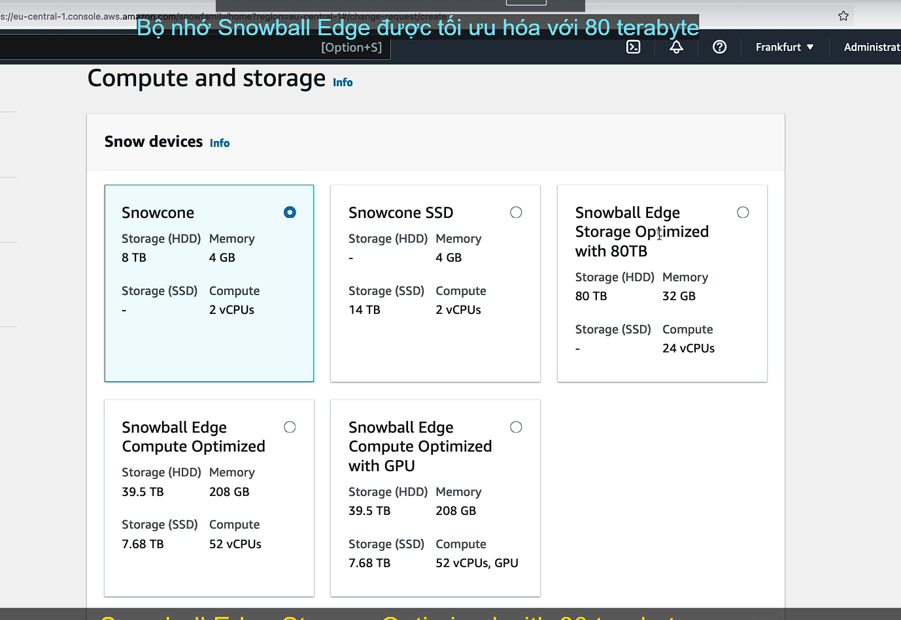
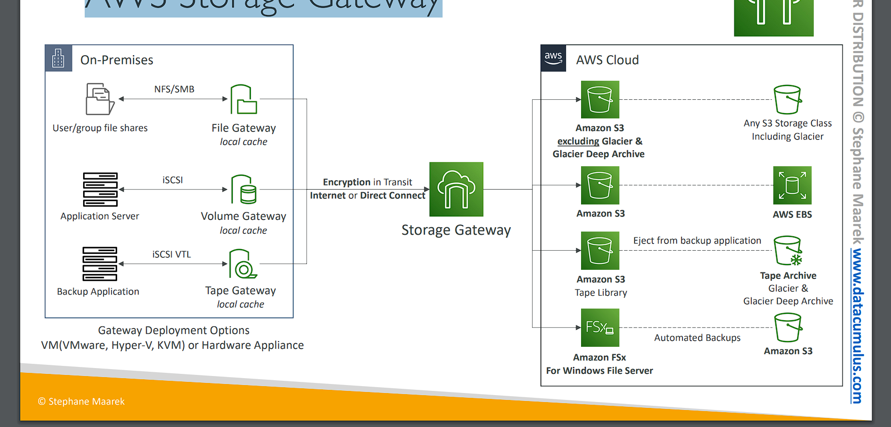

# AWS Storage Extras

## So sanh FSX và EBS


# AWS Snow Family

• Highly-secure (bảo mật cao), portable devices (thiết bị cầm tay) to collect and process data at the edge, and migrate data into and out of AWS


```
AWS Snow Family là một nhóm các thiết bị phần cứng di động và an toàn cao, được sử dụng để thu thập, xử lý dữ liệu tại biên (edge), và di chuyển dữ liệu vào và ra khỏi AWS. Đây là giải pháp lý tưởng cho các tình huống mà kết nối internet hạn chế hoặc không đáng tin cậy, hoặc khi cần di chuyển một lượng dữ liệu lớn.

## Các thành phần chính của AWS Snow Family:
1. AWS Snowcone:

- Thiết bị nhỏ nhất trong Snow Family.
- Dùng để thu thập và xử lý dữ liệu tại các địa điểm xa hoặc có kết nối yếu.
- Dung lượng lưu trữ: 8 TB.
- Có thể gửi về AWS để nhập dữ liệu hoặc kết nối trực tiếp với các dịch vụ AWS.
2. AWS Snowball:

- Thiết bị có kích thước lớn hơn, có dung lượng lưu trữ từ vài TB đến hàng chục PB.
- Có hai phiên bản:
    - Snowball Edge Storage Optimized: Tối ưu hóa cho việc lưu trữ.
    - Snowball Edge Compute Optimized: Cung cấp sức mạnh tính toán để xử lý dữ liệu ngay tại chỗ.
- Dùng cho các dự án lớn, bao gồm cả việc di chuyển dữ liệu khối lượng lớn vào AWS.
3. AWS Snowmobile:

- Là một container lớn có thể lưu trữ exabyte dữ liệu (1 EB = 1 triệu TB).
- Được sử dụng để di chuyển lượng dữ liệu cực kỳ lớn (ví dụ như trung tâm dữ liệu) vào AWS.
- Được sử dụng cho những tổ chức cần chuyển khối lượng dữ liệu khổng lồ.

## Các trường hợp sử dụng:
- Thu thập và xử lý dữ liệu tại edge: Được sử dụng tại các địa điểm xa xôi, không có internet hoặc kết nối yếu, như tàu thuyền, mỏ khai thác, hoặc môi trường khắc nghiệt.
- **Di chuyển dữ liệu khối lượng lớn**: Khi cần di chuyển lượng dữ liệu lớn vào AWS một cách nhanh chóng, tránh việc phải truyền qua mạng internet (quá lâu và không an toàn).
- Xử lý dữ liệu tại chỗ: Snow Family hỗ trợ chạy các ứng dụng máy ảo hoặc tính toán tại chỗ trước khi gửi dữ liệu về AWS.
## Tóm lại:
- AWS Snow Family cung cấp các thiết bị bảo mật cao và di động để thu thập, xử lý dữ liệu tại chỗ, và di chuyển dữ liệu khối lượng lớn vào hoặc ra khỏi AWS, mà không phụ thuộc nhiều vào kết nối internet.
```

```
AWS Snow Family được thiết kế để giải quyết các vấn đề liên quan đến di chuyển dữ liệu lớn và xử lý dữ liệu tại biên (edge) khi kết nối internet bị hạn chế hoặc không thể truyền tải đủ nhanh. Mục đích chính của AWS Snow Family là giúp bạn thu thập, xử lý, và di chuyển dữ liệu một cách an toàn và hiệu quả.

## Cụ thể hơn, AWS Snow Family dùng để:
1. Di chuyển lượng dữ liệu lớn vào hoặc ra khỏi AWS:

- Mục đích: Nếu bạn có khối lượng dữ liệu khổng lồ (hàng terabyte, petabyte, thậm chí exabyte) cần di chuyển vào AWS (ví dụ: từ các trung tâm dữ liệu hoặc các môi trường có lượng dữ liệu lớn), việc sử dụng internet để truyền tải là không thực tế vì sẽ mất quá nhiều thời gian và không an toàn.
- Giải pháp Snow Family: Bạn có thể sử dụng các thiết bị Snowball hoặc Snowmobile để tải dữ liệu vào thiết bị, sau đó gửi thiết bị này đến trung tâm dữ liệu AWS để nhập dữ liệu trực tiếp, thay vì tải qua mạng internet.
2. Xử lý dữ liệu tại các địa điểm xa xôi (Edge computing):

- Mục đích: Trong các môi trường xa xôi hoặc khắc nghiệt (ví dụ: mỏ dầu, nhà máy, hoặc vùng xa), bạn có thể cần thu thập và xử lý dữ liệu nhưng không có kết nối internet mạnh hoặc không có kết nối internet.
- Giải pháp Snow Family: Các thiết bị như Snowcone hoặc Snowball Edge cho phép bạn xử lý và lưu trữ dữ liệu tại chỗ. Sau khi hoàn tất xử lý, bạn có thể chuyển dữ liệu vào AWS khi có kết nối hoặc gửi thiết bị đến AWS để tải dữ liệu.
3. Tăng cường bảo mật khi di chuyển dữ liệu:

- Mục đích: Truyền dữ liệu qua internet có thể tiềm ẩn nhiều nguy cơ bảo mật, đặc biệt với các dữ liệu nhạy cảm.
- Giải pháp Snow Family: Các thiết bị Snow Family đều được mã hóa dữ liệu và tích hợp các tính năng bảo mật, giúp đảm bảo dữ liệu được bảo vệ an toàn trong suốt quá trình di chuyển.
## Tóm tắt mục đích chính:
- AWS Snow Family giúp di chuyển khối lượng dữ liệu lớn một cách nhanh chóng, bảo mật và hiệu quả vào hoặc ra khỏi AWS, đặc biệt trong các môi trường không có kết nối internet ổn định.
- Các thiết bị này cũng hỗ trợ xử lý dữ liệu tại chỗ, giúp bạn tối ưu hóa việc thu thập và xử lý dữ liệu trước khi chuyển về AWS.
```

# Data Migrations with AWS Snow Family


Challenges: (Giải quyết vấn đề)
• Limited connectivity
• Limited bandwidth
• High network cost
• Shared bandwidth (can’t maximize the line)
• Connection stability (Độ ổn định kết nối)

- AWS Snow Family: offline devices to perform data migrations (thiết bị ngoại tuyến thực hiện migrations )
- If it takes more than a week to transfer over the network, use Snowball devices! (Nếu mất hơn một tuần để truyền dữ liệu qua mạng, hãy sử dụng thiết bị Snowball!)

```
Data Migrations with AWS Snow Family giải quyết các thách thức khi di chuyển dữ liệu lớn lên AWS, đặc biệt là trong những môi trường mà kết nối mạng có nhiều giới hạn hoặc không đủ ổn định.

## Các thách thức chính:
1. Limited connectivity (Kết nối mạng bị hạn chế):

- Trong nhiều khu vực hoặc môi trường, kết nối internet có thể bị giới hạn hoặc không có sẵn, gây khó khăn cho việc truyền dữ liệu qua mạng.
2. Limited bandwidth (Băng thông giới hạn):

- Kết nối internet với băng thông thấp không cho phép truyền tải khối lượng dữ liệu lớn trong thời gian ngắn.
3. High network cost (Chi phí mạng cao):

Khi truyền dữ liệu lớn qua internet, chi phí mạng có thể rất cao, đặc biệt là khi phải sử dụng kết nối tốc độ cao hoặc qua các đường truyền quốc tế.
4. Shared bandwidth (Băng thông chia sẻ):

- Trong nhiều tổ chức hoặc môi trường, băng thông mạng phải được chia sẻ giữa nhiều ứng dụng hoặc người dùng, điều này hạn chế khả năng sử dụng toàn bộ đường truyền để di chuyển dữ liệu.
5. Connection stability (Sự ổn định của kết nối):

- Đối với những nơi có kết nối mạng không ổn định, việc truyền dữ liệu lớn có thể bị gián đoạn, dẫn đến thời gian truyền kéo dài hoặc thất bại.
## Giải pháp với AWS Snow Family:
- AWS Snow Family cung cấp các thiết bị ngoại tuyến (offline), như Snowball và Snowmobile, để di chuyển dữ liệu mà không cần phụ thuộc vào mạng.
- Khi việc di chuyển dữ liệu qua internet mất hơn một tuần, AWS khuyến nghị sử dụng Snowball để tiết kiệm thời gian và tránh các vấn đề liên quan đến mạng.
==> Ví dụ, nếu bạn cần di chuyển hàng terabyte hoặc petabyte dữ liệu, việc sử dụng Snowball sẽ nhanh hơn nhiều so với việc truyền qua internet, vì Snowball có thể được gửi qua đường bộ hoặc hàng không đến trung tâm AWS để nhập dữ liệu trực tiếp.

## Tóm lại:
AWS Snow Family là giải pháp hiệu quả và an toàn cho các dự án di chuyển dữ liệu lớn, giúp vượt qua các giới hạn của mạng, chẳng hạn như băng thông thấp, kết nối không ổn định, hoặc chi phí mạng cao. Nếu việc truyền dữ liệu mất hơn một tuần, AWS Snowball là lựa chọn lý tưởng để đẩy nhanh quá trình.
```

# Diagrams

• Direct upload to S3:


• With Snow Family:


# Snow Family – Usage Process

1. Request Snowball devices from the AWS console for delivery
2. Install the snowball client / AWS OpsHub on your servers
3. Connect the snowball to your servers and copy files using the client
4. Ship back the device when you’re done (goes to the right AWS facility)
5. Data will be loaded into an S3 bucket
6. Snowball is completely wiped (xóa hoàn toàn)

```
## Quy trình sử dụng AWS Snow Family (Snowball) để di chuyển dữ liệu bao gồm các bước như sau:

1. Request Snowball devices from the AWS console for delivery
- Bạn yêu cầu thiết bị Snowball từ bảng điều khiển AWS (AWS Console). AWS sẽ gửi thiết bị Snowball tới địa chỉ của bạn.
2. Install the snowball client / AWS OpsHub on your servers
- Trên máy chủ của bạn, bạn cần cài đặt phần mềm Snowball client hoặc AWS OpsHub để dễ dàng quản lý và chuyển dữ liệu giữa máy chủ và thiết bị Snowball.
3. Connect the snowball to your servers and copy files using the client
- Kết nối thiết bị Snowball với máy chủ của bạn qua mạng LAN. Sử dụng Snowball client hoặc AWS OpsHub để sao chép dữ liệu từ hệ thống của bạn vào thiết bị Snowball.
4. Ship back the device when you’re done (goes to the right AWS facility)
- Sau khi bạn hoàn thành việc sao chép dữ liệu, đóng gói và gửi thiết bị Snowball trở lại AWS bằng dịch vụ vận chuyển. AWS đã cung cấp địa chỉ và hướng dẫn giao hàng cụ thể.
5. Data will be loaded into an S3 bucket
- Khi AWS nhận được thiết bị Snowball, họ sẽ tải dữ liệu từ Snowball lên Amazon S3 theo vị trí mà bạn đã chỉ định. Dữ liệu của bạn sẽ an toàn trong S3 và có thể truy cập được từ đó.
6. Snowball is completely wiped
- Sau khi quá trình tải dữ liệu hoàn tất, AWS sẽ xóa toàn bộ dữ liệu trên thiết bị Snowball bằng cách sử dụng quy trình bảo mật, đảm bảo rằng không còn dữ liệu nào của bạn tồn tại trên thiết bị.
```

# What is Edge Computing?

- Process data while it’s being created on an edge location
  • A truck on the road, a ship on the sea, a mining station underground...
  
- These locations may have limited internet and no access to computing power
- We setup a Snowball Edge / Snowcone device to do edge computing
  • Snowcone: 2 CPUs, 4 GB of memory, wired or wireless access
  • Snowball Edge Compute Optimized (dedicated for that use case) (dành riêng cho trường hợp sử dụng) & Storage Optimized
  • Run EC2 Instances or Lambda functions at the edge
- Use cases: preprocess data, machine learning, transcoding media

```
Edge Computing là quá trình xử lý dữ liệu ngay tại nơi dữ liệu được tạo ra, thay vì gửi toàn bộ dữ liệu đến trung tâm dữ liệu hoặc đám mây để xử lý. Điều này rất hữu ích trong các tình huống mà việc truyền tải dữ liệu lên đám mây gặp khó khăn do hạn chế về băng thông, kết nối internet yếu, hoặc cần xử lý nhanh chóng.

# Ví dụ về edge location:
- Xe tải trên đường, tàu trên biển, hoặc trạm khai thác mỏ dưới lòng đất là các vị trí mà kết nối internet bị hạn chế hoặc không có. Ở những nơi này, không thể truyền ngay dữ liệu về trung tâm để xử lý.

# Giải pháp Edge Computing:
- Snowball Edge hoặc Snowcone là các thiết bị mà bạn có thể triển khai tại các vị trí biên (edge) để xử lý dữ liệu tại chỗ mà không cần kết nối internet liên tục. Chúng cung cấp khả năng tính toán và lưu trữ ngay tại biên.
- Snowcone: Thiết bị nhỏ hơn, có 2 CPU, 4GB RAM, hỗ trợ kết nối có dây hoặc không dây, phù hợp với các nhiệm vụ nhẹ.
- Snowball Edge Compute Optimized: Được thiết kế tối ưu cho xử lý dữ liệu tại biên với khả năng tính toán mạnh hơn.
- Snowball Edge Storage Optimized: Tối ưu cho các nhiệm vụ cần lưu trữ lớn.

### Edge Computing giúp làm gì?
- Chạy EC2 Instances hoặc Lambda functions tại các thiết bị Snow để xử lý dữ liệu cục bộ mà không cần phụ thuộc vào kết nối mạng.
T## rường hợp sử dụng:
- Tiền xử lý dữ liệu: Xử lý dữ liệu ban đầu, lọc thông tin không cần thiết trước khi gửi về đám mây để tiết kiệm băng thông.
- Machine Learning: Chạy các mô hình học máy để đưa ra quyết định nhanh tại biên, chẳng hạn nhận diện hình ảnh hoặc phát hiện sự cố.
- Transcoding Media: Chuyển đổi định dạng video hoặc âm thanh ngay tại biên trước khi phân phối.
```

# AWS Snow Family Hands On

(AWS Snow Family => Order an AWS Snow family device => Job name: "DemoJob") => Nói chung demo => yêu cầu đặt hàng aws thiết bị


# Solution Architecture: Snowball into Glacier

• Snowball cannot import to Glacier directly
• You must use Amazon S3 first, in combination with an S3 lifecycle policy


# Amazon FSx – Overview

• Launch 3rd party high-performance file systems on AWS
• Fully managed service


```
Amazon FSx là một dịch vụ của AWS cho phép bạn khởi chạy và sử dụng các hệ thống tệp hiệu suất cao của bên thứ ba trên nền tảng đám mây AWS. Dịch vụ này là fully managed (hoàn toàn được quản lý), nghĩa là AWS sẽ quản lý toàn bộ các tác vụ vận hành như thiết lập, bảo trì, sao lưu, vá lỗi và tối ưu hóa hiệu suất, giúp bạn tập trung vào sử dụng hệ thống mà không cần lo lắng về hạ tầng.

## Đặc điểm chính:
- 3rd party high-performance file systems:
    - Amazon FSx hỗ trợ các hệ thống tệp của bên thứ ba như:
        - FSx for Windows File Server: Hệ thống tệp dành cho các ứng dụng Windows cần chia sẻ file qua SMB (Server Message Block).
        - FSx for Lustre: Hệ thống tệp hiệu suất cao dành cho các khối lượng công việc đòi hỏi tốc độ xử lý dữ liệu lớn, như phân tích dữ liệu, machine learning, hoặc rendering video.
- Fully managed:

    - AWS sẽ tự động quản lý và vận hành dịch vụ, bao gồm việc cấu hình, vá lỗi, sao lưu, và mở rộng hệ thống. Bạn không cần lo lắng về quản trị hay duy trì hệ thống tệp này.
## Lợi ích:
- Hiệu suất cao: Amazon FSx cung cấp hiệu suất nhanh và ổn định cho các tác vụ đòi hỏi tốc độ cao.
- Tích hợp AWS: Dịch vụ dễ dàng tích hợp với các dịch vụ khác của AWS như Amazon EC2, Amazon S3, và AWS Lambda.
- Sao lưu tự động: Amazon FSx tự động sao lưu dữ liệu để đảm bảo tính sẵn sàng và an toàn.
## Tóm lại:
Amazon FSx cho phép bạn sử dụng các hệ thống tệp hiệu suất cao của bên thứ ba, mà không cần lo về việc vận hành, bảo trì hay mở rộng, giúp bạn tập trung vào sử dụng và phát triển các ứng dụng của mình.
```

```

Amazon FSx là dịch vụ lưu trữ tệp hiệu suất cao của AWS, cho phép bạn sử dụng các hệ thống tệp phổ biến mà không cần tự quản lý hạ tầng. Mục đích chính của Amazon FSx là cung cấp các hệ thống tệp chuyên dụng cho các ứng dụng yêu cầu khả năng lưu trữ phức tạp hoặc khối lượng dữ liệu lớn. Dưới đây là cách Amazon FSx có thể được sử dụng:

## Mục đích sử dụng của Amazon FSx:
1. Lưu trữ và chia sẻ tệp:

- FSx cho phép bạn lưu trữ các tệp và chia sẻ chúng giữa các máy chủ hoặc giữa người dùng thông qua các giao thức như SMB (đối với FSx for Windows) hoặc NFS (đối với FSx for Lustre).
- Các tệp này có thể được truy cập đồng thời từ nhiều hệ thống khác nhau, giúp các nhóm làm việc chung với nhau dễ dàng hơn.
2. Tăng hiệu suất cho các ứng dụng nặng về lưu trữ:

- Các hệ thống tệp như FSx for Lustre được thiết kế đặc biệt cho các tác vụ cần hiệu suất lưu trữ cao, như phân tích dữ liệu, máy học (machine learning), hoặc render video. Nó có thể xử lý khối lượng lớn dữ liệu và yêu cầu I/O nhanh chóng.

3. Lưu trữ dữ liệu của các ứng dụng doanh nghiệp:

- FSx for Windows hỗ trợ các ứng dụng Windows-based cần lưu trữ tệp tin, thư mục người dùng, hoặc cơ sở dữ liệu SQL. Hệ thống này tương thích với Windows NTFS và Active Directory, giúp tích hợp vào môi trường Windows dễ dàng.
4. Kết hợp với các dịch vụ AWS khác:

- FSx có thể được tích hợp với các dịch vụ AWS khác, như EC2 để lưu trữ tệp cho các máy chủ, hoặc S3 để sao lưu dữ liệu tự động, đảm bảo an toàn dữ liệu.
5. Di chuyển và mở rộng lưu trữ on-premises lên đám mây:

- Nếu bạn có hệ thống lưu trữ cục bộ (on-premises), bạn có thể sử dụng FSx để di chuyển hoặc mở rộng dung lượng lưu trữ lên đám mây mà không cần phải thay đổi hạ tầng hiện tại quá nhiều.
Nó hỗ trợ kết nối VPN hoặc Direct Connect để bạn có thể truy cập từ hạ tầng cục bộ.
```

# Amazon FSx for Windows (File Server)

```
• FSx for Windows is a fully managed Windows file system share drive (FSx cho Windows là ổ đĩa chia sẻ hệ thống tệp Windows được quản lý hoàn toàn)
• Supports SMB protocol & Windows NTFS
• Microsoft Active Directory integration, ACLs, user quotas
• Can be mounted on Linux EC2 instances
• Supports Microsoft's Distributed File System (DFS) Namespaces (group files across multiple FS)
• Scale up to 10s of GB/s, millions of IOPS, 100s PB of data
• Storage Options:
    • SSD – latency sensitive workloads (databases, media processing, data analytics, …)
    • HDD – broad spectrum of workloads (home directory, CMS, …)
• Can be accessed from your on-premises infrastructure (VPN or Direct Connect)
• Can be configured to be Multi-AZ (high availability)
• Data is backed-up daily to S3
```

```
## Amazon FSx for Windows File Server là gì?
- Amazon FSx for Windows File Server là dịch vụ hệ thống file được AWS quản lý hoàn toàn, cung cấp một hệ thống file Windows với hiệu suất cao, tương thích với các ứng dụng và hệ thống Windows.

## Các đặc điểm chính:
1. Hỗ trợ giao thức SMB và Windows NTFS:

- SMB (Server Message Block): Là giao thức tiêu chuẩn cho việc chia sẻ file và tài nguyên trong mạng Windows.
- NTFS: Là hệ thống file Windows, hỗ trợ các tính năng như quyền truy cập chi tiết (ACLs) và hạn ngạch người dùng (user quotas).
2. Tích hợp Active Directory:

- FSx for Windows tích hợp với Microsoft Active Directory (AD), cho phép quản lý người dùng và bảo mật dễ dàng. Điều này rất hữu ích trong môi trường doanh nghiệp, nơi các chính sách bảo mật và quyền truy cập cần được quản lý tập trung qua Active Directory.
3. Hỗ trợ trên cả Linux:

- Mặc dù là hệ thống file Windows, FSx for Windows vẫn có thể được gắn kết (mount) trên Linux EC2 instances. Điều này giúp hỗ trợ cho các môi trường đa nền tảng (Windows và Linux) cùng làm việc trên một hệ thống file chung.
4. Hỗ trợ Distributed File System (DFS):

- Hỗ trợ DFS Namespaces của Microsoft, cho phép nhóm các file trên nhiều FSx file system khác nhau thành một không gian tên (namespace) chung, giúp việc quản lý và truy cập dễ dàng hơn.
5. Hiệu suất cao và khả năng mở rộng:

- FSx for Windows có thể mở rộng để hỗ trợ lên đến hàng chục GB/s lưu lượng, hàng triệu IOPS, và hàng trăm petabyte dữ liệu. Điều này giúp đáp ứng các yêu cầu về hiệu suất và dung lượng cao của các ứng dụng doanh nghiệp.
6. Tùy chọn lưu trữ:

- SSD (Solid-State Drives): Dành cho các tác vụ yêu cầu độ trễ thấp như cơ sở dữ liệu, xử lý media, phân tích dữ liệu.
- HDD (Hard Disk Drives): Phù hợp cho các tác vụ chung như thư mục người dùng (home directory), hệ thống quản lý nội dung (CMS).
7. Kết nối với cơ sở hạ tầng on-premises:

- Có thể truy cập từ hạ tầng tại chỗ (on-premises) thông qua VPN hoặc AWS Direct Connect. Điều này hữu ích cho các doanh nghiệp có hệ thống file cần truy cập từ cả đám mây và tại chỗ.
8. Multi-AZ (High Availability):

FSx for Windows có thể được cấu hình để hỗ trợ đa vùng sẵn sàng (Multi-AZ) nhằm đảm bảo tính sẵn sàng cao (high availability) và khả năng khôi phục sau sự cố (disaster recovery).
0 Sao lưu tự động lên S3:

Dữ liệu trong FSx for Windows được sao lưu hàng ngày lên Amazon S3, giúp bảo vệ dữ liệu và dễ dàng khôi phục khi cần thiết.
```

```
# Ví dụ cụ thể về việc sử dụng Amazon FSx for Windows:
## Trường hợp sử dụng: Công ty cần một hệ thống file Windows cho các nhân viên
## Một công ty có 500 nhân viên và cần một hệ thống file tương thích Windows để nhân viên có thể lưu trữ và chia sẻ tài liệu nội bộ. Công ty sử dụng Active Directory để quản lý quyền truy cập của người dùng.

- Giải pháp:

    - Công ty triển khai Amazon FSx for Windows File Server với SMB và NTFS, cho phép nhân viên chia sẻ file một cách an toàn với quyền truy cập chi tiết (ACLs) và quản lý qua Active Directory.
    - FSx for Windows hỗ trợ lưu trữ file tài liệu quan trọng với độ trễ thấp bằng cách sử dụng SSD.
    - Dữ liệu của hệ thống được sao lưu hàng ngày lên S3 để đảm bảo an toàn dữ liệu.

```

# Amazon FSx for Lustre

```
• Lustre is a type of parallel distributed file system, for large-scale computing
• The name Lustre is derived from “Linux” and “cluster
• Machine Learning, High Performance Computing (HPC)
• Video Processing, Financial Modeling, Electronic Design Automation
• Scales up to 100s GB/s, millions of IOPS, sub-ms latencies
• Storage Options:
    • SSD – low-latency, IOPS intensive (chuyên sâu) workloads, small & random file operations
    • HDD – throughput-intensive workloads (workload đồi hỏi nhiều thông lượng), large & sequential file operations (tệp tin lớn tuần tự)
• Seamless integration with S3
• Can “read S3” as a file system (through FSx)
• Can write the output of the computations (tính toán) back to S3 (through FSx)
• Can be used from on-premises servers (VPN or Direct Connect)
```

```
## Amazon FSx for Lustre là gì?
- Amazon FSx for Lustre là một dịch vụ lưu trữ file system phân tán và hiệu suất cao, đặc biệt được thiết kế cho các tác vụ tính toán chuyên sâu (HPC) và machine learning. Hệ thống này cho phép truy cập dữ liệu song song với tốc độ cao, giúp xử lý các khối lượng dữ liệu lớn nhanh chóng.
- Lust-re: Tên này xuất phát từ kết hợp giữa "Linux" và "Cluster," ám chỉ sự tích hợp với hệ điều hành Linux và khả năng hoạt động trên các cụm máy chủ.

## Các đặc điểm chính:

1. Hệ thống file phân tán song song:

- FSx for Lustre là một parallel distributed file system, nghĩa là nhiều máy tính có thể truy cập và xử lý dữ liệu song song cùng lúc, giúp tăng tốc độ tính toán cho các khối lượng công việc lớn.

2. Ứng dụng chính:

- Machine Learning: Dùng để huấn luyện các mô hình machine learning trên tập dữ liệu lớn.
- High Performance Computing (HPC): Xử lý các tác vụ tính toán nặng như mô phỏng vật lý, phân tích gen, và dự báo tài chính.
- Xử lý video (Video Processing): Render phim hoặc chỉnh sửa video dung lượng lớn.
- Mô hình tài chính (Financial Modeling): Xử lý dữ liệu phức tạp và tính toán mô phỏng tài chính.
- Thiết kế điện tử (Electronic Design Automation): Dùng để xử lý và mô phỏng các thiết kế phần cứng.

3. Khả năng mở rộng (Scalability):

- Hệ thống có thể mở rộng lên đến hàng trăm GB/s, hỗ trợ hàng triệu IOPS, với độ trễ dưới mili-giây (sub-ms latency). Điều này giúp xử lý khối lượng dữ liệu cực lớn với hiệu suất cao.

4. Tùy chọn lưu trữ:

- SSD: Dành cho các tác vụ yêu cầu độ trễ thấp và IOPS cao (những tác vụ cần xử lý các file nhỏ và truy cập ngẫu nhiên).
- HDD: Phù hợp cho các tác vụ yêu cầu băng thông lớn với các file lớn và tuần tự (throughput-intensive workloads).

5. Tích hợp liền mạch với Amazon S3:

- FSx for Lustre có thể đọc trực tiếp dữ liệu từ Amazon S3 như một hệ thống file, giúp truy cập nhanh chóng vào các file lưu trữ trên S3.
- Sau khi xử lý xong, kết quả có thể ghi trực tiếp trở lại S3 thông qua FSx for Lustre.

6. Khả năng kết nối từ on-premises:

- FSx for Lustre có thể được truy cập từ các máy chủ tại chỗ (on-premises) thông qua VPN hoặc AWS Direct Connect, giúp tích hợp các hạ tầng đám mây với hệ thống nội bộ một cách liền mạch.

```

```
## Ví dụ cụ thể về việc sử dụng Amazon FSx for Lustre:
1. Machine Learning và phân tích dữ liệu lớn:
Giả sử bạn là một công ty chuyên về Machine Learning và cần xử lý một lượng dữ liệu khổng lồ, ví dụ như hàng triệu bức ảnh lưu trữ trên Amazon S3. Để thực hiện quá trình huấn luyện mô hình machine learning, bạn cần truy cập nhanh chóng vào dữ liệu để giảm thời gian xử lý.

- Giải pháp: Sử dụng FSx for Lustre.
    - Bạn có thể gắn Lustre file system vào các máy chủ EC2 hoặc các máy chủ tại chỗ, từ đó truy cập trực tiếp dữ liệu lưu trữ trên S3 mà không cần sao chép dữ liệu.
    - Sau khi quá trình huấn luyện hoàn tất, bạn có thể ghi kết quả huấn luyện trực tiếp lại lên S3 thông qua FSx for Lustre.
    - Điều này giúp tăng tốc độ xử lý và tối ưu hóa chi phí nhờ vào tích hợp trực tiếp với S3.
2. Rendering video:
- Một công ty làm phim cần xử lý render video 3D chất lượng cao, đòi hỏi truy cập nhanh vào dữ liệu lớn gồm các khung hình (frames) và các tài nguyên đồ họa.

- Giải pháp: Sử dụng Amazon FSx for Lustre.
    - Công ty có thể lưu trữ các file cần render trên Amazon S3.
    - Trong quá trình render, các cụm máy tính (clusters) có thể truy cập dữ liệu song song từ Lustre file system với băng thông lớn, giúp quá trình render nhanh hơn.
    - Kết quả video có thể được ghi lại trực tiếp lên S3 sau khi quá trình xử lý hoàn tất.
```

# FSx Lustre - File System Deployment Options


```
• Scratch File System
    • Temporary storage (lưu trữ tạm thời)
    • Data is not replicated (doesn’t persist if file server fails)
    • High burst (6x faster, 200MBps per TiB)
    • Usage: short-term processing, optimize costs
```


```
• Persistent File System
• Long-term storage
• Data is replicated within same AZ
• Replace failed files within minutes
• Usage: long-term processing, sensitive data (dữ liệu nhạy cảm)
```


# Amazon FSx for NetApp ONTAP


```
• Managed NetApp ONTAP on AWS
• File System compatible (tương thích) with NFS, SMB, iSCSI protocol
• Move workloads running on ONTAP or NAS to AWS
• Works with:
    • Linux
    • Windows
    • MacOS
    • VMware Cloud on AWS
    • Amazon Workspaces & AppStream 2.0
    • Amazon EC2, ECS and EKS
• Storage shrinks (co lại) or grows (tăng lên) automatically
• Snapshots, replication, low-cost, compression (nén) and data de-duplication ( Giúp nén dữ liệu và loại bỏ dữ liệu trùng lặp, giảm dung lượng lưu trữ và tiết kiệm chi phí.)
• Point-in-time instantaneous cloning (helpful for testing new workloads) (Sao chép tức thời tại một thời điểm (hữu ích khi kiểm tra khối lượng công việc mới))
```

```
Amazon FSx for NetApp ONTAP là một dịch vụ cung cấp hệ thống tệp NetApp ONTAP được quản lý hoàn toàn trên AWS, mang lại nhiều lợi ích cho việc lưu trữ và quản lý dữ liệu. Dưới đây là giải thích chi tiết về các tính năng và lợi ích của dịch vụ này:

1. Managed NetApp ONTAP on AWS
- NetApp ONTAP là hệ thống quản lý lưu trữ tệp phổ biến trong các trung tâm dữ liệu (on-premises), và Amazon FSx for NetApp ONTAP giúp mang dịch vụ này lên môi trường đám mây AWS.
- AWS quản lý hoàn toàn dịch vụ này, giúp bạn không phải lo lắng về việc quản lý cơ sở hạ tầng phần cứng và bảo trì hệ thống tệp.
2. Hỗ trợ nhiều giao thức lưu trữ (NFS, SMB, iSCSI)
- NFS (Network File System): Giao thức này cho phép bạn chia sẻ và truy cập file từ nhiều máy tính trong cùng một mạng, chủ yếu được sử dụng với Linux.
- SMB (Server Message Block): Phù hợp với Windows và các hệ thống cần chia sẻ file qua mạng, ví dụ như Windows File Sharing.
- iSCSI (Internet Small Computer System Interface): Một giao thức dùng để truy cập ổ đĩa lưu trữ từ xa qua mạng, thường dùng trong các môi trường đòi hỏi hiệu suất cao.

➔ Điểm mạnh: Với hỗ trợ nhiều giao thức này, bạn có thể dễ dàng chuyển các ứng dụng hoặc dữ liệu từ môi trường hiện có sang AWS mà không cần thay đổi hạ tầng.

3. Di chuyển khối lượng công việc chạy trên ONTAP hoặc NAS lên AWS
- Nếu bạn đã sử dụng hệ thống NetApp ONTAP hoặc NAS (Network Attached Storage) trong trung tâm dữ liệu của mình, bạn có thể dễ dàng di chuyển các khối lượng công việc đó sang AWS với Amazon FSx for NetApp ONTAP, tận dụng khả năng mở rộng và linh hoạt của đám mây.

4. Hỗ trợ đa nền tảng (Linux, Windows, MacOS, VMware Cloud on AWS)
- Dịch vụ tương thích với nhiều hệ điều hành khác nhau như Linux, Windows, MacOS, và cả VMware Cloud on AWS, giúp tăng cường tính linh hoạt và khả năng tương thích cho hạ tầng lưu trữ của bạn.
- Nó cũng hỗ trợ Amazon Workspaces & AppStream 2.0, giúp cung cấp môi trường làm việc ảo và ứng dụng trực tiếp từ đám mây AWS.
- Kết hợp tốt với các dịch vụ Amazon EC2, ECS, và EKS, tạo thành một hệ thống lưu trữ mạnh mẽ cho các ứng dụng container và máy ảo.

5. Tự động mở rộng hoặc thu nhỏ lưu trữ
- Lưu trữ tự động mở rộng hoặc thu nhỏ theo nhu cầu khối lượng công việc của bạn. Điều này giúp tối ưu hóa chi phí vì bạn chỉ trả tiền cho dung lượng bạn sử dụng thay vì phải dự đoán trước và mua thừa dung lượng.
6. Tính năng Snapshot, replication, compression, và data de-duplication
- Snapshots: Chụp nhanh hệ thống tệp tại một thời điểm, cho phép bạn khôi phục dữ liệu từ các bản chụp này khi cần thiết.
- Replication: Sao chép dữ liệu đến các vùng khác để bảo vệ dữ liệu khỏi các thảm họa hoặc sự cố.
- Compression và data de-duplication: Giúp nén dữ liệu và loại bỏ dữ liệu trùng lặp, giảm dung lượng lưu trữ và tiết kiệm chi phí.
7. Cloning ngay lập tức (Point-in-time instantaneous cloning)
- Dịch vụ cung cấp khả năng cloning dữ liệu ngay tại một thời điểm bất kỳ mà không làm gián đoạn hệ thống hiện tại. Điều này rất hữu ích cho các tình huống như thử nghiệm khối lượng công việc mới mà không cần phải tạo ra bản sao thực sự của dữ liệu, giúp tiết kiệm thời gian và tài nguyên.
```

# Amazon FSx for OpenZFS

```
• Managed OpenZFS file system on AWS
• File System compatible (tương thích) with NFS (v3, v4, v4.1, v4.2)
• Move workloads running on ZFS to AWS
• Works with:
    • Linux
    • Windows
    • MacOS
    • VMware Cloud on AWS
    • Amazon Workspaces & AppStream 2.0
    • Amazon EC2, ECS and EKS
• Up to 1,000,000 IOPS with < 0.5ms latency
• Snapshots, compression and low-cost
• Point-in-time instantaneous cloning (helpful for testing new workloads)
```

# Amazone FSx - Hands On

(Amazon FSx => Create file system => File system options: amazon FSx for Lustre => next => ) => Nói chúng demo

# Hybrid Cloud for Storage

```
• AWS is pushing for ”hybrid cloud”
    • Part of your infrastructure is on the cloud
    • Part of your infrastructure is on-premises
• This can be due to (Do nguyên nhân)
    • Long cloud migrations
    • Security requirements
    • Compliance requirements (yêu cầu tuân thủ)
    • IT strategy
• S3 is a proprietary storage technology (công nghệ lưu trữ độc quyền) (unlike (không giống như) EFS / NFS), so how do you expose the S3 data on-premises?
• AWS Storage Gateway
```

```
Hybrid Cloud for Storage đề cập đến việc sử dụng cả hạ tầng đám mây và hạ tầng tại chỗ (on-premises) để lưu trữ và quản lý dữ liệu. AWS đang đẩy mạnh mô hình này để giúp các doanh nghiệp có thể sử dụng đám mây AWS mà vẫn giữ một phần hạ tầng lưu trữ trên các máy chủ vật lý tại chỗ của họ. Dưới đây là giải thích chi tiết về các khái niệm trong câu hỏi:

1. Hybrid Cloud là gì?
- Hybrid Cloud (đám mây lai) là mô hình mà doanh nghiệp có thể kết hợp sử dụng cả đám mây (như AWS) và hạ tầng tại chỗ (on-premises).
- Phần hạ tầng trên đám mây: Một phần dữ liệu hoặc ứng dụng của bạn được lưu trữ và xử lý trên AWS (ví dụ: Amazon S3, EC2).
- Phần hạ tầng tại chỗ: Phần khác của hệ thống vẫn hoạt động trên các máy chủ vật lý trong trung tâm dữ liệu của doanh nghiệp (data center on-premises).
2. Lý do doanh nghiệp sử dụng Hybrid Cloud
- Migrations dài hạn: Việc chuyển toàn bộ hệ thống lên đám mây có thể tốn thời gian. Do đó, doanh nghiệp có thể di chuyển từ từ, kết hợp giữa on-premises và đám mây.
- Yêu cầu về bảo mật: Một số dữ liệu nhạy cảm hoặc quan trọng có thể cần giữ tại chỗ để đảm bảo tính an toàn và tuân thủ các quy định về bảo mật.
- Compliance (tuân thủ): Một số ngành công nghiệp yêu cầu dữ liệu phải được lưu trữ trong một khu vực hoặc môi trường cụ thể (ví dụ như không được phép lưu trữ ngoài quốc gia).
- Chiến lược CNTT: Một số doanh nghiệp có chiến lược giữ lại một phần hệ thống tại chỗ để kiểm soát, đồng thời sử dụng đám mây để mở rộng linh hoạt.
3. Vấn đề với S3 và on-premises
- Amazon S3 là một công nghệ lưu trữ đám mây độc quyền (proprietary storage technology), nghĩa là nó không tuân theo các chuẩn lưu trữ tệp như NFS (Network File System) hay EFS (Elastic File System), vốn thường được sử dụng trong các hệ thống lưu trữ on-premises.
- Vấn đề đặt ra: Làm thế nào để tiếp cận và quản lý dữ liệu trên S3 từ các máy chủ tại chỗ? Bởi vì S3 không cung cấp giao diện tương thích với các chuẩn như NFS.
4. Giải pháp: AWS Storage Gateway
- AWS Storage Gateway là dịch vụ giúp kết nối giữa hạ tầng tại chỗ (on-premises) và đám mây AWS.
- Storage Gateway cung cấp các phương thức để truy cập dữ liệu trên S3 từ on-premises:
- File Gateway: Cung cấp giao diện NFS/SMB, cho phép bạn lưu trữ và truy cập các tệp trên S3 từ các hệ thống tại chỗ giống như bạn đang làm việc với một hệ thống tệp thông thường (NFS/SMB).
Volume Gateway: Cung cấp giao diện block storage để lưu trữ và backup dữ liệu lên S3.
Tape Gateway: Giúp các hệ thống sao lưu on-premises sử dụng băng từ ảo, tương thích với phần mềm sao lưu hiện tại.

## Lợi ích của AWS Storage Gateway:
1. Truy cập S3 từ on-premises: Storage Gateway giúp bạn sử dụng các chuẩn NFS/SMB để truy cập dữ liệu trên S3 từ hệ thống tại chỗ mà không cần phải thay đổi phần lớn hệ thống hiện tại.
2. Lưu trữ và backup linh hoạt: Bạn có thể sử dụng AWS như một dịch vụ backup, lưu trữ dữ liệu từ on-premises lên đám mây mà vẫn có thể truy cập dễ dàng.
3. Tích hợp liền mạch: Storage Gateway tạo ra sự kết nối liền mạch giữa hệ thống tại chỗ và đám mây AWS, giúp việc lưu trữ, sao lưu và truy xuất dữ liệu dễ dàng hơn.

Tóm tắt:
- Hybrid Cloud là mô hình kết hợp lưu trữ dữ liệu trên cả đám mây và hạ tầng tại chỗ.
- AWS Storage Gateway là giải pháp giúp kết nối hệ thống tại chỗ với Amazon S3, cung cấp các giao thức lưu trữ quen thuộc như NFS/SMB để truy cập và quản lý dữ liệu trên S3 từ hệ thống tại chỗ một cách dễ dàng.
```

# AWS Storage Cloud Native Options


# AWS Storage Gateway


```
• Bridge between on-premises data and cloud data
• Use cases:
    • disaster recovery (backup your on-premise data into the could)
    • backup & restore
    • tiered storage
    • on-premises cache & low-latency files access
• Types of Storage Gateway:
    • S3 File Gateway
    • FSx File Gateway
    • Volume Gateway
    • Tape Gateway
```

# Amazon S3 File Gateway

• Configured S3 buckets are accessible (có thể truy cập) using the NFS and SMB protocol
• Most recently used data is cached in the file gateway
• Supports S3 Standard, S3 Standard IA, S3 One Zone A, S3 Intelligent Tiering
• Transition (chuyển tiếp) to S3 Glacier using a Lifecycle Policy
• Bucket access using IAM roles for each File Gateway
• SMB Protocol has integration with Active Directory (AD) for user authentication


# Amazon FSx File Gateway

• Native access to Amazon FSx for Windows File Server
• Local cache for frequently accessed data (data thường xuyên truy cập)
• Windows native compatibility (khả năng tương thích gốc)(SMB, NTFS, Active Directory...)
• Useful for group file shares and home directories


# Volume Gateway

• Block storage using iSCSI protocol backed by S3 (hộ trợ bởi S3)
• Backed by EBS snapshots which can help restore on-premises volumes!
• Cached volumes: low latency access to most recent data (data gần đây nhất)
• Stored volumes: entire dataset is on premise, scheduled backups to S3


# Tape Gateway

• Some companies have backup processes using physical tapes (!) (tapes: băng)
• With Tape Gateway, companies use the same processes but, in the cloud
• Virtual Tape Library (VTL) backed by Amazon S3 and Glacier
• Back up data using existing tape-based processes (and iSCSI interface)
• Works with leading backup software vendors (nhà sao lưu hàng đầu)


# Storage Gateway – Hardware appliance


• Using Storage Gateway means you need on-premises virtualization
• Otherwise (Nếu không thì), you can use a Storage Gateway Hardware Appliance
• You can buy it on amazon.com
• Works with File Gateway, Volume Gateway, Tape Gateway
• Has the required CPU, memory, network, SSD cache resources
• Helpful for daily NFS backups in small data centers

# AWS Storage Gateway



## Storage Gateway Hands On

(Storage Gateway => )

# AWS Transfer Family

```
• A fully-managed service for file transfers into and out of Amazon S3 or Amazon EFS using the FTP protocol
• Supported Protocols
    • AWS Transfer for FTP (File Transfer Protocol (FTP))
    • AWS Transfer for FTPS (File Transfer Protocol over SSL (FTPS))
    • AWS Transfer for SFTP (Secure File Transfer Protocol (SFTP))
• Managed infrastructure, Scalable, Reliable, Highly Available (multi-AZ)
• Pay per provisioned endpoint per hour + data transfers in GB
• Store and manage users’ credentials within the service
• Integrate with existing authentication systems (Microsoft Active Directory, LDAP, Okta, Amazon Cognito, custom)
• Usage: sharing files, public datasets, CRM, ERP, …
```


# AWS DataSync

```
• Move large amount of data to and from (di chuyển lượng lớn data và đi từ những lơi)
    • On-premises / other cloud to AWS (NFS, SMB, HDFS, S3 API…) – needs agent
    • AWS to AWS (different storage services) – no agent needed
• Can synchronize to:
    • Amazon S3 (any storage classes – including Glacier)
    • Amazon EFS
    • Amazon FSx (Windows, Lustre, NetApp, OpenZFS...)
• Replication tasks can be scheduled hourly, daily, weekly
• File permissions and metadata are preserved (Quyền của tệp và siêu dữ liệu được bảo toàn) (NFS POSIX, SMB…)
• One agent task can use 10 Gbps, can setup a bandwidth limit
```

# AWS DataSync

NFS / SMB to AWS (S3, EFS, FSx…)


# AWS DataSync

Transfer between AWS storage services


# Storage Comparison

• S3: Object Storage
• S3 Glacier: Object Archival
• EBS volumes: Network storage for one EC2 instance at a time
• Instance Storage: Physical storage for your EC2 instance (high IOPS)
• EFS: Network File System for Linux instances, POSIX filesystem
• FSx for Windows: Network File System for Windows servers
• FSx for Lustre: High Performance Computing Linux file system
• FSx for NetApp ONTAP: High OS Compatibility (tương thích)
• FSx for OpenZFS: Managed ZFS file system
• Storage Gateway: S3 & FSx File Gateway, Volume Gateway (cache & stored), Tape Gateway
• Transfer Family: FTP, FTPS, SFTP interface on top of Amazon S3 or Amazon EFS
• DataSync: Schedule data sync from on-premises to AWS, or AWS to AWS
• Snowcone / Snowball / Snowmobile: to move large amount of data to the cloud, physically
• Database: for specific workloads, usually with indexing and querying

# Câu hỏi 10:

A company uses a lot of files and data which is stored in an FSx for Windows File Server storage on AWS. Those files are currently used by the resources hosted on AWS. There’s a requirement for those files to be accessed on-premises with low latency. Which AWS service can help you achieve this?

Đáp án: FSx File Gateway

# Câu hỏi 11:

A Solutions Architect is working on planning the migration of a startup company from on-premises to AWS. Currently, their infrastructure consists of many servers and 30 TB of data hosted on a shared NFS storage. He has decided to use Amazon S3 to host the data. Which AWS service can efficiently migrate the data from on-premises to S3?

Đáp án: AWS DataSync

# Câu hỏi 12:

Which AWS service is best suited to migrate a large amount of data from an S3 bucket to an EFS file system?

Đáp án : AWS DataSync

# Câu hỏi 16:

A company is running Amazon S3 File Gateway to host their data on S3 buckets and is able to mount them on-premises using SMB. The data currently is hosted on S3 Standard storage class and there is a requirement to reduce the costs for S3. So, they have decided to migrate some of those data to S3 Glacier. What is the most efficient way they can use to move the data to S3 Glacier automatically?

Đáp án: Use S3 Lifecycle Policy (Xem lại lý thuyết)

# Câu hỏi 17:

You have on-premises sensitive files and documents that you want to regularly synchronize to AWS to keep another copy. Which AWS service can help you with that?

Đáp án: AWS DataSync

Giải thích: AWS DataSync is an online data transfer service that simplifies, automates, and accelerates moving data between on-premises storage systems and AWS Storage services, as well as between AWS Storage services

# Câu hỏi 13:

A Machine Learning company is working on a set of datasets that are hosted on S3 buckets. The company decided to release those datasets to the public to be useful for others in their research, but they don’t want to configure the S3 bucket to be public. And those datasets should be exposed over the FTP protocol. What can they do to do the requirement efficiently and with the least effort?

Đáp án: Use AWS Transfer Family

## Câu hỏi 5:

You have a large dataset stored in S3 that you want to access from on-premises servers using the NFS or SMB protocol. Also, you want to authenticate access to these files through on-premises Microsoft AD. What would you use?
Đáp án: Amazon S3 File Gateway

# Câu hỏi 6:

You are planning to migrate your company's infrastructure from on-premises to AWS Cloud. You have an on-premises Microsoft Windows File Server that you want to migrate. What is the most suitable AWS service you can use?

Đáp án: Amazon FSx File Gateway

# Câu hỏi 10:

A company uses a lot of files and data which is stored in an FSx for Windows File Server storage on AWS. Those files are currently used by the resources hosted on AWS. There’s a requirement for those files to be accessed on-premises with low latency. Which AWS service can help you achieve this?
