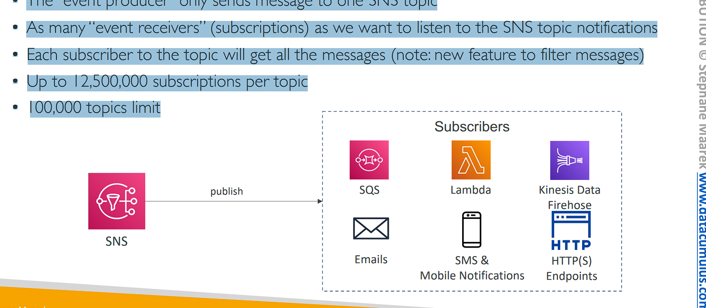
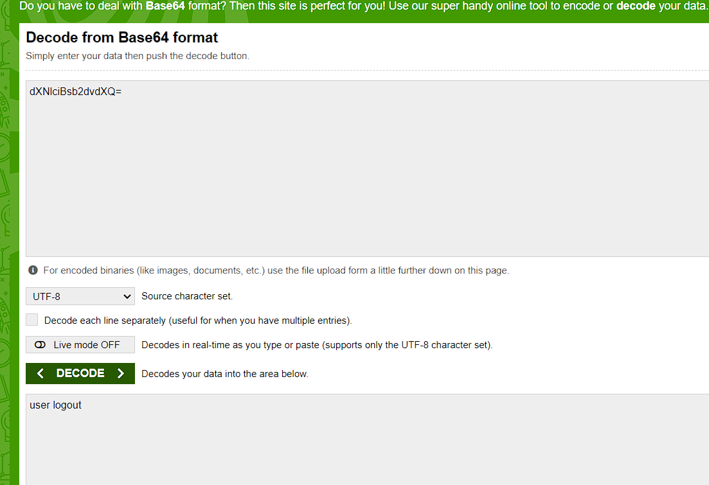
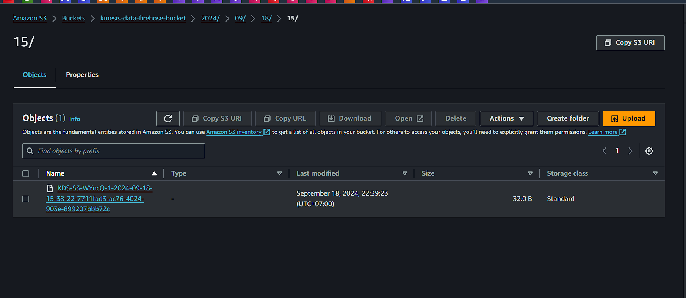

# AWS Integration & Messaging

# Section Introduction

• When we start deploying multiple applications, they will inevitably (tất yếu) need to communicate with one another
• There are two patterns of application communication

1. Synchronous communications (application to application)
   

2. Asynchronous / Event based (application to queue to application)
   

# Section Introduction

```
• Synchronous between applications can be problematic if there are sudden spikes of traffic (Đồng bộ giữa các ứng dụng có thể gặp vấn đề nếu có lưu lượng truy cập tăng đột biến)
• What if you need to suddenly encode (đột ngột mã háo) 1000 videos but usually it’s 10?
• In that case, it’s better to decouple (tách rời) your applications,
    • using SQS: queue model
    • using SNS: pub/sub model
    • using Kinesis: real-time streaming model
• These services can scale independently from our application!
```

# Amazon SQS What’s a queue?


# Amazon SQS – Standard Queue

```
• Oldest offering (over 10 years old)
• Fully managed service, used to decouple applications
• Attributes:
    • Unlimited throughput, unlimited number of messages in queue
    • Default retention of messages: 4 days, maximum of 14 days
    • Low latency (<10 ms on publish and receive)
    • Limitation of 256KB per message sent
• Can have duplicate messages (at least once delivery, occasionally)
• Can have out of order messages (best effort ordering) (message không theo thứ tự)
```

# SQS – Producing Messages


```
• Produced to SQS using the SDK (SendMessage API)
• The message is persisted in SQS until a consumer deletes it
• Message retention: default 4 days, up to 14 days
• Example: send an order to be processed
    • Order id
    • Customer id
    • Any attributes you want
• SQS standard: unlimited throughput
```

# SQS – Consuming Messages

• Consumers (running on EC2 instances, servers, or AWS Lambda)…
• Poll SQS for messages (receive up to 10 messages at a time) (được lư vào hàng đợi SQS cho tới khi đọc và xóa nó)
• Process the messages (example: insert the message into an RDS database)
• Delete the messages using the DeleteMessage API


# SQS – Multiple EC2 Instances Consumers


• Consumers receive and process messages in parallel
• At least once delivery
• Best-effort message ordering (Sắp xếp tin nhắn theo nỗ lực tốt nhất)
• Consumers delete messages after processing them
• We can scale consumers horizontally to improve throughput of processing

# SQS with Auto Scaling Group (ASG)


# SQS to decouple between application tiers


# Amazon SQS - Security

```
• Encryption:
    • In-flight encryption using HTTPS API
    • At-rest encryption using KMS keys
    • Client-side encryption if the client wants to perform encryption/decryption itself
• Access Controls: IAM policies to regulate (điều tiết) access to the SQS API
• SQS Access Policies (similar to S3 bucket policies)
    • Useful for cross-account access to SQS queues
    • Useful for allowing other services (SNS, S3…) to write to an SQS queue
```

## SQS - Standard Quêu Hands On

(SQS => Create queue => type: Standard => name: "DemoQueue" => Create queue => Send and receive message => body: "hello world" => send message => poll for messages)


`Giải thích quan trọng`: mỗi lần poll for messange về và thấy Receive count tăng lên 1 tức là `thời gian sử lý sau 30 giây` nếu như messange đó `chưa được xử lý xong` như trong ảnh thì messange lại trở về trong queue Và khi ta poll for messange thì receive sẽ tăng lên


# SQS – Message Visibility Timeout

• After a message is polled by a consumer, it becomes invisible (vô hình) to other consumers
• By default, the “message visibility timeout” (thời gian chờ hiển thị) is 30 seconds
• That means the message has 30 seconds to be processed
• After the message visibility timeout is over (hết thời gian chờ), `the message is “visible” in SQS`


# SQS – Message Visibility Timeout


• `If a message is not processed within the visibility timeout, it will be processed twice` (Nếu message không được xử lý trong thời gian visibility timeout nó sẽ được sử lý lần 2, được xử lý bởi 2 consumer khác nhau hoặc cùng 1 consumer)
• A consumer could call the ChangeMessageVisibility API to get more time
• If visibility timeout is high (hours), and consumer crashes, re-processing will take time (Nếu thời gian chờ hiển thị cao (giờ) và người dùng gặp sự cố, việc xử lý lại sẽ mất thời gian)
• If visibility timeout is too low (seconds), we may get duplicates (xử lý trùng lặp)

## Hands On


(Send and receive messanges => messange body: "hello world" => Send messange)

==> Mở 2 tab trình duyệt send messange sẽ là 2 consumer


first window => poll for messange

second window => poll for messange ==> thì messange sẽ không xuất hiện ở cửa sổ 2 vì đang trong thời gian xử lý của consumer window 1 trong 30s hết thời gian xử lý nếu như messange đó `Chưa hoàn thành` thì lại dược push lại vao queue


(DemoQueue => Edit => Visibility timeout)

# Amazon SQS - Long Polling


• When a consumer requests messages from the queue, it can optionally “wait” for messages to arrive (đến) if there are none in the queue
• This is called Long Polling
• LongPolling decreases the number of API calls made to SQS while increasing the efficiency (hiệu quả) and reducing latency of your application
• The wait time can be between 1 sec to 20 sec (20 sec preferable)
• Long Polling is preferable to Short Polling
• Long polling can be enabled at the queue level or at the API level using WaitTimeSeconds

# Amazon SQS – FIFO Queue

• FIFO = First In First Out (ordering (sắp xếp) of messages in the queue)


• Limited throughput: 300 msg/s without batching (mà không gửi hàng loạt), 3000 msg/s with
• Exactly-once send capability (by removing duplicates) (Xử lý đúng một lần)
• Messages are processed in order by the consumer (in order: theo thứ tụ)

```
Exactly-Once Processing (Xử lý đúng một lần):
- FIFO queue có khả năng chống trùng lặp tin nhắn. Điều này đảm bảo rằng mỗi tin nhắn được xử lý duy nhất một lần, dù có sự cố hoặc lỗi mạng.
- Khả năng này rất quan trọng khi bạn không muốn bất kỳ tin nhắn nào bị xử lý nhiều hơn một lần, ví dụ trong việc chuyển tiền hay các tác vụ quan trọng.
```

```
Batching là một kỹ thuật mà bạn gửi hoặc xử lý nhiều tin nhắn cùng một lúc thay vì xử lý từng tin nhắn một.

Trong ngữ cảnh của Amazon SQS FIFO Queue, batching có nghĩa là bạn có thể nhóm nhiều tin nhắn lại với nhau và gửi chúng trong một request duy nhất, thay vì gửi từng tin nhắn riêng lẻ.

## Giải thích chi tiết về batching:
1. Không sử dụng batching:

- Bạn gửi từng tin nhắn một lần và mỗi tin nhắn sẽ được xử lý trong một request riêng biệt. Khi đó, số lượng tin nhắn mà SQS FIFO Queue có thể xử lý là 300 tin nhắn/giây.
2. Sử dụng batching:

- Bạn có thể gửi nhiều tin nhắn cùng một lúc (tối đa 10 tin nhắn cho mỗi batch) trong một request duy nhất.
- Điều này sẽ giúp giảm số lượng request cần thực hiện, từ đó tăng throughput của hệ thống lên. Khi sử dụng batching, throughput của FIFO queue sẽ tăng lên 3,000 tin nhắn/giây.
## Ví dụ:
Giả sử bạn có 1,000 tin nhắn cần gửi đến hàng đợi SQS:

- Không sử dụng batching: Bạn sẽ phải thực hiện 1,000 request (mỗi request chứa 1 tin nhắn).
- Sử dụng batching: Bạn có thể chia thành 100 request, mỗi request chứa tối đa 10 tin nhắn (batch). Như vậy bạn chỉ cần 100 request để gửi 1,000 tin nhắn.
## Lợi ích của batching:
- Tăng hiệu suất: Batching cho phép bạn gửi nhiều tin nhắn cùng lúc, giảm thời gian gửi và tăng throughput.
- Tiết kiệm chi phí: AWS tính phí dựa trên số lượng request, vì vậy nếu bạn có thể nhóm nhiều tin nhắn vào một request, bạn sẽ tiết kiệm chi phí.
```

## Hands On

(Create queue => Type: FIFO => name: "DemoQueue.fifo" => Create queue )

(Send and receive messange => messange body: "Hello World 1" => Messange group ID: "demo" => Messange deduplication ID: 1 => Send messange)
(Send and receive messange => messange body: "Hello World 2" => Messange group ID: "demo" => Messange deduplication ID: 2 => Send messange)
(Send and receive messange => messange body: "Hello World 3" => Messange group ID: "demo" => Messange deduplication ID: 3 => Send messange)
(Send and receive messange => messange body: "Hello World 4" => Messange group ID: "demo" => Messange deduplication ID: 4 => Send messange)


# SQS with Auto Scaling Group (ASG)


# If the load is too big, some transactions may be lost


# SQS as a buffer to database writes


# SQS to decouple (tách rời) between application tiers


# Amazon SNS

• What if you want to send one message to many receivers?

- Direct integration
  

- Pub / Sub
  

# Amazon SNS


• The “event producer” only sends message to one SNS topic
• As many “event receivers” (subscriptions) as we want to listen to the SNS topic notifications
• Each subscriber to the topic will get all the messages (note: new feature to filter messages)
• Up to 12,500,000 subscriptions per topic
• 100,000 topics limit

# SNS integrates with a lot of AWS services

• Many AWS services can send data directly to SNS for notifications


# Amazon SNS – How to publish

```
• Topic Publish (using the SDK)
    • Create a topic
    • Create a subscription (or many)
    • Publish to the topic
• Direct Publish (for mobile apps SDK)
    • Create a platform application
    • Create a platform endpoint
    • Publish to the platform endpoint
    • Works with Google GCM, Apple APNS, Amazon ADM…
```

# Amazon SNS – Security

```
• Encryption:
    • In-flight encryption using HTTPS API
    • At-rest encryption using KMS keys
    • Client-side encryption if the client wants to perform encryption/decryption itself
• Access Controls: IAM policies to regulate (quy định) access to the SNS API
• SNS Access Policies (similar to S3 bucket policies)
    • Useful for cross-account access to SNS topics
    • Useful for allowing other services ( S3…) to write to an SNS topic
```

# SNS + SQS: Fan Out


• Push once in SNS, receive in all SQS queues that are subscribers
• Fully decoupled (tách rời), no data loss
• SQS allows for: data persistence, delayed processing and retries of work
• Ability to add more SQS subscribers over time
• Make sure your SQS queue access policy allows for SNS to write
• Cross-Region Delivery: works with SQS Queues in other regions

# Application: S3 Events to multiple queues

• For the same combination of: event type (e.g. object create) and prefix (e.g. images/) you can only have one S3 Event rule
• If you want to send the same S3 event to many SQS queues, use fan-out


# Application: SNS to Amazon S3 through Kinesis Data Firehose

• SNS can send to Kinesis and therefore we can have the following solutions architecture:

# Amazon SNS – FIFO Topic

• FIFO = First In First Out (ordering of messages in the topic)


```
• Similar features as SQS FIFO:
    • Ordering by Message Group ID (all messages in the same group are ordered)
    • Deduplication (sự trùng lặp) using a Deduplication ID or Content Based Deduplication
• Can have SQS Standard and FIFO queues as subscribers
• Limited throughput (same throughput as SQS FIFO)
```

# SNS FIFO + SQS FIFO: Fan Out

• In case you need fan out + ordering + deduplication


# SNS – Message Filtering

• JSON policy used to filter messages sent to SNS topic’s subscriptions
• If a subscription doesn’t have a filter policy, it receives every message


# SNS - Hands On

(SNS => Create topic => name: "MyFirstTopic" => type: Standard => Create topic => create subscription => Protocol: Email => Endpoint: ll6012065@gmail.com => Create subscription) => vô email để confirm
(MyFirstTopic => publish messange => messange body: "Hello World" => publish messange)

# Kinesis Overview

• Makes it easy to collect, process, and analyze streaming data in real-time
• Ingest real-time data such as: Application logs, Metrics, Website clickstreams, IoT telemetry data…

• Kinesis Data Streams: capture (bắt lấy), process, and store data streams
• Kinesis Data Firehose: load data streams into AWS data stores
• Kinesis Data Analytics: analyze data streams with SQL or Apache Flink
• Kinesis Video Streams: capture, process, and store video streams

```
Amazon Kinesis là một dịch vụ đám mây của AWS giúp dễ dàng thu thập, xử lý và phân tích dữ liệu streaming theo thời gian thực. Dưới đây là giải thích chi tiết về các thành phần chính của Kinesis:

1. Thu thập và xử lý dữ liệu theo thời gian thực:

- Kinesis cho phép thu thập và xử lý dữ liệu liên tục từ các nguồn khác nhau trong thời gian thực, ví dụ như log ứng dụng, số liệu hệ thống, thông tin click từ trang web hoặc dữ liệu từ thiết bị IoT.
2. Các thành phần của Kinesis:

- Kinesis Data Streams:

    - Chức năng: Thu thập, xử lý và lưu trữ các luồng dữ liệu liên tục (data streams).
    - Ứng dụng: Có thể dùng để thu thập dữ liệu như log ứng dụng, sự kiện từ thiết bị IoT, hoặc hoạt động người dùng trên trang web.
    - Đặc điểm: Dữ liệu được phân mảnh (shard) giúp tăng khả năng xử lý song song.
- Kinesis Data Firehose:

    - Chức năng: Tự động tải các luồng dữ liệu vào các kho lưu trữ của AWS như S3, Redshift, Elasticsearch.
    - Ứng dụng: Thích hợp cho các trường hợp cần lưu trữ và phân tích dữ liệu theo thời gian thực mà không phải tự quản lý cơ sở hạ tầng.
    - Đặc điểm: Tự động điều chỉnh kích thước batch và thực hiện chuyển đổi dữ liệu trước khi tải vào đích.
- Kinesis Data Analytics:

    - Chức năng: Phân tích luồng dữ liệu theo thời gian thực bằng cách sử dụng SQL hoặc Apache Flink.
    - Ứng dụng: Giúp tạo ra các báo cáo, phát hiện bất thường hoặc xu hướng từ các luồng dữ liệu.
    - Đặc điểm: Cho phép sử dụng SQL quen thuộc hoặc Apache Flink để viết các truy vấn xử lý dữ liệu phức tạp.
- Kinesis Video Streams:

    - Chức năng: Thu thập, xử lý và lưu trữ luồng video theo thời gian thực.
    - Ứng dụng: Phù hợp cho các ứng dụng giám sát video, phân tích video hoặc thu thập dữ liệu video từ các thiết bị IoT.
    - Đặc điểm: Có thể lưu trữ và xử lý video với độ phân giải cao.
## Tóm lại, Kinesis là một giải pháp toàn diện để xử lý dữ liệu theo thời gian thực trên AWS, với khả năng hỗ trợ nhiều loại dữ liệu như văn bản, chỉ số, và video.
```

# Kinesis Data Streams

- shard: mảnh
  

```
Hãy cùng phân tích sơ đồ Kinesis Data Streams một cách chi tiết nhất có thể. Mô hình này mô tả cách dữ liệu di chuyển từ các nguồn vào một dòng dữ liệu (stream) và sau đó được tiêu thụ bởi các ứng dụng hoặc dịch vụ.

1. Producers (Nhà sản xuất dữ liệu)
- Nhà sản xuất dữ liệu là nơi phát sinh ra các dòng dữ liệu và đẩy dữ liệu vào Kinesis Data Streams. Một số ví dụ về nhà sản xuất dữ liệu là:

    - Applications (Ứng dụng): Các ứng dụng tạo ra dữ liệu như logs của hệ thống, giao dịch thương mại điện tử, hay dữ liệu từ thiết bị IoT.
    - Client (Thiết bị khách): Máy tính, điện thoại hoặc các thiết bị gửi dữ liệu thời gian thực lên Kinesis.
    - SDK, KPL (Software Development Kit, Kinesis Producer Library): AWS cung cấp SDK và thư viện (KPL) cho lập trình viên để dễ dàng tích hợp và gửi dữ liệu vào Kinesis.
    - Kinesis Agent: Một công cụ tự động thu thập dữ liệu (thường là logs) từ máy chủ và gửi đến Kinesis Data Streams mà không cần lập trình thêm.
==> Các producer này sẽ tạo ra các bản ghi dữ liệu (records) và gửi chúng vào dòng dữ liệu (stream).

2. Records (Bản ghi dữ liệu)
- Mỗi bản ghi dữ liệu (record) được gửi từ các producer đến Kinesis bao gồm hai phần chính:

    - Partition Key (Khóa phân vùng):

        - Đây là một giá trị (thường là một chuỗi ký tự) được sử dụng để xác định shard (đơn vị nhỏ nhất trong stream) mà bản ghi này sẽ được gửi tới. Việc sử dụng partition key giúp đảm bảo dữ liệu có cùng partition key luôn đi vào cùng một shard.
        - Ví dụ: Nếu bạn đang ghi lại dữ liệu giao dịch cho các khách hàng, bạn có thể sử dụng ID khách hàng làm partition key. Mọi giao dịch của cùng một khách hàng sẽ được gửi đến cùng một shard, giúp việc truy xuất hoặc phân tích dữ liệu hiệu quả hơn.
    - Data Blob (Khối dữ liệu):

        - Đây là phần dữ liệu thực tế, có thể là bất kỳ thứ gì, ví dụ: log của hệ thống, sự kiện IoT, hoặc dữ liệu người dùng từ ứng dụng. Kích thước tối đa của Data Blob là 1 MB cho mỗi bản ghi.
        - Ví dụ: Một bản ghi có thể chứa một sự kiện ghi lại thời gian người dùng nhấp vào một nút trên trang web.
3. Streams (Dòng dữ liệu)
- Stream là nơi chứa các bản ghi dữ liệu. Nó được chia thành các shard. Dòng dữ liệu là đơn vị chính trong Kinesis mà bạn tạo ra để lưu trữ và xử lý dữ liệu theo thời gian thực.

- Shard (Phân đoạn):

    - Shard là đơn vị lưu trữ cơ bản bên trong stream, và mỗi shard có thể ghi và đọc dữ liệu độc lập. Một stream có thể có nhiều shard để hỗ trợ khả năng mở rộng.
    - Khi bạn cần xử lý nhiều dữ liệu, bạn có thể tăng số lượng shard để xử lý song song nhiều dữ liệu hơn.
    - Ví dụ: Nếu bạn có một luồng dữ liệu rất lớn, bạn có thể chia nó thành nhiều shard, mỗi shard xử lý một phần của luồng dữ liệu đó. Một shard sẽ xử lý các bản ghi dựa trên partition key được chỉ định.
- Thông lượng ghi dữ liệu (Ingestion Rate):

    - Mỗi shard có thể tiếp nhận dữ liệu với tốc độ 1 MB/giây hoặc 1000 bản ghi/giây. Nếu dữ liệu lớn hơn hoặc nhiều hơn giới hạn này, bạn cần thêm nhiều shard để đảm bảo khả năng xử lý.

4. Consumers (Nhà tiêu thụ dữ liệu)
Nhà tiêu thụ dữ liệu là nơi dữ liệu từ các shard được đọc và xử lý. Một số ví dụ về nhà tiêu thụ dữ liệu:

- Apps (Ứng dụng): Các ứng dụng đọc dữ liệu từ Kinesis thông qua Kinesis Client Library (KCL) hoặc SDK để xử lý và phân tích dữ liệu.

    - Ví dụ: Một ứng dụng có thể phân tích log từ hệ thống và tạo cảnh báo nếu phát hiện lỗi.
- Lambda: AWS Lambda có thể được kích hoạt khi có dữ liệu mới được gửi vào shard. Lambda sẽ tự động xử lý dữ liệu theo thời gian thực mà không cần phải quản lý server.

- Ví dụ: Khi có dữ liệu từ thiết bị IoT, Lambda có thể thực hiện các hành động như lưu trữ dữ liệu hoặc kích hoạt các sự kiện khác.
- Kinesis Data Firehose: Là dịch vụ tự động tải dữ liệu từ Kinesis vào các kho lưu trữ của AWS như S3, Redshift, hoặc Elasticsearch.

    - Ví dụ: Bạn có thể tự động lưu trữ dữ liệu log vào S3 để phân tích lâu dài hoặc dùng để huấn luyện mô hình machine learning.
- Kinesis Data Analytics: Dịch vụ này cho phép bạn thực hiện các phân tích dữ liệu theo thời gian thực bằng cách sử dụng SQL hoặc Apache Flink. Bạn có thể viết các truy vấn để xử lý dữ liệu từ các stream và tạo ra các kết quả như biểu đồ, báo cáo.

    - Ví dụ: Bạn có thể phân tích luồng dữ liệu từ clickstream trên trang web để phát hiện xu hướng mua hàng trong thời gian thực.
- Thông lượng đọc dữ liệu (Consumption Rate):

    - Mỗi shard có thể đọc dữ liệu với tốc độ 2 MB/giây (shared) khi tất cả các consumer dùng chung tốc độ này.
    - Trong trường hợp bạn sử dụng chế độ enhanced cho mỗi consumer, thì mỗi consumer có thể đọc với tốc độ 2 MB/giây cho mỗi shard, đảm bảo không chia sẻ băng thông giữa các consumer.

- Sơ đồ vận hành tổng thể:
1. Producers (các ứng dụng, thiết bị, logs) gửi dữ liệu đến Kinesis Data Streams.
2. Dữ liệu được tổ chức dưới dạng bản ghi bao gồm partition key và data blob.
3. Dữ liệu được phân bổ vào các shard khác nhau dựa trên partition key.
4. Consumers (như ứng dụng, Lambda, Kinesis Data Firehose, hoặc Kinesis Data Analytics) sẽ đọc dữ liệu từ các shard để xử lý, lưu trữ, hoặc phân tích.

## Ví dụ thực tế:
1. Một trang thương mại điện tử:

- Mỗi khi có một đơn hàng mới hoặc khách hàng click vào sản phẩm, sự kiện này sẽ được ghi lại và gửi vào Kinesis Data Streams.
- Dữ liệu này được chia thành các shard dựa trên partition key như "ID khách hàng".
- Lambda sẽ tự động kích hoạt để xử lý đơn hàng hoặc tính toán số lượng click từ người dùng theo thời gian thực.
2. Dịch vụ IoT:

- Các thiết bị IoT liên tục gửi dữ liệu cảm biến (nhiệt độ, độ ẩm) vào Kinesis.
- Kinesis Data Analytics có thể xử lý và phát hiện ra sự thay đổi bất thường trong thời gian thực và kích hoạt cảnh báo.
```

# Kinesis Data Streams

```
• Retention between 1 day to 365 days
• Ability to reprocess (replay) data
• Once data is inserted in Kinesis, it can’t be deleted (immutability) (bất biến)
• Data that shares the same partition goes to the same shard (ordering)
• Producers: AWS SDK, Kinesis Producer Library (KPL), Kinesis Agent
• Consumers:
    • Write your own: Kinesis Client Library (KCL), AWS SDK
    • Managed: AWS Lambda, Kinesis Data Firehose, Kinesis Data Analytics,
```

# Kinesis Data Streams – Capacity Modes

```
• Provisioned mode:
    • You choose the number of shards provisioned, scale manually or using API
    • Each shard gets 1MB/s in (or 1000 records per second)
    • Each shard gets 2MB/s out (classic or enhanced fan-out consumer)
    • You pay per shard provisioned per hour
• On-demand mode:
    • No need to provision or manage the capacity
    • Default capacity provisioned (4 MB/s in or 4000 records per second)
    • Scales automatically based on observed throughput peak (quan sát thông lượng cao nhất) during the last 30 days
    • Pay per stream per hour & data in/out per GB
```

# Kinesis Data Streams Security


• Control access / authorization using IAM policies
• Encryption in flight using HTTPS endpoints
• Encryption at rest using KMS
• You can implement encryption/decryption of data on client side (harder)
• VPC Endpoints available for Kinesis to access within VPC
• Monitor API calls using CloudTrail

```
1. Dữ liệu at rest là gì?
- Dữ liệu "at rest" là dữ liệu đang được lưu trữ trên đĩa hoặc trong một cơ sở dữ liệu mà không được truyền tải qua mạng hoặc không được xử lý.
- Khi bạn gửi dữ liệu lên Kinesis Data Streams, dữ liệu đó được chia nhỏ và lưu vào các shard. Trong quá trình này, dữ liệu nằm im trên ổ đĩa (trên các máy chủ của AWS). Đây chính là lúc dữ liệu ở trạng thái at rest.
## Ví dụ:

- Bạn ghi lại một log của ứng dụng và gửi nó lên Kinesis. Khi dữ liệu log này đã được lưu vào hệ thống Kinesis (lưu vào các shard), nó không còn di chuyển mà nằm im để chờ được tiêu thụ bởi các dịch vụ khác (như ứng dụng, Lambda, v.v.). Đây là khi dữ liệu ở trạng thái nghỉ (at rest).
```

# Kinesis Data Streams Hands On

(Kinesis => Kinesis Data Streams => create data stream => name: "DemoStream" => Capacity mode: Provisioned => provisioned shards: 1 => Create data stream)


Mở cloudshell (file kinesis-data-stream.sh)


```bash
# PRODUCER
aws kinesis put-record --stream-name DemoStream --partition-key user1 --data "user signup" --cli-binary-format raw-in-base64-out
```


```bash
aws kinesis put-record --stream-name DemoStream --partition-key user1 --data "user login" --cli-binary-format raw-in-base64-out

aws kinesis put-record --stream-name DemoStream --partition-key user1 --data "user logout" --cli-binary-format raw-in-base64-out
```

Tiếp theo

```bash
# CONSUMER

# describe the stream
aws kinesis describe-stream --stream-name DemoStream
```


```bash
# Consume some data
aws kinesis get-shard-iterator --stream-name DemoStream --shard-id shardId-000000000000 --shard-iterator-type TRIM_HORIZON
```


```bash
aws kinesis get-records --shard-iterator "AAAAAAAAAAFdMrRpALCMG48yeflVdG3ygKut5IRPag1Nm36nwDL9Imhx4UxokOw6/KtNau2t+OuJI+LKxSqD+z7rbOfoIH5WTmUy4yVD3ntJ/hM4PK4MFiqVPkQDbDfaOyCylhIZEpTJMK9u9SUg1VD4gF1U7X1TJyLCI5DNMWOo/gjOhEcQ6y4FPhhRzpdSLU0loe3p2XyTL5YZKFVyc4iVrVM1Z3I+5LFbZSwsDuHS9x9sCBxQPg=="
```


Giải mã base 64



# Kinesis Data Firehose


```
Bức hình trên mô tả kiến trúc của Kinesis Data Firehose, một dịch vụ của AWS giúp dễ dàng nạp và xử lý dữ liệu streaming vào các hệ thống lưu trữ khác nhau. Dưới đây là giải thích chi tiết các thành phần trong sơ đồ:

1. Producers (Người sản xuất dữ liệu)
- Đây là các nguồn tạo ra dữ liệu để gửi tới Kinesis Data Firehose. Các nguồn này bao gồm:

    - Applications: Các ứng dụng có thể gửi dữ liệu trực tiếp lên Firehose.
    - Client: Máy tính hoặc thiết bị di động gửi dữ liệu qua API.
    - SDK: AWS SDK giúp lập trình viên dễ dàng tích hợp ứng dụng với Firehose.
    - Kinesis Agent: Một agent chuyên dụng thu thập log từ máy chủ và gửi chúng tới Firehose.
    - AWS IoT: Các thiết bị IoT (Internet of Things) có thể gửi dữ liệu trực tiếp đến Kinesis.
2. Kinesis Data Firehose
- Kinesis Data Firehose là dịch vụ chính giúp nhận dữ liệu streaming từ các producers và chuyển tiếp đến các AWS Destinations hoặc Third-Party Destinations. Quá trình này có thể bao gồm các bước xử lý, biến đổi dữ liệu nếu cần. Một số điểm quan trọng:

    - Mỗi record dữ liệu mà Firehose nhận được có kích thước tối đa là 1 MB.
    - Lambda Function có thể được sử dụng để biến đổi dữ liệu trước khi gửi đến đích.
    - Batch writes: Dữ liệu được Firehose ghi theo lô (batch) đến đích lưu trữ.
3. S3 Backup Bucket
- Firehose hỗ trợ lưu trữ bản sao lưu dự phòng của tất cả dữ liệu hoặc chỉ dữ liệu bị lỗi vào Amazon S3. Điều này giúp bảo vệ dữ liệu trong trường hợp quá trình ghi vào đích chính gặp lỗi.

4. Third-party Partner Destinations (Các đích đến của đối tác bên thứ ba)
- Firehose có thể gửi dữ liệu tới các dịch vụ bên thứ ba để phân tích và theo dõi, bao gồm:

    - Splunk: Công cụ thu thập và phân tích log.
    - Datadog, New Relic, MongoDB: Các dịch vụ giám sát và lưu trữ dữ liệu.
5. AWS Destinations (Các đích đến của AWS)
- Firehose có thể gửi dữ liệu đến các dịch vụ AWS để lưu trữ và phân tích:

    - Amazon S3: Lưu trữ dữ liệu dưới dạng tệp trong hệ thống lưu trữ đối tượng của S3.
    - Amazon Redshift: Lưu dữ liệu vào kho dữ liệu Redshift thông qua S3 (bằng lệnh COPY).
        - Amazon OpenSearch: Gửi dữ liệu vào OpenSearch để phân tích và tìm kiếm.
6. Custom Destinations (Đích tùy chỉnh)
- Ngoài các dịch vụ AWS và đối tác, bạn cũng có thể gửi dữ liệu tới các HTTP Endpoint tùy chỉnh (API riêng của bạn hoặc dịch vụ của bên thứ ba).

## Tóm tắt quá trình:
1. Producers gửi dữ liệu tới Kinesis Data Firehose.
2. Dữ liệu có thể được biến đổi qua Lambda Function.
3. Firehose ghi dữ liệu theo lô đến đích:
    - AWS (S3, Redshift, OpenSearch).
    - Dịch vụ bên thứ ba (Splunk, Datadog...).
    - Đích tùy chỉnh (HTTP Endpoint).
    4. S3 Backup Bucket lưu trữ bản sao dự phòng của tất cả hoặc dữ liệu lỗi.

## Firehose giúp đơn giản hóa quá trình thu thập, chuyển tiếp và lưu trữ dữ liệu streaming, hỗ trợ tích hợp với nhiều hệ thống khác nhau một cách dễ dàng.
```

```
Batch writes trong ngữ cảnh của Kinesis Data Firehose nghĩa là dữ liệu không được gửi đến đích lưu trữ một cách từng mẩu nhỏ lẻ (từng record một) ngay lập tức. Thay vào đó, Firehose sẽ gom nhiều bản ghi dữ liệu (records) lại với nhau thành một lô (batch) trước khi gửi đến đích lưu trữ, ví dụ như Amazon S3, Amazon Redshift hoặc một dịch vụ khác.

## Lợi ích của Batch writes:
1. Tăng hiệu suất: Việc gửi dữ liệu theo từng lô (batch) giúp giảm số lượng yêu cầu gửi đến đích, từ đó tối ưu hóa hiệu suất và giảm chi phí khi gửi dữ liệu.
2. Giảm số lần ghi: Ghi dữ liệu liên tục từng record có thể gây ra tắc nghẽn hệ thống và chi phí cao. Ghi theo lô giảm thiểu số lần giao tiếp với hệ thống lưu trữ, giúp tiết kiệm tài nguyên.
3. Điều chỉnh kích thước lô: Firehose có thể điều chỉnh kích thước của từng lô dựa trên các thông số như dung lượng dữ liệu và thời gian chờ đợi giữa các lần ghi. Điều này có nghĩa là nếu có quá nhiều dữ liệu, Firehose sẽ gửi đi các lô lớn hơn để xử lý nhanh hơn, hoặc nếu dữ liệu đến chậm, Firehose sẽ chờ thêm thời gian để đủ một lô rồi gửi.
## Quy trình:
1. Thu thập dữ liệu: Firehose nhận dữ liệu từ các producer (như ứng dụng, SDK, IoT, v.v.).
2. Gom thành lô: Firehose sẽ tạm thời lưu trữ các bản ghi và chờ cho đến khi:
- Đủ số lượng bản ghi.
- Đủ dung lượng dữ liệu (thường là vài MB).
- Hoặc đã hết thời gian chờ (timeout).
3. Ghi dữ liệu: Sau khi lô đã sẵn sàng, Firehose sẽ ghi dữ liệu đến đích lưu trữ đã được cấu hình, chẳng hạn như S3, Redshift, hoặc OpenSearch.
## Ví dụ:
Giả sử bạn cấu hình Firehose với:

    - S3 là đích đến.
    - Kích thước lô: 5 MB.
    - Thời gian chờ: 60 giây.
Nếu dữ liệu đến Firehose rất nhanh, sau khi tổng kích thước dữ liệu đạt 5 MB, Firehose sẽ ghi lô đó vào S3. Ngược lại, nếu dữ liệu đến chậm, sau 60 giây Firehose sẽ gửi đi các bản ghi đã thu thập được, dù cho lô đó chưa đạt đủ 5 MB.

Batch writes giúp tối ưu hóa hiệu suất khi xử lý dữ liệu streaming lớn liên tục, tránh việc quá tải hệ thống lưu trữ hoặc làm giảm hiệu suất ứng dụng do gửi từng bản ghi đơn lẻ.
```

# Kinesis Data Firehose

```
• Fully Managed Service, no administration, automatic scaling, serverless
• AWS: Redshift / Amazon S3 / OpenSearch
• 3rd party partner: Splunk / MongoDB / DataDog / NewRelic / …
• Custom: send to any HTTP endpoint
• Pay for data going through Firehose
• Near Real Time
    • Buffer interval (khoảng thời gian): 0 seconds (no buffering) to 900 seconds
    • Buffer size: minimum 1MB
• Supports many data formats, conversions (chuyển đổi), transformations, compression
• Supports custom data transformations using AWS Lambda
• Can send failed or all data to a backup S3 bucket
```

```
Amazon Kinesis Data Firehose là một dịch vụ truyền dữ liệu thời gian gần thực hoàn toàn được quản lý bởi AWS. Đây là giải pháp để truyền tải, xử lý và tải dữ liệu lớn vào các đích lưu trữ và phân tích như Amazon S3, Redshift, OpenSearch, cũng như các dịch vụ của bên thứ ba (Splunk, MongoDB, DataDog, NewRelic) hoặc các endpoint HTTP tùy chỉnh.

## Giải thích từng điểm:

1. Fully Managed Service: Kinesis Data Firehose là một dịch vụ không cần quản trị, tự động mở rộng quy mô và không cần máy chủ. Bạn không phải lo về quản lý cơ sở hạ tầng, Firehose sẽ tự động điều chỉnh theo lượng dữ liệu bạn truyền.

2. AWS Services Integration: Dịch vụ tích hợp với các nền tảng phân tích dữ liệu của AWS như Amazon S3 (lưu trữ), Amazon Redshift (kho dữ liệu), và Amazon OpenSearch (tìm kiếm và phân tích log).

3. Third-party Integrations: Firehose có thể truyền dữ liệu đến các hệ thống của bên thứ ba như Splunk, MongoDB, DataDog và NewRelic, giúp tích hợp với các nền tảng giám sát và phân tích dữ liệu phổ biến.

4. Custom Endpoints: Ngoài các đích đến mặc định, bạn có thể tùy chỉnh để truyền dữ liệu đến bất kỳ endpoint HTTP nào, mang lại tính linh hoạt cao.

5. Pricing: Bạn chỉ trả tiền cho lượng dữ liệu đi qua Firehose. Giá phụ thuộc vào khối lượng dữ liệu được truyền tải qua dịch vụ.

6. Near Real Time: Dữ liệu được truyền với độ trễ rất thấp (thời gian gần như thực).

7. Buffering: Firehose hỗ trợ hai loại buffer là buffer thời gian và buffer kích thước. Bạn có thể cấu hình khoảng thời gian từ 0 đến 900 giây hoặc kích thước từ 1MB trở lên trước khi dữ liệu được truyền đi.

8. Data Formats, Transformations & Compression: Hỗ trợ nhiều định dạng dữ liệu, các biến đổi dữ liệu và nén, ví dụ như chuyển đổi dữ liệu từ JSON sang Parquet hoặc nén dữ liệu để tối ưu hóa lưu trữ.

9. Custom Transformations with AWS Lambda: Bạn có thể tích hợp AWS Lambda để tùy chỉnh biến đổi dữ liệu trước khi gửi đến đích, ví dụ như làm sạch hoặc chuẩn hóa dữ liệu.

10. Backup to S3: Firehose cho phép gửi các bản ghi lỗi hoặc tất cả dữ liệu vào một bucket S3 dự phòng để đảm bảo không mất dữ liệu.

Tóm lại, Kinesis Data Firehose giúp truyền tải và xử lý dữ liệu theo thời gian thực một cách dễ dàng và linh hoạt, với các tùy chọn tích hợp dịch vụ đa dạng, bao gồm cả AWS, bên thứ ba, và các đích tùy chỉnh.
```

```
ear Real Time: Trong Kinesis Data Firehose, "gần như thời gian thực" nghĩa là dữ liệu được xử lý và truyền đi với một độ trễ nhỏ, thường trong vài giây. Tuy nhiên, nó không hoàn toàn ngay lập tức mà phụ thuộc vào cấu hình đệm dữ liệu (buffering). Dịch vụ này tối ưu cho các trường hợp cần truyền dữ liệu liên tục và nhanh chóng, nhưng không yêu cầu tính tức thời tuyệt đối (real-time). Độ trễ nhỏ này vẫn đảm bảo dữ liệu được gửi đi kịp thời để phân tích hoặc lưu trữ mà không có sự gián đoạn đáng kể.

## Buffering: Kinesis Data Firehose sử dụng buffering để tối ưu hóa cách thức truyền dữ liệu. Buffering có hai yếu tố chính:

1. Buffer thời gian (Buffer Interval):

- Bạn có thể cấu hình thời gian chờ đợi trước khi dữ liệu được gửi đến đích. Thời gian chờ này có thể dao động từ 0 giây (không đệm) đến 900 giây (15 phút).
- Nếu bạn đặt giá trị thời gian chờ thấp (như 0 giây), dữ liệu sẽ được truyền ngay lập tức (độ trễ gần như thời gian thực).
- Nếu bạn đặt thời gian đệm lâu hơn, dữ liệu sẽ được lưu lại trong một khoảng thời gian cho đến khi đạt đến thời gian chờ định trước, sau đó toàn bộ dữ liệu sẽ được truyền cùng lúc.
2. Buffer kích thước (Buffer Size):

- Firehose cũng hỗ trợ đệm theo kích thước, có nghĩa là dữ liệu sẽ được đợi cho đến khi đạt được kích thước tối thiểu của gói dữ liệu, với kích thước tối thiểu là 1MB.
- Điều này giúp giảm số lượng lần truyền nhỏ lẻ, tăng hiệu suất tổng thể, nhất là khi truyền khối lượng dữ liệu lớn.
## Cách hai loại buffer này hoạt động cùng nhau:

- Firehose sẽ gửi dữ liệu đi khi một trong hai điều kiện được đáp ứng trước, hoặc buffer thời gian đạt ngưỡng, hoặc buffer kích thước đạt ngưỡng.
    - Ví dụ: Nếu bạn cấu hình buffer là 60 giây và buffer kích thước là 5MB, Firehose sẽ gửi dữ liệu đi khi hoặc buffer đạt 5MB, hoặc sau 60 giây (dù dữ liệu chưa đạt 5MB).
## Buffering giúp tối ưu hóa chi phí và hiệu suất, nhưng việc điều chỉnh buffer kích thước và thời gian phụ thuộc vào yêu cầu độ trễ và khối lượng dữ liệu cụ thể của ứng dụng.
```

# Kinesis Data Streams vs Firehose

- Kinesis Data Streams:
  • Streaming service for ingest at scale (nhập dữ liệu ở quy mô lớn)
  • Write custom code (producer / consumer)
  • Real-time (~200 ms)
  • Manage scaling (shard splitting / merging)
  • Data storage for 1 to 365 days
  • Supports replay capability
- Kinesis Data Firehose
  • Load streaming data into S3 / Redshift / OpenSearch / 3rd party / custom HTTP
  • Fully managed
  • Near real-time
  • Automatic scaling
  • No data storage
  • Doesn’t support replay capability

```
## So sánh giữa Kinesis Data Streams và Kinesis Data Firehose:

1. Kinesis Data Streams:

- Streaming service for ingest at scale: Kinesis Data Streams được thiết kế để nhận dữ liệu liên tục với quy mô lớn.
- Write custom code (producer/consumer): Bạn cần viết mã tùy chỉnh để xử lý việc gửi dữ liệu (producer) và nhận dữ liệu (consumer). Điều này đòi hỏi khả năng lập trình phức tạp hơn.
- Real-time (~200 ms): Kinesis Data Streams cung cấp xử lý dữ liệu theo thời gian thực với độ trễ khoảng 200ms.
- Manage scaling (shard splitting/merging): Bạn phải quản lý việc mở rộng và thu hẹp khả năng tiếp nhận dữ liệu bằng cách điều chỉnh số lượng shard (chia/tách shard).
- Data storage for 1 to 365 days: Dữ liệu được lưu trữ trong khoảng thời gian từ 1 ngày đến 365 ngày, cho phép truy xuất lại dữ liệu nếu cần.
- Supports replay capability: Hỗ trợ phát lại dữ liệu, nghĩa là bạn có thể tiêu thụ lại dữ liệu từ một thời điểm trước đó.
2. Kinesis Data Firehose:

- Load streaming data into S3 / Redshift / OpenSearch / 3rd party / custom HTTP: Dữ liệu truyền tải có thể được gửi đến các dịch vụ lưu trữ hoặc phân tích như S3, Redshift, OpenSearch, các nền tảng bên thứ ba như Splunk, hoặc các endpoint HTTP tùy chỉnh.
- Fully managed: Kinesis Data Firehose là một dịch vụ hoàn toàn được quản lý, không cần phải lo lắng về cơ sở hạ tầng hay lập trình phức tạp.
- Near real-time: Firehose hoạt động với độ trễ gần như thời gian thực, thường vài giây đến phút, tùy thuộc vào cấu hình buffer.
- Automatic scaling: Firehose tự động mở rộng quy mô mà không cần bạn can thiệp quản lý.
- No data storage: Không lưu trữ dữ liệu lâu dài; dữ liệu chỉ được truyền ngay lập tức đến đích mà không lưu lại.
- Doesn't support replay capability: Không hỗ trợ phát lại dữ liệu, nghĩa là sau khi dữ liệu đã được truyền đi, bạn không thể truy xuất lại nó từ Firehose.
## Tóm lại:
- Kinesis Data Streams phù hợp cho các trường hợp yêu cầu xử lý dữ liệu theo thời gian thực với khả năng lập trình tùy chỉnh, quản lý cơ sở hạ tầng phức tạp hơn, có khả năng lưu trữ và phát lại dữ liệu.
- Kinesis Data Firehose dễ sử dụng hơn, phù hợp khi bạn muốn truyền dữ liệu liên tục mà không cần quản lý cơ sở hạ tầng, tự động mở rộng và không yêu cầu phát lại dữ liệu.
```

# Kinesis Data Firehose - Hands On

( Create Firehose stream => Source: Kinesis Data Stream => Destination: S3 => Kinesis data stream: DemoStream => S3 bucket: chọn 1 cái => Create Firehose stream )


==> sử dụng cloud shell

```bash
# PRODUCER

# CLI v2
aws kinesis put-record --stream-name DemoStream --partition-key user1 --data "user signup" --cli-binary-format raw-in-base64-out

aws kinesis put-record --stream-name DemoStream --partition-key user1 --data "user login" --cli-binary-format raw-in-base64-out

aws kinesis put-record --stream-name DemoStream --partition-key user1 --data "user logout" --cli-binary-format raw-in-base64-out

```

==> đợi 60 do det buffer là 60s


==> fiel dowdload về


```
user signupuser loginuser logout
```

# Ordering data into Kinesis


• Imagine you have 100 trucks (truck_1, truck_2, … truck_100) on the road sending their GPS positions regularly (thường xuyên) into AWS.
• You want to consume (tiêu thụ) the data in order for each truck, so that you can track (theo dõi) their movement accurately (sự chuyển động chính xác).
• How should you send that data into Kinesis?
• Answer: send using a “Partition Key” value of the “truck_id”
• The same key will always go to the same shard

```
Trong trường hợp này, bạn có 100 xe tải (truck_1, truck_2, … truck_100) gửi vị trí GPS của chúng một cách liên tục vào Kinesis. Để đảm bảo rằng dữ liệu được tiêu thụ theo đúng thứ tự cho mỗi xe tải (tức là bạn có thể theo dõi sự di chuyển của từng xe một cách chính xác), bạn cần phải gửi dữ liệu một cách hợp lý.

Giải pháp: sử dụng Partition Key là truck_id.

##Giải thích chi tiết:
1. Partition Key (Khóa phân vùng):

- Khi gửi dữ liệu vào Kinesis Data Streams, bạn cần chỉ định một Partition Key. Đây là giá trị được sử dụng để xác định shard mà dữ liệu sẽ được gửi vào.
- Trong ví dụ này, bạn sẽ sử dụng truck_id (ví dụ: "truck_1", "truck_2", ...) làm Partition Key cho mỗi xe tải.
2. Shard:

- Kinesis chia luồng dữ liệu thành các shard, và mỗi shard chịu trách nhiệm xử lý một phần dữ liệu.
- Partition Key giúp Kinesis quyết định dữ liệu từ xe tải nào sẽ được gửi đến shard nào. Với cùng một Partition Key (truck_id), dữ liệu của cùng một xe tải sẽ luôn đi đến cùng một shard.
3. Bảo đảm thứ tự dữ liệu:

- Vì dữ liệu từ cùng một xe tải sẽ luôn được gửi đến cùng một shard, Kinesis sẽ bảo đảm rằng dữ liệu của xe tải đó được tiêu thụ theo đúng thứ tự mà nó được gửi đến.
- Điều này rất quan trọng vì bạn muốn theo dõi vị trí GPS của xe tải theo thứ tự thời gian, nếu không, việc giám sát sự di chuyển của xe tải sẽ bị sai lệch.
## Tóm lại:
- Mỗi xe tải sẽ có một truck_id làm Partition Key, ví dụ: "truck_1", "truck_2".
- Khi dữ liệu của xe tải được gửi vào Kinesis với cùng một Partition Key, nó sẽ được phân phối vào cùng một shard.
- Điều này đảm bảo rằng dữ liệu của mỗi xe tải luôn đến đúng shard và được tiêu thụ theo đúng thứ tự, giúp bạn theo dõi sự di chuyển của từng xe tải một cách chính xác.
```

# Ordering data into SQS

• For SQS standard, there is no ordering.
• For SQS FIFO, if you don’t use a Group ID, messages are consumed in the
order they are sent, `with only one consumer`


• You want to scale the number of consumers, but you want messages to be “grouped” when they are related (có liên quan) to each other (với nhau)
• Then you use a Group ID (similar to Partition Key in Kinesis)


# Kinesis vs SQS ordering

• `Let’s assume 100 trucks, 5 kinesis shards, 1 SQS FIFO`

```
• Kinesis Data Streams:
    • On average you’ll have 20 trucks per shard
    • Trucks will have their data ordered within each shard
    • The maximum amount of consumers in parallel we can have is 5 (5 shard need one consumer per shared)
    • Can receive up to 5 MB/s of data
• SQS FIFO
    • You only have one SQS FIFO queue
    • You will have 100 Group ID
    • You can have up to 100 Consumers (due to the 100 Group ID)
    • You have up to 300 messages per second (or 3000 if using batching)
```

```
So sánh Kinesis Data Streams và SQS FIFO về tính năng sắp xếp dữ liệu (ordering):
## Kinesis Data Streams:
- Cấu hình: Bạn có 100 xe tải (trucks) và 5 shard trong Kinesis Data Streams.
- Phân bổ shard: Trung bình, mỗi shard sẽ xử lý dữ liệu của 20 xe tải. Partition Key (truck_id) được sử dụng để đảm bảo dữ liệu của cùng một xe tải sẽ được gửi vào cùng một shard.
- Sắp xếp dữ liệu: Dữ liệu của mỗi xe tải sẽ được sắp xếp theo thứ tự trong mỗi shard. Kinesis đảm bảo rằng dữ liệu trong shard luôn giữ đúng thứ tự mà nó được gửi đến.
- Tối đa 5 consumer: Do bạn có 5 shard, bạn chỉ có thể có tối đa 5 consumer chạy song song, bởi vì mỗi consumer chỉ có thể đọc dữ liệu từ một shard tại một thời điểm.
- Tốc độ dữ liệu: Mỗi shard có thể nhận tối đa 1 MB/s dữ liệu, vì vậy với 5 shard, Kinesis có thể xử lý tối đa 5 MB/s dữ liệu tổng cộng.
## SQS FIFO:
- Cấu hình: Bạn có 1 hàng đợi SQS FIFO duy nhất với 100 Group ID (tương ứng với mỗi xe tải là một Group ID).
- Sắp xếp dữ liệu: SQS FIFO đảm bảo sắp xếp dữ liệu theo thứ tự gửi đến cho từng Group ID. Tương tự như Partition Key của Kinesis, Group ID đảm bảo rằng dữ liệu của cùng một xe tải sẽ được nhận theo thứ tự.
- Tối đa 100 consumer: Bạn có thể có tối đa 100 consumer hoạt động đồng thời vì SQS FIFO hỗ trợ tối đa 1 consumer trên mỗi Group ID. Như vậy, mỗi xe tải (Group ID) có thể được xử lý song song, cho phép xử lý đồng thời của tất cả 100 xe tải.
- Tốc độ thông lượng: SQS FIFO giới hạn ở 300 tin nhắn/giây. Tuy nhiên, nếu bạn sử dụng batching (gửi dữ liệu theo lô), bạn có thể tăng lên tối đa 3000 tin nhắn/giây.
## Tóm tắt:
- Kinesis Data Streams:
    - Có thể xử lý dữ liệu với tốc độ cao hơn (5 MB/s).
    - Sắp xếp dữ liệu trong từng shard, nhưng giới hạn số lượng consumer là 5 (vì có 5 shard).
    - Tối ưu cho xử lý dữ liệu theo luồng liên tục, nhưng ít parallelism hơn.
## SQS FIFO:
- Hỗ trợ tối đa 100 consumer hoạt động đồng thời nhờ có 100 Group ID.
- Giới hạn thông lượng là 300 tin nhắn/giây (hoặc 3000 khi dùng batching).
- Phù hợp hơn cho các tình huống yêu cầu song song cao và sắp xếp dữ liệu chặt chẽ trong các nhóm ID.
```

# SQS vs SNS vs Kinesis


- SQS:
  • Consumer “pull data”
  • Data is deleted after being consumed
  • Can have as many workers (consumers) as we want
  • No need to provision throughput
  • Ordering guarantees (đảm bảo) only on FIFO queues
  • Individual message delay capability (khả năng trì hoãn tin nhắn cá nhân)

- SNS:
  • Push data to many subscribers
  • Up to 12,500,000 subscribers
  • Data is not persisted (lost if not delivered) (data không tồn tại lâu dài)
  • Pub/Sub
  • Up to 100,000 topics
  • No need to provision throughput
  • Integrates with SQS for fan- out architecture pattern
  • FIFO capability for SQS FIFO

- Kinesis:
  • Standard: pull data
  • 2 MB per shard
  • Enhanced-fan out: push data
  • 2 MB per shard per consumer
  • Possibility to replay data
  • Meant for real-time big data, analytics and ETL
  • Ordering at the shard level
  • Data expires after X days
  • Provisioned mode or ondemand capacity mode

```
## So sánh giữa SQS, SNS và Kinesis
- SQS (Simple Queue Service):
    - Consumer “pull data”: Các consumer (khách hàng) phải tự động kéo dữ liệu từ hàng đợi.
    - Data is deleted after being consumed: Dữ liệu sẽ bị xóa sau khi được tiêu thụ, không có khả năng lưu trữ lại.
    - Unlimited consumers: Không giới hạn số lượng worker (consumer) có thể kéo dữ liệu từ hàng đợi.
    - No need to provision throughput: Không cần dự phòng hoặc cấu hình thông lượng trước, AWS tự động quản lý thông lượng.
    - Ordering guarantees only on FIFO queues: Đảm bảo sắp xếp dữ liệu chỉ có trên các hàng đợi FIFO (First-In, First-Out).
    - Individual message delay capability: Hỗ trợ trì hoãn thời gian xử lý cho từng tin nhắn cụ thể.
- SNS (Simple Notification Service):
    - Push data to many subscribers: SNS đẩy dữ liệu đến nhiều subscriber cùng một lúc.
    - Up to 12,500,000 subscribers: Có thể có tới 12,5 triệu subscriber nhận thông báo từ một topic.
    - Data is not persisted: Dữ liệu không được lưu trữ lại, nếu không thể gửi được, dữ liệu sẽ bị mất.
    - Pub/Sub architecture: SNS là dịch vụ theo mô hình Pub/Sub (Publish/Subscribe), nơi các publisher gửi dữ liệu đến một topic và SNS đẩy dữ liệu đến tất cả các subscriber đăng ký.
    - Up to 100,000 topics: Hỗ trợ lên đến 100.000 topic khác nhau.
    - No need to provision throughput: Không cần quản lý thông lượng, AWS tự động xử lý.
    - Integrates with SQS for fan-out architecture: SNS có thể tích hợp với SQS để thực hiện mô hình fan-out, phân phối tin nhắn đến nhiều hàng đợi SQS.
    - FIFO capability for SQS FIFO: Hỗ trợ khả năng FIFO khi kết hợp với SQS FIFO.
- Kinesis:
- Standard: pull data: Các consumer phải tự động kéo dữ liệu từ Kinesis theo cách tiêu chuẩn.
- 2 MB per shard: Mỗi shard trong Kinesis có thể nhận dữ liệu tối đa 2 MB mỗi giây.
- Enhanced-fan out: push data: Với tính năng Enhanced Fan-Out, Kinesis có thể đẩy dữ liệu trực tiếp đến nhiều consumer.
- 2 MB per shard per consumer: Khi sử dụng Enhanced Fan-Out, mỗi consumer có thể nhận tối đa 2 MB dữ liệu mỗi giây từ một shard.
- Replay data capability: Kinesis cho phép khả năng replay (phát lại) dữ liệu trong một khoảng thời gian nhất định (dữ liệu không bị mất sau khi tiêu thụ).
- Real-time big data, analytics and ETL: Kinesis phù hợp cho các tình huống xử lý dữ liệu lớn trong thời gian thực, phân tích và ETL.
- Ordering at the shard level: Dữ liệu được sắp xếp theo thứ tự trong mỗi shard.
- Data expires after X days: Dữ liệu trong Kinesis sẽ hết hạn sau một khoảng thời gian nhất định (1-365 ngày).
- Provisioned mode or ondemand capacity mode: Có thể cấu hình thông lượng trước hoặc sử dụng chế độ on-demand để AWS tự động quản lý.
## Tóm tắt sự khác biệt chính:
- SQS: Phù hợp cho các hệ thống queue-based nơi dữ liệu được kéo bởi consumer và không yêu cầu lưu trữ lâu dài sau khi tiêu thụ.
- SNS: Hệ thống push-based phù hợp cho việc gửi thông báo đến nhiều subscriber, không lưu trữ dữ liệu và có thể kết hợp với SQS để mở rộng khả năng phân phối tin nhắn.
- Kinesis: Thiết kế cho big data trong thời gian thực với khả năng xử lý dữ liệu có thứ tự, phát lại dữ liệu, và tích hợp tốt với các hệ thống phân tích hoặc ETL.
```

# Amazon MQ

• SQS, SNS are “cloud-native” services: proprietary protocols from AWS
• Traditional applications running from on-premises may use open protocols such as: MQTT, AMQP, STOMP, Openwire, WSS
• When migrating to the cloud, instead of re-engineering (thiết kế lại) the application to use SQS and SNS, we can use Amazon MQ
• Amazon MQ is a managed message broker service for


• Amazon MQ doesn’t “scale” as much as SQS / SNS
• Amazon MQ runs on servers, can run in Multi-AZ with failover
• Amazon MQ has both queue feature (~SQS) and topic features (~SNS)

# Amazon MQ – High Availability


# Câu hỏi 1:

You have an e-commerce website and you are preparing for Black Friday which is the biggest sale of the year. You expect that your traffic will increase by 100x. Your website already using an SQS Standard Queue, and you're running a fleet of EC2 instances in an Auto Scaling Group to consume SQS messages. What should you do to prepare your SQS Queue?
Đáp án: Do nothing, SQS scales automatically

# Câu hỏi 2:

You have an SQS Queue where each consumer polls 10 messages at a time and finishes processing them in 1 minute. After a while, you noticed that the same SQS messages are received by different consumers resulting in your messages being processed more than once. What should you do to resolve this issue?

Đáp án: Increase the Visibility Timeout

Giải thích: SQS Visibility Timeout is a period of time during which Amazon SQS prevents other consumers from receiving and processing the message again. In Visibility Timeout, a message is hidden only after it is consumed from the queue. Increasing the Visibility Timeout gives more time to the consumer to process the message and prevent duplicate reading of the message. (default: 30 sec., min.: 0 sec., max.: 12 hours)

# Câu hỏi 5:

You have a Kinesis data stream with 6 shards provisioned. This data stream usually receiving 5 MB/s of data and sending out 8 MB/s. Occasionally, your traffic spikes up to 2x and you get a ProvisionedThroughputExceeded exception. What should you do to resolve the issue?

Đáp án: Add more shards
