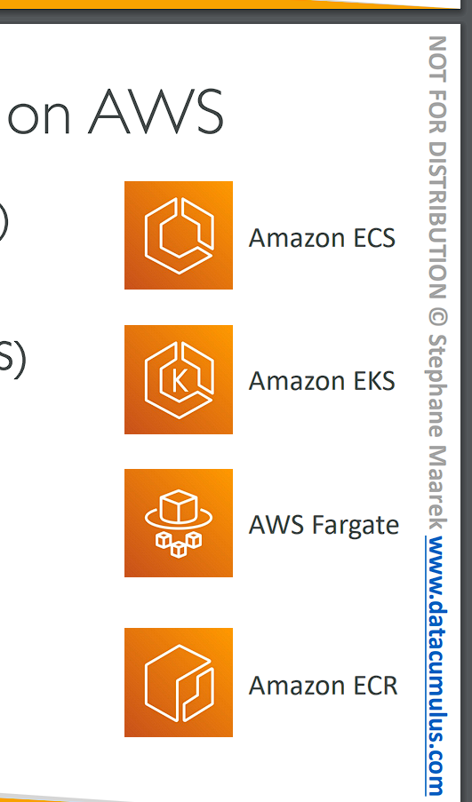
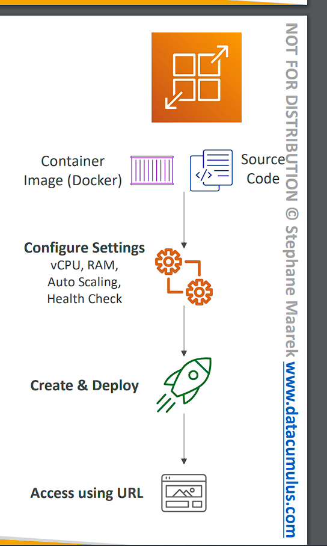

# Containers on AWS

# What is Docker?

```
• Docker is a software development platform to deploy apps
• Apps are packaged in containers that can be run on any OS
• Apps run the same, regardless (bất kể) of where they’re run
    • Any machine
    • No compatibility issues (vấn đề tương thích)
    • Predictable behavior (hành động có thể dự đoán)
    • Less work
    • Easier to maintain and deploy
    • Works with any language, any OS, any technology
• Use cases: microservices architecture, lift-and-shift apps from on- premises to the AWS cloud, …
```

# Docker on an OS


# Where are Docker images stored?

```
• Docker images are stored in Docker Repositories
• Docker Hub (https://hub.docker.com)
    • Public repository
    • Find base images for many technologies or OS (e.g., Ubuntu, MySQL, …)
• Amazon ECR (Amazon Elastic Container Registry)
    • Private repository
    • Public repository (Amazon ECR Public Gallery https://gallery.ecr.aws)
```

# Docker vs. Virtual Machines

• Docker is ”sort of” a virtualization technology, but not exactly
• Resources are shared with the host => many containers on one server


# Getting Started with Docker


# Docker Containers Management on AWS



```
• Amazon Elastic Container Service (Amazon ECS)
    • Amazon’s own container platform
• Amazon Elastic Kubernetes Service (Amazon EKS)
    • Amazon’s managed Kubernetes (open source)
• AWS Fargate
    • Amazon’s own Serverless container platform
    • Works with ECS and with EKS
• Amazon ECR:
    • Store container images
```

# Amazon ECS - EC2 Launch Type


• ECS = Elastic Container Service
• Launch Docker containers on AWS = Launch ECS Tasks on ECS Clusters
• EC2 Launch Type: you must provision & maintain the infrastructure (the
EC2 instances)
• Each EC2 Instance must run the ECS Agent to register in the ECS Cluster
• AWS takes care of starting / stopping containers

# Amazon ECS – Fargate Launch Type


• Launch Docker containers on AWS
• You do not provision the infrastructure (no EC2 instances to manage)
• It’s all Serverless!
• You just create task definitions
• AWS just runs ECS Tasks for you based on the CPU / RAM you need
• To scale, just increase the number of tasks. Simple - no more EC2 instances

# Amazon ECS – IAM Roles for ECS


```
• EC2 Instance Profile (EC2 Launch Type only):
    • Used by the ECS agent
    • Makes API calls to ECS service
    • Send container logs to CloudWatch Logs
    • Pull Docker image from ECR
    • Reference sensitive data in Secrets Manager or SSM Parameter Store
• ECS Task Role:
    • Allows each task to have a specific role
    • Use different roles for the different ECS Services you run
    • Task Role is defined in the task definition
```

# Amazon ECS – Load Balancer Integrations


• Application Load Balancer supported and works for most use cases
• Network Load Balancer recommended only for high throughput / high performance use cases, or to pair it with AWS Private Link
• Classic Load Balancer supported but not recommended (no advanced features – no Fargate)

# Amazon ECS – Data Volumes (EFS)


• Mount EFS file systems onto ECS tasks
• Works for both EC2 and Fargate launch types
• Tasks running in any AZ will share the same data in the EFS file system
• Fargate + EFS = Serverless
• Use cases: persistent multi-AZ shared storage for your containers
• Note: Amazon S3 cannot be mounted as a file system

# Create ECS Cluter - Hands On

(ECS => Create cluster => name: "DemoCluster" => Infratructure -> tích AWS Fargate -> EC2 Instance -> OS: Amazone Linux 2023 -> Ec2 type: t2.micro -> minimum: 0 -> maximun: 5 => Create )

# Create ECS service - Hands On

(Task definitions => Create new task definition => family: nginxdemos-hello => launch type: AWS Fargate => cpy: 0.5 => memory: 1 => Container details -> Name: "nginxdemos-hello" -> Image URI: nginxdemos/hello => Create)


(Cluster => DemoCluster => Services => Create => Compute options: Launch type => Application type: Service => Task definitions -> Family: "nginxdemos-hello" -> Revions: 2 (LATEST) -> Service name: "nginxdemos-hello" -> Desired task: 1 => SG -> Create new security group -> name: "nginxdemos-hello" -> Inbound type: HTTP -> source: any where -> endable Publich IP => Load Balancing -> type: ALB -> Create a new load balancer -> name: "DemoALBForECS" -> target group name: "tg-nginxdemos-hello" => Create)

Truy cập DNS ALB


# ECS Service Auto Scaling

```
• Automatically increase/decrease the desired number of ECS tasks
• Amazon ECS Auto Scaling uses AWS Application Auto Scaling
    • ECS Service Average CPU Utilization
    • ECS Service Average Memory Utilization - Scale on RAM
    • ALB Request Count Per Target – metric coming from the ALB
• Target Tracking – scale based on target value for a specific CloudWatch metric
• Step Scaling – scale based on a specified CloudWatch Alarm
• Scheduled Scaling – scale based on a specified date/time (predictable changes)
• ECS Service Auto Scaling (task level) ≠ EC2 Auto Scaling (EC2 instance level)
• Fargate Auto Scaling is much easier to setup (because Serverless)
```

# EC2 Launch Type – Auto Scaling EC2 Instances

```
• Accommodate ECS Service Scaling by adding underlying EC2 Instances
• Auto Scaling Group Scaling
    • Scale your ASG based on CPU Utilization
    • Add EC2 instances over time
• ECS Cluster Capacity Provider
    • Used to automatically provision and scale the infrastructure for your ECS Tasks
    • Capacity Provider paired with an Auto Scaling Group
    • Add EC2 Instances when you’re missing capacity (CPU, RAM…)
```

# ECS Scaling – Service CPU Usage Example


# ECS tasks invoked by Event Bridge


# ECS tasks invoked by Event Bridge Schedule


# ECS – SQS Queue Example


# ECS – Intercept Stopped Tasks using EventBridge


# Amazon ECR


• ECR = Elastic Container Registry
• Store and manage Docker images on AWS
• Private and Public repository (Amazon ECR Public Gallery https://gallery.ecr.aws)
• Fully integrated with ECS, backed by Amazon S3
• Access is controlled through IAM (permission errors => policy)
• Supports image vulnerability scanning, versioning, image tags, image lifecycle, …

# Amazon EKS Overview

• Amazon EKS = Amazon Elastic Kubernetes Service
• It is a way to launch managed Kubernetes clusters on AWS
• Kubernetes is an open-source system for automatic deployment, scaling and management of containerized (usually Docker) application
• It’s an alternative (thay thế) to ECS, similar goal but different API
• EKS supports EC2 if you want to deploy worker nodes or Fargate to deploy serverless containers
• Use case: if your company is already using Kubernetes on-premises or in another cloud, and wants to migrate to AWS using Kubernetes
• Kubernetes is cloud-agnostic (can be used in any cloud – Azure, GCP…) (Kubernetes không phụ thuộc vào đám mây (có thể sử dụng trên bất kỳ đám mây nào – Azure, GCP…))
• For multiple regions, deploy one EKS cluster per region
• Collect logs and metrics using CloudWatch Container Insights

# Amazon EKS - Diagram


# Amazon EKS – Node Types

```
• Managed Node Groups
    • Creates and manages Nodes (EC2 instances) for you
    • Nodes are part of an ASG managed by EKS
    • Supports On-Demand or Spot Instances
• Self-Managed Nodes
    • Nodes created by you and registered to the EKS cluster and managed by an ASG
    • You can use prebuilt AMI - Amazon EKS Optimized AMI
    • Supports On-Demand or Spot Instances
• AWS Fargate
    • No maintenance required; no nodes managed
```

# Amazon EKS – Data Volumes

• Need to specify StorageClass manifest on your EKS cluster
• Leverages 9tanaj dụng a Container Storage Interface (CSI) compliant (tuân thủ) driver


• Support for…
• Amazon EBS
• Amazon EFS (works with Fargate)
• Amazon FSx for Lustre
• Amazon FSx for NetApp ONTAP

# Amazone EKS - Hands On

(EKS => Cluster => Create => Name: "DemoEKS" => Cluster service role (IAM => Role => Create => Use case: EKS -> EKS Cluster => next => Role name: "eksClusterRole" => Create role) => next => Create)
(Compute => Add node group => Name: "DemoNodeGroup" => Node IAM role: (IAM => Create role => Use casses: EC2 => next => policy: EKSWorkerNodePolicy, EC2ContainerRegistryReadOnly => next => Role name: AmazoneEKSNodeRole => Create role) => next => Instance type: t3.medium => next => Create )


# AWS App Runner


• Fully managed service that makes it easy to deploy web applications and APIs at scale
• No infrastructure experience required
• Start with your source code or container image
• Automatically builds and deploy the web app
• Automatic scaling, highly available, load balancer, encryption
• VPC access support
• Connect to database, cache, and message queue services
• Use cases: web apps, APIs, microservices, rapid production deployments

# AWS App Runner - Hands On

(Create an App Runner services => Repository type: container registry => provider: ERC public => Container image URI: xxx => next => Service name: "DemoHTTP" => cpu: 1 => memory: 2 => Port: 80 => next => create)

Truy cập


