# Serverless Overview

# What’s serverless?

• Serverless is a new paradigm in which the developers don’t have to manage servers anymore…
• They just deploy code
• They just deploy… functions !
• Initially... Serverless == FaaS (Function as a Service)
• Serverless was pioneered (tiên phong) by AWS Lambda but now also includes anything that’s managed: “databases, messaging, storage, etc.”
• Serverless does not mean there are no servers… it means you just don’t manage / provision / see them

# Serverless in AWS

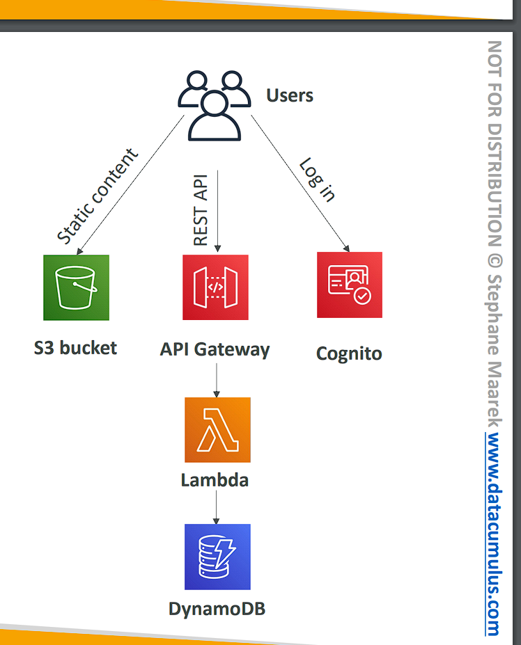
• AWS Lambda
• DynamoDB
• AWS Cognito
• AWS API Gateway
• Amazon S3
• AWS SNS & SQS
• AWS Kinesis Data Firehose
• Aurora Serverless
• Step Functions
• Fargate

# Why AWS Lambda

- Amazon EC2:
  • Virtual Servers in the Cloud
  • Limited by RAM and CPU
  • Continuously running
  • Scaling means intervention to add / remove servers

- Amazon Lambda:
  • Virtual functions – no servers to manage!
  • Limited by time - short executions
  • Run on-demand
  • Scaling is automated!

# Benefits of AWS Lambda

```
• Easy Pricing:
    • Pay per request and compute time
    • Free tier of 1,000,000 AWS Lambda requests and 400,000 GBs of compute time
• Integrated with the whole AWS suite of services
• Integrated with many programming languages
• Easy monitoring through AWS CloudWatch
• Easy to get more resources per functions (up to 10GB of RAM!)
• Increasing RAM will also improve CPU and network!
```

# AWS Lambda language support

```
• Node.js (JavaScript)
• Python
• Java
• C# (.NET Core) / Powershell
• Ruby
• Custom Runtime API (community supported, example Rust or Golang)
• Lambda Container Image
    • The container image must implement the Lambda Runtime API
    • ECS / Fargate is preferred for running arbitrary Docker images
```

# AWS Lambda Integrations Main ones

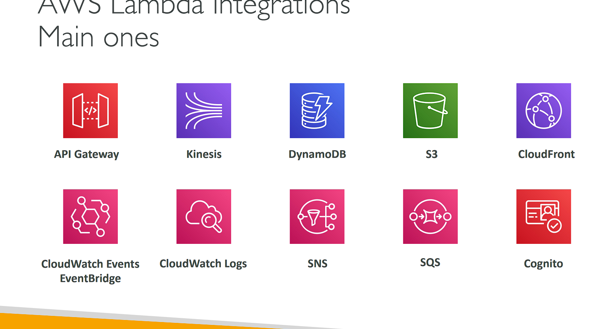

# Example: Serverless Thumbnail creation

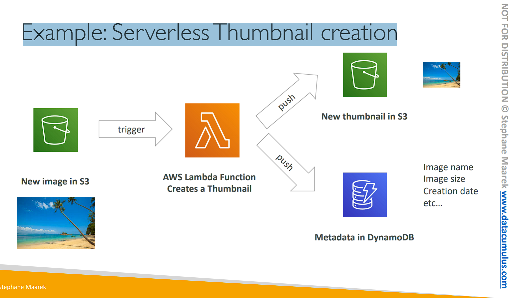

# Example: Serverless CRON Job

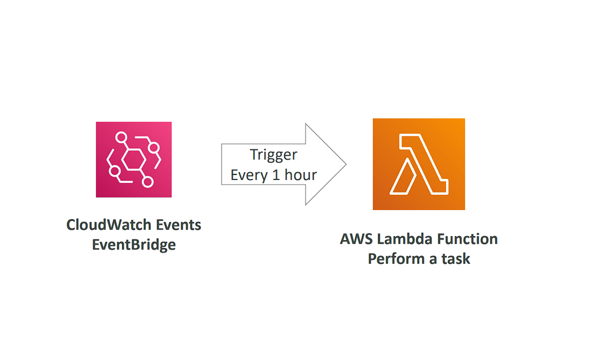

# AWS Lambda Pricing: example

• You can find overall pricing information here: https://aws.amazon.com/lambda/pricing/
• Pay per calls :
• First 1,000,000 requests are free
• $0.20 per 1 million requests thereafter ($0.0000002 per request)
• Pay per duration: (in increment of 1 ms)
• 400,000 GB-seconds of compute time per month for FREE
• == 400,000 seconds if function is 1GB RAM
• == 3,200,000 seconds if function is 128 MB RAM
• After that $1.00 for 600,000 GB-seconds
• It is usually very cheap to run AWS Lambda so it’s very popular

# Lambda - Hands On

(Lambda => Create function => Use a blueprint => Blueprint name: Hello world function python3.10 => function name: "demo-lambda" => create function)
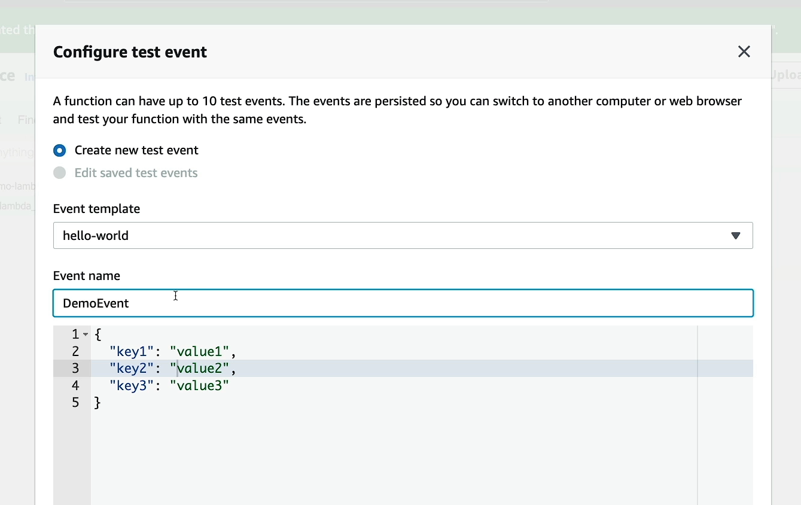
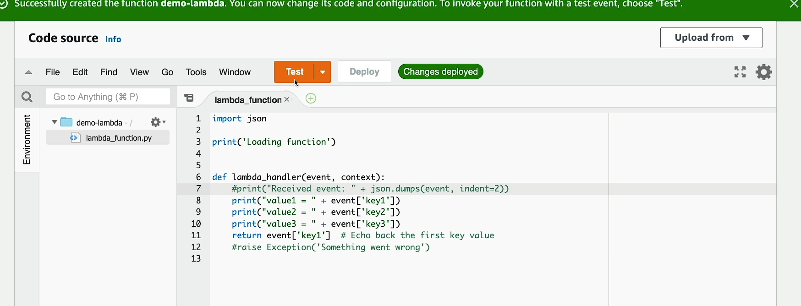

# AWS Lambda Limits to Know - per region

```
• Execution:
  • Memory allocation: 128 MB – 10GB (1 MB increments)
  • Maximum execution time: 900 seconds (15 minutes)
  • Environment variables (4 KB)
  • Disk capacity in the “function container” (in /tmp): 512 MB to 10GB (Trong thư mục /tmp, Lambda cung cấp từ 512 MB đến 10 GB dung lượng lưu trữ tạm thời trong mỗi container.)
  • Concurrency executions: 1000 (can be increased)
• Deployment:
  • Lambda function deployment size (compressed .zip): 50 MB (Tối đa 50 MB cho file nén khi tải lên Lambda.
)
  • Size of uncompressed deployment (code + dependencies): 250 MB
  • Can use the /tmp directory to load other files at startup
  • Size of environment variables: 4 KB
```

# Lambda SnapStart

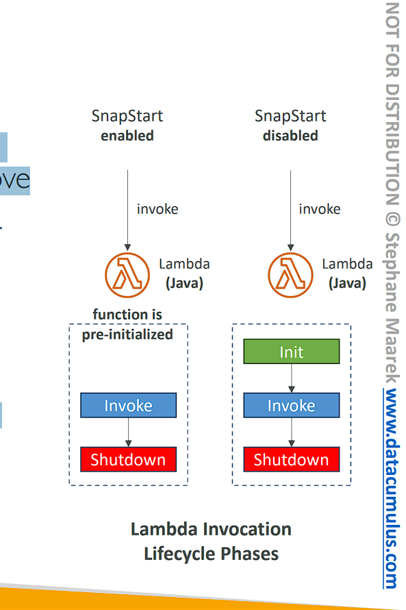

```
• Improves your Lambda functions performance up to 10x at no extra cost (không  mất phí thêm) for Java 11 and above
• When enabled, function is invoked from a preinitialized state (no function initialization from scratch)
• When you publish a new version:
  • Lambda initializes your function
  • Takes a snapshot of memory and disk state of the initialized function
  • Snapshot is cached for low-latency access
```

```
AWS Lambda SnapStart là một tính năng giúp tăng hiệu suất của các hàm Lambda, đặc biệt là với Java 11 trở lên, mà không tốn phí thêm. Dưới đây là giải thích chi tiết:

## Cách hoạt động của Lambda SnapStart
1. Cải thiện hiệu suất:
- Tính năng này giúp cải thiện hiệu suất của hàm Lambda lên tới 10 lần so với bình thường.
2. Trạng thái khởi tạo trước:
- Khi SnapStart được kích hoạt, hàm Lambda sẽ được gọi từ một trạng thái đã khởi tạo sẵn, giúp bỏ qua quá trình khởi tạo từ đầu mỗi khi có lời gọi hàm. Điều này giúp giảm thời gian khởi động (cold start) đáng kể.
## Quy trình khi bạn xuất bản phiên bản mới của hàm Lambda
1. Khởi tạo hàm:
- AWS Lambda sẽ khởi tạo hàm của bạn một lần duy nhất khi bạn xuất bản phiên bản mới.
2. Chụp ảnh bộ nhớ và trạng thái đĩa:
- Lambda sau đó sẽ chụp một snapshot (ảnh chụp nhanh) của bộ nhớ và trạng thái đĩa của hàm đã khởi tạo.
3. Bộ nhớ đệm snapshot:
-  Snapshot này sẽ được lưu trữ trong bộ nhớ đệm để dễ dàng truy cập với độ trễ thấp. Khi hàm Lambda được gọi lần sau, nó sẽ được khôi phục từ snapshot này, giúp tiết kiệm thời gian khởi tạo.

===> SnapStart đặc biệt hữu ích cho những hàm Java có thời gian khởi tạo dài, giúp giảm cold start và cải thiện trải nghiệm người dùng.
```

# Customization At The Edge

```
 Many modern applications execute some form of the logic at the edge
• Edge Function:
  • A code that you write and attach to CloudFront distributions
  • Runs close to your users to minimize latency
• CloudFront provides two types: CloudFront Functions & Lambda@Edge
• You don’t have to manage any servers, deployed globally
• Use case: customize the CDN content
• Pay only for what you use
• Fully serverless
```

# CloudFront Functions & Lambda@Edge - Use Cases

• Website Security and Privacy
• Dynamic Web Application at the Edge
• Search Engine Optimization (SEO)
• Intelligently Route Across Origins and Data Centers
• Bot Mitigation at the Edge ((Ngăn chặn bot tại biên))
• Real-time Image Transformation (Chuyển đổi hình ảnh theo thời gian thực)
• A/B Testing
• User Authentication and Authorization
• User Prioritization (Ưu tiên người dùng)
• User Tracking (theo dõi) and Analytics

```
6. Real-time Image Transformation (Chuyển đổi hình ảnh theo thời gian thực):

- Thực hiện các thao tác xử lý hình ảnh như cắt, nén, thay đổi kích thước ngay tại edge, giúp giảm tải và thời gian chờ cho người dùng.
7. A/B Testing:

- Thử nghiệm nhiều phiên bản của cùng một nội dung hoặc giao diện cho các nhóm người dùng khác nhau để kiểm tra hiệu quả và tối ưu hóa trải nghiệm người dùng.
8. User Authentication and Authorization (Xác thực và phân quyền người dùng):

- Xử lý xác thực người dùng và quản lý quyền truy cập ngay tại edge trước khi yêu cầu đến máy chủ, giúp tăng tốc độ phản hồi.
9. User Prioritization (Ưu tiên người dùng):

- Tùy chỉnh nội dung hoặc ưu tiên tài nguyên cho một số người dùng nhất định, dựa trên trạng thái người dùng (ví dụ: thành viên trả phí).
10 . User Tracking and Analytics (Theo dõi và phân tích người dùng):

- Thu thập dữ liệu và phân tích hành vi người dùng để cải thiện trải nghiệm, tất cả thực hiện tại biên nhằm giảm thiểu độ trễ.

## Tóm lại:
- CloudFront Functions và Lambda@Edge hỗ trợ rất nhiều trường hợp sử dụng khác nhau, từ bảo mật, tối ưu hóa hiệu suất cho đến quản lý người dùng và phân tích. Điều này giúp ứng dụng của bạn trở nên nhanh hơn, an toàn hơn, và mang lại trải nghiệm người dùng tốt hơn
```

# CloudFront Functions

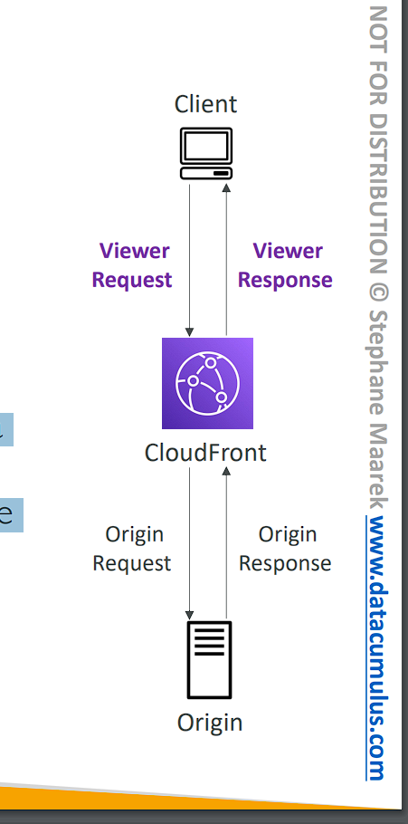

```
• Lightweight functions written in JavaScript
• For high-scale, latency-sensitive (nhạy cảm) CDN customizations
• Sub-ms startup times, millions of requests/second
• Used to change Viewer requests and responses:
• Viewer Request: after CloudFront receives a request from a viewer
• Viewer Response: before CloudFront forwards the response to the viewer
• Native feature of CloudFront (manage code entirely (toàn bộ ) within CloudFront)
```

```
CloudFront Functions là các hàm nhẹ viết bằng JavaScript, dùng để tùy chỉnh CDN (Content Delivery Network) với độ trễ thấp và khả năng mở rộng cao. Dưới đây là giải thích chi tiết:

### Đặc điểm của CloudFront Functions:
1. Hàm nhẹ viết bằng JavaScript:

- Các hàm được viết bằng ngôn ngữ JavaScript, đơn giản và dễ sử dụng cho các tùy chỉnh nhỏ nhưng hiệu quả.
2. Tùy chỉnh CDN với độ trễ thấp:

- Được thiết kế để xử lý lượng yêu cầu rất lớn (hàng triệu yêu cầu mỗi giây), phù hợp cho các ứng dụng cần độ trễ thấp.
3. Thời gian khởi động rất nhanh (sub-ms startup):

- Các hàm khởi động trong thời gian dưới một mili-giây, đảm bảo đáp ứng nhanh chóng cho các yêu cầu CDN.
4. Thích hợp cho các tình huống yêu cầu số lượng lớn:

- Có khả năng xử lý hàng triệu yêu cầu mỗi giây mà không làm tăng đáng kể độ trễ.
## Sử dụng CloudFront Functions để thay đổi các yêu cầu và phản hồi:
- Viewer Request (Yêu cầu của người dùng):

  - Hàm được thực thi sau khi CloudFront nhận yêu cầu từ người dùng, giúp tùy chỉnh yêu cầu trước khi nó được chuyển đến máy chủ gốc, như thay đổi tiêu đề, cookie, hay URL.
- Viewer Response (Phản hồi cho người dùng):

  - Hàm được thực thi trước khi CloudFront gửi phản hồi về cho người dùng, cho phép bạn sửa đổi phản hồi từ máy chủ gốc (ví dụ: thêm tiêu đề bảo mật hoặc chỉnh sửa nội dung).
5. Tính năng gốc của CloudFront:
- CloudFront Functions được tích hợp sẵn trong CloudFront và toàn bộ việc quản lý mã được thực hiện trong hệ thống CloudFront, không cần thêm dịch vụ phụ hoặc cơ sở hạ tầng bổ sung.
## Tóm lại:
- CloudFront Functions là các hàm nhẹ, hiệu quả và rất nhanh (sub-ms), giúp tùy chỉnh các yêu cầu và phản hồi trong mạng phân phối nội dung (CDN) với khả năng mở rộng cao, phù hợp cho các ứng dụng yêu cầu độ trễ thấp.
```

# Lambda@Edge

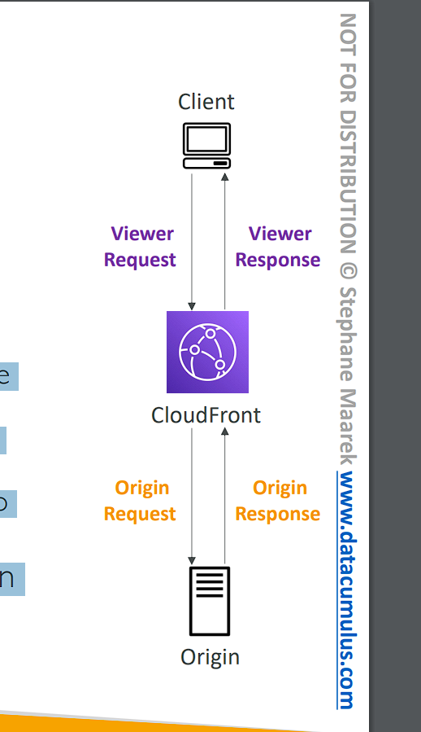

```
• Lambda functions written in NodeJS or Python
• Scales to 1000s of requests/second
• Used to change CloudFront requests and responses:
  • Viewer Request – after CloudFront receives a request from a viewer
  • Origin Request – before CloudFront forwards the request to the origin
  • Origin Response – after CloudFront receives the response from the origin
  • Viewer Response – before CloudFront forwards the response to the viewer
• Author your functions in one AWS Region (us-east-1), then CloudFront replicates to its locations
```

```
Lambda@Edge là một dịch vụ của AWS cho phép bạn chạy các hàm Lambda gần người dùng bằng cách sử dụng mạng phân phối nội dung (CDN) Amazon CloudFront. Đây là cách hoạt động và các đặc điểm của Lambda@Edge:

## Đặc điểm của Lambda@Edge:
1. Ngôn ngữ lập trình:

- Các hàm Lambda có thể được viết bằng Node.js hoặc Python.
2. Khả năng mở rộng:

- Lambda@Edge có thể mở rộng để xử lý hàng ngàn yêu cầu mỗi giây, giúp ứng dụng của bạn đáp ứng nhu cầu cao với số lượng người dùng lớn.
## Các trường hợp sử dụng để thay đổi yêu cầu và phản hồi trong CloudFront:
Lambda@Edge được sử dụng để thay đổi yêu cầu và phản hồi tại nhiều giai đoạn khác nhau trong quy trình xử lý của CloudFront:

1. Viewer Request (Yêu cầu của người dùng):

- Hàm Lambda được thực thi sau khi CloudFront nhận yêu cầu từ người dùng, cho phép bạn sửa đổi hoặc xử lý yêu cầu trước khi nó được chuyển đến máy chủ gốc. Ví dụ: thay đổi tiêu đề, xác thực người dùng, hoặc chuyển hướng yêu cầu.
2. Origin Request (Yêu cầu đến máy chủ gốc):

- Hàm Lambda được thực thi trước khi CloudFront chuyển yêu cầu đến máy chủ gốc. Đây là thời điểm bạn có thể thay đổi cách CloudFront giao tiếp với máy chủ gốc, như điều chỉnh URL hoặc thêm tiêu đề tùy chỉnh.
3. Origin Response (Phản hồi từ máy chủ gốc):

- Hàm Lambda được thực thi sau khi CloudFront nhận phản hồi từ máy chủ gốc, cho phép bạn xử lý phản hồi trước khi nó được gửi về cho người dùng. Ví dụ: nén dữ liệu hoặc sửa đổi nội dung phản hồi.
4.Viewer Response (Phản hồi đến người dùng):

- Hàm Lambda được thực thi trước khi CloudFront gửi phản hồi đến người dùng, giúp bạn tùy chỉnh phản hồi, chẳng hạn như thêm tiêu đề bảo mật, nén dữ liệu, hoặc thay đổi nội dung hiển thị.
## Quản lý và sao chép hàm Lambda:
- Tạo hàm Lambda ở một khu vực (us-east-1):
  - Bạn chỉ cần tạo và triển khai hàm Lambda ở một khu vực cụ thể (thường là us-east-1).
- Sao chép tự động đến các vị trí CloudFront:
  - Sau khi triển khai, CloudFront sẽ tự động sao chép hàm Lambda của bạn đến tất cả các vị trí edge trên toàn cầu, giúp hàm chạy gần với người dùng để giảm độ trễ.
## Tóm lại:
Lambda@Edge giúp bạn mở rộng và tối ưu hóa các ứng dụng chạy trên CloudFront, bằng cách cho phép bạn tùy chỉnh và thay đổi các yêu cầu/phản hồi từ người dùng hoặc máy chủ gốc tại nhiều giai đoạn khác nhau, giúp giảm độ trễ và tăng tính linh hoạt.
```

# CloudFront Functions vs. Lambda@Edge

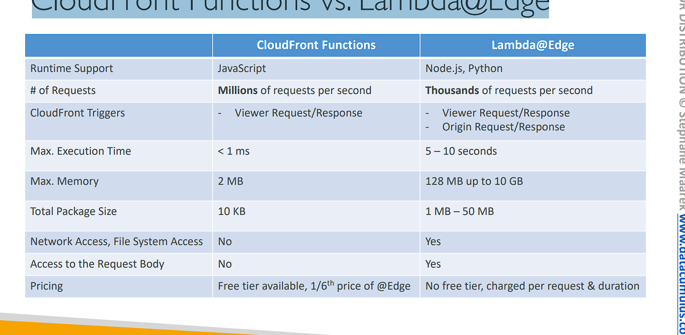

# CloudFront Functions vs. Lambda@Edge - Use Cases

- CloudFront Functions

```
• Cache key normalization (chuẩn hóa khóa bộ đệm)
  • Transform request attributes (headers, cookies, query strings, URL) to create an optimal Cache Key
• Header manipulation (thao tác)
  • Insert/modify/delete HTTP headers in the request or response
• URL rewrites or redirects
• Request authentication & authorization
  • Create and validate user-generated tokens (e.g., JWT) to allow/deny requests
```

- Lambda@Edge

```
• Longer execution time (several ms)
• Adjustable CPU or memory
• Your code depends on a 3rd libraries (e.g., AWS SDK to access other AWS services)
• Network access to use external services for processing
• File system access or access to the body of HTTP requests
```

```
Tóm lại:
- CloudFront Functions: Phù hợp cho các tác vụ đơn giản, thời gian thực thi ngắn (sub-ms), như thay đổi tiêu đề, chuyển hướng URL, và xác thực yêu cầu.
- Lambda@Edge: Phù hợp cho các tác vụ phức tạp hơn yêu cầu thời gian xử lý lâu hơn, cần truy cập mạng, thư viện bên ngoài, hoặc dữ liệu từ hệ thống file.
```

# Lambda by default

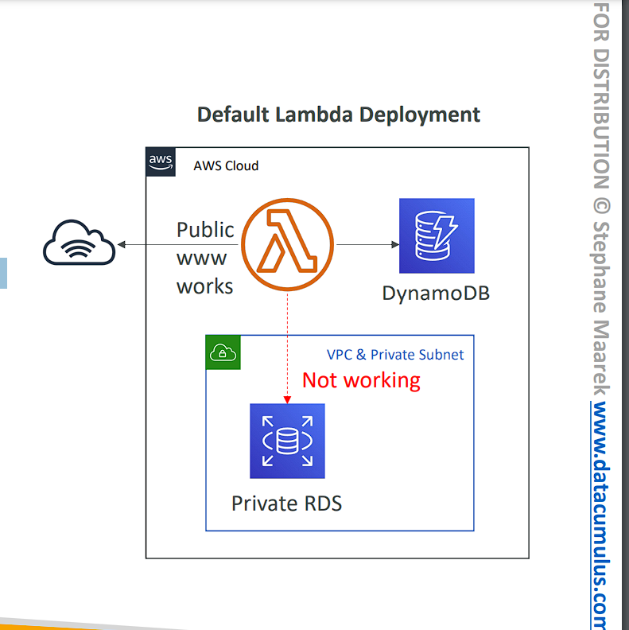
• By default, your Lambda function is launched outside your own VPC (in an AWS -owned VPC)
• Therefore, it cannot access resources in your VPC (RDS, ElastiCache, internal ELB…)

# Lambda in VPC

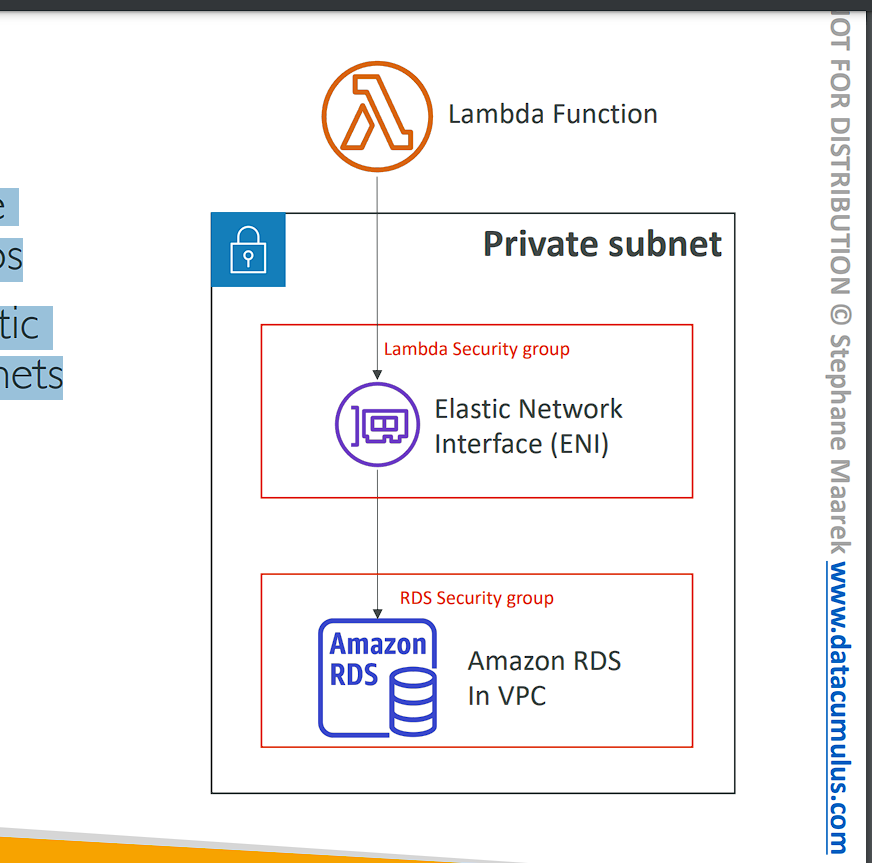
• You must define the VPC ID, the Subnets and the Security Groups
• Lambda will create an ENI (Elastic Network Interface) in your subnets

# Lambda with RDS Proxy

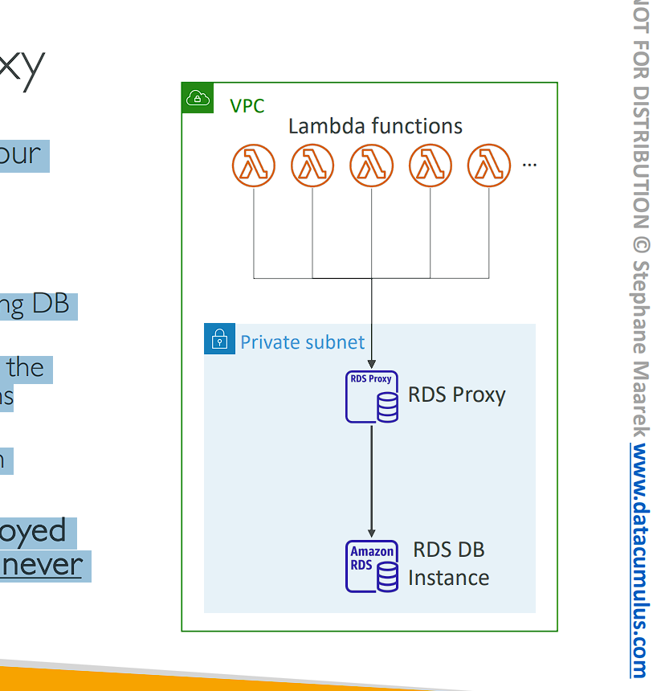

```
• If Lambda functions directly access your database, they may open too many connections under high load
• RDS Proxy
  • Improve scalability by pooling and sharing DB connections
  • Improve availability by reducing by 66% the failover time and preserving connections
  • Improve security by enforcing IAM authentication and storing credentials in Secrets Manager
• The Lambda function must be deployed in your VPC, because RDS Proxy is never publicly accessible
```

# Invoking Lambda from RDS & Aurora

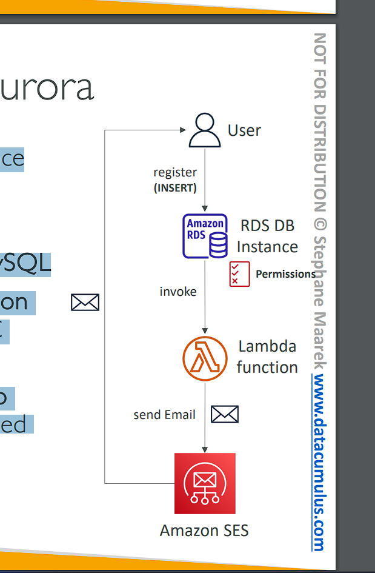
• Invoke Lambda functions from within your DB instance
• Allows you to process data events from within a database
• Supported for RDS for PostgreSQL and Aurora MySQL
• Must allow outbound traffic to your Lambda function from within your DB instance (Public, NAT GW, VPC Endpoints)
• DB instance must have the required permissions to invoke the Lambda function (Lambda Resource-based Policy & IAM Policy)

# RDS Event Notifications


• Notifications that tells information about the DB instance itself (created, stopped, start, …)
• You don’t have any information about the data itself
• Subscribe to the following event categories: DB instance, DB snapshot, DB Parameter Group, DB Security Group, RDS Proxy, Custom Engine Version
• Near real-time events (up to 5 minutes)
• Send notifications to SNS or subscribe to events using EventBridge

# Amazon DynamoDB

• Fully managed, highly available with replication across multiple AZs
• NoSQL database - not a relational database - with transaction support
• Scales to massive workloads, distributed database
• Millions of requests per seconds, trillions of row, 100s of TB of storage
• Fast and consistent (nhất quán) in performance (single-digit millisecond)
• Integrated with IAM for security, authorization and administration
• Low cost and auto-scaling capabilities
• No maintenance or patching, always available
• Standard & Infrequent Access (IA) Table Class

# DynamoDB - Basics

```
• DynamoDB is made of Tables
• Each table has a Primary Key (must be decided at creation time)
• Each table can have an infinite number of items (= rows)
• Each item has attributes (can be added over time – can be null)
• Maximum size of an item is 400KB
• Data types supported are:
  • Scalar Types – String, Number, Binary, Boolean, Null
  • Document Types – List, Map
  • Set Types – String Set, Number Set, Binary Set
• Therefore, in DynamoDB you can rapidly evolve schemas (trong DynamoDB, bạn có thể nhanh chóng phát triển các lược đồ)
```

# DynamoDB – Table example

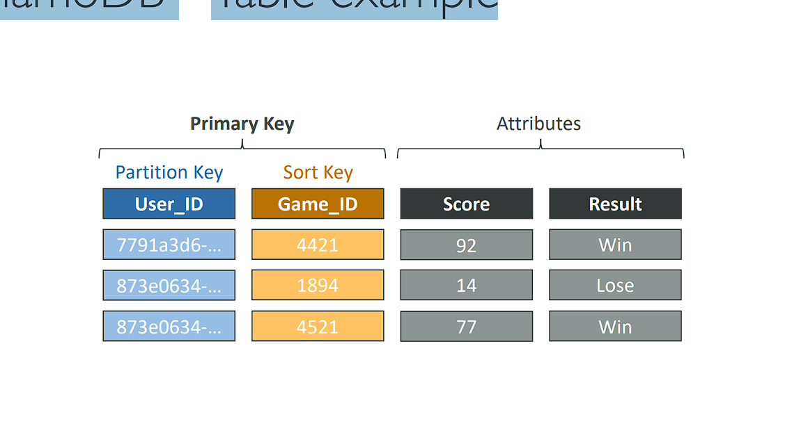

# DynamoDB – Read/Write Capacity Modes

```
• Control how you manage your table’s capacity (read/write throughput)
• Provisioned Mode (default)
  • You specify the number of reads/writes per second
  • You need to plan capacity beforehand
  • Pay for provisioned Read Capacity Units (RCU) & Write Capacity Units (WCU)
  • Possibility to add auto-scaling mode for RCU & WCU
• On-Demand Mode
  • Read/writes automatically scale up/down with your workloads
  • No capacity planning needed
  • Pay for what you use, more expensive ($$$)
  • Great for unpredictable (không thể đoán trước) workloads, steep sudden spikes (mức tăng đột biến)
```

(DynamoDB => Create table => table name: "DemoTable" => Partition key: "user_id" => Settings: Customize setting => Capcity mode: provisioned => Read capacity: off -> provisioned: 1 => Write capacity: off -> provisioned: 1 => Create table => Create tiem => Attribute name: user_id => value: viettu => create item)

# DynamoDB Accelerator (DAX)

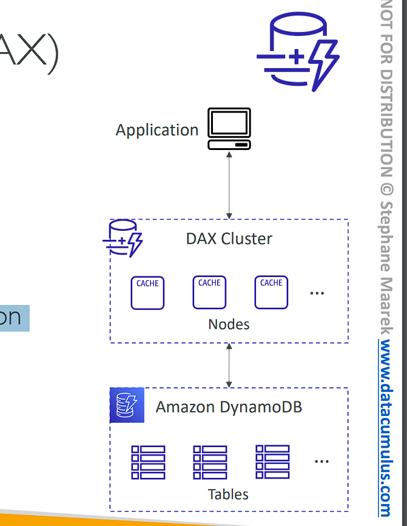
• Fully-managed, highly available, seamless inmemory cache for DynamoDB
• Help solve read congestion (tắc nghẽn) by caching
• Microseconds latency for cached data
• Doesn’t require application logic modification (compatible with existing DynamoDB APIs)
• 5 minutes TTL for cache (default)

# DynamoDB Accelerator (DAX) vs. ElastiCache

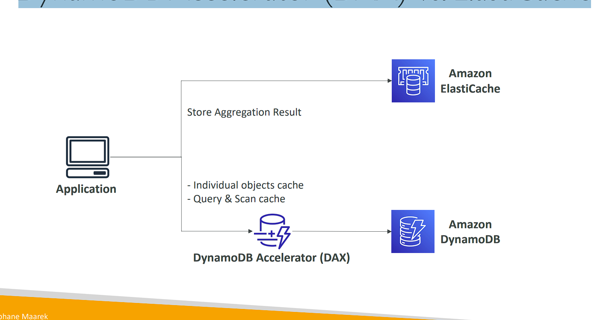

# DynamoDB – Stream Processing

```
• Ordered stream of item-level modifications (create/update/delete) in a table
• Use cases:
  • React to changes in real-time (welcome email to users)
  • Real-time usage analytics
  • Insert into derivative tables
  • Implement cross-region replication
  • Invoke AWS Lambda on changes to your DynamoDB table
```

- DynamoDB Streams

```
• 24 hours retention
• Limited # of consumers
• Process using AWS Lambda Triggers, or DynamoDB Stream Kinesis adapter
```

- Kinesis Data Streams (newer)

```
• 1 year retention
• High # of consumers
• Process using AWS Lambda, Kinesis Data Analytics, Kineis Data Firehose, AWS Glue Streaming ETL…
```

# DynamoDB Streams

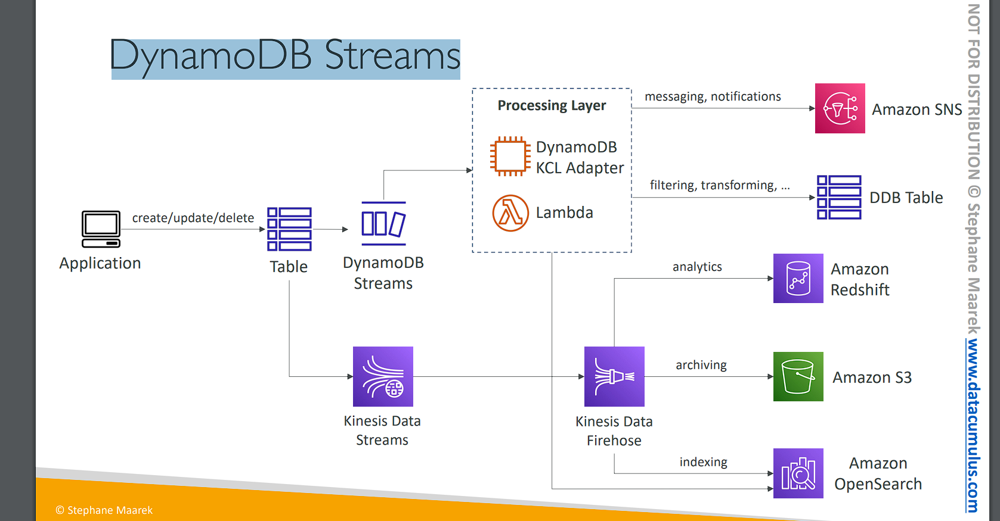

# DynamoDB Global Tables

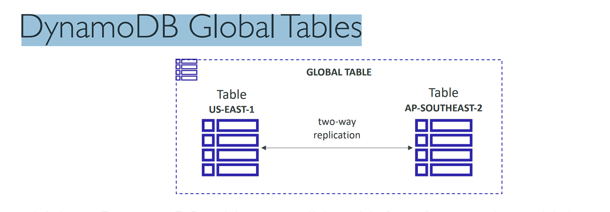

• Make a DynamoDB table accessible with low latency in multiple-regions
• Active-Active replication
• Applications can READ and WRITE to the table in any region
• Must enable DynamoDB Streams as a pre-requisite (Phải bật DynamoDB Streams như một điều kiện tiên quyết)

# DynamoDB –Time To Live (TTL)

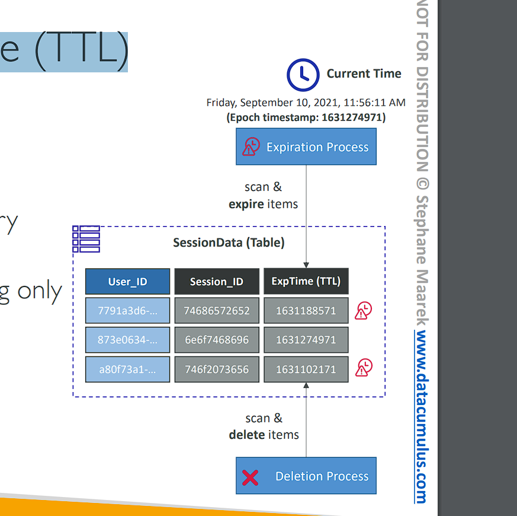

• Automatically delete items after an expiry timestamp
• Use cases: reduce stored data by keeping only current items, adhere to regulatory obligations, web session handling… ( Các trường hợp sử dụng: giảm dữ liệu được lưu trữ bằng cách chỉ giữ lại các mục hiện tại, tuân thủ các nghĩa vụ theo quy định, xử lý phiên web…)

# DynamoDB – Backups for disaster recovery

```
• Continuous backups using point-in-time recovery (PITR)
  • Optionally enabled for the last 35 days
  • Point-in-time recovery to any time within the backup window
  • The recovery process creates a new table
• On-demand backups
  • Full backups for long-term retention, until explicitely deleted
  • Doesn’t affect performance or latency
  • Can be configured and managed in AWS Backup (enables cross-region copy)
  • The recovery process creates a new table
```

# DynamoDB – Integration with Amazon S3

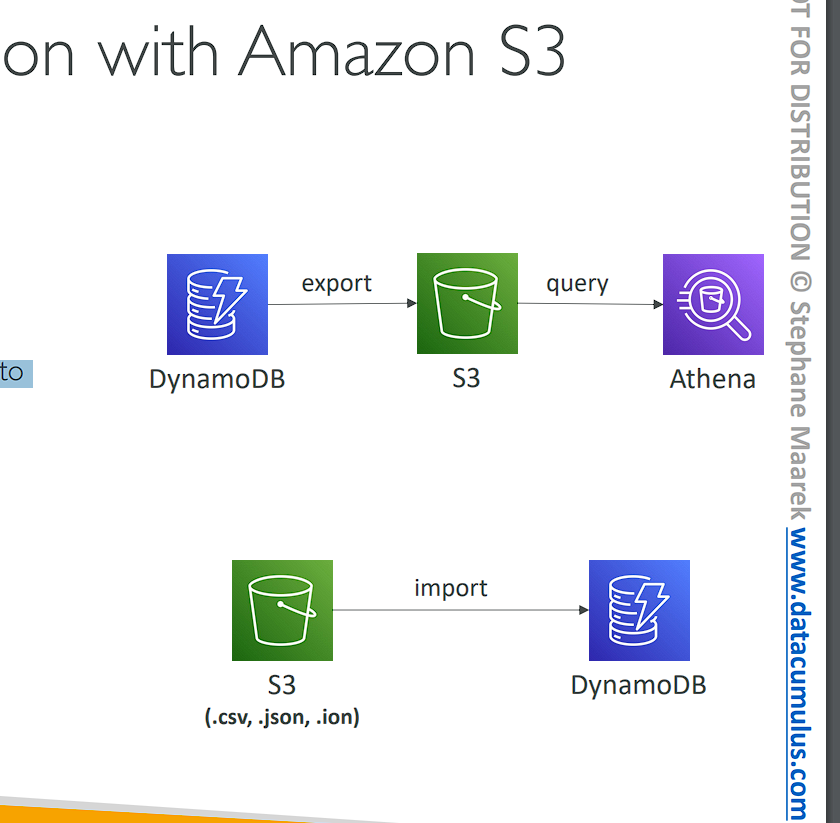

```
• Export to S3 (must enable PITR)
  • Works for any point of time in the last 35 days
  • Doesn’t affect the read capacity of your table
  • Perform data analysis on top of DynamoDB
  • Retain snapshots for auditing (giữ lại snapshot để kiểm traf)
  • ETL on top of S3 data before importing back intoDynamoDB
  • Export in DynamoDB JSON or ION format
• Import from S3
  • Import CSV, DynamoDB JSON or ION format
  • Doesn’t consume any write capacity
  • Creates a new table
  • Import errors are logged in CloudWatch Logs
```

# Example: Building a Serverless API

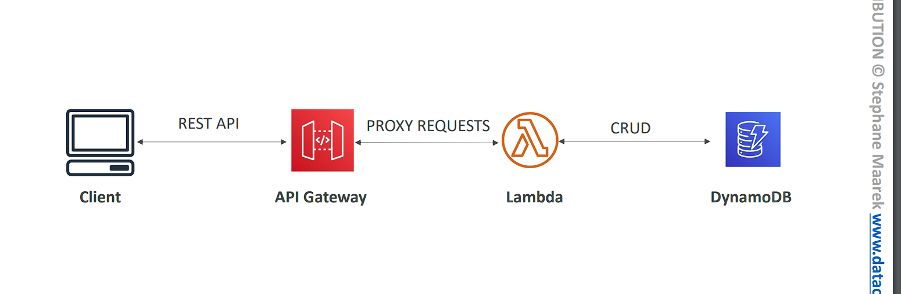

==> Phần Dynamodb cần xem lại

# Example: Building a Serverless API

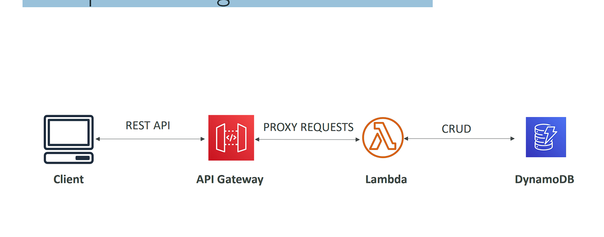

# AWS API Gateway

• AWS Lambda + API Gateway: No infrastructure to manage
• Support for the WebSocket Protocol
• Handle API versioning (v1, v2…)
• Handle different environments (dev, test, prod…)
• Handle security (Authentication and Authorization)
• Create API keys, handle request throttling
• Swagger / Open API import to quickly define APIs
• Transform and validate requests and responses
• Generate SDK and API specifications
• Cache API responses

# API Gateway – Integrations High Level

```
• Lambda Function
  • Invoke Lambda function
  • Easy way to expose REST API backed by AWS Lambda
• HTTP
  • Expose HTTP endpoints in the backend
  • Example: internal HTTP API on premise, Application Load Balancer…
  • Why? Add rate limiting, caching, user authentications, API keys, etc…
• AWS Service
  • Expose any AWS API through the API Gateway
  • Example: start an AWS Step Function workflow, post a message to SQS
  • Why? Add authentication, deploy publicly, rate control…
```

# API Gateway – AWS Service Integration - Kinesis Data Streams example

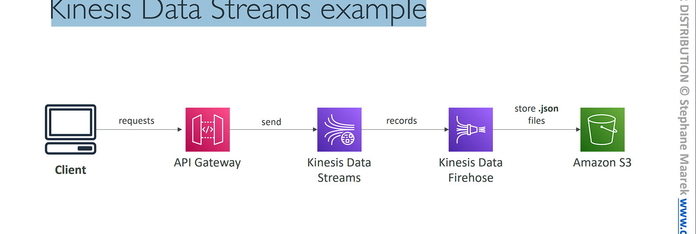

# API Gateway - Endpoint Types

```
• Edge-Optimized (default): For global clients
  • Requests are routed through the CloudFront Edge locations (improves latency)
  • The API Gateway still lives in only one region
• Regional:
  • For clients within the same region
  • Could manually combine with CloudFront (more control over the caching strategies and the distribution)
• Private:
  • Can only be accessed from your VPC using an interface VPC endpoint (ENI)
  • Use a resource policy to define access
```

# API Gateway – Security

```
• User Authentication through
  • IAM Roles (useful for internal applications)
  • Cognito (identity for external users – example mobile users)
  • Custom Authorizer (your own logic)
• Custom Domain Name HTTPS security through integration with AWS Certificate Manager (ACM)
  • If using Edge-Optimized endpoint, then the certificate must be in us-east-1
  • If using Regional endpoint, the certificate must be in the API Gateway region
  • Must setup CNAME or A-alias record in Route 53
```

## API Gateway - Hands On

(lambda => create function => name: "api-gateway-root-get" => runtime: python 3.11 => Create function => paste code file: `lambda-code.py` => Deploy => Test => name: "DemoTest" => save => Test)
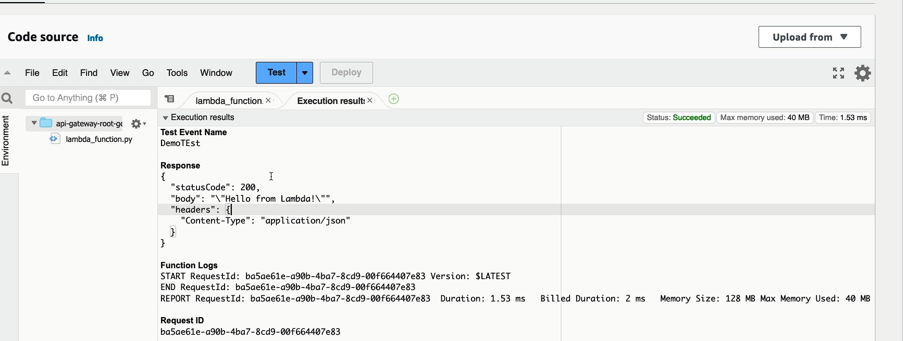
(API gateway => Create => Rest api => api details: New API => api name: "MyFirstAPI" => Create API => Create method: Get => intergation type: Lambda function => chọn lambda vừa tạo => Create method )

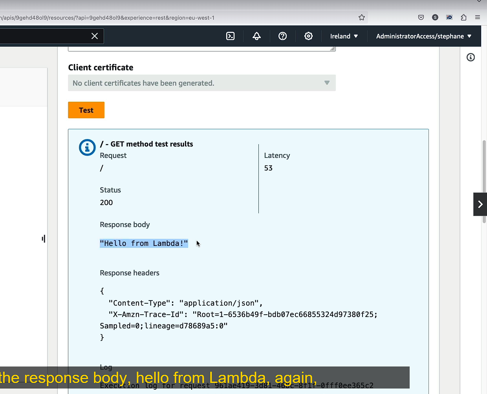

# AWS Step Functions

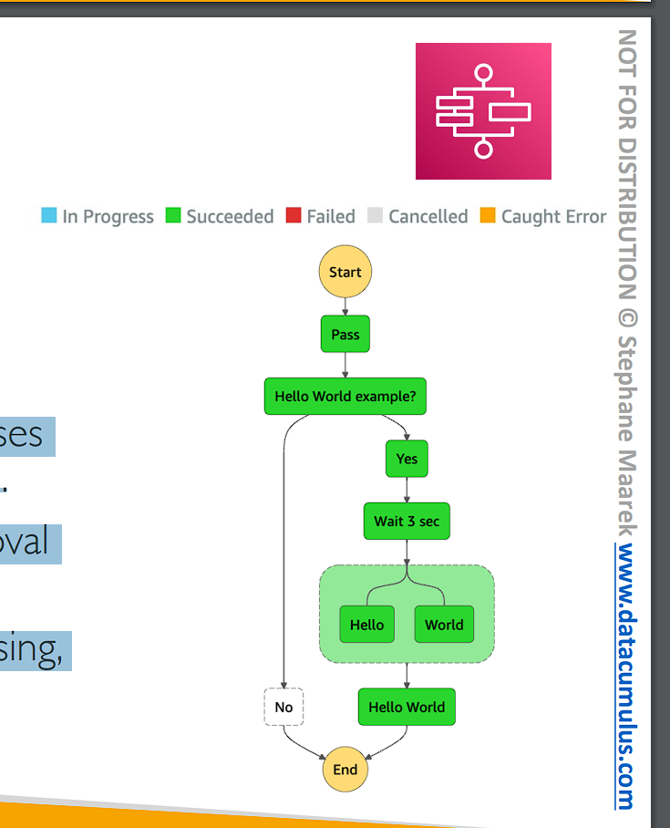
• Build serverless visual workflow to orchestrate your Lambda functions
• Features: sequence, parallel, conditions, timeouts, error handling, …
• Can integrate with EC2, ECS, On-premises servers, API Gateway, SQS queues, etc …
• Possibility of implementing human approval feature
• Use cases: order fulfillment, data processing, web applications, any workflow

```
AWS Step Functions là một dịch vụ quản lý và điều phối các quy trình làm việc serverless một cách trực quan, cho phép bạn xây dựng và giám sát các ứng dụng dễ dàng bằng cách kết hợp các dịch vụ AWS khác, đặc biệt là AWS Lambda. Đây là cách để orchestrate các dịch vụ khác nhau, xử lý các yêu cầu theo thứ tự tuần tự hoặc song song và có thể tích hợp với nhiều dịch vụ khác của AWS.

1. Tính năng chính:
- Sequence (Trình tự): Step Functions cho phép thực hiện các bước theo thứ tự được định nghĩa trước.
- Parallel (Song song): Bạn có thể thực hiện nhiều bước cùng lúc.
- Conditions (Điều kiện): Bạn có thể kiểm tra các điều kiện và thực hiện các hành động khác nhau dựa trên kết quả của chúng (nhánh if/else).
- Timeouts (Thời gian chờ): Có khả năng đặt thời gian chờ cho một bước cụ thể trong workflow.
- Error Handling (Xử lý lỗi): Hỗ trợ các cơ chế để xử lý lỗi, retry (thử lại), hoặc nhảy qua các bước khác khi xảy ra sự cố.
2. Tích hợp:
## Step Functions có khả năng tích hợp với nhiều dịch vụ khác nhau:

- AWS Lambda: Được sử dụng phổ biến nhất để chạy các hàm serverless.
- EC2, ECS, on-premises servers: Bạn có thể điều phối các bước làm việc liên quan đến các dịch vụ điện toán khác như EC2 (Elastic Compute Cloud), ECS (Elastic Container Service) và các máy chủ tại chỗ.
- API Gateway, SQS: Có thể kích hoạt Step Functions từ API Gateway hoặc sử dụng các hàng đợi SQS để điều phối.
3. Human approval (Phê duyệt của con người):
- AWS Step Functions có khả năng tích hợp với các hệ thống phê duyệt thủ công, điều này có thể được triển khai bằng cách thêm một bước chờ (wait step) trong quy trình, đợi sự xác nhận từ người dùng trước khi tiếp tục.

4. Use Cases (Trường hợp sử dụng):
- Order fulfillment: Điều phối quy trình xử lý đơn hàng từ bước nhận đơn đến giao hàng.
- Data processing: Tự động hóa quy trình xử lý dữ liệu lớn với các bước tuần tự hoặc song song.
- Web applications: Tạo các quy trình làm việc phức tạp trong ứng dụng web, như quy trình xác thực người dùng.
- Bất kỳ workflow nào: Có thể được sử dụng để xây dựng bất kỳ quy trình làm việc nào yêu cầu điều phối nhiều bước hoặc nhiều dịch vụ.

## AWS Step Functions giúp giảm bớt sự phức tạp của việc quản lý các ứng dụng với nhiều bước và dịch vụ, đồng thời cung cấp khả năng theo dõi, giám sát và xử lý lỗi mạnh mẽ.
```

# Amazon Cognito

```
• Give users an identity to interact (tương tác) with our web or mobile application
• Cognito User Pools:
  • Sign in functionality for app users
  • Integrate with API Gateway & Application Load Balancer
• Cognito Identity Pools (Federated Identity):
  • Provide AWS credentials to users so they can access AWS resources directly
  • Integrate with Cognito User Pools as an identity provider
• Cognito vs IAM: “hundreds of users”, ”mobile users”, “authenticate with SAML”
```

# Cognito User Pools (CUP) – User Features

• Create a serverless database of user for your web & mobile apps
• Simple login: Username (or email) / password combination
• Password reset
• Email & Phone Number Verification
• Multi-factor authentication (MFA)
• Federated Identities: users from Facebook, Google, SAML…

# Cognito User Pools (CUP) - Integrations

• CUP integrates with API Gateway and Application Load Balancer
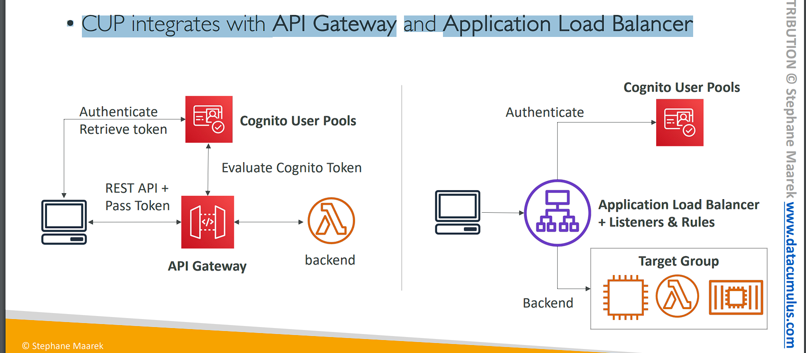

# Cognito Identity Pools (Federated Identities)

• Get identities for “users” so they obtain temporary AWS credentials (Nhận danh tính cho “người dùng” để họ có được thông tin xác thực AWS tạm thời)
• Users source can be Cognito User Pools, 3rd party logins, etc…
• Users can then access AWS services directly or through API Gateway
• The IAM policies applied to the credentials are defined in Cognito
• They can be customized based on the user_id for fine grained control (Chúng có thể được tùy chỉnh dựa trên user_id để kiểm soát chi tiết)
• Default IAM roles for authenticated and guest users

# Cognito Identity Pools – Diagram

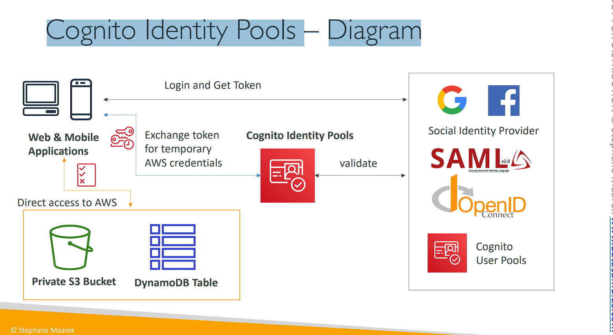

# Cognito Identity Pools - Row Level Security in DynamoDB

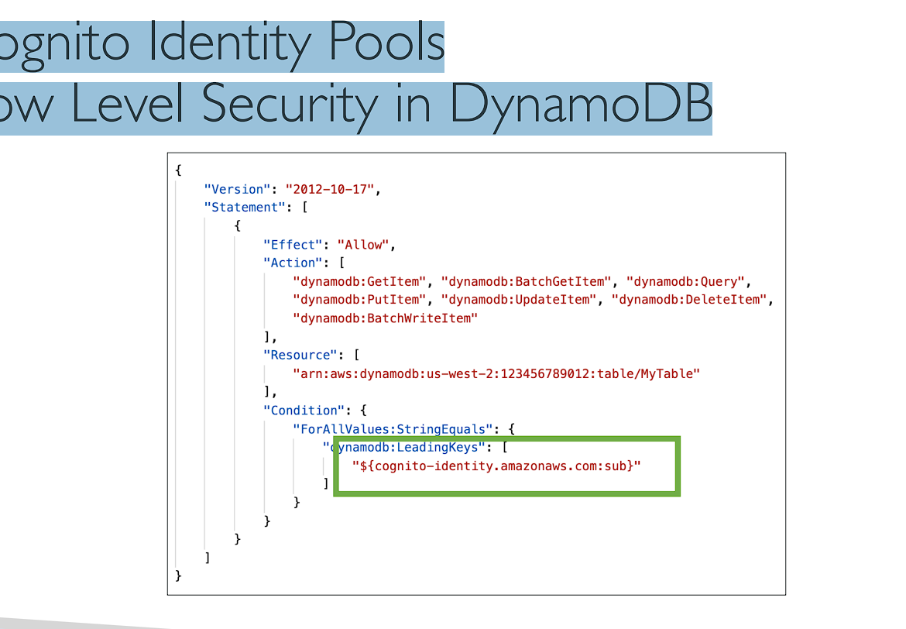
