# Serverless Architectures

# Mobile application: MyTodoList

• We want to create a mobile application with the following requirements
• Expose as REST API with HTTPS
• Serverless architecture
• Users should be able to directly interact (tương tác trực tiếp) with their own folder in S3
• Users should authenticate through a managed serverless service
• The users can write and read to-dos, but they mostly read them
• The database should scale, and have some high read throughput

# Mobile app: REST API layer

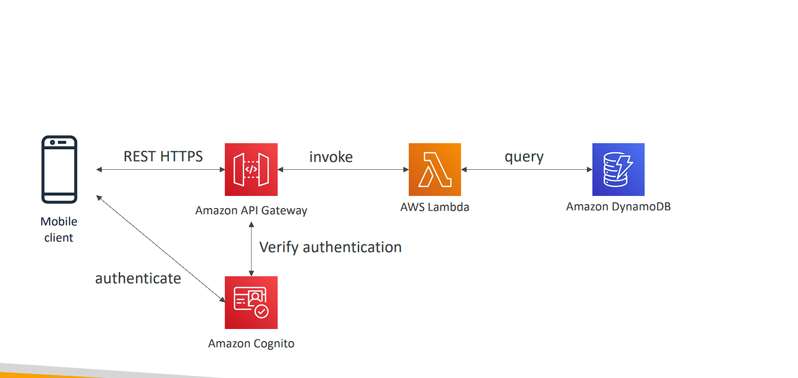

# Mobile app: giving users access to S3

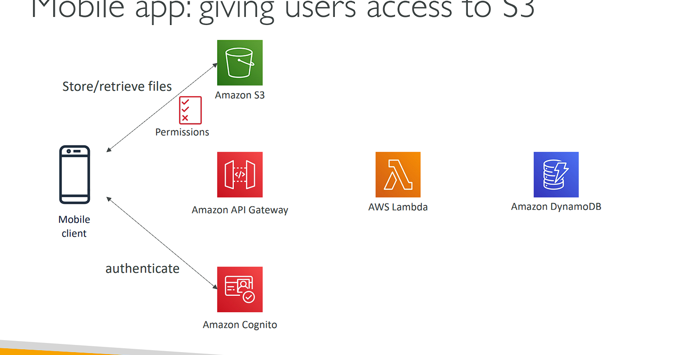

# Mobile app: high read throughput, static data

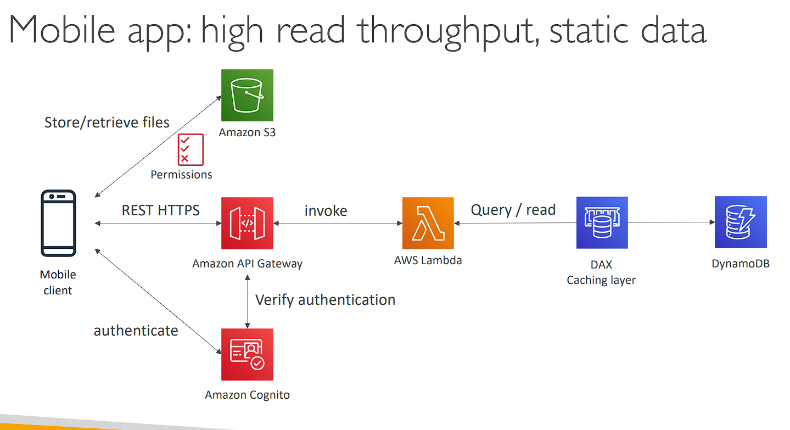

# Mobile app: caching at the API Gateway

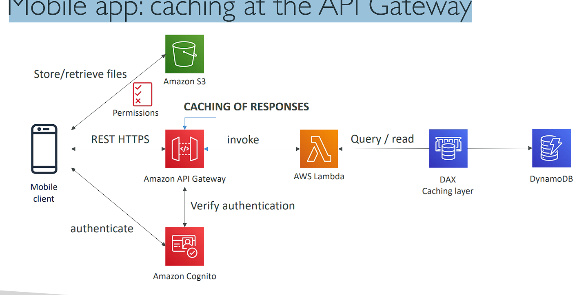

# In this lecture

• Serverless REST API: HTTPS, API Gateway, Lambda, DynamoDB
• Using Cognito to generate temporary credentials to access S3 bucket with restricted (hạn chế) policy. App users can directly access AWS resources this way. Pattern can be applied to DynamoDB, Lambda…
• Caching the reads on DynamoDB using DAX
• Caching the REST requests at the API Gateway level
• Security for authentication and authorization with Cognito

# Serverless hosted website: MyBlog.com

• This website should scale globally
• Blogs are rarely (hiếm khi) written, but often read
• Some of the website is purely (hoàn toàn) static files, the rest is a dynamic REST API
• Caching must be implement where possible
• Any new users that subscribes should receive a welcome email
• Any photo uploaded to the blog should have a thumbnail generated

# Serving static content, globally

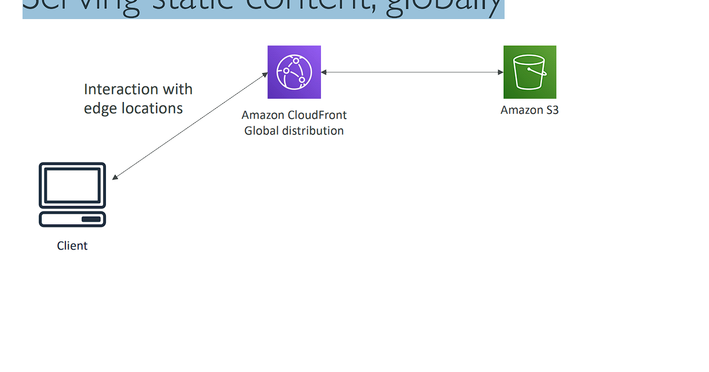

# Serving static content, globally, securely

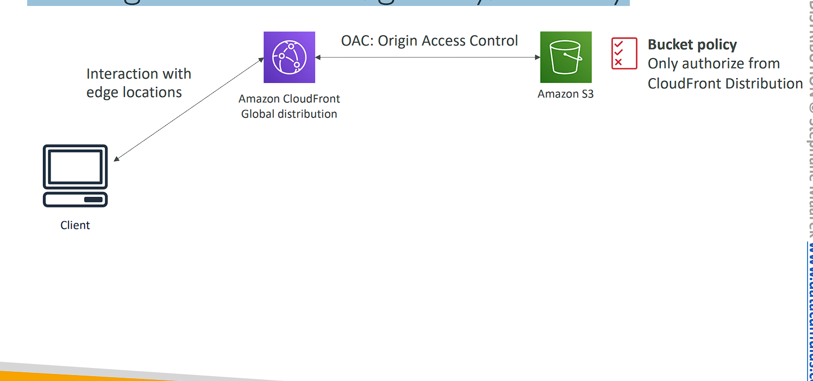

# Adding a public serverless REST API

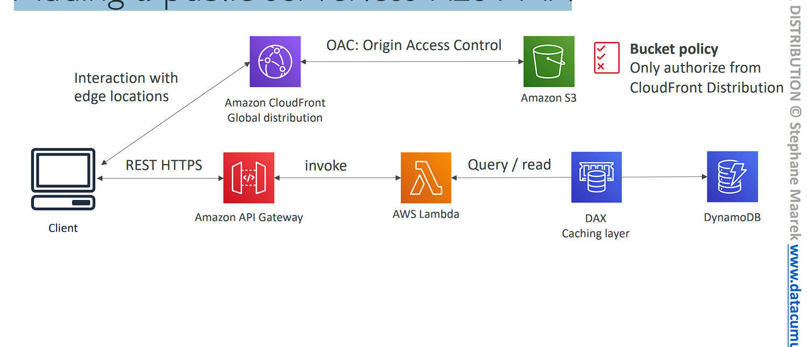

# Leveraging DynamoDB Global Tables

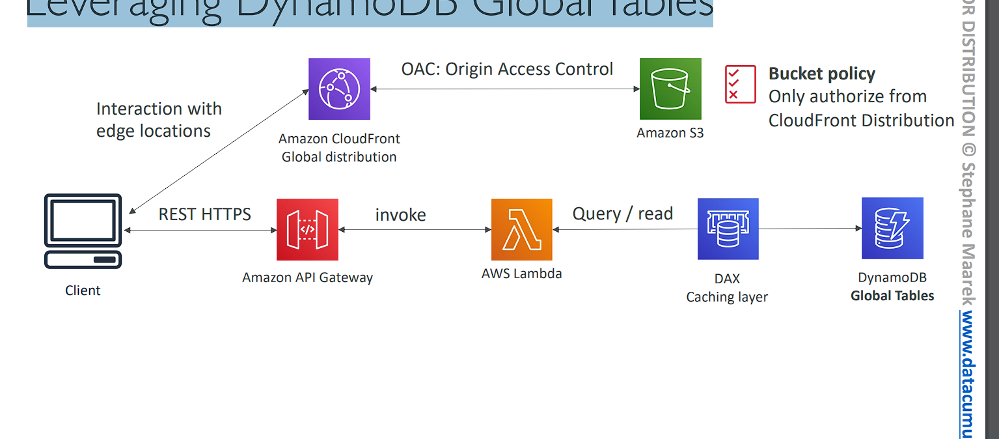

# User Welcome email flow

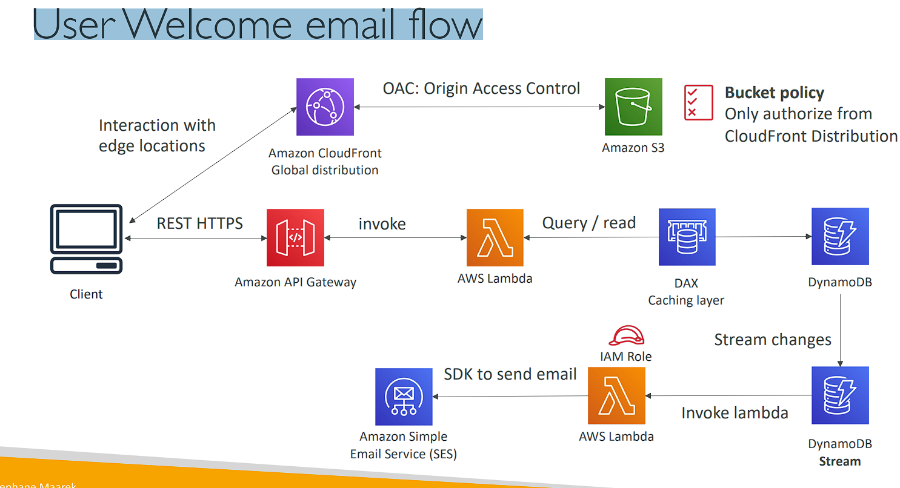

# Thumbnail Generation flow

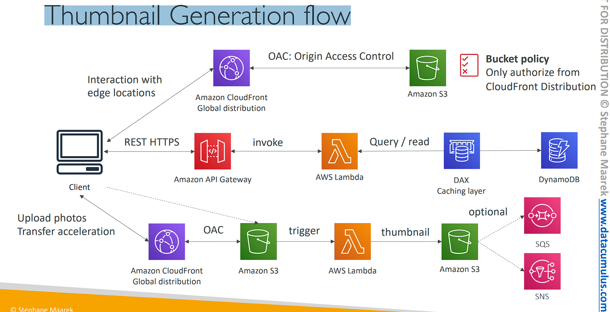

# AWS Hosted Website Summary

• We’ve seen static content being distributed using CloudFront with S3
• The REST API was serverless, didn’t need Cognito because public
• We leveraged a Global DynamoDB table to serve the data globally
• (we could have used Aurora Global Database)
• We enabled DynamoDB streams to trigger a Lambda function
• The lambda function had an IAM role which could use SES
• SES (Simple Email Service) was used to send emails in a serverless way
• S3 can trigger SQS / SNS / Lambda to notify of events

# Micro Services architecture

• We want to switch to a micro service architecture
• Many services interact (tương tác) with each other directly using a REST API
• Each architecture for each micro service may vary (khác nhau) in form and shape
• We want a micro-service architecture so we can have a leaner (thu gọn hơn) development lifecycle for each service

# Micro Services Environment

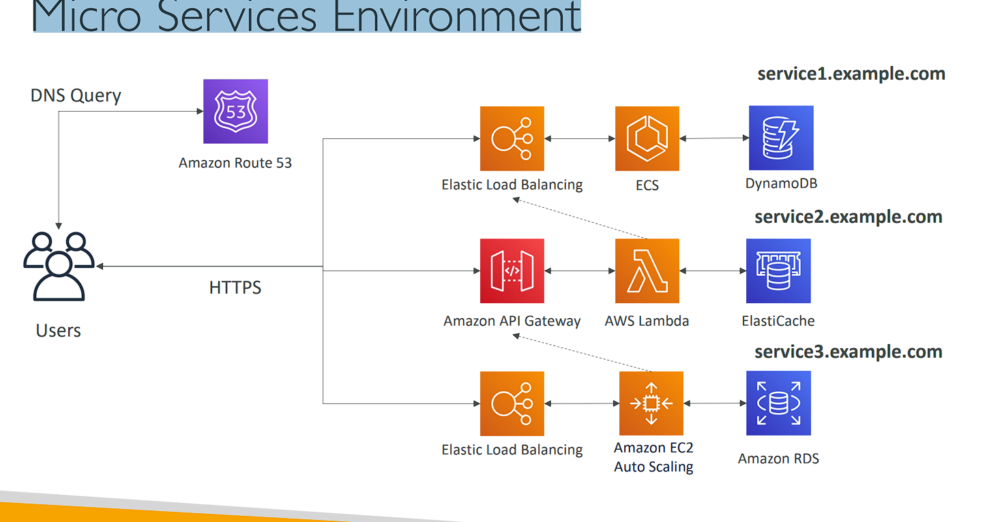

# Discussions on Micro Services

```
• You are free to design each micro-service the way you want
• Synchronous patterns: API Gateway, Load Balancers
• Asynchronous patterns: SQS, Kinesis, SNS, Lambda triggers (S3)
• Challenges with micro-services:
    • repeated overhead for creating each new microservice, (chi phí lặp lại để tạo ra mỗi dịch vụ vi mô mới,)
    • issues with optimizing server density/utilization
    • complexity of running multiple versions of multiple microservices simultaneously (đồng thời)
    • proliferation (gia tăng) of client-side code requirements to integrate with many separate (riêng biệt) services.
• Some of the challenges are solved by Serverless patterns:
    • API Gateway, Lambda scale automatically and you pay per usage
    • You can easily clone API, reproduce environments
    • Generated client SDK through Swagger integration for the API Gateway
```

# Software updates offloading (giảm tải các bản cập nhật phần mềm)

• We have an application running on EC2, that distributes software updates once in a while
• When a new software update is out, we get a lot of request and the content is distributed in mass over the network. It’s very costly
• We don’t want to change our application, but want to optimize our cost and CPU, how can we do it?

# Our application current state

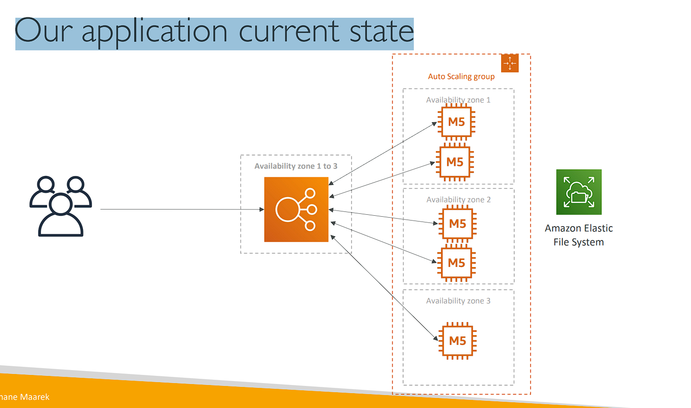

# Easy way to fix things!

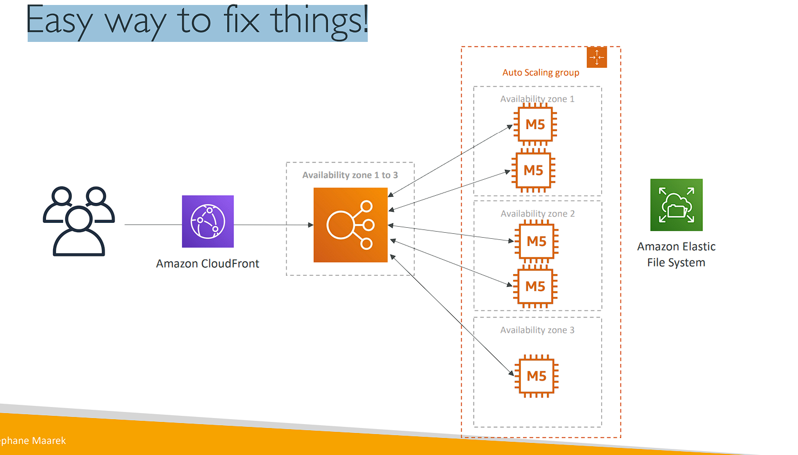

# Why CloudFront?

• No changes to architecture
• Will cache software update files at the edge
• Software update files are not dynamic, they’re static (never changing)
• Our EC2 instances aren’t serverless
• But CloudFront is, and will scale for us
• Our ASG will not scale as much, and we’ll save tremendously in EC2
• We’ll also save in availability, network bandwidth cost, etc
• Easy way to make an existing application more scalable and cheaper!
