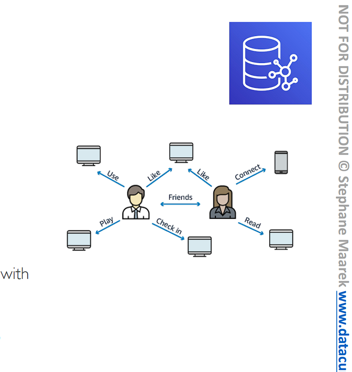
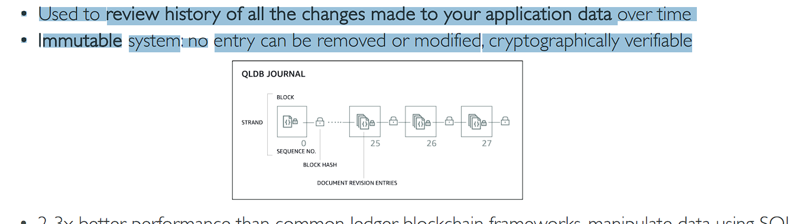
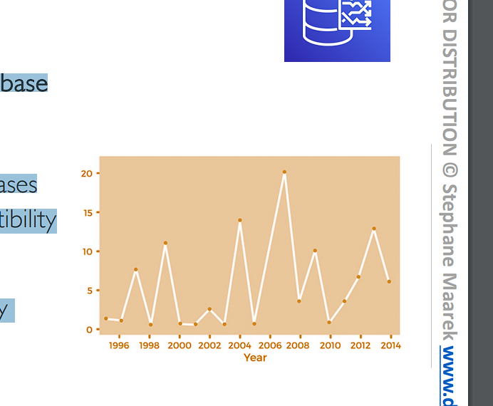
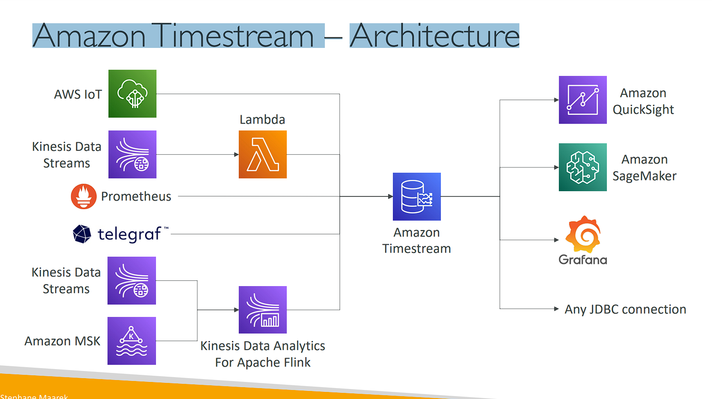

# Databases in AWS

# Choosing the Right Database

```
• We have a lot of managed databases on AWS to choose from
• Questions to choose the right database based on your architecture:
    • Read-heavy, write-heavy, or balanced workload? Throughput needs? Will it change, does it need to scale or fluctuate during the day?
    • How much data to store and for how long? Will it grow? Average object size? How are they accessed?
    • Data durability? Source of truth for the data ?
    • Latency requirements? Concurrent users?
    • Data model? How will you query the data? Joins? Structured? Semi-Structured?
    • Strong schema? More flexibility? Reporting? Search? RDBMS / NoSQL?
    • License costs? Switch to Cloud Native DB such as Aurora?
```

# Database Types

```
• RDBMS (= SQL / OLTP): RDS, Aurora – great for joins
• NoSQL database – no joins, no SQL : DynamoDB (~JSON), ElastiCache (key / value pairs), Neptune (graphs), DocumentDB (for MongoDB), Keyspaces (for Apache Cassandra)
• Object Store: S3 (for big objects) / Glacier (for backups / archives)
• Data Warehouse (= SQL Analytics / BI): Redshift (OLAP), Athena, EMR
• Search: OpenSearch (JSON) – free text, unstructured searches
• Graphs: Amazon Neptune – displays relationships between data
• Ledger: Amazon Quantum Ledger Database
• Time series: Amazon Timestream
• Note: some databases are being discussed in the Data & Analytics section
```

# Amazon RDS – Summary

```
• Managed PostgreSQL / MySQL / Oracle / SQL Server / DB2 / MariaDB / Custom
• Provisioned RDS Instance Size and EBS Volume Type & Size
• Auto-scaling capability for Storage
• Support for Read Replicas and Multi AZ
• Security through IAM, Security Groups, KMS , SSL in transit
• Automated Backup with Point in time restore feature (up to 35 days)
• Manual DB Snapshot for longer-term recovery
• Managed and Scheduled maintenance (with downtime)
• Support for IAM Authentication, integration with Secrets Manager
• RDS Custom for access to and customize the underlying instance (Oracle & SQL Server)
• Use case: Store relational datasets (RDBMS / OLTP), perform SQL queries, transactions
```

# Amazon Aurora – Summary

```
• Compatible API for PostgreSQL / MySQL, separation of storage and compute (tách biệt lưu trữ và tính toán)
• Storage: data is stored in 6 replicas, across 3 AZ – highly available, self-healing, auto-scaling
• Compute: Cluster of DB Instance across multiple AZ, auto-scaling of Read Replicas
• Cluster: Custom endpoints for writer and reader DB instances
• Same security / monitoring / maintenance features as RDS
• Know the backup & restore options for Aurora
• Aurora Serverless – for unpredictable (không đoán t rước) / intermittent (không liên tục) workloads, no capacity planning
• Aurora Global: up to 16 DB Read Instances in each region, < 1 second storage replication
• Aurora Machine Learning: perform ML using SageMaker & Comprehend on Aurora
• Aurora Database Cloning: new cluster from existing one, faster than restoring a snapshot
• Use case: same as RDS, but with less maintenance / more flexibility / more performance / more features
```

# Amazon ElastiCache – Summary

```
• Managed Redis / Memcached (similar offering as RDS, but for caches)
• In-memory data store, sub-millisecond latency
• Select an ElastiCache instance type (e.g., cache.m6g.large)
• Support for Clustering (Redis) and Multi AZ, Read Replicas (sharding)
• Security through IAM, Security Groups, KMS, Redis Auth
• Backup / Snapshot / Point in time restore feature
• Managed and Scheduled maintenance
• Requires some application code changes to be leveraged (được tận dụng)
• Use Case: Key/Value store, Frequent reads, less writes, cache results for DB queries, store session data for websites, cannot use SQL.
```

# Amazon DynamoDB – Summary

```
• AWS proprietary technology (công nghệ độc quyền), managed serverless NoSQL database, millisecond latency
• Capacity modes: provisioned capacity with optional auto-scaling or on-demand capacity
• Can replace ElastiCache as a key/value store (storing session data for example, using TTL feature)
• Highly Available, Multi AZ by default, Read and Writes are decoupled (tách rời), transaction capability
• DAX cluster for read cache, microsecond read latency
• Security, authentication and authorization is done through IAM
• Event Processing: DynamoDB Streams to integrate with AWS Lambda, or Kinesis Data Streams
• Global Table feature: active-active setup
• Automated backups up to 35 days with PITR (restore to new table), or on-demand backups
• Export to S3 without using RCU within the PITR window, import from S3 without using WCU
• Great to rapidly evolve schemas (Tuyệt vời để phát triển nhanh chóng các lược đồ)
• Use Case: Serverless applications development (small documents 100s KB), distributed serverless cache
```

# Amazon S3 – Summary

• S3 is a… key / value store for objects
• Great for bigger objects, not so great for many small objects
• Serverless, scales infinitely, max object size is 5 TB, versioning capability
• Tiers: S3 Standard, S3 Infrequent Access, S3 Intelligent, S3 Glacier + lifecycle policy
• Features: Versioning, Encryption, Replication, MFA-Delete, Access Logs…
• Security: IAM, Bucket Policies, ACL, Access Points, Object Lambda, CORS, Object/Vault Lock
• Encryption: SSE-S3, SSE-KMS, SSE-C, client-side, TLS in transit, default encryption
• Batch operations on objects using S3 Batch, listing files using S3 Inventory (liệt kê các tệp sử dụng S3 Inventory)
• Performance: Multi-part upload, S3 Transfer Acceleration, S3 Select
• Automation: S3 Event Notifications (SNS, SQS, Lambda, EventBridge)
• Use Cases: static files, key value store for big files, website hosting

# DocumentDB

• Aurora is an “AWS-implementation” of PostgreSQL / MySQL …
• DocumentDB is the same for MongoDB (which is a NoSQL database)
• MongoDB is used to store, query, and index JSON data
• Similar “deployment concepts” as Aurora
• Fully Managed, highly available with replication across 3 AZ
• DocumentDB storage automatically grows in increments of 10GB
• Automatically scales to workloads with millions of requests per seconds

# Amazon Neptune



```
• Fully managed graph database
• A popular graph dataset would be a social network
    • Users have friends
    • Posts have comments
    • Comments have likes from users
    • Users share and like posts…
• Highly available across 3 AZ, with up to 15 read replicas
• Build and run applications working with highly connected datasets – optimized for these complex and hard queries
• Can store up to billions of relations and query the graph with milliseconds latency
• Highly available with replications across multiple AZs
• Great for knowledge graphs (Wikipedia), fraud detection (phát hiện gian lận), recommendation engines, social networking
```

# Amazon Neptune – Streams


```
• Real-time ordered sequence of every change to your graph data (Trình tự sắp xếp theo thời gian thực của mọi thay đổi đối với dữ liệu biểu đồ của bạn)
• Changes are available immediately (ngay lập tức) after writing
• No duplicates, strict order (Không trùng lặp, thứ tự nghiêm ngặt)
• Streams data is accessible in an HTTP REST API
• Use cases:
    • Send notifications when certain changes are made (Gửi thông báo khi có những thay đổi nhất định)
    • Maintain your graph data synchronized in another data store (e.g., S3, OpenSearch, ElastiCache)
    • Replicate data across regions in Neptune
```

# Amazon Keyspaces (for Apache Cassandra)

• Apache Cassandra is an open-source NoSQL distributed database
• A managed Apache Cassandra-compatible database service
• Serverless, Scalable, highly available, fully managed by AWS
• Automatically scale tables up/down based on the application’s traffic
• Tables are replicated 3 times across multiple AZ
• Using the Cassandra Query Language (CQL)
• Single-digit millisecond latency at any scale, 1000s of requests per second
• Capacity: On-demand mode or provisioned mode with auto-scaling
• Encryption, backup, Point-In-Time Recovery (PITR) up to 35 days
• Use cases: store IoT devices info, time-series data, …

# Amazon QLDB

• QLDB stands for ”Quantum Ledger Database”
• A ledger is a book recording financial transactions (Sổ cái là một cuốn sổ ghi chép các giao dịch tài chính)
• Fully Managed, Serverless, High available, Replication across 3 AZ
• Used to review history of all the changes made to your application data over time (Được sử dụng để xem lại lịch sử của tất cả các thay đổi được thực hiện đối với dữ liệu ứng dụng của bạn theo thời gian)
• Immutable system: no entry can be removed or modified, cryptographically verifiable (hệ thống không thay đổi: không có mục nào có thể bị xóa hoặc sửa đổi, có thể xác minh bằng mật mã)


• 2-3x better performance than common ledger blockchain frameworks, manipulate data using SQL (xử lý dữ liệu bằng SQL)
• Difference with Amazon Managed Blockchain: no decentralization component, in accordance with financial regulation rules (Sự khác biệt với Amazon Managed Blockchain: không có thành phần phi tập trung, theo các quy tắc quản lý tài chính) (Tóm lại, Amazon QLDB là hệ thống sổ cái tập trung (centralized ledger), thích hợp cho các quy định tài chính yêu cầu sự giám sát tập trung, trong khi Amazon Managed Blockchain có tính chất phi tập trung, phù hợp với các ứng dụng không yêu cầu cơ quan quản lý tập trung.)

# Amazon Timestream


• Fully managed, fast, scalable, serverless time series database
• Automatically scales up/down to adjust (điều chỉnh) capacity
• Store and analyze trillions of events per day
• 1000s times faster & 1/10th the cost of relational databases
• Scheduled queries, multi-measure records, SQL compatibility (Truy vấn theo lịch trình, bản ghi đa biện pháp, khả năng tương thích SQL)
• Data storage tiering: recent data kept in memory and historical data kept in a cost-optimized storage
• Built-in time series analytics functions (helps you identify patterns in your data in near real-time)
• Encryption in transit and at rest • Use cases: IoT apps, operational applications, real-time analytics, …

# Amazon Timestream – Architecture



# Câu hỏi 4:

You are looking to perform Online Transaction Processing (OLTP). You would like to use a database that has built-in auto-scaling capabilities and provides you with the maximum number of replicas for its underlying storage. What AWS service do you recommend?
Đáp án: Amazone Aurora
Giải thích: Amazon Aurora is a MySQL and PostgreSQL-compatible relational database. It features a distributed, fault-tolerant, self-healing storage system that auto-scales up to 128TB per database instance. It delivers high performance and availability with up to 15 low-latency read replicas, point-in-time recovery, continuous backup to Amazon S3, and replication across 3 AZs.
