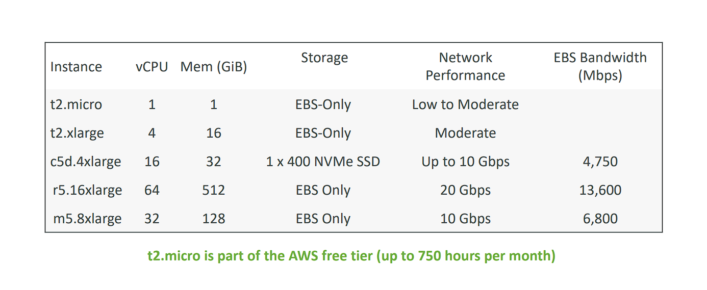
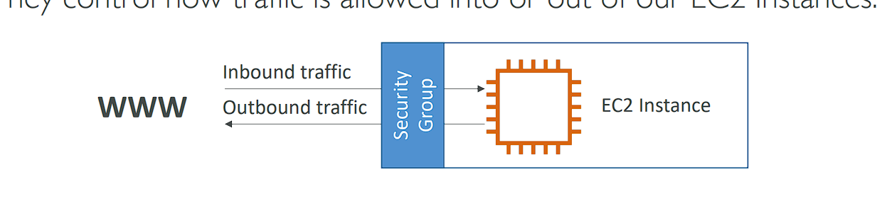
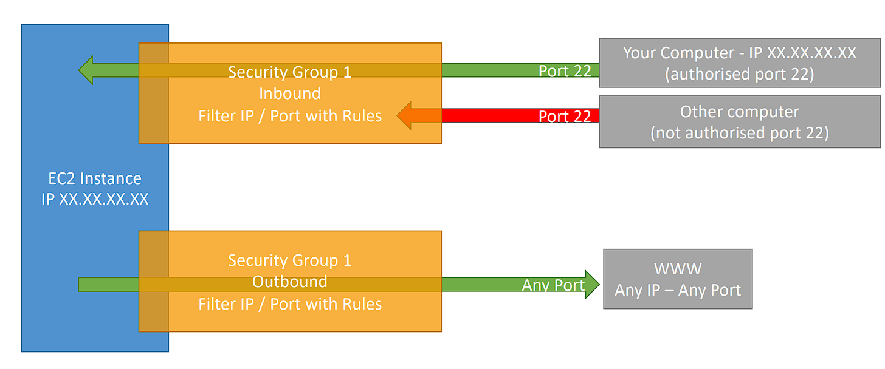
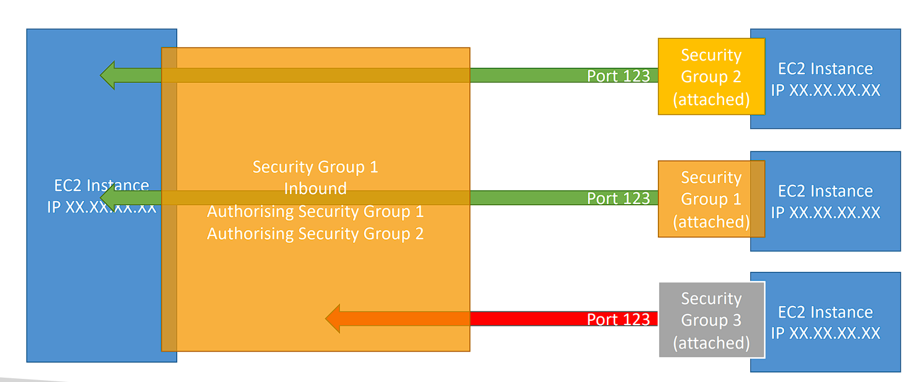
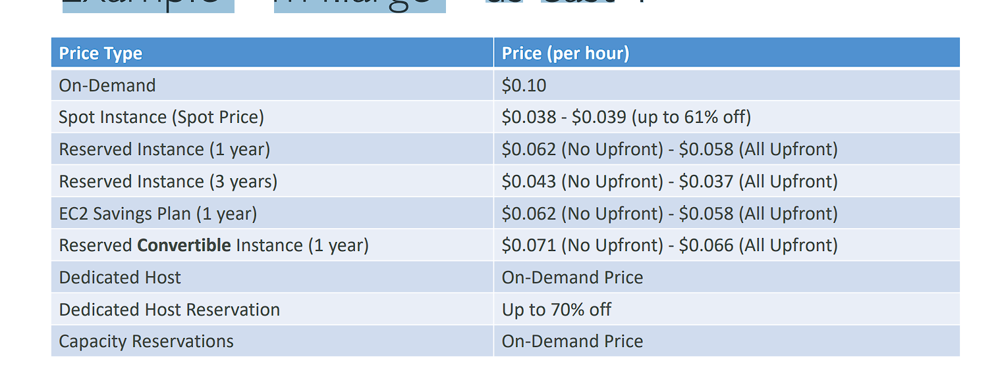
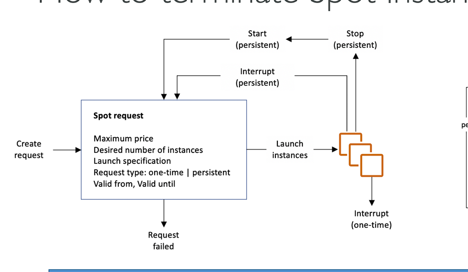
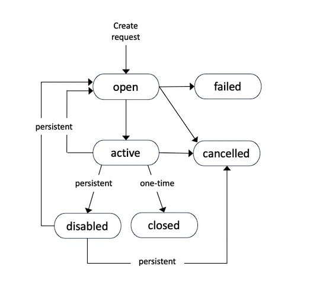

# Amazon EC2

```plaintext
• EC2 is one of the most popular of AWS’ offering (EC2 là một trong những dịch vụ phổ biến nhất của AWS)
• EC2 = Elastic Compute Cloud = Infrastructure as a Service
• It mainly consists in the capability of :
    • Renting virtual machines (EC2)
    • Storing data on virtual drives (EBS)
    • Distributing load across machines (ELB)
    • Scaling the services using an auto-scaling group (ASG)
• Knowing EC2 is fundamental to understand how the Cloud works
```

# EC2 sizing & configuration options

```plaintext
• Operating System (OS): Linux, Windows or Mac OS
• How much compute power & cores (CPU) • How much random-access memory (RAM)
• How much storage space:
    • Network-attached (EBS & EFS)
    • hardware (EC2 Instance Store)
• Network card: speed of the card, Public IP address
• Firewall rules: security group
• Bootstrap script (configure at first launch): EC2 User Data
```

# EC2 User Data

```plaintext
• It is possible to bootstrap (khởi động) our instances using an EC2 User data script.
• bootstrapping means launching commands when a machine starts
• That script is only run once at the instance first start
• EC2 user data is used to automate boot tasks such as:
    • Installing updates
    • Installing software
    • Downloading common files from the internet
    • Anything you can think of
• The EC2 User Data Script runs with the root user
```

# Hands-On: Launching an EC2 Instance running Linux

• We’ll be launching our first virtual server using the AWS Console
• We’ll get a first high-level approach(tiếp cận) to the various parameters
• We’ll see that our web server is launched using EC2 user data
• We’ll learn how to start / stop / terminate our instance.

(IPv4 public sẽ bị thay đổi khi start lại, IPv4 private sẽ được giữ nguyên)

# EC2 Instance Types - Overview

• You can use different types of EC2 instances that are optimised for different use cases (https://aws.amazon.com/ec2/instance-types/)
• AWS has the following naming convention: `m5.2xlarge`
• `m`: instance class
• `5`: generation (thế hệ) (AWS improves them over time)
• `2xlarge`: size within the instance class

# EC2 Instance Types – General Purpose

```plaintext
• Great for a diversity (đa dạng) of workloads such as web servers or code repositories (`T2`)
• Balance between:
    • Compute
    • Memory
    • Networking
• In the course, we will be using the t2.micro which is a General Purpose EC2 instance
```

```plaintext
• Great for compute-intensive(tính toán chuyên sâu) tasks that require high performance processors: (`C6g`)
    • Batch processing workloads
    • Media transcoding
    • High performance web servers
    • High performance computing (HPC)
    • Scientific modeling & machine learning
    • Dedicated gaming servers
```

```plaintext
• Fast performance for workloads that process large data sets in memory (`R6g`)
• Use cases:
    • High performance, relational/non-relational databases
    • Distributed web scale cache stores
    • In-memory databases optimized for BI (business intelligence)
    • Applications performing real-time processing of big unstructured data
```

```plaintext
• Great for storage-intensive tasks that require high, sequential read and write access to large data sets on local storage (I3)
• Use cases:
    • High frequency online transaction processing (OLTP) systems
    • Relational & NoSQL databases
    • Cache for in-memory databases (for example, Redis)
    • Data warehousing applications
    • Distributed file systems
```

# EC2 Instance Types: example



# Introduction to Security Groups

• Security Groups are the fundamental of network security in AWS
• They control how traffic is allowed into or out of our EC2 Instances

• Security groups only `allow` contain rules
• Security groups rules can reference by IP or by `security group`

# Security Groups Deeper Dive

```plaintext
• Security groups are acting as a “firewall” on EC2 instances
• They regulate (điều tiết):
    • Access to Ports
    • Authorised IP ranges – IPv4 and IPv6
    • Control of inbound network (from other to the instance)
    • Control of outbound network (from the instance to other)
```

# Security Groups Diagram



# Security Groups Good to know

• Can be attached to multiple instances
• Locked down to a region / VPC combination (Một máy chủ cơ sở dữ liệu có thể bị "locked down" trong một region cụ thể (ví dụ: US-East-1) và một VPC cụ thể, ngăn cản nó bị truy cập từ các region hoặc VPC khác.)
• Does live “outside” the EC2 – if traffic is blocked the EC2 instance won’t see it
• It’s good to maintain one separate security group for SSH access
• If your application is not accessible (time out), then it’s a security group issue
• If your application gives a “connection refused“ error, then it’s an application error or it’s not launched
• All inbound traffic is blocked by default
• All outbound traffic is authorised by default

# Referencing other security groups Diagram



# Classic Ports to know

• 22 = SSH (Secure Shell) - log into a Linux instance
• 21 = FTP (File Transfer Protocol) – upload files into a file share
• 22 = SFTP (Secure File Transfer Protocol) – upload files using SSH
• 80 = HTTP – access unsecured websites
• 443 = HTTPS – access secured websites
• 3389 = RDP (Remote Desktop Protocol) – log into a Windows instance

-` Một EC2 có thể gắn 1 hoặc nhiều Security Group`

# EC2 Instances Purchasing Options

```plainxtext
• On-Demand Instances – short workload, predictable pricing (dự đoán giá cả), pay by second
• Reserved (1 & 3 years) (dự trữ) (Convertible Reserved Instances rất phù hợp cho các khối lượng công việc dài hạn, nơi bạn muốn tiết kiệm chi phí nhưng vẫn cần sự linh hoạt để điều chỉnh loại tài nguyên (instance type) theo thời gian.)
    • Reserved Instances – long workloads
    • Convertible Reserved Instances – long workloads with flexible instances (Các phiên bản Reserved có thể chuyển đổi – khối lượng công việc dài với các phiên bản linh hoạt)
• Savings Plans (1 & 3 years) –commitment (cam kết) to an amount of usage, long workload
• Spot Instances – short workloads, cheap, can lose instances (less reliable) (kém tin cậy)
• Dedicated Hosts (máy chủ chuyên dụng) – book an entire (toàn bộ) physical server, control instance placement
• Dedicated Instances – no other customers will share your hardware
• Capacity Reservations – reserve capacity in a specific AZ for any duration
```

```
Dưới đây là giải thích chi tiết các tùy chọn mua EC2 Instances:

1. On-Demand Instances:

- Dùng cho các workload ngắn hạn hoặc khi nhu cầu không ổn định.
- Thanh toán theo giây hoặc giờ sử dụng, không yêu cầu cam kết dài hạn.
- Lý tưởng cho việc thử nghiệm, phát triển, hoặc các ứng dụng có tải không ổn định.
2. Reserved Instances (1 và 3 năm):

- Dùng cho các workload dài hạn, với mức giá giảm đáng kể so với On-Demand.
- Bạn cần phải cam kết sử dụng trong 1 hoặc 3 năm, giúp tiết kiệm chi phí cho các hệ thống có nhu cầu ổn định.
3. Convertible Reserved Instances:

- Tương tự như Reserved Instances, nhưng linh hoạt hơn vì bạn có thể chuyển đổi loại instance (ví dụ từ cỡ nhỏ lên cỡ lớn) mà không mất phí.
- Phù hợp khi bạn cần một workload dài hạn nhưng muốn linh hoạt thay đổi loại tài nguyên.
4. Savings Plans (1 và 3 năm):

- Đây là kế hoạch tiết kiệm chi phí dựa trên mức cam kết sử dụng trong 1 hoặc 3 năm (ví dụ, cam kết sử dụng $10/giờ).
- Cung cấp sự linh hoạt hơn Reserved Instances vì bạn không bị giới hạn vào một loại instance cụ thể, chỉ cần tuân theo mức sử dụng đã cam kết.
5. Spot Instances:

- Rất rẻ nhưng kém ổn định, vì có thể bị AWS thu hồi nếu nhu cầu sử dụng tài nguyên tăng lên.
- Phù hợp cho các workload ngắn hạn, không cần phải chạy liên tục, như các tác vụ xử lý dữ liệu lớn (big data), phân tích batch, hoặc các thử nghiệm.
6. Dedicated Hosts:

- Bạn sẽ thuê một máy chủ vật lý riêng biệt, cho phép bạn kiểm soát hoàn toàn việc đặt instance.
- Phù hợp cho các nhu cầu liên quan đến compliance, phần mềm yêu cầu giấy phép đặc biệt, hoặc cần tránh bị ảnh hưởng bởi "noisy neighbors" (instance của khách hàng khác trên cùng phần cứng).
7. Dedicated Instances:

- Instance chạy trên phần cứng riêng biệt chỉ dành cho bạn, không chia sẻ với khách hàng khác, nhưng bạn không kiểm soát trực tiếp máy chủ.
- Giải pháp này cũng đáp ứng các yêu cầu compliance nhưng với ít quyền kiểm soát hơn so với Dedicated Hosts.
8. Capacity Reservations:

- Đặt trước dung lượng trong một Availability Zone (AZ) cụ thể mà không cần phải cam kết dài hạn.
- Bạn có thể giữ trước dung lượng trong một AZ cho các sự kiện bất ngờ hoặc khi cần đảm bảo sẵn có của tài nguyên.

## Tóm lại, lựa chọn tùy thuộc vào mức độ ổn định của workload, dài hay ngắn hạn, và mức cam kết tài chính mà bạn sẵn sàng.


```

# EC2 On Demand

```plaintext
• Pay for what you use:
    • Linux or Windows - billing per second, after the first minute
    • All other operating systems - billing per hour
• Has the highest cost but no upfront payment (không phải trả trước)
• No long-term commitment
• Recommended for short-term and un-interrupted workloads, where you can't predict (dự đoán) how the application will behave (hoạt động)
(Được khuyến nghị cho khối lượng công việc ngắn hạn và không bị gián đoạn, trong đó bạn không thể dự đoán ứng dụng sẽ hoạt động như thế nào)
```

# EC2 Reserved Instances (đặt trước instance)

```plaintext
• Up to 72% discount compared to On-demand
• You reserve a specific instance attributes (Instance Type, Region, Tenancy, OS)
• Reservation Period – 1 year (+discount) or 3 years (+++discount)
• Payment Options – No Upfront (+), Partial Upfront (++) (trả trước một phần), All Upfront (+++)
• Reserved Instance’s Scope – Regional or Zonal (reserve capacity in an AZ)
(Regional: Phạm vi khu vực, áp dụng cho tất cả các AZ trong khu vực, nhưng không đảm bảo dung lượng sẵn có trong một AZ cụ thể.
Zonal: Phạm vi vùng sẵn sàng, áp dụng cho một AZ cụ thể và đảm bảo dung lượng sẵn có trong AZ đó.)
• Recommended for steady-state usage applications (ứng dụng trạng thái ổn định) (think database)
• You can buy and sell in the Reserved Instance Marketplace
• Convertible Reserved Instance
    • Can change the EC2 instance type, instance family, OS, scope and tenancy
    • Up to 66% discount
    (Convertible Reserved Instances cung cấp một mức độ linh hoạt đáng kể cho việc quản lý tài nguyên EC2 trên AWS, cho phép thay đổi cấu hình mà vẫn được hưởng lợi từ mức giá chiết khấu lên đến 66%. Điều này làm cho chúng phù hợp cho các doanh nghiệp có khối lượng công việc dài hạn nhưng có thể cần thay đổi yêu cầu về tài nguyên trong suốt thời gian hợp đồng.)
```

```
Dưới đây là giải thích chi tiết về EC2 Reserved Instances:

1. Giảm giá lên tới 72% so với On-demand:

- Reserved Instances (RI) giúp bạn tiết kiệm chi phí đáng kể khi cam kết sử dụng tài nguyên EC2 trong thời gian dài (1 hoặc 3 năm), đặc biệt so với chi phí On-Demand (trả theo nhu cầu, không cam kết).
2. Bạn đặt trước các thuộc tính cụ thể của instance:

- Khi mua RI, bạn phải chỉ định các thuộc tính cố định của instance như:
    - Loại Instance (Instance Type: ví dụ, t2.micro, m5.large).
    - Khu vực (Region): Nơi mà instance sẽ chạy.
    - Loại tenancy: Chạy instance trên máy chủ vật lý riêng hay chia sẻ (shared).
    - Hệ điều hành (OS): Ví dụ, Linux, Windows.
3. Thời gian cam kết – 1 năm hoặc 3 năm:

    - 1 năm sẽ giúp tiết kiệm chi phí hơn so với On-Demand, nhưng mức giảm giá sẽ cao hơn nếu bạn cam kết trong 3 năm.
4. Các tùy chọn thanh toán:

- No Upfront: Không cần trả trước, nhưng tiết kiệm ít nhất.
- Partial Upfront: Thanh toán một phần trước, giảm giá nhiều hơn.
- All Upfront: Trả trước toàn bộ chi phí, nhận mức giảm giá tối đa.
5. Phạm vi Reserved Instance – Vùng (Region) hoặc Zone (AZ):

- Regional: Cho phép sử dụng RI trong toàn bộ Region, tăng tính linh hoạt khi khởi chạy instance.
- Zonal: Đảm bảo dung lượng tài nguyên trong một Availability Zone (AZ) cụ thể, thường dùng khi bạn muốn chắc chắn tài nguyên sẽ luôn sẵn sàng.
6. Được khuyến nghị cho các ứng dụng ổn định (steady-state):

- Reserved Instances lý tưởng cho các ứng dụng có tải ổn định, như cơ sở dữ liệu, vì bạn biết trước nhu cầu tài nguyên sẽ không thay đổi nhiều.
7. Mua và bán trong Reserved Instance Marketplace:

Nếu không còn nhu cầu sử dụng, bạn có thể mua bán lại RI trên Reserved Instance Marketplace.


## Convertible Reserved Instance:
1. Có thể thay đổi loại EC2 instance:

- Convertible RI cho phép bạn thay đổi các thuộc tính như:
    - Loại instance (instance type).
    - Family của instance (instance family).
    - Hệ điều hành (OS).
    - Phạm vi sử dụng (scope từ regional sang zonal hoặc ngược lại).
    - Tenancy.
2. Giảm giá lên đến 66%:

- So với mức giảm của Reserved Instances chuẩn (lên đến 72%), Convertible RI cung cấp mức giảm thấp hơn (lên đến 66%) nhưng có tính linh hoạt cao hơn.

==> Nhìn chung, Reserved Instances phù hợp cho các ứng dụng ổn định, còn Convertible RI dành cho các trường hợp cần sự linh hoạt trong việc thay đổi loại tài nguyên mà vẫn muốn tiết kiệm chi phí.
```

# EC2 Savings Plans

```plainxtext
• Get a discount based on long-term usage (up to 72% - same as RIs)
• Commit to a certain type of usage ($10/hour for 1 or 3 years)
• Usage beyond (vượt quá) EC2 Savings Plans is billed at the On-Demand price
• Flexible across:
    • Instance Size (e.g., m5.xlarge, m5.2xlarge)
    • OS (e.g., Linux, Windows)
    • Tenancy (Host, Dedicated, Default)
```

```
## Cam kết với một mức sử dụng cố định ($/giờ trong 1 hoặc 3 năm):

- Thay vì cam kết cho một loại instance cụ thể, bạn cam kết với AWS về một mức sử dụng tối thiểu tính theo đô la ($) mỗi giờ, ví dụ như $10/giờ trong 1 hoặc 3 năm. Điều này có nghĩa là bạn trả một khoản cố định mỗi giờ bất kể loại instance cụ thể mà bạn đang chạy.


## Bị giới hạn bởi một family của instance và khu vực AWS cụ thể:

- Khi bạn chọn Savings Plan, bạn có thể linh hoạt sử dụng các kích thước khác nhau trong cùng một instance family, nhưng bạn không thể chuyển đổi sang family khác. Ví dụ:
    - Nếu bạn đã cam kết cho family M5, bạn có thể chạy các instance có kích thước khác nhau như m5.large, m5.xlarge, m5.2xlarge, nhưng bạn không thể chuyển đổi sang các instance thuộc family khác như C5 hoặc R5.
## Giới hạn theo "Region":
- Khi bạn cam kết Savings Plan, bạn sẽ bị giới hạn trong một Region cụ thể. Điều này có nghĩa là nếu bạn cam kết cho Region us-east-1, thì bạn chỉ được hưởng lợi từ Savings Plan khi khởi chạy instance ở us-east-1. Nếu bạn khởi chạy instance ở Region khác như eu-west-1 hoặc ap-southeast-1, bạn sẽ phải trả giá On-Demand cho các instance đó, vì Savings Plan không áp dụng cho các Region ngoài khu vực đã cam kết.

==> Savings Plan cho phép bạn linh hoạt thay đổi kích thước instance (instance size), hệ điều hành (OS), và tenancy (Tenancy), nhưng phải trong cùng một family (ví dụ, M5) và trong cùng một region (ví dụ, us-east-1).

## Tính linh hoạt:

- So với Reserved Instances, Savings Plans có tính linh hoạt cao hơn vì bạn có thể thay đổi:
    - Kích thước instance: Bạn có thể thay đổi giữa các kích thước khác nhau trong cùng một family (ví dụ, từ m5.xlarge sang m5.2xlarge).
    - Hệ điều hành: Bạn có thể chọn giữa các hệ điều hành khác nhau (Linux, Windows).
    - Tenancy: Bạn có thể thay đổi giữa các loại tenancy (Host, Dedicated, Default)

==> EC2 Savings Plans là một lựa chọn tuyệt vời nếu bạn muốn có chiết khấu giống như Reserved Instances nhưng vẫn muốn linh hoạt trong việc thay đổi kích thước instance, hệ điều hành, và tenancy trong cùng một instance family và region.
```

# EC2 Spot Instances

```plaintext
• Can get a discount of up to 90% compared to On-demand
• Instances that you can “lose” at any point of time if your max price is less than the
current spot price
• The MOST cost-efficient (tiết kiệm tri phí) instances in AWS
• Useful for workloads that are resilient (đàn hồi) to failure
    • Batch jobs (công việc hàng loạt)
    • Data analysis
    • Image processing
    • Any distributed workloads
    • Workloads with a flexible start and end time
• Not suitable for critical jobs or databases
```

# EC2 Dedicated Hosts

```plaintext
• A physical server with EC2 instance capacity fully dedicated to your use (Một máy chủ vật lý có dung lượng EC2 dành riêng cho mục đích sử dụng của bạn)
• Allows you address compliance requirements and use your existing server- bound software licenses (per-socket, per-core, pe—VM software licenses)
• Purchasing Options:
    • On-demand – pay per second for active Dedicated Host
    • Reserved - 1 or 3 years (No Upfront, Partial Upfront, All Upfront)
• The most expensive option
• Useful for software that have complicated licensing model (BYOL – Bring Your Own License)
• Or for companies that have strong regulatory or compliance needs (Hoặc đối với các công ty có nhu cầu tuân thủ hoặc quy định chặt chẽ)
(EC2 Dedicated Hosts là một giải pháp EC2 cung cấp toàn quyền kiểm soát một máy chủ vật lý, lý tưởng cho các doanh nghiệp cần tuân thủ quy định chặt chẽ, hoặc có các yêu cầu phần mềm với mô hình cấp phép phức tạp. Tuy đây là lựa chọn đắt đỏ, nhưng nó mang lại sự linh hoạt và bảo mật cao nhất.)
```

```
Dưới đây là giải thích chi tiết về EC2 Dedicated Hosts:

1. Máy chủ vật lý dành riêng cho bạn:

- EC2 Dedicated Hosts là một máy chủ vật lý với dung lượng EC2 instance hoàn toàn dành riêng cho bạn. Điều này có nghĩa là bạn sẽ không chia sẻ phần cứng (CPU, RAM, ổ đĩa) với bất kỳ khách hàng nào khác.
2. Đáp ứng yêu cầu về compliance và sử dụng các giấy phép phần mềm gắn liền với phần cứng:

- Dedicated Hosts giúp giải quyết các yêu cầu về tuân thủ pháp lý (compliance), như những trường hợp quy định nghiêm ngặt về dữ liệu hoặc nơi mà bạn cần kiểm soát toàn bộ môi trường vật lý.
- Nó cũng giúp bạn tận dụng các giấy phép phần mềm đã có sẵn, đặc biệt là các giấy phép liên quan đến phần cứng (per-socket, per-core, per-VM), ví dụ như Bring Your Own License (BYOL). Bạn có thể sử dụng các giấy phép cũ mà bạn đã mua cho máy chủ vật lý của mình.
3. Các tùy chọn mua:

- On-Demand: Bạn trả tiền theo giây cho mỗi lần bạn sử dụng máy chủ vật lý Dedicated Host. Phù hợp cho các nhu cầu ngắn hạn hoặc khi không cần cam kết lâu dài.
- Reserved: Tương tự như Reserved Instances, bạn có thể đặt trước Dedicated Hosts cho 1 hoặc 3 năm với các tùy chọn thanh toán:
    - No Upfront: Không trả trước, chi phí sẽ cao hơn trong quá trình sử dụng.
    - Partial Upfront: Trả trước một phần, giảm giá nhiều hơn.
    - All Upfront: Trả trước toàn bộ, nhận mức giảm giá tối đa.
4. Lựa chọn đắt nhất:

- Dedicated Hosts là lựa chọn đắt đỏ nhất trong các loại EC2 Instances do bạn phải thuê toàn bộ máy chủ vật lý và không chia sẻ tài nguyên với bất kỳ ai.
5. Phù hợp với phần mềm có mô hình cấp phép phức tạp:

- Dedicated Hosts rất hữu ích cho các ứng dụng có mô hình cấp phép phần mềm phức tạp, ví dụ như các phần mềm yêu cầu giấy phép trên cơ sở per-core hoặc per-socket. Với BYOL (Bring Your Own License), bạn có thể tận dụng các giấy phép đã mua cho phần cứng của mình thay vì mua mới.
6. Phù hợp với các công ty có yêu cầu tuân thủ hoặc quy định nghiêm ngặt:

- Những công ty hoạt động trong các lĩnh vực như tài chính, chăm sóc sức khỏe, hoặc chính phủ có thể có các yêu cầu về tuân thủ và an ninh đòi hỏi việc kiểm soát hoàn toàn cơ sở hạ tầng vật lý. Dedicated Hosts giúp đảm bảo rằng không có khách hàng nào khác chia sẻ phần cứng của bạn, từ đó hỗ trợ việc tuân thủ các quy định khắt khe này.

## Tóm lại:
- EC2 Dedicated Hosts phù hợp cho các tổ chức có nhu cầu về tuân thủ, yêu cầu kiểm soát môi trường vật lý hoặc có giấy phép phần mềm phức tạp cần sử dụng với hạ tầng riêng.
```

# EC2 Dedicated Instances

• Instances run on hardware that’s dedicated to you (Các phiên bản chạy trên phần cứng dành riêng cho bạn)
• May share hardware with other instances in same account
• No control over instance placement (can move hardware after Stop / Start) (Không kiểm soát được vị trí đặt phiên bả (có thể di chuyển phần cứng sau khi Dừng/Bắt đầu))

(EC2 Dedicated Instances cung cấp một mức độ cô lập vật lý với các tài khoản AWS khác, nhưng vẫn có thể chia sẻ phần cứng với các phiên bản khác trong cùng tài khoản. Bạn không có quyền kiểm soát vị trí chính xác của phiên bản trên phần cứng vật lý và chúng có thể di chuyển khi dừng và khởi động lại. Điều này mang lại sự cân bằng giữa tính bảo mật, cô lập, và chi phí, nhưng ít linh hoạt hơn so với EC2 Dedicated Hosts (nơi bạn có toàn quyền kiểm soát phần cứng).)

# EC2 Capacity Reservations

• Reserve On-Demand instances capacity in a specific AZ for any duration
• You always have access to EC2 capacity when you need it
• No time commitment (create/cancel anytime), no billing discounts
• Combine with Regional Reserved Instances and Savings Plans to benefit from billing discounts
• You’re charged at On-Demand rate whether you run instances or not
• Suitable for short-term, uninterrupted workloads that needs to be in a specific AZ

```plaintext
Câu này mô tả về EC2 Capacity Reservations trên AWS, một tính năng cho phép bạn đảm bảo khả năng sẵn sàng của tài nguyên EC2 trong một vùng sẵn sàng (AZ) cụ thể. Dưới đây là giải thích chi tiết:

1. Reserve On-Demand instances capacity in a specific AZ for any duration:
EC2 Capacity Reservations cho phép bạn đặt trước dung lượng của các phiên bản EC2 On-Demand trong một vùng sẵn sàng (Availability Zone - AZ) cụ thể. Bạn có thể giữ chỗ này cho bất kỳ khoảng thời gian nào mà bạn cần, từ vài giờ đến vài tháng hoặc hơn.
2. You always have access to EC2 capacity when you need it:
Khi bạn đã tạo một Capacity Reservation, AWS sẽ đảm bảo rằng dung lượng của phiên bản EC2 mà bạn đã đặt trước luôn sẵn sàng cho bạn sử dụng bất cứ khi nào bạn cần. Điều này rất quan trọng khi bạn có các ứng dụng quan trọng và không muốn gặp phải tình trạng thiếu dung lượng (capacity shortages) trong vùng sẵn sàng.
3. No time commitment (create/cancel anytime), no billing discounts:
Bạn không cần cam kết về thời gian khi sử dụng Capacity Reservations, có nghĩa là bạn có thể tạo hoặc hủy chỗ giữ bất cứ lúc nào mà không phải trả thêm phí. Tuy nhiên, không có ưu đãi về giá (billing discounts) như với Reserved Instances hoặc Savings Plans.
4. Combine with Regional Reserved Instances and Savings Plans to benefit from billing discounts:
Mặc dù bản thân Capacity Reservations không cung cấp ưu đãi về giá, nhưng bạn có thể kết hợp với Regional Reserved Instances và Savings Plans để nhận được các chiết khấu về giá. Khi kết hợp, bạn có thể tận dụng các ưu đãi này cho các phiên bản EC2 chạy trong chỗ giữ của bạn.
5. You’re charged at On-Demand rate whether you run instances or not:
Bạn sẽ bị tính phí theo giá On-Demand cho chỗ giữ của mình, ngay cả khi bạn không chạy phiên bản EC2 nào trong chỗ giữ đó. Điều này có nghĩa là bạn đang trả tiền cho việc đảm bảo dung lượng, chứ không phải cho việc sử dụng thực tế.
6. Suitable for short-term, uninterrupted workloads that need to be in a specific AZ:
EC2 Capacity Reservations rất phù hợp cho các khối lượng công việc ngắn hạn, không bị gián đoạn và cần phải triển khai trong một vùng sẵn sàng (AZ) cụ thể. Điều này giúp đảm bảo rằng công việc của bạn sẽ không bị ảnh hưởng bởi thiếu dung lượng trong AZ đó.
Tóm lại:
EC2 Capacity Reservations cho phép bạn giữ chỗ dung lượng EC2 trong một vùng sẵn sàng cụ thể, đảm bảo tài nguyên luôn sẵn sàng khi bạn cần. Tuy không có cam kết thời gian và không cung cấp ưu đãi về giá, nhưng nó lại mang lại sự linh hoạt cao, rất phù hợp cho các công việc ngắn hạn, yêu cầu tài nguyên liên tục trong một AZ cụ thể. Bạn có thể kết hợp với các kế hoạch khác để giảm chi phí tổng thể, nhưng vẫn phải trả giá On-Demand cho việc giữ chỗ.


```

# Về cơ bản, EC2 tính tiền instance dựa trên thời gian chạy và kích thước của instance. Mỗi instance sẽ có mức giá khác nhau tùy theo cấu hình (càng bự càng mắc).

## Các mô hình tính tiền của EC2 (Pricing Model)

• On-Demand: Xài nhiêu trả nhiêu, không cần trả trước. Phù hợp cho đa số mục đích (học tập, môi trường dev,…)
• Reserve Instance or Saving Plan: Mua trước 1-3 năm hoặc commit số tiền sẽ xài hằng tháng để được discount so với On-Demand (tối đa discount lên tới ~72%). Phù hợp cho môi trường production.
• Spot Instance: Đấu giá để được sd EC2 instance vào các khung giờ thấp điểm. Phù hợp cho các tác vụ xử lý hàng loạt, cần giá rẻ, xử lý có thể resume lại khi bị dừng đột ngột.
• Dedicated Host: Thuê riêng phần cứng nếu có yêu cầu đặc biệt về compliance.

# Which purchasing option is right for me?

• On demand: coming and staying in resort whenever we like, we pay the full price
• Reserved: like planning ahead and if we plan to stay for a long time, we may get a good discount.
• Savings Plans: pay a certain amount per hour for certain period (khoảng thời gian nhất định) and stay in any room type (e.g., King, Suite, Sea View, …)
• Spot instances: the hotel allows people to bid (thầu) for the empty rooms and the highest bidder keeps (người trả giá cao nhất) the rooms. You can get kicked out at any time
• Dedicated Hosts: We book an entire building (toàn bộ) of the resort
• Capacity Reservations: you book a room for a period with full price even you don’t stay in it

```
Dưới đây là giải thích về các tùy chọn mua EC2 Instances bằng cách so sánh với các ví dụ liên quan đến việc thuê phòng khách sạn:

1. On-Demand:

- Ví dụ khách sạn: Bạn có thể đến và ở tại khu nghỉ dưỡng bất kỳ khi nào bạn muốn, nhưng bạn phải trả giá đầy đủ cho mỗi lần ở. Bạn không có cam kết dài hạn và bạn chỉ trả tiền khi sử dụng.
- Giải pháp EC2: Đây là lựa chọn lý tưởng cho các workload ngắn hạn hoặc khi nhu cầu không thể đoán trước. Không có cam kết, và bạn trả tiền theo từng giờ sử dụng.
2. Reserved Instances:

- Ví dụ khách sạn: Nếu bạn lên kế hoạch từ trước và dự định ở lại khu nghỉ dưỡng trong một khoảng thời gian dài, bạn có thể nhận được mức giảm giá tốt. Bạn đặt phòng trước cho 1 hoặc 3 năm để đảm bảo chỗ ở với giá ưu đãi.
- Giải pháp EC2: Dành cho các ứng dụng có nhu cầu liên tục, ổn định, như các dịch vụ cơ sở dữ liệu, nơi bạn có thể lên kế hoạch dài hạn và cam kết sử dụng trong 1 hoặc 3 năm để tiết kiệm chi phí.
3. Savings Plans:

- Ví dụ khách sạn: Bạn trả một khoản tiền cố định cho mỗi giờ trong một khoảng thời gian nhất định (1 hoặc 3 năm), và bạn có thể ở bất kỳ loại phòng nào trong khu nghỉ dưỡng (ví dụ: phòng King, phòng Suite, phòng nhìn ra biển). Bạn linh hoạt trong việc chọn phòng nhưng vẫn được giảm giá.
- Giải pháp EC2: Tương tự, bạn trả một khoản tiền cam kết mỗi giờ và có thể linh hoạt chọn loại EC2 instance, hệ điều hành, tenancy. Đây là lựa chọn tốt cho các ứng dụng dài hạn nhưng vẫn muốn linh hoạt thay đổi tài nguyên.
4. Spot Instances:

- Ví dụ khách sạn: Khách sạn cho phép mọi người đấu giá cho các phòng trống, và người trả giá cao nhất sẽ được ở. Tuy nhiên, nếu có khách trả giá cao hơn, bạn có thể bị mời ra bất kỳ lúc nào.
- Giải pháp EC2: Spot Instances là lựa chọn rẻ nhất cho các workload ngắn hạn, không quan trọng việc gián đoạn. Tuy nhiên, bạn có thể mất tài nguyên nếu AWS cần dung lượng đó cho người khác.
5. Dedicated Hosts:

- Ví dụ khách sạn: Bạn đặt trước toàn bộ tòa nhà trong khu nghỉ dưỡng, không chia sẻ với khách nào khác. Bạn có toàn quyền kiểm soát các phòng trong tòa nhà.
- Giải pháp EC2: Dedicated Hosts cho phép bạn thuê một máy chủ vật lý riêng biệt. Điều này rất hữu ích cho các công ty có yêu cầu tuân thủ nghiêm ngặt hoặc cần sử dụng giấy phép phần mềm đặc biệt.
6. Capacity Reservations:

- Ví dụ khách sạn: Bạn đặt trước một phòng trong khách sạn với giá đầy đủ dù bạn có ở hay không. Phòng đó sẽ luôn có sẵn cho bạn bất kỳ lúc nào bạn cần.
- Giải pháp EC2: Capacity Reservations đảm bảo rằng dung lượng EC2 luôn sẵn sàng trong một Availability Zone (AZ) cụ thể, nhưng bạn vẫn phải trả giá On-Demand cho dung lượng đã đặt trước, dù bạn có sử dụng hay không. Phù hợp cho các ứng dụng cần đảm bảo tài nguyên luôn sẵn có.

## Tóm lại:
- On-Demand: Linh hoạt, trả theo nhu cầu, nhưng giá cao nhất.
- Reserved Instances: Cam kết dài hạn, giảm giá.
- Savings Plans: Cam kết chi tiêu theo giờ, linh hoạt về tài nguyên sử dụng.
- Spot Instances: Rẻ nhưng không ổn định, dễ mất tài nguyên.
- Dedicated Hosts: Kiểm soát toàn bộ tài nguyên vật lý, phù hợp cho yêu cầu tuân thủ cao.
- Capacity Reservations: Đảm bảo dung lượng trong một AZ, nhưng vẫn trả giá On-Demand.
```

# Price Comparison

Example – m4.large – us-east-1


# EC2 Spot Instance Requests

```plaintext
• Can get a discount of up to 90% compared to On-demand
• Define max spot price and get the instance while current spot price < max
    • The hourly spot price varies based on offer and capacity
    • If the current spot price > your max price you can choose to stop or terminate your instance with a 2 minutes grace period.
• Other strategy: Spot Block
    • “block” spot instance during a specified time frame (1 to 6 hours) without interruptions
    • In rare situations, the instance may be reclaimed
• Used for batch jobs, data analysis, or workloads that are resilient to failures.
• Not great for critical jobs or databases
```

```plaintext
Câu này mô tả EC2 Spot Instances trên AWS, cung cấp các chi tiết về cách hoạt động, lợi ích, và các tình huống sử dụng phù hợp. Dưới đây là giải thích chi tiết:

1. Can get a discount of up to 90% compared to On-demand:
Spot Instances có thể giúp bạn tiết kiệm lên đến 90% chi phí so với việc sử dụng các phiên bản On-Demand. Điều này làm cho Spot Instances trở thành một lựa chọn tiết kiệm chi phí cho các khối lượng công việc không quan trọng hoặc linh hoạt về thời gian.
2. Define max spot price and get the instance while current spot price < max:
Khi tạo yêu cầu Spot Instance, bạn sẽ đặt giá tối đa (max spot price) mà bạn sẵn sàng trả. Miễn là giá Spot hiện tại (current spot price) thấp hơn hoặc bằng giá tối đa của bạn, AWS sẽ cung cấp Spot Instance cho bạn.
3. The hourly spot price varies based on offer and capacity:
Giá Spot thay đổi liên tục theo thời gian, dựa trên cung và cầu của tài nguyên EC2. Khi có nhiều tài nguyên rỗi, giá có xu hướng giảm; ngược lại, khi tài nguyên khan hiếm, giá có thể tăng.
4. If the current spot price > your max price you can choose to stop or terminate your instance with a 2 minutes grace period:
Nếu giá Spot hiện tại vượt quá giá tối đa mà bạn đã đặt, AWS sẽ ngừng hoặc chấm dứt phiên bản của bạn. Bạn sẽ được cảnh báo trước 2 phút (2 minutes grace period) để có thể xử lý tình huống, chẳng hạn như lưu dữ liệu hoặc dừng các tác vụ đang chạy.
5. Other strategy: Spot Block:
Spot Block là một chiến lược khác của Spot Instances, cho phép bạn khóa giá Spot trong một khoảng thời gian cụ thể, từ 1 đến 6 giờ. Trong khoảng thời gian này, phiên bản của bạn sẽ không bị gián đoạn, ngay cả khi giá Spot tăng cao.
6. “block” spot instance during a specified time frame (1 to 6 hours) without interruptions:
Với Spot Block, bạn có thể đảm bảo rằng phiên bản Spot của bạn sẽ chạy liên tục trong thời gian đã chọn (1 đến 6 giờ), bất kể giá Spot thay đổi như thế nào. Điều này rất hữu ích cho các tác vụ ngắn hạn nhưng không muốn bị gián đoạn.
7. In rare situations, the instance may be reclaimed:
Mặc dù Spot Block thường không bị gián đoạn, nhưng trong các trường hợp hiếm hoi, phiên bản có thể bị AWS thu hồi (reclaimed) nếu hệ thống cần tài nguyên cho các trường hợp quan trọng hơn.
8. Used for batch jobs, data analysis, or workloads that are resilient to failures:
Spot Instances phù hợp với các tác vụ như batch jobs, phân tích dữ liệu, hoặc bất kỳ công việc nào có thể chịu đựng được sự gián đoạn. Đây là những công việc không yêu cầu tính liên tục cao và có thể được khởi động lại mà không ảnh hưởng lớn đến kết quả.
9. Not great for critical jobs or databases:
Tuy nhiên, Spot Instances không phù hợp cho các công việc quan trọng hoặc cần tính liên tục cao như cơ sở dữ liệu hoặc các ứng dụng sản xuất quan trọng. Điều này là do khả năng bị gián đoạn nếu giá Spot tăng cao hoặc hệ thống cần tài nguyên.
Tóm lại:
EC2 Spot Instances cung cấp một cách tiết kiệm chi phí lớn cho các khối lượng công việc linh hoạt, với khả năng tiết kiệm lên đến 90%. Tuy nhiên, chúng không đảm bảo sự liên tục và có thể bị gián đoạn nếu giá Spot vượt quá mức bạn đã đặt. Để tránh gián đoạn trong khoảng thời gian cụ thể, bạn có thể sử dụng Spot Block. Spot Instances rất phù hợp cho các tác vụ không quan trọng hoặc có thể dễ dàng khôi phục, nhưng không nên sử dụng cho các công việc quan trọng hoặc dữ liệu có tính nhạy cảm cao.
```

# How to terminate Spot Instances?



```plaintext

Hình ảnh này mô tả quy trình của một yêu cầu "Spot request" trong hệ thống điện toán đám mây (thường liên quan đến AWS Spot Instances). Dưới đây là phần giải thích chi tiết về các thành phần trong sơ đồ:

1. Spot request (Yêu cầu Spot):

- Maximum price (Giá tối đa): Người dùng đặt giá tối đa mà họ sẵn sàng trả cho phiên bản spot.
- Desired number of instances (Số lượng phiên bản mong muốn): Người dùng xác định số lượng phiên bản họ muốn khởi chạy.
- Launch specification (Thông số khởi chạy): Các thông số cụ thể của phiên bản như loại phiên bản, hệ điều hành, v.v.
- Request type (Loại yêu cầu): Có thể là một trong hai loại:
    + One-time (Một lần): Yêu cầu sẽ khởi chạy một lần và kết thúc sau khi phiên bản được dừng.
    + Persistent (Liên tục): Yêu cầu sẽ được giữ liên tục, ngay cả khi phiên bản bị dừng, hệ thống sẽ cố gắng khởi chạy lại nó.
- Valid from, Valid until (Có hiệu lực từ, Có hiệu lực đến): Khoảng thời gian mà yêu cầu này có hiệu lực.

2. Quy trình xử lý yêu cầu:

- Create request (Tạo yêu cầu): Người dùng tạo một yêu cầu Spot request.
- Request failed (Yêu cầu thất bại): Nếu yêu cầu không thể được đáp ứng (ví dụ: giá quá thấp so với giá thị trường), yêu cầu sẽ thất bại.
- Launch instances (Khởi chạy phiên bản): Nếu yêu cầu thành công, hệ thống sẽ khởi chạy các phiên bản theo thông số đã định.
- Interrupt (one-time) (Ngắt kết nối một lần): Nếu phiên bản bị ngắt kết nối (ví dụ: khi giá thị trường tăng cao hơn giá tối đa), phiên bản sẽ dừng và yêu cầu cũng sẽ kết thúc.
- Interrupt (persistent) (Ngắt kết nối liên tục): Nếu yêu cầu là liên tục và phiên bản bị ngắt kết nối, hệ thống sẽ cố gắng khởi chạy lại phiên bản này.
- Start (persistent) (Khởi động lại liên tục): Đối với yêu cầu liên tục, phiên bản có thể được khởi động lại nếu nó đã bị dừng trước đó.
- Stop (persistent) (Dừng liên tục): Phiên bản có thể bị dừng nhưng yêu cầu vẫn giữ lại, và hệ thống có thể khởi động lại phiên bản này trong tương lai.


===
Yêu cầu Spot Liên tục (Persistent Spot Request)
Khi bạn tạo một yêu cầu Spot liên tục (Persistent Spot Request), có nghĩa là bạn muốn hệ thống giữ yêu cầu này hoạt động liên tục, ngay cả khi phiên bản Spot (máy chủ ảo) của bạn bị dừng hoặc gián đoạn.

Cách hoạt động:
- Khi bạn tạo một yêu cầu Spot liên tục, hệ thống sẽ cố gắng khởi chạy phiên bản Spot theo yêu cầu của bạn.
- Nếu phiên bản Spot của bạn bị dừng hoặc bị gián đoạn (ví dụ: vì giá thị trường tăng cao hơn giá bạn đã đặt hoặc vì tài nguyên không còn sẵn có), yêu cầu Spot của bạn sẽ không bị hủy.
- Thay vào đó, hệ thống sẽ liên tục cố gắng khởi chạy lại phiên bản mới khi điều kiện cho phép (ví dụ: khi giá giảm xuống hoặc tài nguyên lại có sẵn).

Ví dụ:
Giả sử bạn có một ứng dụng cần chạy liên tục, nhưng bạn muốn tiết kiệm chi phí bằng cách sử dụng phiên bản Spot thay vì phiên bản theo yêu cầu (on-demand).

- Bạn tạo một yêu cầu Spot liên tục với giá tối đa là $0.10/giờ.
- Hệ thống khởi chạy phiên bản Spot của bạn với giá $0.08/giờ.
- Sau một thời gian, giá thị trường tăng lên $0.12/giờ, cao hơn mức giá tối đa của bạn. Phiên bản Spot của bạn bị gián đoạn.
- Yêu cầu Spot của bạn không bị hủy. Thay vào đó, hệ thống sẽ theo dõi thị trường và khi giá giảm xuống dưới $0.10/giờ hoặc khi có tài nguyên sẵn có, hệ thống sẽ tự động khởi chạy lại phiên bản mới cho bạn.
Tóm lại:
Yêu cầu Spot liên tục là một loại yêu cầu mà hệ thống sẽ giữ nguyên và cố gắng khởi chạy lại các phiên bản Spot mỗi khi chúng bị dừng, cho đến khi bạn hủy yêu cầu hoặc đến khi hết thời hạn mà bạn đã đặt (nếu có).
```



```plaintext
1. Create request (Tạo yêu cầu):
Khi bạn gửi yêu cầu để tạo một Spot Instance, yêu cầu này sẽ bắt đầu ở trạng thái open.
2. open (mở):
- Trạng thái này biểu thị rằng yêu cầu của bạn đã được gửi và đang chờ để tìm được tài nguyên phù hợp. Ở trạng thái này, AWS sẽ xem xét giá bid (giá mà bạn sẵn sàng trả) và tài nguyên hiện có.
- Có ba kết quả có thể xảy ra:
    + active (hoạt động): Nếu có đủ tài nguyên và giá của bạn phù hợp, yêu cầu sẽ được chấp nhận, Spot Instance sẽ được khởi chạy, và trạng thái sẽ chuyển sang active.
    + failed (thất bại): Nếu yêu cầu không thể thực hiện được (ví dụ: giá Spot hiện tại cao hơn giá bạn đặt ra), yêu cầu sẽ chuyển sang trạng thái failed.
    + cancelled (đã hủy): Nếu bạn hủy yêu cầu trước khi nó được thực hiện, yêu cầu sẽ chuyển sang trạng thái cancelled.
3. failed (thất bại):
- Nếu yêu cầu không thể hoàn thành do các lý do như giá Spot quá cao hoặc không đủ tài nguyên, yêu cầu sẽ bị đánh dấu là failed.
- Bạn có thể tạo lại yêu cầu hoặc điều chỉnh giá bid của mình.
4. active (hoạt động):
- Khi Spot Instance được khởi chạy thành công, trạng thái của yêu cầu chuyển sang active. Đây là trạng thái mà Spot Instance đang hoạt động và sử dụng tài nguyên AWS.
_ Từ trạng thái active, có thể xảy ra hai kết quả:
    + disabled (vô hiệu hóa, giá Spot cao hơn giá mà bạn đã đề xuất (bid)): Nếu yêu cầu được cấu hình là persistent (kéo dài), nhưng Spot Instance bị hủy hoặc ngừng lại, yêu cầu sẽ chuyển sang trạng thái disabled.
    + closed (đóng): Nếu yêu cầu được cấu hình là one-time (chỉ một lần), hoặc khi yêu cầu không còn cần thiết nữa, nó sẽ chuyển sang trạng thái closed sau khi hoàn tất công việc.
5. cancelled (đã hủy):
- Trạng thái này xảy ra khi bạn quyết định hủy yêu cầu Spot Instance trước khi nó được thực hiện hoặc khi Spot Instance đang hoạt động. Sau khi yêu cầu bị hủy, nó sẽ không được thực hiện nữa.
- Từ trạng thái này, yêu cầu có thể đi thẳng đến trạng thái closed.
6. disabled (vô hiệu hóa):
- Nếu yêu cầu của bạn được cấu hình là persistent, điều này có nghĩa là yêu cầu sẽ tồn tại sau khi Spot Instance bị ngừng hoặc bị hủy (giá Spot cao hơn giá mà bạn đã đề xuất (bid)). Trạng thái này cho phép yêu cầu tiếp tục hoạt động trong tương lai khi tài nguyên trở nên có sẵn một lần nữa.
- Từ trạng thái disabled, yêu cầu có thể trở lại trạng thái open để tiếp tục tìm kiếm tài nguyên.
7. closed (đóng):
Khi yêu cầu không còn hoạt động nữa, trạng thái của nó sẽ chuyển sang closed. Điều này có thể xảy ra nếu yêu cầu được cấu hình là one-time hoặc sau khi Spot Instance đã hoàn thành nhiệm vụ của nó và không còn cần thiết nữa.
```

- You can only cancel Spot Instance requests that are open, active, or disabled.
- Cancelling a Spot Request does not terminate instances (Việc hủy bỏ một yêu cầu Spot không tự động chấm dứt các Spot Instances đã được khởi tạo từ yêu cầu đó. Điều này có nghĩa là các phiên bản Spot Instances sẽ vẫn tiếp tục chạy cho đến khi bạn chủ động chấm dứt chúng.)
- You must first cancel a Spot Request, and then terminate the associated Spot Instances

# Spot Fleets

```plaintext
• Spot Fleets = set of Spot Instances + (optional) On-Demand Instances
• The Spot Fleet will try to meet the target capacity with price constraints (Đội tàu Spot sẽ cố gắng đáp ứng mục tiêu công suất với những hạn chế về giá)
    • Define possible launch pools (định nghĩa pool khởi chạy): instance type (m5.large), OS, Availability Zone
    • Can have multiple launch pools, so that the fleet can choose
    • Spot Fleet stops launching instances when reaching capacity or max cost (công suất tối đa hoặc chi phí tối đa)
• Strategies to allocate Spot Instances: (chiến lược phân bổ spot instance)
    • lowestPrice: from the pool with the lowest price (cost optimization, short workload)
    • diversified: distributed across all pools (great for availability, long workloads)
    • capacityOptimized: pool with the optimal capacity for the number of instances
    • priceCapacityOptimized (recommended): pools with highest capacity available, then select the pool with the lowest price (best choice for most workloads)
• Spot Fleets allow us to automatically request Spot Instances with the lowest price
```

```
## Spot Fleets trong AWS là một tập hợp các Spot Instances và có thể bao gồm cả các On-Demand Instances. Spot Fleets cho phép bạn quản lý nhiều Spot Instances theo các chiến lược tối ưu chi phí và khả năng đáp ứng nhu cầu tính toán linh hoạt của bạn.

## Các khái niệm và cơ chế chính:
1. Spot Fleets:

- Là một tập hợp các Spot Instances (các phiên bản có giá thầu theo thị trường) và có thể kết hợp với On-Demand Instances (các phiên bản trả giá cố định) nếu cần.
- Mục tiêu của Spot Fleet là đạt được công suất mục tiêu (target capacity) trong phạm vi các ràng buộc về giá mà bạn đưa ra.
2. Launch pools:

- Bạn có thể định nghĩa các "pool khởi chạy" (launch pools) bao gồm các loại phiên bản (ví dụ: m5.large), hệ điều hành, và vùng sẵn sàng (Availability Zone).
- Spot Fleet có thể có nhiều pool, cho phép lựa chọn từ các pool khác nhau để tối ưu hóa giá hoặc công suất.
3. Hoạt động:

- Spot Fleet sẽ dừng việc khởi chạy các phiên bản mới khi đã đạt được công suất mong muốn hoặc chi phí tối đa mà bạn đặt ra.
## Các chiến lược phân bổ Spot Instances:
1. lowestPrice:

- Chiến lược chọn phiên bản từ pool có giá thấp nhất. Phù hợp cho những tác vụ ngắn hạn cần tối ưu chi phí.
2. diversified:

- Phân phối các Spot Instances đều giữa tất cả các pool để tăng khả năng sẵn sàng và giảm nguy cơ gián đoạn. Phù hợp với các tác vụ dài hạn.
3. capacityOptimized:

- Chọn pool có khả năng đáp ứng (capacity) tốt nhất cho số lượng Spot Instances bạn cần, nhằm giảm thiểu khả năng gián đoạn do không đủ công suất.
4. priceCapacityOptimized (được khuyến nghị):

- Đây là chiến lược kết hợp giữa khả năng đáp ứng và giá cả. Spot Fleet trước tiên sẽ chọn pool có công suất cao nhất, sau đó chọn pool có giá thấp nhất trong số đó. Đây là lựa chọn tốt nhất cho hầu hết các tác vụ.

## Kết luận:
Spot Fleets giúp tự động hóa việc yêu cầu các Spot Instances, chọn giá thấp nhất hoặc tối ưu hóa công suất. Điều này giúp bạn tối ưu hóa chi phí và đáp ứng được yêu cầu khối lượng công việc của mình trong các môi trường tính toán linh hoạt.
```
