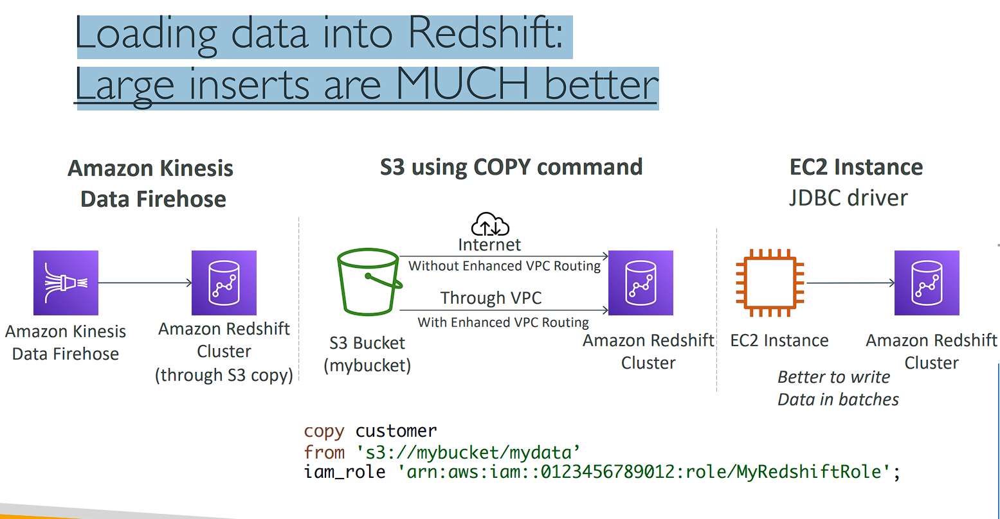

# Data & Analytics

# Amazon Athena


• Serverless query service to analyze data stored in Amazon S3
• Uses standard SQL language to query the files (built on Presto)
• Supports CSV, JSON, ORC, Avro, and Parquet
• Pricing: $5.00 per TB of data scanned
• Commonly used with Amazon Quicksight for reporting/dashboards
• Use cases: Business intelligence / analytics / reporting, analyze & query VPC Flow Logs, ELB Logs, CloudTrail trails, etc...
• Exam Tip: analyze data in S3 using serverless SQL, use

# Amazon Athena – Performance Improvement

```
• Use columnar data for cost-savings (less scan) (Sử dụng dữ liệu dạng cột để tiết kiệm chi phí (ít quét hơn))
• Apache Parquet or ORC is recommended
• Huge performance improvement (Cải thiện hiệu suất đáng kể)
• Use Glue to convert your data to Parquet or ORC
• Compress data for smaller retrievals (truy xuất nhỏ hơn) (bzip2, gzip, lz4, snappy, zlip, zstd…)
• Partition (phân vùng) datasets in S3 for easy querying on virtual columns
    • s3://yourBucket/pathToTable /<PARTITION_COLUMN_NAME>=<VALUE> /<PARTITION_COLUMN_NAME>=<VALUE> /<PARTITION_COLUMN_NAME>=<VALUE> /etc…
    • Example: s3://athena-examples/flight/parquet/year=1991/month=1/day=1/
• Use larger files (> 128 MB) to minimize overhead (Sử dụng các tệp lớn hơn (> 128 MB) để giảm thiểu chi phí)
```

# Amazon Athena – Federated Query (truy vấn liên kết)


• Allows you to run SQL queries across data stored in relational, non-relational, object, and custom data sources (AWS or on-premises)
• Uses Data Source Connectors that run on AWS Lambda to run Federated Queries (e.g., CloudWatch Logs, DynamoDB, RDS, …)
• Store the results back in Amazon S3

# Athena - Hands On


(Athena => Edit setting => Manage => Location of query result: "s3://viettu-demo-athena" (Create bucket => name: "viettu-demo-athena" => create bucket) => save )


Chạy câu lệnh tròng file athena-s3-access-log.sql


==> chú ý: data lằm ở folder S3

# Redshift Overview

• Redshift is based on PostgreSQL, but it’s not used for OLTP
• It’s OLAP – online analytical processing (analytics and data warehousing)
• 10x better performance than other data warehouses, scale to PBs of data
• Columnar storage of data (instead (thay vì hàng) of row based) & parallel (song song) query engine
• Pay as you go based on the instances provisioned
• Has a SQL interface for performing the queries
• BI tools such as Amazon Quicksight or Tableau integrate with it
• vs Athena: faster queries / joins / aggregations thanks to indexes

```
Amazon Redshift là một dịch vụ kho dữ liệu (data warehouse) được quản lý hoàn toàn, chuyên về phân tích và xử lý dữ liệu (OLAP - Online Analytical Processing). Dưới đây là giải thích chi tiết từng điểm chính:

1. Dựa trên PostgreSQL nhưng không dùng cho OLTP
- PostgreSQL: Redshift dựa trên kiến trúc của PostgreSQL, một hệ quản trị cơ sở dữ liệu mã nguồn mở rất phổ biến. Điều này có nghĩa là cú pháp SQL của Redshift rất giống với PostgreSQL, giúp người dùng có thể dễ dàng làm quen nếu đã sử dụng PostgreSQL trước đó.
- Không dùng cho OLTP (Online Transaction Processing): Redshift không được thiết kế cho xử lý giao dịch trực tuyến, tức là không phù hợp với các ứng dụng thường xuyên thực hiện các thao tác thêm, xóa, hoặc cập nhật dữ liệu liên tục (như trong các hệ thống quản lý giao dịch).
2. OLAP (Online Analytical Processing) – Xử lý phân tích trực tuyến
- OLAP: Redshift được thiết kế cho phân tích dữ liệu lớn và kho dữ liệu. Điều này có nghĩa là nó phù hợp cho việc phân tích dữ liệu và tổng hợp báo cáo, với mục tiêu chủ yếu là cung cấp thông tin chi tiết về dữ liệu lớn thông qua các truy vấn phức tạp.
3. Hiệu suất cao hơn 10 lần so với các kho dữ liệu khác, mở rộng tới mức petabyte
- Hiệu suất cao: Redshift có thể đạt hiệu suất cao hơn đến 10 lần so với các hệ thống kho dữ liệu khác nhờ vào kiến trúc đặc thù, bao gồm lưu trữ cột và xử lý truy vấn song song.
- Mở rộng quy mô: Redshift có thể mở rộng quy mô để xử lý hàng petabyte dữ liệu, thích hợp cho các ứng dụng doanh nghiệp lớn cần xử lý và lưu trữ lượng dữ liệu khổng lồ.
4. Lưu trữ theo cột (Columnar Storage) và công cụ truy vấn song song
- Lưu trữ theo cột: Thay vì lưu trữ dữ liệu theo dòng (row-based), Redshift lưu trữ theo cột (column-based). Điều này giúp tối ưu hóa truy vấn trên các cột dữ liệu cụ thể, giảm khối lượng dữ liệu cần đọc và cải thiện tốc độ xử lý.
- Xử lý song song (MPP - Massively Parallel Processing): Redshift sử dụng nhiều nút xử lý để thực hiện các truy vấn song song, giúp giảm thời gian xử lý đối với các tập dữ liệu lớn.
5. Mô hình trả phí dựa trên phiên bản được provision
- Pay-as-you-go: Bạn trả tiền dựa trên các phiên bản (instances) mà bạn đã provision (tức là bạn chỉ trả cho tài nguyên mà bạn sử dụng). Điều này giúp tối ưu hóa chi phí tùy theo nhu cầu sử dụng của bạn.
6. Cung cấp giao diện SQL để thực hiện các truy vấn
- Redshift sử dụng giao diện SQL rất quen thuộc, giúp bạn có thể viết các truy vấn phức tạp để phân tích dữ liệu mà không cần học một ngôn ngữ mới.
7. Tích hợp với các công cụ BI (Business Intelligence) như Amazon Quicksight hoặc Tableau
- Redshift tích hợp dễ dàng với các công cụ BI phổ biến như Amazon Quicksight hoặc Tableau, cho phép người dùng tạo báo cáo và bảng điều khiển (dashboard) dựa trên dữ liệu được lưu trữ trong Redshift.
8. So sánh với Athena
- Redshift vs Athena: Amazon Athena là dịch vụ truy vấn SQL trên các tập dữ liệu trong S3 mà không cần phải thiết lập kho dữ liệu, nhưng Redshift vượt trội hơn khi cần thực hiện các truy vấn phức tạp, kết hợp (joins), và tổng hợp (aggregations) nhờ vào việc sử dụng các chỉ mục (indexes) để tăng tốc độ truy vấn.
### Tóm tắt
Amazon Redshift là một dịch vụ kho dữ liệu mạnh mẽ cho phép doanh nghiệp phân tích lượng dữ liệu lớn một cách hiệu quả với tốc độ nhanh, tích hợp tốt với các công cụ phân tích và BI. Nhờ vào các tính năng như lưu trữ cột và xử lý song song, nó giúp tối ưu hóa thời gian phản hồi của các truy vấn dữ liệu phức tạp, và có thể dễ dàng mở rộng để xử lý dữ liệu quy mô petabyte.
```

# Redshift Cluster


• Leader node: for query planning, results aggregation (• Nút dẫn đầu: để lập kế hoạch truy vấn, tổng hợp kết quả)
• Copute node: for performing the queries, send results to leader
• You provision the node size in advance
• You can used Reserved Instances for cost savings

# Redshift – Snapshots & DR


• Redshift has “Multi-AZ” mode for some clusters
• Snapshots are point-in-time backups of a cluster, stored internally in S3
• Snapshots are incremental (only what has changed is saved)
• You can restore a snapshot into a new cluster
• Automated: every 8 hours, every 5 GB, or on a schedule. Set retention between 1 to 35 days
• Manual: snapshot is retained (giữ lại) until you delete it
• You can configure Amazon Redshift to automatically copy snapshots (automated or manual) of a cluster to another AWS Region

```
Point-in-time snapshots trong Amazon Redshift là các bản sao lưu của một cụm cơ sở dữ liệu (cluster) tại một thời điểm cụ thể. Điều này có nghĩa là tại bất kỳ thời điểm nào, bạn có thể chụp một "ảnh chụp" (snapshot) của trạng thái hiện tại của cụm Redshift, bao gồm toàn bộ dữ liệu và cấu trúc của nó, để có thể phục hồi sau này nếu cần.

Dưới đây là giải thích chi tiết về các điểm quan trọng liên quan đến snapshots và tính năng phục hồi dữ liệu trong Redshift:

1. Snapshots là các bản sao lưu tại một thời điểm cụ thể
Một snapshot là bản sao của toàn bộ cụm cơ sở dữ liệu Redshift tại một thời điểm cụ thể, bao gồm cả dữ liệu và cấu trúc.
Point-in-time ở đây nghĩa là nếu bạn chụp snapshot vào lúc 10:00 sáng ngày hôm nay, thì nó sẽ chứa toàn bộ trạng thái của cụm cơ sở dữ liệu vào thời điểm đó. Nếu bạn phục hồi từ snapshot đó, bạn sẽ khôi phục cụm về đúng trạng thái tại thời điểm 10:00 sáng, với toàn bộ dữ liệu và thiết lập.
```

# Loading data into Redshift: Large inserts are MUCH better



# Redshift Spectrum


• Query data that is already in S3 without loading it (Truy vấn dữ liệu đã có trong S3 mà không cần tải nó)
• Must have a Redshift cluster available to start the query
• The query is then submitted to thousands of Redshift Spectrum nodes

# Amazon OpenSearch Service

• Amazon OpenSearch is successor (kết nghiệm) to Amazon ElasticSearch
• In DynamoDB, queries only exist by primary key or indexes…
• With OpenSearch, you can search any field, even partially matches (
65 / 5.000
Với OpenSearch, bạn có thể tìm kiếm bất kỳ trường nào, thậm chí là một phần khớp)
• It’s common to use OpenSearch as a complement to another database (Việc sử dụng OpenSearch như một phần bổ sung cho cơ sở dữ liệu khác là điều phổ biến)
• Two modes: managed cluster or serverless cluster
• Does not natively support SQL (can be enabled via a plugin)
• Ingestion from Kinesis Data Firehose, AWS IoT, and CloudWatch Logs (Thu thập dữ liệu từ Kinesis Data Firehose, AWS IoT và CloudWatch Logs)
• Security through Cognito & IAM, KMS encryption, TLS
• Comes with OpenSearch Dashboards (visualization)

# OpenSearch patterns DynamoDB


# OpenSearch patterns CloudWatch Logs


# OpenSearch patterns Kinesis Data Streams & Kinesis Data Firehose


# Amazon EMR

• EMR stands for “Elastic MapReduce”
• EMR helps creating Hadoop clusters (Big Data) to analyze and process vast amount of data (xử lý lượng dữ liệu khổng lồ)
• The clusters can be made of hundreds of EC2 instances
• EMR comes bundled (đi kèm) with Apache Spark, HBase, Presto, Flink…
• EMR takes care (đảm nhiệm) of all the provisioning and configuration
• Auto-scaling and integrated with Spot instances
• Use cases: data processing, machine learning, web indexing, big data…

# Amazon EMR – Node types & purchasing

```
• Master Node: Manage the cluster, coordinate (điều phối), manage health – long running
• Core Node: Run tasks and store data – long running
• Task Node (optional): Just to run tasks – usually Spot (Chỉ để chạy tác vụ – thường là Spot)
• Purchasing options:
    • On-demand: reliable, predictable, won’t be terminated
    • Reserved (min 1 year): cost savings (EMR will automatically use if available)
    • Spot Instances: cheaper, can be terminated, less reliable
• Can have long-running cluster, or transient (temporary) cluster (• Có thể có cụm chạy dài hoặc cụm tạm thời (tạm thời))
```

# Amazon QuickSight


• Serverless machine learning-powered business intelligence service to create interactive dashboards
• Fast, automatically scalable, embeddable, with per-session pricing
• Use cases:
• Business analytics
• Building visualizations
• Perform ad-hoc analysis
• Get business insights using data
• Integrated with RDS, Aurora, Athena, Redshift, S3…
• In-memory computation using SPICE engine if data is imported into QuickSight
• Enterprise edition: Possibility to setup Column-Level security (CLS)

# QuickSight Integrations


# QuickSight – Dashboard & Analysis

```
• Define Users (standard versions) and Groups (enterprise version)
    • These users & groups only exist within QuickSight, not IAM !!
• A dashboard…
    • is a read-only snapshot of an analysis that you can share
    • preserves (duy trì) the configuration of the analysis (filtering, parameters, controls, sort)
• You can share the analysis or the dashboard with Users or Groups
• To share a dashboard, you must first publish it
• Users who see the dashboard can also see the underlying data
```

# AWS Glue

• Managed extract, transform, and load (ETL) service (Dịch vụ trích xuất, chuyển đổi và tải được quản lý (ETL))
• Useful to prepare and transform data for analytics
• Fully serverless service


# AWS Glue – Convert data into Parquet format


# Glue Data Catalog: catalog of datasets


# Glue – things to know at a high-level

```
• Glue Job Bookmarks: prevent re-processing old data (Dấu trang Glue Job: ngăn chặn việc xử lý lại dữ liệu cũ)
• Glue Elastic Views:
    • Combine and replicate (nhân rộng) data across multiple data stores using SQL
    • No custom code, Glue monitors for changes in the source data, serverless
    • Leverages a “virtual table” (materialized view) ((chế độ xem thực thể))
• Glue DataBrew: clean and normalize data using pre-built transformation
• Glue Studio: new GUI to create, run and monitor ETL jobs in Glue
• Glue Streaming ETL (built on Apache Spark Structured Streaming): compatible with Kinesis Data Streaming, Kafka, MSK (managed Kafka)
```

# AWS Lake Formation

• Data lake = central place to have all your data for analytics purposes
• Fully managed service that makes it easy to setup a data lake in days
• Discover, cleanse, transform, and ingest data into your Data Lake
• It automates many complex manual steps (collecting, cleansing, moving, cataloging data, …) and de-duplicate (using ML Transforms)
• Combine structured and unstructured data in the data lake
• Out-of-the-box source blueprints: S3, RDS, Relational & NoSQL DB…
• Fine-grained Access Control for your applications (row and column-level)
• Built on top of AWS Glue

# AWS Lake Formation


# AWS Lake Formation Centralized Permissions Example


# Kinesis Data Analytics for SQL applications


# Kinesis Data Analytics (SQL application)

```
• Real-time analytics on Kinesis Data Streams & Firehose using SQL
• Add reference data from Amazon S3 to enrich streaming data (Thêm dữ liệu tham chiếu từ Amazon S3 để làm phong phú dữ liệu phát trực tuyến)
• Fully managed, no servers to provision
• Automatic scaling
• Pay for actual consumption rate (Trả theo mức tiêu thụ thực tế)
• Output:
    • Kinesis Data Streams: create streams out of the real-time analytics queries
    • Kinesis Data Firehose: send analytics query results to destinations
• Use cases:
    • Time-series analytics
    • Real-time dashboards
    • Real-time metrics
```

# Kinesis Data Analytics for Apache Flink

• Use Flink (Java, Scala or SQL) to process and analyze streaming data


```
• Run any Apache Flink application on a managed cluster on AWS
    • provisioning compute resources, parallel computation, automatic scaling
    • application backups (implemented as checkpoints and snapshots)
    • Use any Apache Flink programming features
    • Flink does not read from Firehose (use Kinesis Analytics for SQL instead)
```

# Kenesis Data Analytics - Hands On

# Amazon Managed Streaming for Apache Kafka (Amazon MSK)

```
• Alternative (thay thế) to Amazon Kinesis
• Fully managed Apache Kafka on AWS
    • Allow you to create, update, delete clusters
    • MSK creates & manages Kafka brokers nodes & Zookeeper nodes for you
    • Deploy the MSK cluster in your VPC, multi-AZ (up to 3 for HA)
    • Automatic recovery from common Apache Kafka failures
    • Data is stored on EBS volumes for as long as you want
• MSK Serverless
    • Run Apache Kafka on MSK without managing the capacity
    • MSK automatically provisions resources and scales compute & storage
```

# Apache Kafka at a high level


# Kinesis Data Streams vs. Amazon MSK

- Kinesis Data Streams:
  • 1 MB message size limit
  • Data Streams with Shards (Luồng dữ liệu với các phân đoạn)
  • Shard Splitting & Merging
  • TLS In-flight encryption
  • KMS at-rest encryption

- Amazon MSK:
  • 1MB default, configure for higher (ex: 10MB)
  • Kafka Topics with Partitions
  • Can only add partitions to a topic
  • PLAINTEXT or TLS In-flight Encryption
  • KMS at-rest encryption

# Amazon MSK Consumers


# Big Data Ingestion Pipeline (Đường ống thu thập dữ liệu lớn)

• We want the ingestion pipeline to be fully serverless
• We want to collect data in real time
• We want to transform the data
• We want to query the transformed data using SQL
• The reports created using the queries should be in S3
• We want to load that data into a warehouse and create dashboards

# Big Data Ingestion Pipeline


# Big Data Ingestion Pipeline discussion

• IoT Core allows you to harvest (thu thập) data from IoT devices
• Kinesis is great for real-time data collection
• Firehose helps with data delivery to S3 in near real-time (1 minute)
• Lambda can help Firehose with data transformations
• Amazon S3 can trigger notifications to SQS
• Lambda can subscribe to SQS (we could have connecter S3 to Lambda)
• Athena is a serverless SQL service and results are stored in S3
• The reporting bucket contains analyzed data and can be used by reporting tool such as AWS QuickSight, Redshift, etc…
