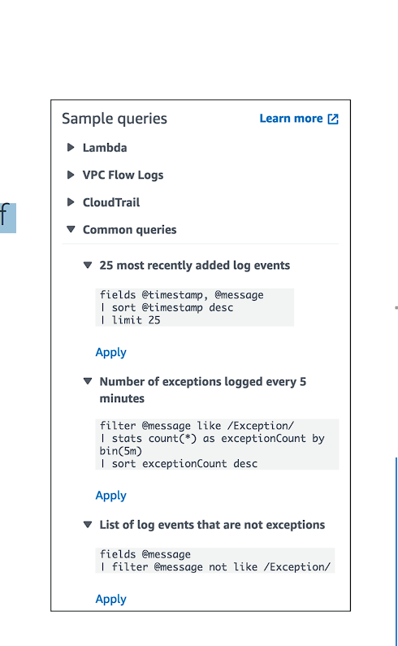
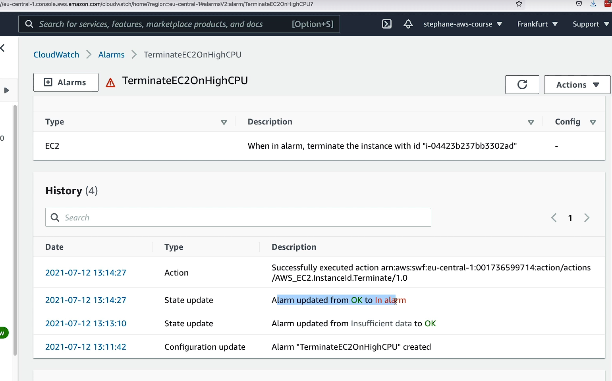
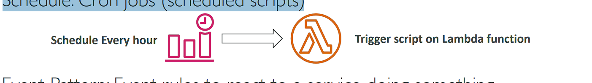
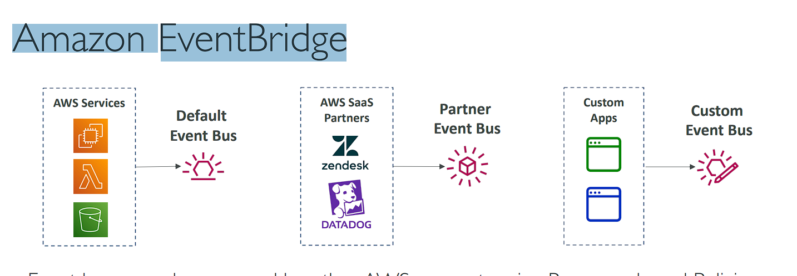

# AWS Monitoring, Audit and Performance

# Amazon CloudWatch Metrics

• CloudWatch provides metrics for every services in AWS
• Metric is a variable to monitor (CPUUtilization, NetworkIn…)
• Metrics belong to namespaces
• Dimension is an attribute of a metric (instance id, environment, etc…).
• Up to 30 dimensions per metric
• Metrics have timestamps
• Can create CloudWatch dashboards of metrics
• Can create CloudWatch Custom Metrics (for the RAM for example)

# CloudWatch Metric Streams


• Continually (liên tục) stream CloudWatch metrics to a destination of your choice, with near-real-time delivery and low latency.
• Amazon Kinesis Data Firehose (and then its destinations)
• 3rd party service provider: Datadog, Dynatrace, New Relic, Splunk, Sumo Logic…
• Option to filter metrics to only stream a subset of them

# CloudWatch Logs

```
• Log groups: arbitrary name, usually representing an application (Nhóm nhật ký: tên tùy ý, thường đại diện cho một ứng dụng)
• Log stream: instances within application / log files / containers
• Can define log expiration policies (never expire, 1 day to 10 years…)
• CloudWatch Logs can send logs to:
    • Amazon S3 (exports)
    • Kinesis Data Streams
    • Kinesis Data Firehose
    • AWS Lambda
    • OpenSearch
• Logs are encrypted by default
• Can setup KMS-based encryption with your own keys
```

# CloudWatch Logs - Sources

• SDK, CloudWatch Logs Agent, CloudWatch Unified Agent
• Elastic Beanstalk: collection of logs from application
• ECS: collection from containers
• AWS Lambda: collection from function logs
• VPC Flow Logs: VPC specific logs
• API Gateway
• CloudTrail based on filter
• Route53: Log DNS queries

# CloudWatch Logs Insights


# CloudWatch Logs Insights


• Search and analyze log data stored in CloudWatch Logs
• Example: find a specific IP inside a log, count occurrences of “ERROR” in your logs… (Ví dụ: tìm một địa chỉ IP cụ thể bên trong nhật ký, đếm số lần xuất hiện “ERROR” trong nhật ký của bạn…)
• Provides a purpose-built query language
• Automatically discovers fields from AWS services and JSON log events
• Fetch desired event fields, filter based on conditions, calculate aggregate statistics, sort events, limit number of events…
• Can save queries and add them to CloudWatch Dashboards
• Can query multiple Log Groups in different AWS accounts • It’s a query engine, not a real-time engine

# CloudWatch Logs – S3 Export


• Log data can take up to 12 hours to become available for export
• The API call is CreateExportTask
• Not near-real time or real-time… use Logs Subscriptions instead

# CloudWatch Logs Subscriptions

• Get a real-time log events from CloudWatch Logs for processing and analysis
• Send to Kinesis Data Streams, Kinesis Data Firehose, or Lambda
• Subscription Filter – filter which logs are events delivered to your destination


# CloudWatch Logs Aggregation Multi-Account & Multi Region


# CloudWatch Logs Subscriptions

• Cross-Account Subscription – send log events to resources in a different AWS account (KDS, KDF)


# CloudWatch Logs - Hands On

# CloudWatch Logs - Live tail - Hands On

# CloudWatch Logs for EC2


• By default, no logs from your EC2 machine will go to CloudWatch
• You need to run a CloudWatch agent on EC2 to push the log files you want
• Make sure IAM permissions are correct
• The CloudWatch log agent can be setup on-premises too

# CloudWatch Logs Agent & Unified Agent

```
• For virtual servers (EC2 instances, on-premises servers…)
• CloudWatch Logs Agent
    • Old version of the agent
    • Can only send to CloudWatch Logs
• CloudWatch Unified Agent
    • Collect additional system-level metrics such as RAM, processes, etc… (Thu thập các số liệu bổ sung ở cấp độ hệ thống như RAM, quy trình, v.v.)
    • Collect logs to send to CloudWatch Logs
    • Centralized configuration using SSM Parameter Store (Cấu hình tập trung sử dụng SSM Parameter Store)
```

# CloudWatch Unified Agent – Metrics

• Collected directly on your Linux server / EC2 instance
• CPU (active, guest, idle, system, user, steal)
• Disk metrics (free, used, total), Disk IO (writes, reads, bytes, iops)
• RAM (free, inactive, used, total, cached)
• Netstat (number of TCP and UDP connections, net packets, bytes)
• Processes (total, dead, bloqued, idle, running, sleep)
• Swap Space (free, used, used %)
• Reminder: out-of-the box metrics for EC2 – disk, CPU, network (high level) (Nhắc lại: số liệu thống kê sẵn có cho EC2 – đĩa, CPU, mạng (cấp cao))

# CloudWatch Alarms

```
• Alarms are used to trigger notifications for any metric
• Various options (sampling, %, max, min, etc…)
• Alarm States:
    • OK
    • INSUFFICIENT_DATA (KHÔNG ĐỦ DỮ LIỆU)
    • ALARM
• Period:
    • Length of time in seconds to evaluate the metric (Khoảng thời gian tính bằng giây để đánh giá số liệu)
    • High resolution custom metrics: 10 sec, 30 sec or multiples of 60 sec (Số liệu tùy chỉnh có độ phân giải cao: 10 giây, 30 giây hoặc bội số của 60 giây)
```

# CloudWatch Alarm Targets

• Stop, Terminate, Reboot, or Recover an EC2 Instance
• Trigger Auto Scaling Action
• Send notification to SNS (from which you can do pretty much anything)


# CloudWatch Alarms – Composite (tổng hợp) Alarms

• CloudWatch Alarms are on a single metric
• Composite Alarms are monitoring the states of multiple other alarms (Báo động tổng hợp đang theo dõi trạng thái của nhiều báo động khác)
• AND and OR conditions
• Helpful to reduce “alarm noise” by creating complex composite alarms (Hữu ích để giảm “tiếng ồn báo động” bằng cách tạo ra các báo động tổng hợp phức tạp)


# EC2 Instance Recovery

```
• Status Check:
    • Instance status = check the EC2 VM
    • System status = check the underlying hardware
```


• Recovery: Same Private, Public, Elastic IP, metadata, placement group

# CloudWatch Alarm: good to know

• Alarms can be created based on CloudWatch Logs Metrics Filters


• To test alarms and notifications, set the alarm state to Alarm using CLI aws cloudwatch set-alarm-state --alarm-name "myalarm" --state-value ALARM --state-reason "testing purposes"

# Cloudwatch Alarm - Hands On

(Launch EC2 instance)
(Create alarm => Select metric => EC2 => PerInstance Metrics => paste instance id vô => Chọn CPUUtilization => Select metric => Period: 5 minute => than: 95 => next => EC2 action: Add EC2 action => chọn terminate this instance => next => alarm name: "TerminateEC2OnHighCPU" => Create alarm)



# Amazon EventBridge (formerly CloudWatch Events)

• Schedule: Cron jobs (scheduled scripts)

• Event Pattern: Event rules to react to a service doing something

Trigger Lambda functions, send SQS/SNS messages…

# Amazon EventBridge Rules


# Amazon EventBridge



• Event buses can be accessed by other AWS accounts using Resource-based Policies
• You can archive events (all/filter) sent to an event bus (indefinitely or set period)
• Ability to replay archived events

# Amazon EventBridge – Schema Registry


• EventBridge can analyze the events in your bus and infer (suy ra) the schema
• The Schema Registry allows you to generate code for your application, that will know in advance how data is structured in the event bus
• Schema can be versioned

# Amazon EventBridge – Resource-based Policy

• Manage permissions for a specific Event Bus
• Example: allow/deny events from another AWS account or AWS region
• Use case: aggregate all events from your AWS Organization in a single AWS account or AWS region


# CloudWatch Container Insights


```
• Collect, aggregate, summarize metrics and logs from containers
• Available for containers on…
    • Amazon Elastic Container Service (Amazon ECS)
    • Amazon Elastic Kubernetes Services (Amazon EKS)
    • Kubernetes platforms on EC2
    • Fargate (both for ECS and EKS)
• In Amazon EKS and Kubernetes, CloudWatch Insights is using a containerized version of the CloudWatch Agent to discover containers
```

# CloudWatch Lambda Insights


• Monitoring and troubleshooting solution for serverless applications running on AWS Lambda
• Collects, aggregates, and summarizes system-level metrics including CPU time, memory, disk, and network
• Collects, aggregates, and summarizes diagnostic information such as cold starts and Lambda worker shutdowns
• Lambda Insights is provided as a Lambda Layer

# CloudWatch Contributor Insights


```
• Analyze log data and create time series that display contributor data.
    • See metrics about the top-N contributors
    • The total number of unique contributors, and their usage.
• This helps you find top talkers and understand who or what is impacting system performance.
• Works for any AWS-generated logs (VPC, DNS, etc..)
• For example, you can find bad hosts, identify the heaviest network users, or find the URLs that generate the most errors.
• You can build your rules from scratch, or you can also use sample rules that AWS has created – leverages your CloudWatch Logs
• CloudWatch also provides built-in rules that you can use to analyze metrics from other AWS services.
```

```
CloudWatch Contributor Insights là một tính năng của Amazon CloudWatch giúp phân tích dữ liệu log và tạo các chuỗi thời gian hiển thị dữ liệu về các "contributor" (tác nhân hoặc đối tượng gây ra sự kiện) trong hệ thống. Đây là công cụ hữu ích để theo dõi, phân tích các hành vi ảnh hưởng đến hiệu suất hệ thống, đặc biệt là trong các môi trường AWS có lưu lượng và log lớn.

@@@ Giải thích chi tiết:
1. Phân tích log data và tạo chuỗi thời gian: CloudWatch Contributor Insights giúp bạn phân tích dữ liệu log từ các nguồn khác nhau như VPC Flow Logs, AWS Lambda Logs, hoặc DNS logs. Từ dữ liệu log này, hệ thống sẽ tạo ra các chuỗi thời gian, hiển thị các tác nhân (contributors) và cách chúng ảnh hưởng đến hệ thống theo thời gian.

2. Xem các số liệu về "top-N" contributors: Contributor Insights có thể cung cấp cho bạn các số liệu về những contributor chính (các tác nhân chiếm nhiều tài nguyên hoặc tạo ra sự cố), chẳng hạn như top-N contributors. Đây là danh sách những đối tượng hàng đầu ảnh hưởng đến hệ thống, có thể là các địa chỉ IP, người dùng, hay ứng dụng tiêu tốn nhiều tài nguyên nhất.

3.  Số lượng unique contributors và mức sử dụng của chúng: Hệ thống cũng cung cấp thông tin về tổng số contributors duy nhất (ví dụ: số lượng các địa chỉ IP, người dùng, hoặc dịch vụ khác nhau) cùng với mức độ sử dụng tài nguyên của từng đối tượng đó.

4. Giúp phát hiện các tác nhân ảnh hưởng đến hiệu suất: Contributor Insights rất hữu ích khi bạn cần phát hiện các tác nhân ảnh hưởng lớn đến hiệu suất của hệ thống, như:

- Bad hosts: Các địa chỉ IP hoặc máy chủ gây lỗi hoặc tải nặng cho hệ thống.
- Heaviest network users: Các người dùng hoặc dịch vụ tiêu thụ nhiều băng thông hoặc tài nguyên mạng nhất.
- URLs gây ra nhiều lỗi nhất: Các đường dẫn URL trên ứng dụng của bạn có tỷ lệ lỗi cao nhất.
5. Hỗ trợ phân tích log từ nhiều dịch vụ AWS: Contributor Insights hoạt động trên bất kỳ log nào do AWS tạo ra như VPC Flow Logs, Route 53 DNS logs, hay các log của ứng dụng chạy trên EC2, Lambda, và các dịch vụ khác.

6. Xây dựng quy tắc (rules) tùy chỉnh hoặc dùng quy tắc mẫu: Bạn có thể tạo quy tắc từ đầu để giám sát và phân tích các log theo các tiêu chí riêng của mình, hoặc sử dụng các quy tắc mẫu do AWS cung cấp sẵn. Các quy tắc này giúp bạn dễ dàng bắt đầu phân tích log mà không cần thiết kế từ đầu.

7.  tắc tích hợp với các dịch vụ khác: CloudWatch Contributor Insights còn hỗ trợ các quy tắc tích hợp để bạn có thể phân tích và đo lường hiệu suất từ các dịch vụ khác của AWS, giúp dễ dàng quản lý nhiều dịch vụ trong hệ thống.

## Tóm tắt:
CloudWatch Contributor Insights cung cấp một công cụ mạnh mẽ để theo dõi và phân tích các log từ nhiều dịch vụ AWS, giúp phát hiện ra các đối tượng ảnh hưởng đến hiệu suất hệ thống. Nó giúp tìm ra các "top contributors" ảnh hưởng xấu đến hệ thống, từ đó tối ưu hóa và cải thiện hiệu suất tổng thể.
```

# CloudWatch Application Insights

• Provides automated dashboards that show potential problems with monitored applications, to help isolate ongoing issues (Cung cấp bảng thông tin tự động hiển thị các vấn đề tiềm ẩn với các ứng dụng được giám sát, giúp cô lập các vấn đề đang diễn ra)
• Your applications run on Amazon EC2 Instances with select technologies only(Java, .NET, Microsoft IIS Web Server, databases…)
• And you can use other AWS resources such as Amazon EBS, RDS, ELB, ASG, Lambda, SQS, DynamoDB, S3 bucket, ECS, EKS, SNS, API Gateway…
• Powered by SageMaker
• Enhanced visibility into your application health to reduce the time it will take you to troubleshoot and repair your applications (Tăng cường khả năng hiển thị tình trạng ứng dụng của bạn để giảm thời gian khắc phục sự cố và sửa chữa ứng dụng của bạn)
• Findings and alerts are sent to Amazon EventBridge and SSM OpsCenter

# CloudWatch Insights and Operational Visibility

```
• CloudWatch Container Insights
    • ECS, EKS, Kubernetes on EC2, Fargate, needs agent for Kubernetes
    • Metrics and logs
• CloudWatch Lambda Insights
    • Detailed metrics to troubleshoot serverless applications
• CloudWatch Contributors Insights
    • Find “Top-N” Contributors through CloudWatch Logs
• CloudWatch Application Insights
    • Automatic dashboard to troubleshoot your application and related AWS services
```

# AWS CloudTrail

```
• Provides governance, compliance and audit for your AWS Account (Cung cấp khả năng quản trị, tuân thủ và kiểm toán cho Tài khoản AWS của bạn)
• CloudTrail is enabled by default!
• Get an history of events / API calls made within your AWS Account by:
    • Console
    • SDK
    • CLI
    • AWS Services
• Can put logs from CloudTrail into CloudWatch Logs or S3
• A trail can be applied to All Regions (default) or a single Region.
• If a resource is deleted in AWS, investigate CloudTrail first! (Nếu một tài nguyên bị xóa trong AWS, trước tiên hãy điều tra CloudTrail!)
```

# CloudTrail Diagram


# CloudTrail Events

```
• Management Events:
    • Operations that are performed on resources in your AWS account
    • Examples:
        • Configuring security (IAM AttachRolePolicy)
        • Configuring rules for routing data (Amazon EC2 CreateSubnet)
        • Setting up logging (AWS CloudTrail CreateTrail)
    • By default, trails are configured to log management events.
    • Can separate Read Events (that don’t modify resources) from Write Events (that may modify resources)
• Data Events:
    • By default, data events are not logged (because high volume operations)
    • Amazon S3 object-level activity (ex: GetObject, DeleteObject, PutObject): can separate Read and Write Events
    • AWS Lambda function execution activity (the Invoke API)
• CloudTrail Insights Events:
    • See next slide
```

# CloudTrail Insights

```
• Enable CloudTrail Insights to detect unusual (bất thường) activity in your account:
    • inaccurate resource provisioning (cung cấp tài nguyên không chính xác)
    • hitting service limits (đạt đến giới hạn dịch vụ)
    • Bursts of AWS IAM actions (Các đợt hành động AWS IAM)
    • Gaps in periodic maintenance activity (Khoảng cách trong hoạt động bảo trì định kỳ)
• CloudTrail Insights analyzes normal management events to create a baseline
• And then continuously analyzes write events to detect unusual patterns
    • Anomalies appear in the CloudTrail console (Xuất hiện các điểm bất thường trong bảng điều khiển CloudTrail)
    • Event is sent to Amazon S3
    • An EventBridge event is generated (for automation needs)
```


# CloudTrail Events Retention

• Events are stored for 90 days in CloudTrail
• To keep events beyond (vượt ra) this period, log them to S3 and use Athena


# ClodTrail - hands on

# Amazon EventBridge – Intercept API Calls


# Amazon EventBridge + CloudTrail


# AWS Config

```
• Helps with auditing (hành động) and recording compliance of your AWS resources
• Helps record configurations and changes over time
• Questions that can be solved by AWS Config:
    • Is there unrestricted SSH access to my security groups? (Có quyền truy cập SSH không giới hạn vào nhóm bảo mật của tôi không?)
    • Do my buckets have any public access?
    • How has my ALB configuration changed over time?
• You can receive alerts (SNS notifications) for any changes
• AWS Config is a per-region service
• Can be aggregated across regions and accounts
• Possibility of storing the configuration data into S3 (analyzed by Athena)
```

# Config Rules

```
• Can use AWS managed config rules (over 75)
• Can make custom config rules (must be defined in AWS Lambda)
    • Ex: evaluate (đánh giá) if each EBS disk is of type gp2
    • Ex: evaluate if each EC2 instance is t2.micro
• Rules can be evaluated / triggered:
    • For each config change
    • And / or: at regular time intervals (theo các khoảng thời gian đều đặn)
• AWS Config Rules does not prevent (ngăn chặn) actions from happening (no deny)
• Pricing: no free tier, $0.003 per configuration item recorded per region,
$0.001 per config rule evaluation per region
```

# AWS Config Resource

• View compliance of a resource over time

• View configuration of a resource over time

• View CloudTrail API calls of a resource over time


# Config Rules – Remediations (biện pháp khắc phục)

```
• Automate remediation of non-compliant resources using SSM Automation Documents
• Use AWS-Managed Automation Documents or create custom Automation Documents
    • Tip: you can create custom Automation Documents that invokes Lambda function
• You can set Remediation Retries if the resource is still non-compliant after auto- remediation
```


# Config Rules – Notifications

• Use EventBridge to trigger notifications when AWS resources are noncompliant

• Ability to send configuration changes and compliance state notifications to SNS (all events – use SNS Filtering or filter at client-side)


# AWS Config - Hands On

(Config => Get started => )

# CloudWatch vs CloudTrail vs Config

```
• CloudWatch
    • Performance monitoring (metrics, CPU, network, etc…) & dashboards
    • Events & Alerting
    • Log Aggregation & Analysis
• CloudTrail
    • Record API calls made within your Account by everyone
    • Can define trails for specific resources
    • Global Service
• Config
    • Record configuration changes
    • Evaluate resources against compliance rules
    • Get timeline of changes and compliance
```

# For an Elastic Load Balancer

```
• CloudWatch:
    • Monitoring Incoming connections metric
    • Visualize error codes as % over time
    • Make a dashboard to get an idea of your load balancer performance
• Config:
    • Track security group rules for the Load Balancer
    • Track configuration changes for the Load Balancer
    • Ensure an SSL certificate is always assigned to the Load Balancer (compliance)
• CloudTrail:
    • Track who made any changes to the Load Balancer with API calls
```

# Câu hỏi 14:

A DevOps engineer is working for a company and managing its infrastructure and resources on AWS. There was a sudden spike in traffic for the main application for the company which was not normal in this period of the year. The application is hosted on a couple of EC2 instances in private subnets and is fronted by an Application Load Balancer in a public subnet. To detect if this is normal traffic or an attack, the DevOps engineer enabled the VPC Flow Logs for the subnets and stored those logs in CloudWatch Log Group. The DevOps wants to analyze those logs and find out the top IP addresses making requests against the website to check if there is an attack. Which of the following can help the DevOps engineer to analyze those logs?

Đáp án: CloudWatch Contributor Insights

# Câu hỏi 4:

You have made a configuration change and would like to evaluate the impact of it on the performance of your application. Which AWS service should you use?

Đáp án: Amazon CloudWatch

Giải thích: Amazon CloudWatch là dịch vụ giám sát cho phép bạn giám sát các ứng dụng của mình, phản hồi các thay đổi về hiệu suất trên toàn hệ thống, tối ưu hóa việc sử dụng tài nguyên và có được cái nhìn thống nhất về tình trạng hoạt động. Dịch vụ này được sử dụng để giám sát hiệu suất và số liệu của ứng dụng.

# Câu hỏi 8:

You are running a website on a fleet of EC2 instances with OS that has a known vulnerability on port 84. You want to continuously monitor your EC2 instances if they have port 84 exposed. How should you do this?

Đáp án: Setup Config Rules

Giải thích:

```
Đáp án: Setup Config Rule

### Lý do chọn:
- AWS Config là một dịch vụ theo dõi và đánh giá cấu hình tài nguyên của AWS. Bằng cách thiết lập Config Rule, bạn có thể liên tục giám sát các thay đổi cấu hình của các tài nguyên AWS, bao gồm cả việc phát hiện các cổng đang mở trên các EC2 instances.

## Lợi ích khi sử dụng Config Rule:

1. Theo dõi liên tục: Config Rule cho phép kiểm tra liên tục tình trạng của các security groups gắn với EC2 instances. Bạn có thể xác định một rule tùy chỉnh để kiểm tra xem cổng 84 có được mở hay không.

2. Tự động hóa và cảnh báo: Khi một rule bị vi phạm (ví dụ: cổng 84 mở), AWS Config sẽ tự động đánh dấu instance đó là "non-compliant" và có thể kích hoạt các hành động thông báo như SNS hoặc AWS Lambda để thực hiện biện pháp phòng ngừa.

3. Không yêu cầu sự can thiệp thủ công: Config Rule hoạt động tự động và liên tục, không cần phải chạy các script thủ công để kiểm tra tình trạng các cổng mạng.

4. Phát hiện theo thời gian thực: Bất kỳ khi nào có thay đổi liên quan đến cài đặt security group, Config Rule sẽ ngay lập tức phát hiện và thông báo nếu có vi phạm, đảm bảo phát hiện kịp thời các rủi ro bảo mật.

## Kết luận:
Sử dụng AWS Config Rule là giải pháp tốt nhất để liên tục giám sát các cổng bị lộ, bao gồm port 84. Nó cung cấp khả năng tự động phát hiện các thay đổi về cấu hình, giảm thiểu rủi ro bảo mật một cách nhanh chóng và hiệu quả.
```
