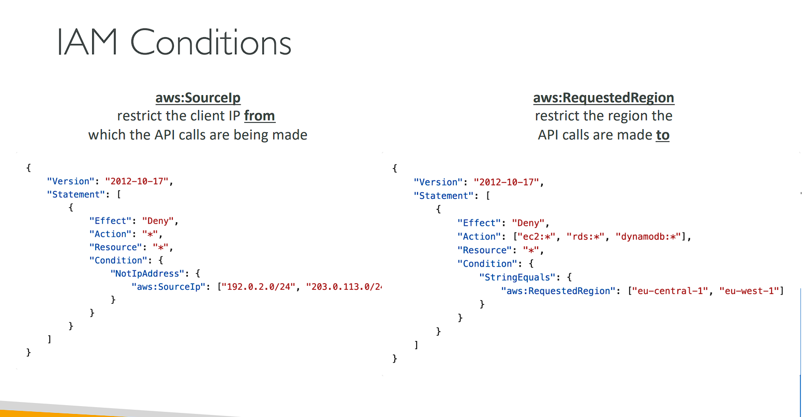

# Advanced Identity in AWS

# AWS Organizations

• Global service
• Allows to manage multiple AWS accounts
• The main account is the management account
• Other accounts are member accounts
• Member accounts can only be part of one organization
• Consolidated Billing across all accounts - single payment method (Thanh toán hợp nhất trên tất cả các tài khoản - phương thức thanh toán duy nhất)
• Pricing benefits from aggregated usage (volume discount for EC2, S3…) (Lợi ích về giá từ việc sử dụng tổng hợp)
• Shared reserved instances and Savings Plans discounts across accounts
• API is available to automate AWS account creation

```
AWS Organizations là một dịch vụ toàn cầu giúp quản lý và hợp nhất nhiều tài khoản AWS trong cùng một tổ chức. Đây là công cụ mạnh mẽ cho các doanh nghiệp và tổ chức lớn khi cần quản lý và kiểm soát tài nguyên trên nhiều tài khoản AWS một cách tập trung và hiệu quả.

## Giải thích chi tiết:
1. Dịch vụ toàn cầu (Global Service): AWS Organizations là một dịch vụ hoạt động trên phạm vi toàn cầu, cho phép bạn quản lý các tài khoản AWS trên các vùng khác nhau mà không bị giới hạn về địa lý.

2. Quản lý nhiều tài khoản AWS: AWS Organizations cho phép bạn quản lý nhiều tài khoản AWS trong cùng một tổ chức. Điều này hữu ích khi bạn có nhiều bộ phận, nhóm dự án hoặc môi trường sản xuất và phát triển tách biệt, mỗi môi trường sử dụng một tài khoản AWS riêng.

3. Tài khoản chính và tài khoản thành viên:

- Tài khoản chính (Management Account): Đây là tài khoản chính của tổ chức, có quyền quản lý toàn bộ các tài khoản thành viên khác. Tài khoản này chịu trách nhiệm thanh toán chung cho các tài khoản khác.
- Tài khoản thành viên (Member Accounts): Là các tài khoản phụ thuộc trong tổ chức. Các tài khoản này có thể hoạt động độc lập nhưng vẫn thuộc quyền kiểm soát của tài khoản quản lý. Một tài khoản thành viên chỉ có thể là thành viên của một tổ chức duy nhất.
4. Consolidated Billing (Thanh toán hợp nhất): AWS Organizations cung cấp tính năng thanh toán hợp nhất, giúp gom toàn bộ hóa đơn của các tài khoản thành viên lại thành một hóa đơn duy nhất. Điều này giúp đơn giản hóa quy trình thanh toán và quản lý chi phí.

5. Lợi ích về giá dựa trên tổng mức sử dụng: Khi sử dụng AWS Organizations, bạn có thể được hưởng lợi ích về giá dựa trên mức sử dụng tổng hợp từ tất cả các tài khoản. Các dịch vụ như EC2, S3 sẽ có mức chiết khấu tốt hơn khi sử dụng với số lượng lớn từ nhiều tài khoản.

6. Chia sẻ Reserved Instances và Savings Plans: Các tài khoản thành viên có thể chia sẻ các gói Reserved Instances và Savings Plans, giúp tối ưu hóa chi phí sử dụng tài nguyên AWS trên tất cả các tài khoản trong tổ chức. Điều này đặc biệt hữu ích nếu một số tài khoản không sử dụng hết tài nguyên đã dự trữ, tài khoản khác có thể tận dụng phần dư thừa.

7. API tự động hóa việc tạo tài khoản AWS: AWS Organizations cung cấp API để bạn có thể tự động hóa việc tạo các tài khoản AWS mới. Điều này rất tiện lợi khi bạn cần tạo ra nhiều tài khoản cho các dự án, môi trường khác nhau mà không cần phải thao tác thủ công.

## Tóm tắt:
AWS Organizations là một giải pháp quản lý và tối ưu hóa chi phí cho nhiều tài khoản AWS. Nó giúp đơn giản hóa việc thanh toán, quản lý và chia sẻ tài nguyên giữa các tài khoản, đồng thời cung cấp lợi ích về chi phí và khả năng tự động hóa mạnh mẽ.
```

# AWS Organizations


# Organizational Units (OU) - Examples


# AWS Organizations

```
• Advantages
    • Multi Account vs One Account Multi VPC
    • Use tagging standards for billing purposes
    • Enable CloudTrail on all accounts, send logs to central S3 account
    • Send CloudWatch Logs to central logging account
    • Establish Cross Account Roles for Admin purposes
• Security: Service Control Policies (SCP)
    • IAM policies applied to OU or Accounts to restrict Users and Roles
    • They do not apply to the management account (full admin power)
    • Must have an explicit allow from the root through each OU in the direct path to the target account (does not allow anything by default – like IAM) (Phải có lệnh cho phép rõ ràng từ gốc thông qua mỗi OU trong đường dẫn trực tiếp đến tài khoản đích (không cho phép bất kỳ thứ gì theo mặc định – như IAM))
```

# SCP Hierarchy


# SCP Examples Blocklist and Allowlist strategies


# Organization - Hands On

(AWS organizations => )

# IAM Conditions



# IAM Conditions


# IAM for S3


• s3:ListBucket permission applies to arn:aws:s3:::test
• => bucket level permission • s3:GetObject, s3:PutObject, s3:DeleteObject applies to arn:awn:s3:::test/\*
• => object level permission

# Resource Policies & aws:PrincipalOrgID

• aws:PrincipalOrgID can be used in any resource policies to restrict access to accounts that are member of an AWS Organization


# IAM Roles vs Resource Based Policies

```
• Cross account:
    • attaching a resource-based policy to a resource (example: S3 bucket policy)
    • OR using a role as a proxy
```

# IAM Roles vs Resource-Based Policies

• When you assume a role (user, application or service), you give up your original permissions and take the permissions assigned to the role
• When using a resource-based policy, the principal doesn’t have to give up his permissions
• Example: User in account A needs to scan a DynamoDB table in Account A and dump it in an S3 bucket in Account B.
• Supported by: Amazon S3 buckets, SNS topics, SQS queues, etc…
