# Amazon EC2 – Associate

# Private vs Public IP (IPv4)

```plaintext
• Networking has two sorts of IPs. IPv4 and IPv6:
    • IPv4: 1.160.10.240
    • IPv6: 3ffe:1900:4545:3:200:f8ff:fe21:67cf
• In this course, we will only be using IPv4.
• IPv4 is still the most common format used online.
• IPv6 is newer and solves problems for the Internet of Things (IoT).
• IPv4 allows for 3.7 billion different addresses in the public space
• IPv4: [0-255].[0-255].[0-255].[0-255].
```

# Private vs Public IP (IPv4) Example

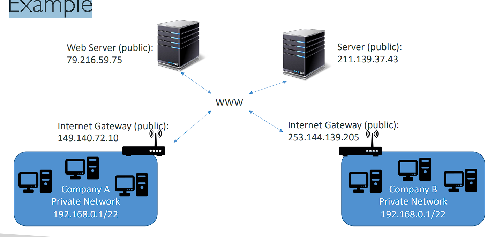

# Private vs Public IP (IPv4) Fundamental Differences

```plaintext
• Public IP:
    • Public IP means the machine can be identified on the internet (WWW) (machine xác định bên ngoài internet)
    • Must be unique across the whole web (not two machines can have the same public IP).
    • Can be geo-located easily (Có thể định vị địa lý dễ dàng)
• Private IP:
    • Private IP means the machine can only be identified on a private network only
    • The IP must be unique across the private network
    • BUT two different private networks (two companies) can have the same IPs.
    • Machines connect to WWW using a NAT + internet gateway (a proxy)
    • Only a specified range of IPs can be used as private IP
```

# Elastic IPs

- `When you stop and then start an EC2 instance, it can change its public IP.`
- If you need to have a fixed public IP for your instance, you need an Elastic IP
- An Elastic IP is a public IPv4 IP you own as long as you don’t delete it
- You can `attach it to one instance at a time`

- With an Elastic IP address, you can mask the failure of an instance or software by rapidly remapping the address to another instance in your account. (hiểm lôm na là nêu con ec2 đang gắn Elastic IP bị lỗi có thể swith EIP sang con EC2 đang hoạt động ổn)
- You can only have 5 Elastic IP in your account (you can ask AWS to increase that).
- Overall, try to avoid using Elastic IP: (Nhìn chung, hãy cố gắng tránh sử dụng Elastic IP:)
  • They often reflect poor architectural decisions (Chúng thường phản ánh các quyết định kiến ​​trúc kém)
  • Instead, use a random public IP and register a DNS name to it
  • Or, as we’ll see later, use a Load Balancer and don’t use a public IP

```
## Khuyến cáo:

- AWS khuyến cáo hạn chế sử dụng Elastic IP, vì chúng có thể phản ánh các quyết định kiến trúc chưa tối ưu.
- Thay vì sử dụng Elastic IP, bạn nên cân nhắc các giải pháp khác như:
    - Sử dụng IP công cộng ngẫu nhiên kết hợp với tên miền DNS để dễ dàng quản lý mà không cần cố định IP.
    - Sử dụng Load Balancer (bộ cân bằng tải) để phân phối lưu lượng mà không cần phải gán IP công cộng trực tiếp cho instance.
```

# Private vs Public IP (IPv4) In AWS EC2 – Hands On

```plaintext
• By default, your EC2 machine comes with:
    • A private IP for the internal AWS Network
    • A public IP, for the WWW.
• When we are doing SSH into our EC2 machines:
    • We can’t use a private IP, because we are not in the same network
    • We can only use the public IP.
• If your machine is stopped and then started, the public IP can change

(EC2 => Elatic IP => Allocate => create => Action => Associate EIP address => type: insatnce => chọn instance => chọn ip vừa tạo => associate)
```

# Placement Groups (nhóm vị trí)

```plaintext
• Sometimes you want control over the EC2 Instance placement strategy
• That strategy can be defined using placement groups
• When you create a placement group, you specify one of the following strategies for the group:
    • Cluster—clusters instances into a low-latency (độ trể thấp) group in a single Availability Zone
    • Spread—spreads (chải đều) instances across underlying (cơ bản) hardware (max 7 instances per group per AZ)
    • Partition—spreads instances across many different partitions (which rely on (dựa vào) different sets of racks (giá đỡ)) within an AZ. Scales to 100s of EC2 instances per group (Hadoop, Cassandra, Kafka)
```

```
## Placement Groups là gì?
Khi bạn tạo các EC2 instances trong AWS, bạn có thể cần kiểm soát cách chúng được phân bố trên hạ tầng của AWS (như các máy chủ vật lý). Placement Groups giúp bạn kiểm soát chiến lược này để đạt được các mục tiêu như tối ưu hiệu suất, giảm độ trễ, hoặc tăng tính khả dụng.

AWS cung cấp 3 chiến lược cho Placement Groups:

1. Cluster (Nhóm lại gần nhau):
- Cách hoạt động: Tất cả các EC2 instances trong nhóm này sẽ được đặt gần nhau trên cùng một vùng sẵn sàng (Availability Zone), thường trên cùng một máy chủ hoặc cùng một cụm máy chủ.
- Lợi ích: Độ trễ mạng giữa các instance rất thấp và băng thông mạng rất cao. Điều này rất phù hợp cho các ứng dụng cần kết nối nhanh và mạnh giữa các instance, ví dụ như các hệ thống tính toán hiệu năng cao (HPC).
- Nhược điểm: Nếu máy chủ (hoặc rack) chứa các instances gặp sự cố, tất cả các instances trong Cluster có thể bị ảnh hưởng.
- Ví dụ: Hệ thống giao dịch tài chính yêu cầu các instance trao đổi dữ liệu với độ trễ rất thấp.
```

```
## Rack là gì?
- Trong các trung tâm dữ liệu (datacenter), các máy chủ vật lý thường được đặt trong các tủ rack. Một rack là một khung chứa nhiều máy chủ vật lý (servers), thiết bị mạng, và các thiết bị lưu trữ. Các máy chủ trong cùng một rack sẽ chia sẻ nguồn điện và mạng kết nối nội bộ, giúp giao tiếp nhanh hơn giữa các máy chủ.

- Nếu một rack gặp sự cố (ví dụ như mất điện hoặc hỏng phần cứng), tất cả các máy chủ trong rack đó sẽ bị ảnh hưởng. Do đó, phân tán các EC2 instances qua nhiều rack khác nhau giúp tăng tính sẵn sàng và giảm nguy cơ gián đoạn.

## Sự khác biệt giữa chiến lược Spread và Partition
1. Spread (Phân tán đều)
- Cách hoạt động: EC2 instances được phân tán đều trên các rack khác nhau trong cùng một vùng sẵn sàng (Availability Zone).

- Số lượng giới hạn: Mỗi nhóm Spread chỉ được chứa tối đa 7 instances trong mỗi vùng sẵn sàng.

- Lợi ích: Nếu một rack gặp sự cố, các instance khác vẫn hoạt động bình thường vì chúng được đặt trên các rack khác nhau. Điều này giúp tăng độ tin cậy cho ứng dụng của bạn.

- Ví dụ: Giả sử bạn có 3 instance chạy dịch vụ quan trọng. Bạn đặt chúng vào một Spread Group. AWS sẽ đảm bảo rằng 3 instance này sẽ nằm trên 3 rack khác nhau, để nếu một rack gặp sự cố, chỉ một instance bị ảnh hưởng.

2. Partition (Phân vùng)
- Cách hoạt động: EC2 instances được phân chia thành các phân vùng (partition). Mỗi phân vùng sẽ được đặt trên một nhóm rack khác nhau và các instance trong một phân vùng sẽ chia sẻ chung các rack.

- Khả năng mở rộng: Một Partition Group có thể hỗ trợ hàng trăm instances, không giới hạn như Spread.

- Lợi ích: Partition giúp bạn quản lý và kiểm soát tốt hơn việc phân bổ instance trong các hệ thống lớn và phức tạp. Nếu một phân vùng (partition) gặp sự cố, các phân vùng khác vẫn hoạt động bình thường, đảm bảo khả năng chịu lỗi tốt hơn.

- Ví dụ: Giả sử bạn có một hệ thống lớn chạy Hadoop với 200 instance. Bạn có thể chia hệ thống này thành nhiều phân vùng, mỗi phân vùng chạy trên các rack khác nhau. Khi một phân vùng gặp sự cố, hệ thống vẫn có thể tiếp tục hoạt động nhờ vào các phân vùng còn lại.

## Điểm khác biệt chính:
- Spread: Chỉ cho phép tối đa 7 instances và phân tán chúng trên các rack khác nhau để tối ưu tính sẵn sàng và giảm rủi ro. Phù hợp cho các ứng dụng nhỏ và yêu cầu độ tin cậy cao.
- Partition: Có thể chứa hàng trăm instances và chia thành nhiều phân vùng, mỗi phân vùng sử dụng các rack khác nhau. Phù hợp cho các hệ thống lớn, phân tán, cần khả năng quản lý và chịu lỗi tốt hơn.
## Tóm lại:
- Spread: Được thiết kế cho các hệ thống nhỏ với số lượng instance giới hạn, yêu cầu độ tin cậy cao bằng cách phân tán instance trên các rack khác nhau.
- Partition: Được thiết kế cho các hệ thống lớn với nhiều instance, có thể phân chia thành nhiều phân vùng để tăng khả năng quản lý và chịu lỗi.

==> Bạn có thể hình dung Spread như phân tán mỗi instance trên một rack khác nhau, còn Partition thì tạo nhiều nhóm (partition), mỗi nhóm có thể chứa nhiều instance và các nhóm này phân tán trên nhiều rack khác nhau.
```

## Cluster

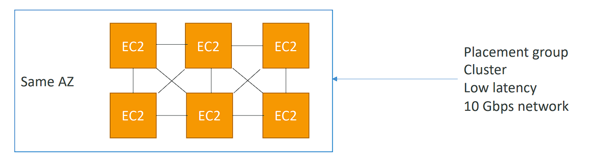

```plaintext
• Pros (ưu điểm): Great network (10 Gbps bandwidth between instances with Enhanced
Networking enabled - recommended)
• Cons (nhược điểm): If the AZ fails, all instances fails at the same time
• Use case:
    • Big Data job that needs to complete fast
    • Application that needs extremely low latency and high network throughput
```

```
Cluster Placement Group là một chiến lược trong AWS EC2 cho phép bạn nhóm các instance lại với nhau trên cùng một vùng sẵn sàng (Availability Zone) để tối ưu hóa hiệu suất mạng giữa chúng. Dưới đây là chi tiết:

## Ưu điểm (Pros):
- Hiệu suất mạng tuyệt vời: Khi các instance được nhóm lại trong một Cluster Placement Group và bật tính năng Enhanced Networking, chúng có thể đạt được băng thông mạng lên tới 10 Gbps giữa các instance.
- Độ trễ thấp: Việc đặt các instance gần nhau giúp giảm thiểu độ trễ trong việc trao đổi dữ liệu, rất phù hợp cho các ứng dụng yêu cầu kết nối nhanh và băng thông cao giữa các máy chủ.
## Nhược điểm (Cons):
- Phụ thuộc vào vùng sẵn sàng (AZ): Tất cả các instance trong một Cluster Placement Group đều nằm trong cùng một vùng sẵn sàng (AZ). Nếu vùng này gặp sự cố, tất cả các instance trong Cluster sẽ bị ảnh hưởng và ngừng hoạt động.
##  Use case (Trường hợp sử dụng):
1. Big Data jobs: Các tác vụ xử lý dữ liệu lớn cần hoàn thành nhanh chóng. Việc sử dụng Cluster Placement Group sẽ giúp các máy chủ trao đổi dữ liệu với nhau nhanh hơn, giúp tăng tốc độ xử lý dữ liệu.

2. Ứng dụng yêu cầu độ trễ cực thấp: Các ứng dụng cần độ trễ thấp và băng thông mạng cao giữa các máy chủ như hệ thống tài chính hoặc siêu máy tính (HPC). Cluster Placement Group đảm bảo rằng các instance sẽ có kết nối nhanh nhất có thể.

## Kết luận:
Cluster Placement Group là lựa chọn tốt cho các ứng dụng yêu cầu hiệu suất mạng tối đa và độ trễ cực thấp, nhưng nó cũng có rủi ro nếu vùng sẵn sàng gặp sự cố.
```

## Spread

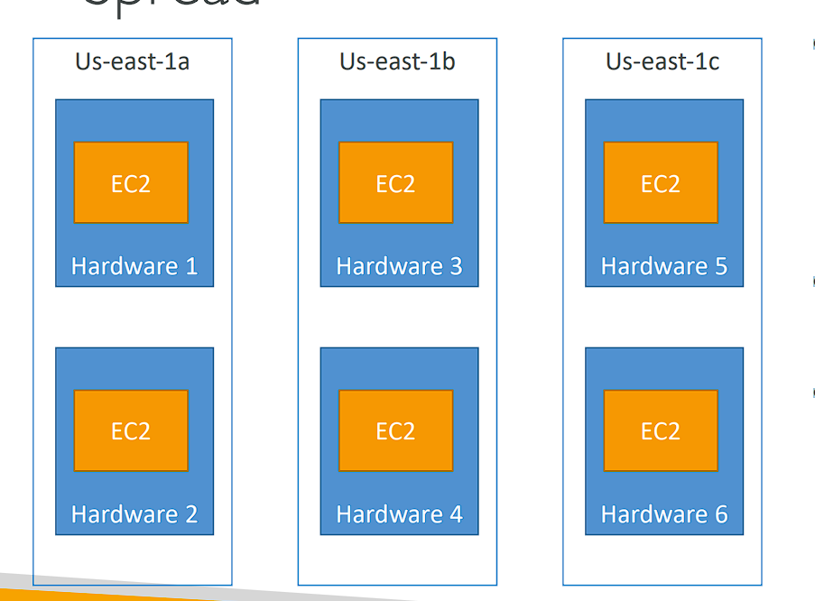

```plaintext
• Pros:
    • Can span across Availability Zones (AZ)
    • Reduced risk is simultaneous (đồng thời) failure
    • EC2 Instances are on different physical hardware
• Cons:
    • Limited to 7 instances per AZ per placement group
• Use case:
    • Application that needs to maximize high availability
    • Critical (quan trọng) Applications where each instance must be isolated from failure from each other (• Các ứng dụng quan trọng trong đó mỗi trường hợp phải được cách ly khỏi lỗi của nhau)
```

```plaintext
Spread Placement Group là một chiến lược phân bổ EC2 instances trong AWS nhằm tối đa hóa tính sẵn sàng và giảm thiểu rủi ro gián đoạn bằng cách phân tán các instance trên nhiều phần cứng khác nhau và thậm chí trên nhiều Availability Zones (AZs).

## Ưu điểm (Pros):
1. Có thể trải rộng qua nhiều vùng sẵn sàng (AZs): Spread Placement Group cho phép bạn phân tán các instance không chỉ trên nhiều phần cứng khác nhau mà còn qua nhiều vùng sẵn sàng. Điều này giúp tăng tính sẵn sàng và khả năng chịu lỗi cho ứng dụng.

2. Giảm thiểu rủi ro sự cố đồng thời: Do các instance được phân tán trên phần cứng vật lý khác nhau, nếu một máy chủ hoặc rack gặp sự cố, các instance khác sẽ không bị ảnh hưởng. Điều này làm giảm nguy cơ toàn bộ hệ thống gặp sự cố đồng thời.

3. Instance chạy trên các phần cứng khác nhau: Mỗi instance trong Spread Placement Group sẽ chạy trên một máy chủ vật lý khác nhau, đảm bảo rằng không có hai instance nào bị phụ thuộc vào cùng một phần cứng.

## Nhược điểm (Cons):
1. Giới hạn số lượng: Spread Placement Group bị giới hạn tối đa 7 instances trên mỗi vùng sẵn sàng (AZ). Nếu bạn cần nhiều hơn 7 instance trong một AZ, bạn phải tạo thêm các nhóm Spread Placement khác.
## Use case (Trường hợp sử dụng):
1. Ứng dụng cần tính sẵn sàng cao: Spread Placement Group rất phù hợp cho các ứng dụng yêu cầu tính sẵn sàng cao, đảm bảo rằng các instance sẽ không bị gián đoạn đồng thời do lỗi phần cứng hoặc vùng sẵn sàng.

2. Ứng dụng quan trọng cần cách ly từng instance: Đối với các ứng dụng quan trọng, nơi mỗi instance phải được cách ly khỏi các lỗi của các instance khác, Spread Placement Group là lựa chọn lý tưởng. Nếu một instance gặp sự cố, các instance khác vẫn tiếp tục hoạt động mà không bị ảnh hưởng.

##  Kết luận:
Spread Placement Group tối ưu cho các ứng dụng yêu cầu tính sẵn sàng cao và cách ly lỗi giữa các instance. Tuy nhiên, nó có giới hạn về số lượng instance trong mỗi AZ, phù hợp cho các ứng dụng vừa và nhỏ cần đảm bảo rằng các instance không bị ảnh hưởng bởi cùng một sự cố phần cứng.
```

## Partition

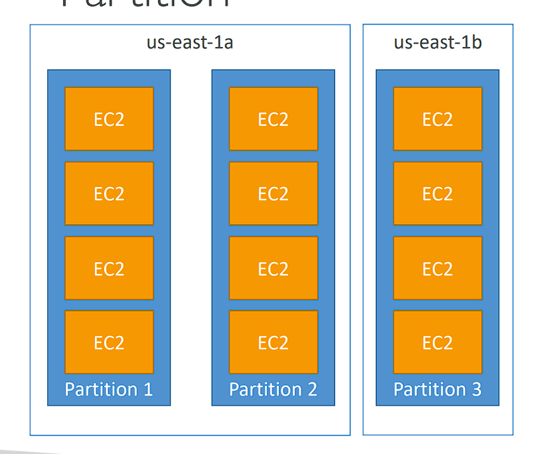

• Up to 7 partitions per AZ
• Can span across multiple AZs in the same region
• Up to 100s of EC2 instances
• The instances in a partition do not share racks with the instances in the other partitions
• A partition failure can affect many EC2 but won’t affect other partitions
• EC2 instances get access to the partition information as metadata
• Use cases: HDFS, HBase, Cassandra, Kafka

```
Partition Placement Group là một chiến lược phân bổ các EC2 instances trong AWS giúp phân tán các instance thành nhiều phân vùng (partitions), với mỗi phân vùng sử dụng các rack khác nhau để tăng khả năng chịu lỗi và mở rộng quy mô hệ thống. Dưới đây là chi tiết:

## Cách hoạt động:
- Phân vùng (Partition): Mỗi partition chứa một số lượng lớn các EC2 instances và được phân bổ trên các rack vật lý khác nhau. Các partition không chia sẻ rack với nhau, nghĩa là nếu một partition gặp sự cố phần cứng, chỉ các instance trong partition đó bị ảnh hưởng, các partition khác vẫn tiếp tục hoạt động bình thường.

- Số lượng phân vùng: Có thể tạo tối đa 7 partitions trên mỗi Availability Zone (AZ).

- Quy mô lớn: Partition Placement Group có thể chứa hàng trăm EC2 instances, phù hợp với các hệ thống lớn cần mở rộng quy mô.

- Trải rộng qua nhiều AZ: Partition Placement Group có thể trải rộng qua nhiều Availability Zones trong cùng một khu vực (region), giúp tăng khả năng chịu lỗi ở cấp độ vùng sẵn sàng.

- Metadata partition: Các instance trong Partition Placement Group có thể truy cập thông tin phân vùng thông qua metadata, giúp ứng dụng biết được instance đang chạy trong phân vùng nào.

## Ưu điểm (Pros):
1. Phân tán theo phân vùng: Mỗi partition được phân tán trên các rack khác nhau. Điều này giúp giảm thiểu rủi ro sự cố đồng thời khi một partition gặp sự cố, các partition khác không bị ảnh hưởng.

2. Quy mô lớn: Partition Placement Group hỗ trợ hàng trăm instance, lý tưởng cho các hệ thống phân tán lớn như Cassandra, Hadoop, Kafka, nơi cần quản lý nhiều instance cùng lúc.

3. Tăng khả năng chịu lỗi: Khi một partition gặp sự cố, chỉ các instance trong partition đó bị ảnh hưởng, các partition khác vẫn hoạt động bình thường, giúp tăng khả năng chịu lỗi.

## Nhược điểm (Cons):
- Partition failure: Nếu một partition gặp sự cố, nhiều instance trong partition đó có thể bị ảnh hưởng cùng lúc, mặc dù các partition khác không bị ảnh hưởng.
## Use case (Trường hợp sử dụng):
- HDFS, HBase, Cassandra, Kafka: Các hệ thống phân tán lớn như Hadoop Distributed File System (HDFS), HBase, Cassandra, và Kafka là những ứng dụng lý tưởng cho Partition Placement Group. Chúng cần sự phân tán dữ liệu, xử lý quy mô lớn và khả năng chịu lỗi tốt.

## Kết luận:
Partition Placement Group phù hợp cho các hệ thống phân tán lớn yêu cầu quy mô cao và khả năng chịu lỗi tốt. Nó cho phép phân tán các instance thành nhiều phân vùng độc lập để giảm rủi ro gián đoạn. Mặc dù một partition gặp sự cố có thể ảnh hưởng đến nhiều instance, các partition khác sẽ không bị ảnh hưởng, đảm bảo hệ thống tiếp tục hoạt động.
```

## EC2 Placement Groups hand on

(EC2 => Placement Groups => create => name: my-high-performance-group => strategy: Cluster => create group)
(create placement group => name: my-critical-group => strategy: Spread => sparead level: Rack => create group)
(create => name: "my-distributed-group" => strategy: Partition => number of partitios: 4 => create)
(Ec2 => Instance => launch => Advanced details => Placement group name: chọn một cái (trong 3 cái đã tạo))

# Elastic Network Interfaces (ENI)

(ENI giúp EC2 truy cập vào mạng)
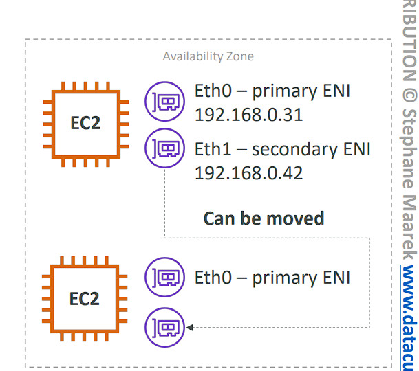
(Elastic Network Interface (ENI) là một thành phần logic trong VPC (Virtual Private Cloud), đại diện cho một card mạng ảo trên AWS. Nó được sử dụng để quản lý mạng cho các EC2 instance và cung cấp khả năng linh hoạt trong việc cấu hình, di chuyển, và quản lý mạng.)

```plaintext
• Logical component in a VPC that represents a virtual network card
• The ENI can have the following attributes:
    • Primary private IPv4, one or more secondary IPv4
    • One Elastic IP (IPv4) per private IPv4
    • One Public IPv4
    • One or more security groups
    • A MAC address
• You can create ENI independently (độc lập) and attach them on the fly (nhanh chóng) (move them) on EC2 instances for failover
• Bound (giới hạn) to a specific availability zone (AZ)
```

```
Elastic Network Interface (ENI) là một thành phần mạng ảo trong AWS VPC, đại diện cho một card mạng ảo được gắn vào các EC2 instances. ENI giúp quản lý các thuộc tính mạng cho các EC2 instances, và có thể được di chuyển giữa các instance để tăng tính sẵn sàng.

## Các thuộc tính chính của ENI:
1. Primary private IPv4: Địa chỉ IP riêng chính được gán cho ENI, sử dụng để liên lạc trong mạng nội bộ của VPC.
2. Secondary IPv4: ENI có thể có nhiều địa chỉ IP phụ (secondary IPv4), giúp mở rộng khả năng mạng của instance.
3. Elastic IP: Mỗi địa chỉ IPv4 riêng có thể được ánh xạ với một địa chỉ Elastic IP (địa chỉ IP tĩnh công cộng).
4. Public IPv4: ENI cũng có thể được gán một địa chỉ IP công cộng (Public IPv4).
5. Security Groups: Mỗi ENI có thể được gán với một hoặc nhiều nhóm bảo mật để kiểm soát quyền truy cập vào instance.
6. MAC Address: ENI cũng có một địa chỉ MAC tương tự như một card mạng vật lý.
## Tính năng và lợi ích:
1. Tạo và di chuyển độc lập: ENI có thể được tạo độc lập và sau đó gắn vào hoặc di chuyển giữa các EC2 instances một cách dễ dàng. Điều này giúp cung cấp tính linh hoạt khi cần thay đổi cấu hình mạng hoặc chuyển sang instance khác trong trường hợp failover (khi một instance gặp sự cố).

2. Gắn liền với Availability Zone (AZ): Mỗi ENI được gắn liền với một vùng sẵn sàng (AZ) cụ thể. Bạn không thể di chuyển ENI giữa các vùng sẵn sàng khác nhau, nhưng có thể chuyển nó giữa các instance trong cùng một AZ.

## Ứng dụng thực tiễn:
- Failover và khôi phục: ENI có thể được di chuyển từ một instance gặp sự cố sang một instance khác trong cùng một AZ, giúp khôi phục dịch vụ một cách nhanh chóng mà không cần thay đổi cấu hình mạng.
- Bảo mật mạng: Bằng cách sử dụng nhiều security groups, ENI có thể cung cấp khả năng bảo mật linh hoạt và kiểm soát quyền truy cập mạng dựa trên cấu hình cụ thể.
## Kết luận:
Elastic Network Interface (ENI) là một công cụ mạng mạnh mẽ, cho phép linh hoạt trong việc quản lý và bảo mật mạng của các EC2 instances. ENI có thể được gắn độc lập và di chuyển để cung cấp khả năng chuyển đổi dự phòng (failover) một cách nhanh chóng, giúp tăng tính sẵn sàng của hệ thống mạng trong AWS.
```

```
Elastic Network Interface (ENI) trong Amazon Web Services (AWS) là một giao diện mạng ảo trong VPC (Virtual Private Cloud), đóng vai trò quan trọng trong việc quản lý và tối ưu hóa mạng cho các phiên bản EC2. Để làm rõ hơn, dưới đây là tác dụng chính của ENI cùng ví dụ minh họa:

## Tác dụng của ENI
1. Tách biệt giữa giao diện mạng và EC2 instance:

- Mỗi EC2 instance luôn cần ít nhất một ENI để kết nối vào mạng.
- ENI có thể được tạo độc lập và gắn vào hoặc tháo ra khỏi một instance EC2. Điều này giúp quản lý giao diện mạng dễ dàng hơn vì chúng ta có thể di chuyển ENI từ instance này sang instance khác mà không bị gián đoạn quá trình kết nối mạng.
2. Đa giao diện mạng trên một EC2 instance:

- ENI cho phép một EC2 instance có nhiều giao diện mạng. Điều này hữu ích nếu bạn muốn instance của mình kết nối với nhiều mạng khác nhau, chẳng hạn như một mạng công khai và một mạng riêng biệt.
3. Cung cấp khả năng dự phòng và phục hồi nhanh:

- ENI hỗ trợ failover: Trong trường hợp một instance EC2 gặp sự cố, bạn có thể tách ENI ra và gắn vào một instance EC2 khác. Các cấu hình mạng (địa chỉ IP, security group) vẫn được giữ nguyên, giúp dịch vụ hoạt động trở lại một cách nhanh chóng mà không cần thay đổi thiết lập mạng.

4. Địa chỉ IP cố định:

- ENI có thể gắn Elastic IP (EIP), một địa chỉ IP cố định. Điều này giúp các dịch vụ trên instance EC2 luôn có một địa chỉ IP tĩnh, dù instance có thay đổi hay không.
5. Tăng cường bảo mật với Security Groups:

Mỗi ENI có thể liên kết với một hoặc nhiều Security Groups, giúp kiểm soát lưu lượng vào/ra của EC2 instance. Điều này giúp tăng cường bảo mật cho các ứng dụng chạy trên EC2.

## Ví dụ minh họa
### Ví dụ 1: Hệ thống chịu lỗi (Failover)
Giả sử bạn có một dịch vụ web chạy trên EC2 instance trong vùng us-east-1a, và bạn muốn bảo đảm rằng nếu instance gặp sự cố, dịch vụ của bạn vẫn hoạt động.

- Bạn tạo một ENI với địa chỉ IP riêng (private IP) và một Elastic IP (EIP) liên kết với nó.
- Dịch vụ web của bạn sử dụng ENI này để nhận lưu lượng truy cập từ người dùng.
- Nếu EC2 instance gặp sự cố và ngừng hoạt động, bạn có thể tách ENI khỏi instance đó và gắn vào một instance EC2 mới trong cùng vùng us-east-1a.
- Kết quả: Dịch vụ của bạn không bị gián đoạn, người dùng vẫn có thể truy cập thông qua Elastic IP, và bạn không cần cấu hình lại các thông số mạng.

### Ví dụ 2: Đa giao diện mạng
Bạn có một ứng dụng yêu cầu kết nối với hai mạng:

- Một mạng công khai để giao tiếp với người dùng bên ngoài (internet),

- Một mạng riêng để giao tiếp với các cơ sở dữ liệu nội bộ.

- Bạn có thể tạo hai ENI:

    - Một ENI với Elastic IP để kết nối ra internet.
    - Một ENI khác chỉ có Private IP để kết nối với mạng nội bộ.
- Gắn cả hai ENI vào một EC2 instance.

- Kết quả: Ứng dụng trên EC2 instance có thể giao tiếp đồng thời với cả mạng internet và mạng riêng, giúp dễ dàng tách biệt lưu lượng và bảo mật mạng nội bộ.

## Tóm lại:
- ENI rất quan trọng khi bạn cần linh hoạt, dự phòng mạng, và tách biệt cấu hình mạng giữa các ứng dụng hoặc mạng khác nhau. Nó cho phép dễ dàng quản lý và duy trì các dịch vụ mạng mà không phụ thuộc vào việc khởi tạo lại hay cấu hình lại các EC2 instance.
```

## ENI - Hands On

(EC2 => launch => os: amazon linux => network -> subnet: `ap-southeast-1b` => number of instance: 2 => launch instance)
Mặc định khi tạo EC2 sẽ có một ENI:


(EC2 => Network interface => create a new interface => description: "DemoENI" => Subnet: `ap-southeast-1b` => sg: default => create => action => attach => chọn bất kỳ một trong ec2 instance => attach )
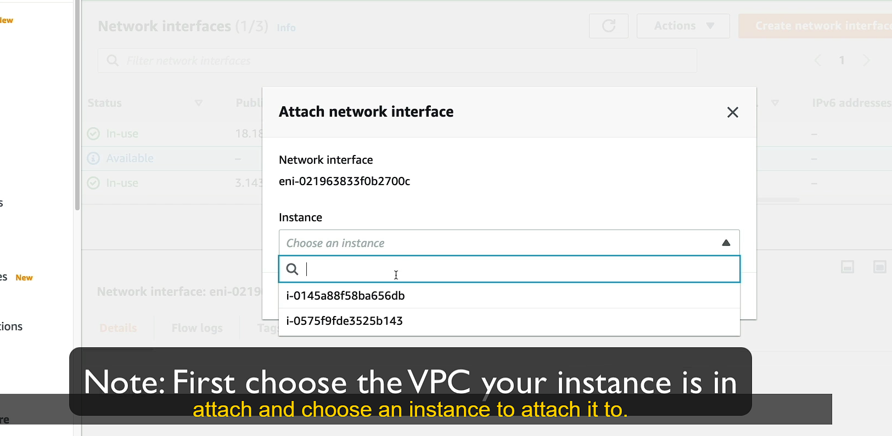

==> Lúc này EC2 instance vừa attach sẽ có 2 Network interface, 1 primary and secondary
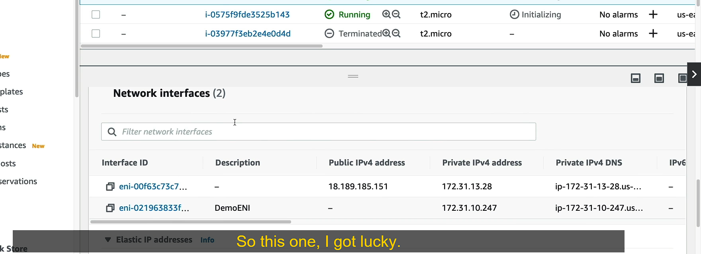

Trường hợp Dettach ENI vừa tạo và gắn vào một EC2 instance khác
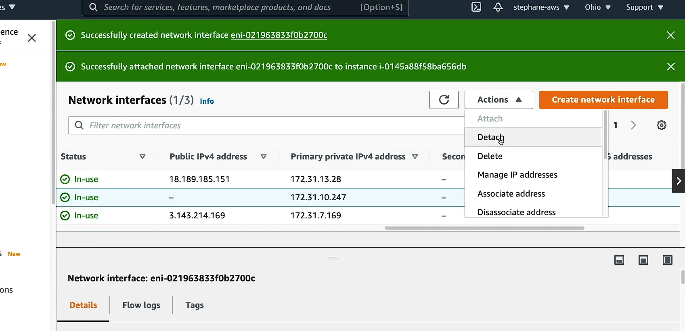
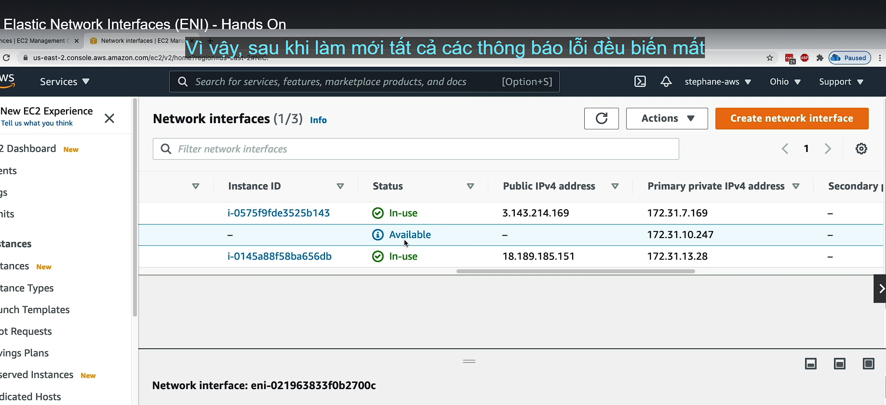

(ENI vừa tạo => attach một ec2 instance (không phải EC2 vừa attach) => attach)
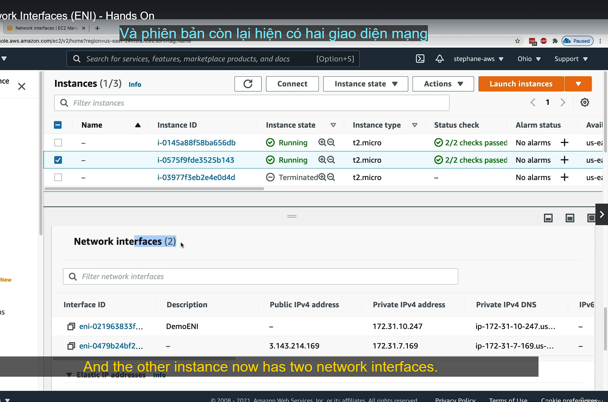

==> Khi xóa instance thì ENI tạo bằng tay sẽ không bị xóa

# EC2 Hibernate

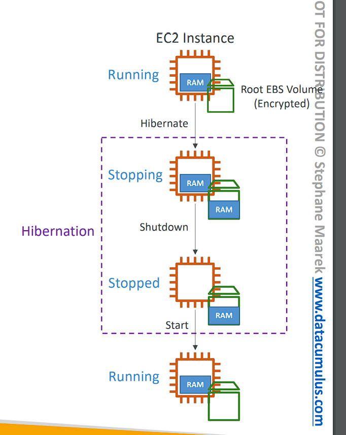

```plaintext
• We know we can stop, terminate instances
    • Stop – the data on disk (EBS) is kept intact (nguyên vẹn) in the next start
    • Terminate – any EBS volumes (root) also set-up to be destroyed is lost
• On start, the following happens:
    • First start: the OS boots & the EC2 User Data script is run
    • Following starts: the OS boots up
    • Then your application starts, caches get warmed up (bộ nhớ đệm khởi động), and that can take time!

• Introducing EC2 Hibernate:
    • The in-memory (RAM) state is preserved (bảo quản)
    • The instance boot is much faster! (the OS is not stopped / restarted)
    • Under the hood: the RAM state is written to a file in the root EBS volume (Bên dưới: trạng thái RAM được ghi vào một tệp trong ổ đĩa EBS gốc)
    • The root EBS volume must be encrypted (mã hóa)
• Use cases:
    • Long-running processing
    • Saving the RAM state
    • Services that take time to initialize
```

```
EC2 Hibernate là một tính năng trên Amazon EC2 giúp tiết kiệm thời gian khởi động và bảo quản trạng thái phiên làm việc bằng cách lưu lại toàn bộ trạng thái của bộ nhớ (RAM) khi instance tạm ngưng (hibernate). Khác với việc Stop hoặc Terminate, Hibernate giúp ứng dụng và dịch vụ có thể tiếp tục hoạt động từ nơi chúng đã dừng lại mà không cần khởi động lại hoàn toàn.

## So sánh giữa các trạng thái của EC2:
1. Stop (Dừng):

- Khi dừng một EC2 instance, dữ liệu trên ổ đĩa EBS (Elastic Block Store) sẽ được giữ lại.
- Khi khởi động lại, hệ điều hành (OS) phải khởi động lại từ đầu và chạy các script cấu hình (EC2 User Data script), sau đó mới khởi chạy các ứng dụng.
- Quá trình này có thể mất thời gian vì hệ thống phải khởi động lại và ứng dụng phải được tải từ đầu, bộ nhớ đệm (cache) cũng phải được làm mới.
2. Terminate (Chấm dứt):

- Khi chấm dứt một EC2 instance, các ổ đĩa gốc EBS sẽ bị xóa nếu không được cấu hình giữ lại.
- Dữ liệu trong bộ nhớ và hệ điều hành hoàn toàn bị mất.
3. Hibernate (Tạm ngưng):

- Khi tạm ngưng (hibernate) một EC2 instance, trạng thái của RAM (bộ nhớ trong) sẽ được bảo quản. Tất cả dữ liệu đang chạy trong bộ nhớ RAM của phiên bản sẽ được ghi vào một tệp trong ổ đĩa EBS gốc trước khi tạm ngưng.
- Khi khởi động lại từ trạng thái Hibernate, hệ điều hành không cần khởi động lại từ đầu, và trạng thái của phiên bản sẽ được phục hồi ngay từ nơi nó đã dừng lại. Điều này giúp khởi động lại nhanh hơn rất nhiều so với việc khởi động lại hoàn toàn hệ điều hành.

## Yêu cầu và cách hoạt động của EC2 Hibernate:
- Lưu trữ trạng thái RAM: Khi phiên bản được tạm ngưng, toàn bộ nội dung trong RAM sẽ được lưu lại trên ổ đĩa gốc (root EBS volume). Khi phiên bản được bật lại, trạng thái này sẽ được nạp trở lại từ EBS vào RAM, giúp hệ thống tiếp tục hoạt động từ vị trí đã dừng.

- EBS phải được mã hóa: Để đảm bảo tính bảo mật, ổ đĩa EBS gốc chứa trạng thái RAM phải được mã hóa. Điều này đảm bảo rằng dữ liệu trong bộ nhớ, đặc biệt là khi được lưu vào ổ đĩa, sẽ không bị lộ ra bên ngoài.

## Lợi ích của EC2 Hibernate:
1. Tăng tốc khởi động:

- Vì hệ điều hành không cần khởi động lại từ đầu và các ứng dụng có thể tiếp tục từ trạng thái dừng, việc khởi động lại EC2 instance sẽ nhanh hơn rất nhiều. Điều này đặc biệt hữu ích cho các dịch vụ tốn nhiều thời gian khởi động hoặc tải dữ liệu, ví dụ như dịch vụ có bộ nhớ đệm lớn cần khởi động lại.
2. Giữ trạng thái của hệ thống và ứng dụng:

- Khi khởi động lại từ trạng thái Hibernate, hệ thống sẽ tiếp tục từ nơi mà nó đã tạm ngưng, giúp tránh mất mát dữ liệu hoặc trạng thái đang xử lý trong bộ nhớ RAM.
3. Sử dụng trong các trường hợp dài hạn:

- Long-running processes: Các tác vụ dài hạn có thể dễ dàng được tiếp tục sau khi Hibernate mà không cần khởi động lại toàn bộ hệ điều hành và dịch vụ.
- Tiết kiệm tài nguyên: EC2 Hibernate giúp tiết kiệm tài nguyên bởi không cần giữ một instance đang chạy nếu không cần thiết, nhưng vẫn có thể khởi động lại nhanh chóng mà không bị gián đoạn nhiều.

## Ví dụ sử dụng EC2 Hibernate:
Giả sử bạn có một ứng dụng xử lý dữ liệu lớn và cần nhiều thời gian để khởi động, tải dữ liệu và làm nóng bộ nhớ đệm (cache).

- Trong quá trình bảo trì, bạn có thể tạm ngưng (hibernate) instance thay vì dừng hoặc chấm dứt.
- Khi cần khởi động lại sau đó, bạn chỉ cần bật instance từ trạng thái Hibernate, và ứng dụng của bạn sẽ khởi động lại ngay lập tức từ nơi nó đã dừng lại, không cần khởi động lại toàn bộ hệ điều hành hoặc nạp lại dữ liệu từ đầu.

## Tóm lại:
EC2 Hibernate giúp tiết kiệm thời gian và tối ưu hóa quá trình khởi động lại, đặc biệt hữu ích trong các kịch bản cần bảo quản trạng thái hệ thống và ứng dụng để tiếp tục xử lý nhanh chóng.
```

# EC2 Hibernate – Good to know

• Supported Instance Families – C3, C4, C5, I3, M3, M4, R3, R4, T2, T3, …
• Instance RAM Size – must be less than 150 GB.
• Instance Size – not supported for bare metal instances.
• AMI – Amazon Linux 2, Linux AMI, Ubuntu, RHEL, CentOS & Windows…
• Root Volume – must be EBS, encrypted, not instance store, and large
• Available for On-Demand, Reserved and Spot Instances
• An instance can NOT be hibernated more than 60 days

# EC2 Hibernate - Hands On

(EC2 => launch => os: Amazone linux 2023 => ... => Advanced details -> Stop - Hibernate behavior: Enable => Config storage -> Advance -> Encrypted: Yes -> KMS key: aws/ebs => launch instance)
(ssh vào ec2 => uptime (lệnh cho biết instance đã chạy trong bao lâu kể từ lần chạy đầu) => đợi 1 phút thì Hibernate instance đó và kiểm tra khi start lại instance => Action Hibernate instance )
(start instance => ssh vào chạy lệnh uptime để kiểm tra, thì lúc này thời gian sẽ không phải là 0 nữa vì dữ liệu ghi trên ram được lưu vào ebs)
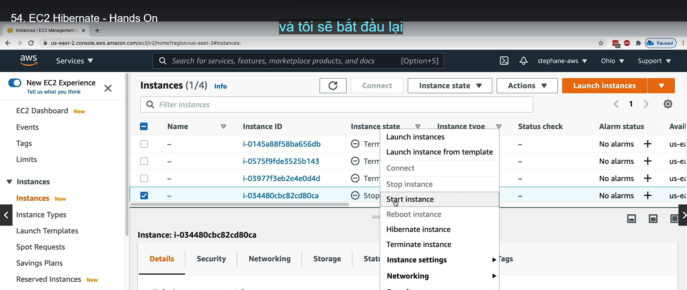
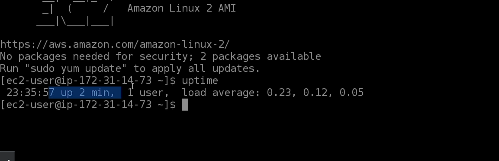
