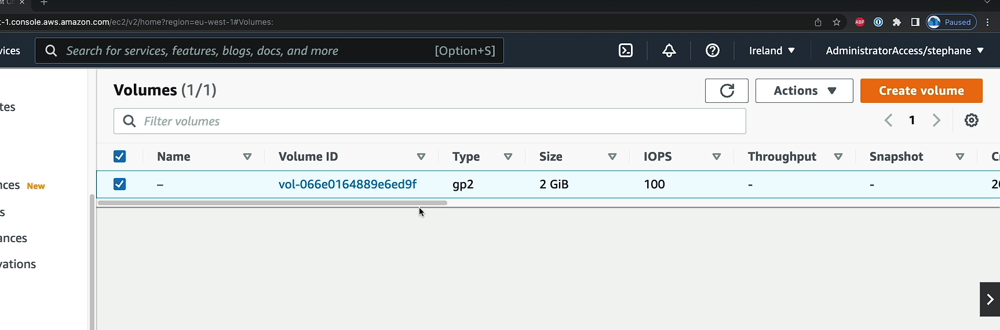

# Amazon EC2 – Instance Storage

# What’s an EBS Volume?


• An EBS (Elastic Block Store) Volume is a network drive you can attach to your instances while they run
• It allows your instances to persist data, even after their termination
• `They can only be mounted to one instance at a time` (at the CCP level)
• They are bound (ràng buộc) to a specific availability zone
• Analogy: Think of them as a “network USB stick”
• Free tier: 30 GB of free EBS storage of type General Purpose (SSD) or Magnetic per month

```
An EBS Volume (Elastic Block Store) trong AWS là một ổ đĩa mạng mà bạn có thể gắn vào các phiên bản EC2 trong khi chúng đang chạy. Dưới đây là các đặc điểm và tác dụng của EBS Volume:

## Giải thích chi tiết
1. Lưu trữ dữ liệu lâu dài:

- EBS là một dạng lưu trữ khối (block storage), cung cấp khả năng lưu trữ dữ liệu vĩnh viễn, ngay cả sau khi phiên bản EC2 mà nó gắn kết bị tắt hoặc chấm dứt. Điều này khác với ổ đĩa gốc instance store, nơi dữ liệu sẽ bị mất khi phiên bản bị tắt.
2. Gắn vào các phiên bản EC2:

- EBS Volumes có thể được gắn vào các phiên bản EC2 khi chúng đang chạy. Khi gắn kết, phiên bản có thể đọc và ghi dữ liệu trên EBS giống như cách nó hoạt động với ổ đĩa thông thường.
3. Chỉ gắn kết được vào một phiên bản tại một thời điểm:

- Tại cấp độ CCP (Certified Cloud Practitioner), một EBS Volume chỉ có thể gắn vào một phiên bản EC2 tại một thời điểm. Điều này đảm bảo tính nhất quán của dữ liệu, ngăn chặn tình trạng xung đột khi nhiều phiên bản cố gắng ghi vào cùng một ổ đĩa.
4. Giới hạn trong một Availability Zone (AZ):

- EBS Volume được ràng buộc với một Availability Zone (AZ) cụ thể. Điều này có nghĩa là bạn chỉ có thể gắn EBS Volume vào các phiên bản EC2 trong cùng AZ với nó.
5. Tương tự như một “USB mạng”:

- Bạn có thể hình dung EBS giống như một USB stick mà bạn cắm vào phiên bản EC2. Tuy nhiên, thay vì cắm trực tiếp vào máy, bạn gắn nó qua mạng nội bộ (network drive). Dữ liệu trên EBS Volume có thể được lưu trữ và sử dụng lại khi cần thiết, ngay cả khi EC2 instance bị tắt.
6. Free Tier (Miễn phí):

- AWS cung cấp 30 GB miễn phí EBS storage mỗi tháng dưới dạng SSD (General Purpose) hoặc ổ Magnetic cho người dùng thuộc gói miễn phí. Điều này giúp người dùng mới có thể sử dụng dịch vụ mà không cần lo lắng về chi phí ban đầu.
## Ví dụ:
Giả sử bạn có một ứng dụng cần lưu trữ dữ liệu, như một trang web bán hàng với cơ sở dữ liệu. Bạn có thể gắn một EBS Volume vào EC2 instance để lưu trữ cơ sở dữ liệu. Nếu bạn tắt EC2 instance (Stop hoặc Terminate), dữ liệu vẫn được giữ lại trong EBS Volume. Khi cần khởi động lại ứng dụng, bạn có thể gắn lại volume này vào một instance khác trong cùng Availability Zone và tiếp tục sử dụng dữ liệu.

## Tóm lại:
EBS Volume là một ổ đĩa lưu trữ bền vững, giúp các phiên bản EC2 lưu trữ và truy cập dữ liệu. Nó cung cấp khả năng mở rộng, sử dụng như một "USB mạng", nhưng chỉ hoạt động với một EC2 instance tại một thời điểm và trong cùng một Availability Zone.
```

# EBS Volume

```plaintext
• It’s a network drive (i.e. not a physical drive)
    • It uses the network to communicate the instance, which means there might be a bit of latency (có một chút độ trễ)
    • It can be detached from an EC2 instance and attached to another one quickly (có thể chuyển đổi dự phòng)
• It’s locked to an Availability Zone (AZ)
    • An EBS Volume in us-east-1a cannot be attached to us-east-1b
    • To move a volume across, you first need to snapshot it (move volume across from different AZ)
• Have a provisioned capacity (size in GBs, and IOPS) (cung cấp trước dung lượng)
    • You get billed for all the provisioned capacity (Bạn sẽ được tính phí cho toàn bộ dung lượng đã cung cấp)
    • You can increase the capacity of the drive over time
    (nếu bạn muốn hiệu suất tốt hơn hoặc kích thước lớn hơn)
```

(EBS volume không thể gắn cho 2 EC2 instance at a time)

```
An EBS Volume (Elastic Block Store) là một ổ đĩa mạng trong AWS, không phải là ổ đĩa vật lý, được sử dụng để lưu trữ dữ liệu lâu dài và có thể gắn vào các phiên bản EC2 để truy cập và sử dụng dữ liệu. Dưới đây là giải thích chi tiết về các tính năng của EBS Volume:

## Giải thích chi tiết
1. Ổ đĩa mạng (Network Drive):

- EBS Volume là một ổ đĩa mạng, không phải ổ đĩa vật lý, nên việc giao tiếp giữa EC2 instance và EBS Volume được thực hiện qua mạng nội bộ trong AWS. Điều này khác với ổ đĩa gắn trực tiếp vào máy chủ (direct-attached storage), vì thế có thể sẽ có độ trễ nhỏ (latency) khi truy cập dữ liệu so với các ổ đĩa vật lý.
2. Có thể tách ra và gắn vào nhanh chóng:

- EBS Volume có thể tách rời (detach) khỏi một EC2 instance và gắn vào (attach) một instance khác trong cùng một Availability Zone một cách nhanh chóng. Điều này giúp linh hoạt trong việc di chuyển dữ liệu hoặc ứng dụng giữa các EC2 instance.
3. Giới hạn trong một Availability Zone (AZ):

- EBS Volume bị giới hạn trong một Availability Zone (AZ) cụ thể. Ví dụ, nếu EBS Volume được tạo trong vùng us-east-1a, bạn chỉ có thể gắn nó vào các EC2 instance trong vùng us-east-1a. Bạn không thể gắn EBS Volume này vào một instance ở us-east-1b hoặc các vùng AZ khác.
4. Di chuyển EBS Volume giữa các AZ:

- Để di chuyển một EBS Volume từ một AZ này sang AZ khác, bạn phải snapshot (tạo bản sao lưu) volume đó. Sau khi snapshot được tạo, bạn có thể tạo một volume mới từ snapshot trong AZ mong muốn.
5. Dung lượng và IOPS đã được cung cấp:

- Khi tạo một EBS Volume, bạn phải chọn dung lượng của volume (tính bằng GB) và tốc độ IOPS (tính bằng số lần đọc/ghi dữ liệu mỗi giây). Đây là khả năng đã được cung cấp sẵn mà bạn cam kết sử dụng.
6. Tính phí theo dung lượng được cung cấp:

- Bạn sẽ bị tính phí dựa trên dung lượng mà bạn đã cung cấp, chứ không phải dựa trên dung lượng mà bạn thực tế sử dụng. Điều này có nghĩa là dù bạn có sử dụng toàn bộ dung lượng hay không, bạn vẫn sẽ trả tiền cho toàn bộ dung lượng mà bạn đã chỉ định khi tạo volume.
7. Tăng dung lượng theo thời gian:

- Bạn có thể tăng dung lượng của EBS Volume theo thời gian nếu cần. Điều này giúp bạn mở rộng không gian lưu trữ mà không phải tạo một volume mới và di chuyển dữ liệu.

## Tóm lại:
-   EBS Volume là một ổ đĩa mạng trong AWS, cung cấp khả năng lưu trữ linh hoạt và lâu dài. Nó có thể tách rời và gắn vào các EC2 instance nhanh chóng trong cùng một AZ, với một dung lượng và IOPS đã được định trước. Để di chuyển giữa các AZ, bạn cần tạo snapshot và tạo volume mới từ snapshot đó. Bạn bị tính phí theo dung lượng đã cung cấp và có thể mở rộng dung lượng theo nhu cầu.
```

# EBS Volume - Example


# EBS – Delete on Termination attribute

• Controls the EBS behaviour when an EC2 instance terminates
• By default, the root EBS volume is deleted (attribute enabled)
• By default, any other attached EBS volume is not deleted (attribute disabled)
• This can be controlled by the AWS console / AWS CLI
• `Use case: preserve root volume when instance is terminated` (• Trường hợp sử dụng: bảo toàn ổ đĩa gốc khi phiên bản bị chấm dứt)

## EBS Hands On

(EC2 => volume => Create volume => type: gp2 => size: 2 GB => Availvility zone: (kiểm tra xem EC2 đang ở zone nào) => snapshot Id: don't create volume snapshot => create volume => Ation => Attach volume => chọn instance => attach volume)

(gg: format EBS vlume attach EC2)
(Thử tạo một ebs lằm ở zone không có EC2 để xác nhận EBS ràng buộc bởi AZ)

# EBS Snapshots


• Make a backup (snapshot) of your EBS volume at a point in time
• Not necessary to detach volume to do snapshot, but recommended
• Can copy snapshots across AZ or Region
(`có thể tranfrom an EBS volume from one AZ to another AZ`)

# EBS Snapshots Features


```plaintext
• EBS Snapshot Archive (lưu trữ snapshot EBS)
    • Move a Snapshot to an ”archive tier” (tầng lưu trữ) that is 75% cheaper
    • Takes within 24 to 72 hours for restoring the archive (khôi phục lưu trữ, vì vậy nó không phải ngay lập tức)
• Recycle Bin for EBS Snapshots (thùng rác  tái chế)
    • Setup rules to retain (giữ lại) deleted snapshots so you can recover them after an accidental deletion (khôi phúc nó sau khi vô tình xóa)
    • Specify retention (giữ lại) (from 1 day to 1 year)
• Fast Snapshot Restore (FSR) (khôi phục snapshot nhanh)
    • Force full initialization of snapshot to have no latency on the first use ($$$)
```

```
## Giải thích chi tiết về EBS Snapshots Features
1. EBS Snapshot Archive:

- Snapshot Archive là tính năng cho phép bạn di chuyển snapshot EBS vào một tầng lưu trữ archive để tiết kiệm chi phí. Khi snapshot không cần truy cập thường xuyên, bạn có thể lưu nó vào archive với mức giá rẻ hơn, giảm tới 75% chi phí so với lưu trữ trong tầng tiêu chuẩn.
- Khôi phục từ archive: Việc khôi phục snapshot từ tầng archive có thể mất từ 24 đến 72 giờ, do đó, nó phù hợp cho những dữ liệu không cần truy cập ngay lập tức.
2. Recycle Bin for EBS Snapshots:

- Recycle Bin cho phép bạn bảo vệ các snapshot khỏi việc xóa nhầm. Khi bạn xóa một snapshot, nó sẽ được chuyển vào Recycle Bin thay vì bị xóa vĩnh viễn ngay lập tức.
- Bạn có thể thiết lập quy tắc để giữ lại các snapshot trong Recycle Bin với khoảng thời gian tùy chọn, từ 1 ngày đến 1 năm. Điều này giúp bạn có thể khôi phục snapshot trong trường hợp bị xóa nhầm hoặc thay đổi quyết định sau khi xóa.
3. Fast Snapshot Restore (FSR):

- Fast Snapshot Restore (FSR) giúp bạn tránh độ trễ (latency) khi sử dụng snapshot EBS lần đầu tiên. Thông thường, khi khôi phục từ snapshot, dữ liệu có thể phải được khởi tạo dần dần, dẫn đến độ trễ trong lần sử dụng đầu tiên.
- Với FSR, toàn bộ snapshot được khởi tạo đầy đủ ngay từ đầu, đảm bảo rằng khi bạn sử dụng EBS Volume khôi phục từ snapshot, không có độ trễ nào xảy ra trong lần sử dụng đầu tiên. Tuy nhiên, tính năng này có chi phí cao (FSR tốn tiền nhiều hơn).
## Tóm lại:
- EBS Snapshot Archive giúp tiết kiệm chi phí với dữ liệu ít sử dụng, nhưng việc khôi phục có thể mất thời gian.
- Recycle Bin bảo vệ snapshot khỏi bị xóa nhầm, cho phép bạn khôi phục trong thời gian thiết lập.
- Fast Snapshot Restore loại bỏ độ trễ trong lần khởi tạo đầu tiên, nhưng có chi phí cao.

```

## EBS Snapshots - Hands On


(Tạo một EBS với 2GB như trên => Actions => Create snapshot => description: DemoSnapshot => create snapshot => vô tab snapshot => chọn snapshot đó => actions => create volume from snapshot => chọn một AZ bất kỳ khác với az của của snapshot => crate volume )
=> có across different Availabity Zones

(Snapshot => Recycle Bin => create retenion rule => name: DemoRetetionRule => type: EBS Snapshots => tích Apply to all resource => period: 1 days => create)
(Snapshot => chọn snapshot => Action: Delete snapshot)
(Recovery => chọn snapshot vừa xóa => Recover ) => kiểm tra snapshot thì thấy đã đươc khôi phục lại sau khi xóa

# AMI Overview

```plaintext
• AMI = Amazon Machine Image
• AMI are a customization of an EC2 instance
• You add your own software, configuration, operating system, monitoring…
• Faster boot / configuration time because all your software is pre-packaged (đóng gói sẵn)
• AMI are built for a specific region (and can be copied across regions)
• You can launch EC2 instances from:
• A Public AMI: AWS provided
• Your own AMI: you make and maintain them yourself
• An AWS Marketplace AMI: an AMI someone else made (and potentially (có khả năng) sells)
```

```
## Ví dụ minh họa:
Giả sử bạn có một ứng dụng web chạy trên một phiên bản EC2 với các phần mềm như Nginx và MySQL đã được cài đặt và cấu hình sẵn. Thay vì thiết lập lại toàn bộ khi tạo phiên bản mới, bạn có thể tạo AMI của riêng mình, chứa toàn bộ cấu hình này. Khi bạn cần triển khai một phiên bản EC2 mới, chỉ cần khởi động từ AMI này, và EC2 instance sẽ sẵn sàng hoạt động ngay lập tức với cấu hình như phiên bản ban đầu.

## Tóm lại:
AMI giúp tự động hóa và tăng tốc quá trình khởi động và triển khai EC2 instance với các cấu hình và phần mềm đã cài đặt trước. Bạn có thể sử dụng AMI từ AWS, tự tạo, hoặc từ AWS Marketplace để phù hợp với nhu cầu sử dụng của mình.

```

# AMI Process (from an EC2 instance)

• Start an EC2 instance and customize it
• Stop the instance (for data integrity) (tính toàn vẹn dữ liệu)
• Build an AMI – this will also create EBS snapshots
• Launch instances from other AMIs


# AMI Hands ON

(EC2 => Launch => chọn như bình thường => User data: copy ở ec2-user-data.sh => launch instance => khi runnting => Action => image and template => Create template => name: DemoImage => Create Image => Vô tab IMIs để kiểm tra)
(EC2 => instance => launch instance => name: "From AMI" => MY AMIs -> Owned by me -> "DemoImage" => ... => launch)

# EC2 Instance Store

• EBS volumes are network drives with good but “limited” performance
• If you need a high-performance hardware disk, use EC2 Instance Store
• Better I/O performance
• EC2 Instance Store lose their storage if they’re stopped (ephemeral) (lưu trữ phù du không vững vàn)
• Good for buffer / cache / scratch data / temporary content (không phải lưu trữ lâu dài, lưu trữ lầu dài thì dùng EBS)
• Risk of data loss if hardware fails
• Backups and Replication (nhân rộng) are your responsibility

```
EC2 Instance Store là loại lưu trữ trên máy chủ vật lý của EC2 instance, cung cấp hiệu suất I/O cao hơn so với ổ đĩa EBS. Tuy nhiên, nó có một số đặc điểm đặc biệt cần lưu ý:

## Giải thích chi tiết:
1. Hiệu suất cao hơn:

- EC2 Instance Store là một dạng ổ đĩa gắn trực tiếp vào phần cứng máy chủ của EC2 instance. Điều này mang lại hiệu suất I/O (đọc/ghi) cao hơn so với EBS, đặc biệt khi bạn cần xử lý các tác vụ yêu cầu nhiều tài nguyên về đọc/ghi dữ liệu nhanh chóng.
2. Dữ liệu không được duy trì sau khi dừng instance (ephemeral):

- Instance Store chỉ duy trì dữ liệu khi instance EC2 đang chạy. Nếu instance bị dừng hoặc chấm dứt, dữ liệu trên Instance Store sẽ mất đi vĩnh viễn. Vì lý do này, nó không phù hợp cho lưu trữ dữ liệu lâu dài.
- Đây là lý do nó được gọi là ephemeral storage (lưu trữ tạm thời). Dữ liệu chỉ tồn tại trong khoảng thời gian instance hoạt động.
3. Sử dụng cho dữ liệu tạm thời:

- Instance Store phù hợp cho các loại dữ liệu tạm thời hoặc dữ liệu có thể dễ dàng tạo lại, chẳng hạn như:
    - Buffer: Lưu trữ tạm thời các dữ liệu đệm.
    - Cache: Bộ nhớ đệm để tăng tốc độ truy xuất dữ liệu.
    - Scratch data: Dữ liệu dùng để tính toán hoặc xử lý mà không cần lưu trữ lâu dài.
    - Temporary content: Các tệp tin hoặc thông tin chỉ tồn tại trong khoảng thời gian ngắn.
4. Nguy cơ mất dữ liệu nếu phần cứng gặp sự cố:

- Vì Instance Store được gắn trực tiếp vào phần cứng máy chủ, nếu phần cứng bị hỏng hoặc có vấn đề, dữ liệu trên Instance Store sẽ bị mất. Đây là một rủi ro lớn nếu bạn không quản lý và sao lưu dữ liệu cẩn thận.
5. Sao lưu và sao chép (backups & replication):

- Trách nhiệm sao lưu và sao chép dữ liệu thuộc về bạn. AWS không cung cấp tính năng sao lưu tự động cho dữ liệu trên Instance Store. Nếu dữ liệu quan trọng, bạn cần tự sao lưu nó sang một nơi khác, chẳng hạn như EBS hoặc S3 để đảm bảo an toàn.

## Tóm lại:
EC2 Instance Store cung cấp hiệu suất cao nhưng tạm thời và có nguy cơ mất dữ liệu. Nó thích hợp cho các tác vụ yêu cầu hiệu suất I/O nhanh, nhưng không phù hợp để lưu trữ dữ liệu quan trọng hoặc lâu dài, vì dữ liệu sẽ bị mất khi instance dừng hoặc gặp sự cố.
```

# Local EC2 Instance Store

Very high IOPS


# EBS Volume Types

```plaintext
• EBS Volumes come in 6 types
    • gp2 / gp3 (SSD): General purpose SSD volume that balances price and performance for a wide variety of workloads (cho nhiều nhiều khối lượng công việc khác nhau)
    • io1 / io2 Block Express (SSD): Highest-performance SSD volume for mission-critical low-latency or high-throughput workloads (• io1 / io2 Block Express (SSD): Ổ SSD hiệu suất cao nhất dành cho khối lượng công việc có độ trễ thấp hoặc thông lượng cao quan trọng)
    • st1 (HDD): Low cost HDD volume designed for frequently accessed (truy cập thường xuyên), throughput- intensive workloads (khối lượng công việc đồi hỏi thông lượng)
    • sc1 (HDD): Lowest cost HDD volume designed for less frequently accessed workloads (ít được truy cập thường xuyên)
• EBS Volumes are characterized in Size | Throughput (thông lượng) | IOPS (I/O Ops Per Sec)
• When in doubt always consult the AWS documentation – it’s good!
• Only gp2/gp3 and io1/io2 Block Express can be used as boot volumes (có thể được sử dụng làm ổ đĩa khởi động)
```

```
EBS Volumes là các loại ổ đĩa lưu trữ trên Amazon Elastic Block Store (EBS), được phân loại dựa trên hiệu suất và mục đích sử dụng. AWS cung cấp 6 loại EBS Volume với các đặc điểm khác nhau về dung lượng, thông lượng và tốc độ IOPS (số lượng thao tác I/O trên giây). Dưới đây là chi tiết về từng loại:

## Các loại EBS Volume:
1. gp2 / gp3 (SSD):

- Mục đích chung (General Purpose SSD): Đây là loại SSD được thiết kế để cân bằng giữa giá cả và hiệu suất. Loại này phù hợp với hầu hết các ứng dụng thông thường như hệ điều hành, cơ sở dữ liệu nhỏ và khối lượng công việc trung bình.
- gp3: Là phiên bản nâng cấp của gp2, cung cấp hiệu suất tốt hơn với chi phí thấp hơn và khả năng tách rời IOPS và dung lượng lưu trữ. Điều này giúp dễ dàng điều chỉnh hiệu suất mà không phải tăng kích thước ổ đĩa.
- Sử dụng: Rất phù hợp cho các ứng dụng web, ứng dụng thử nghiệm và phát triển, và các cơ sở dữ liệu nhỏ.
2. io1 / io2 Block Express (SSD):

- Hiệu suất cao nhất (Highest-Performance SSD): Loại này được thiết kế cho các tác vụ quan trọng với yêu cầu về độ trễ thấp và hiệu suất I/O cao. Thường được sử dụng trong các ứng dụng nhiệm vụ quan trọng như cơ sở dữ liệu lớn, phân tích dữ liệu lớn (big data), và các hệ thống cần hiệu suất cao liên tục.
- io2 Block Express: Là phiên bản mới nhất với tính năng Block Express cho phép tăng thông lượng và IOPS cực kỳ cao, phù hợp với các ứng dụng có độ yêu cầu rất cao về độ tin cậy và hiệu suất.
- Sử dụng: Các cơ sở dữ liệu doanh nghiệp, SAP, Oracle, và các ứng dụng giao dịch tài chính yêu cầu hiệu suất cực kỳ cao.
3. st1 (HDD):

- Thông lượng cao, chi phí thấp (Low-cost Throughput-Optimized HDD): Loại ổ cứng HDD này được tối ưu hóa cho các khối lượng công việc yêu cầu thông lượng dữ liệu cao nhưng không cần IOPS cao, chẳng hạn như các hệ thống xử lý dữ liệu lớn, hệ thống log, và các ứng dụng yêu cầu truy cập thường xuyên nhưng không yêu cầu tốc độ đọc/ghi nhanh.
- Sử dụng: Dữ liệu lớn, hệ thống phân tích log, máy chủ truyền file hoặc streaming.
4. sc1 (HDD):

- Chi phí thấp nhất (Lowest-cost Cold HDD): Loại này có chi phí thấp nhất và được thiết kế cho những dữ liệu ít được truy cập nhưng cần dung lượng lớn. Đây là lựa chọn lý tưởng cho lưu trữ dữ liệu lâu dài hoặc ít thường xuyên.
- Sử dụng: Lưu trữ archive, backup, hoặc các dữ liệu không yêu cầu truy cập thường xuyên.

## Đặc điểm của các EBS Volume:

- Mỗi loại EBS volume có các đặc điểm về kích thước (size), thông lượng (throughput) và IOPS khác nhau. Điều này cho phép người dùng lựa chọn loại phù hợp dựa trên yêu cầu cụ thể về dung lượng lưu trữ và hiệu suất I/O.
## Boot Volumes:
- Chỉ có gp2/gp3 và io1/io2 Block Express có thể được sử dụng làm boot volumes (ổ đĩa khởi động) cho EC2 instances. Điều này là do chúng cung cấp tốc độ I/O cần thiết để khởi động hệ điều hành và chạy các ứng dụng nhanh chóng.

## Khi nào nên dùng loại nào:
- gp2/gp3: Sử dụng cho các ứng dụng thông thường yêu cầu cân bằng giữa giá cả và hiệu suất.
- io1/io2 Block Express: Sử dụng cho các ứng dụng quan trọng yêu cầu I/O và độ tin cậy cao.
- st1: Sử dụng cho các khối lượng công việc cần thông lượng cao với chi phí thấp.
- sc1: Sử dụng để lưu trữ dữ liệu ít truy cập với chi phí rẻ.

## Tóm lại:
EBS Volume được phân loại dựa trên mục đích sử dụng và yêu cầu về hiệu suất. Tùy theo khối lượng công việc của bạn, bạn có thể chọn loại SSD hoặc HDD phù hợp để tối ưu hóa giữa hiệu suất, dung lượng và chi phí.
```

```
IOPS (Input/Output Operations Per Second) là đơn vị đo lường hiệu suất của thiết bị lưu trữ, cho biết số lượng thao tác đọc/ghi có thể được thực hiện trong một giây. IOPS rất quan trọng trong việc đánh giá khả năng xử lý của các ổ đĩa lưu trữ, như EBS volumes trên AWS, vì nó ảnh hưởng trực tiếp đến tốc độ truy cập và xử lý dữ liệu.

## Cách hoạt động của IOPS:
1. Input/Output (I/O) Operations:

- Một thao tác I/O bao gồm đọc hoặc ghi dữ liệu từ ổ đĩa. Số lượng thao tác này càng lớn, thiết bị lưu trữ càng có thể xử lý nhiều dữ liệu trong một khoảng thời gian nhất định.
2. IOPS là chỉ số đo hiệu suất:

- IOPS cho biết ổ đĩa có thể thực hiện bao nhiêu lần thao tác I/O trong mỗi giây. IOPS cao có nghĩa là thiết bị lưu trữ có thể xử lý nhiều yêu cầu hơn trong thời gian ngắn hơn, dẫn đến hiệu suất tốt hơn cho các ứng dụng yêu cầu truy cập dữ liệu nhanh, chẳng hạn như cơ sở dữ liệu, hệ thống phân tích dữ liệu lớn.

## Tầm quan trọng của IOPS:
- Ứng dụng yêu cầu IOPS cao: Những ứng dụng như cơ sở dữ liệu hoặc các ứng dụng giao dịch yêu cầu IOPS cao để có thể xử lý nhiều yêu cầu đọc/ghi một cách nhanh chóng và chính xác.
- Tối ưu hóa hiệu suất: Nếu IOPS quá thấp, ứng dụng có thể gặp tình trạng tắc nghẽn do hệ thống lưu trữ không thể xử lý nhanh chóng các yêu cầu I/O, dẫn đến hiệu suất chậm.
## Ví dụ về IOPS trên AWS:
- Trên AWS, các loại EBS volume như gp2/gp3 hay io1/io2 đều có các mức IOPS khác nhau:
    - gp3: Cho phép điều chỉnh số IOPS độc lập với dung lượng lưu trữ, hỗ trợ lên tới 16,000 IOPS.
    - io1/io2: Cung cấp IOPS cực cao, lên tới 256,000 IOPS, dành cho các ứng dụng yêu cầu hiệu suất I/O cao.
## Yếu tố ảnh hưởng đến IOPS:
- Loại thiết bị lưu trữ: SSD (Solid State Drive) thường có IOPS cao hơn so với HDD (Hard Disk Drive).
- Kích thước và loại tệp: Kích thước tệp nhỏ hoặc khối lượng công việc có nhiều thao tác đọc/ghi ngẫu nhiên thường yêu cầu nhiều IOPS hơn.

## Tóm lại:
- IOPS là chỉ số quan trọng để đánh giá hiệu suất lưu trữ, đặc biệt khi chọn ổ đĩa cho các ứng dụng yêu cầu truy cập và xử lý dữ liệu nhanh. Việc chọn đúng loại EBS volume với IOPS phù hợp sẽ giúp tối ưu hóa hiệu suất của ứng dụng.
```

# EBS Volume Types Use cases - General Purpose SSD (gp3, gp2):

```
IOPS (Input/Output Operations Per Second) là chỉ số đo lường số lượng hoạt động đọc/ghi mà một thiết bị lưu trữ có thể xử lý trong một giây. Trong ngữ cảnh của EBS (Elastic Block Store) của AWS, IOPS là một yếu tố quan trọng để đánh giá hiệu suất của ổ đĩa.

I/O Operations bao gồm cả đọc và ghi dữ liệu, mỗi lần truy cập vào dữ liệu (dù là đọc hay ghi) được tính là một I/O operation.

IOPS cao nghĩa là ổ đĩa có thể xử lý nhiều yêu cầu đọc/ghi dữ liệu hơn trong một giây, dẫn đến hiệu suất nhanh hơn, đặc biệt trong các ứng dụng đòi hỏi nhiều I/O như cơ sở dữ liệu.
```

```plaintext
• Cost effective storage, low-latency (Lưu trữ tiết kiệm chi phí, độ trễ thấp)
• System boot volumes, Virtual desktops, Development and test environments
• 1 GiB - 16 TiB
• gp3:
    • Baseline (mức cơ bản) of 3,000 IOPS and throughput of 125 MiB/s
    • Can increase IOPS up to 16,000 and throughput up to 1000 MiB/s independently (một cách độc lập)
• gp2:
    • Small gp2 volumes can burst IOPS to 3,000 (có thể đạt tới 3000)
    • Size of the volume and IOPS are linked (có thể liên két do đó max là), max IOPS is 16,000
    • 3 IOPS per GB, means at 5,334 GB we are at the max IOPS

cần lưu ý:  gp2 và gp3 for cost-effective strogage latency (độ trễ lưu trữ hiệu quả về mặt chi phí) và gp3 you can independently set the IOPS and the throughput whereas for gp2 they're linked  together
```

```
## General Purpose SSD (gp2 & gp3)
Loại lưu trữ SSD phổ biến nhất, cung cấp hiệu suất ổn định và chi phí hợp lý. Phù hợp cho các tác vụ cần lưu trữ với độ trễ thấp.

## Sử dụng cho các trường hợp:
- System boot volumes: Dùng để làm ổ khởi động cho các instance EC2 vì chúng yêu cầu truy cập nhanh và độ trễ thấp.
- Virtual desktops: Các môi trường máy tính để bàn ảo cần lưu trữ nhanh chóng, đảm bảo hiệu suất tốt mà không tốn nhiều chi phí.
- Development and test environments: Các môi trường phát triển và thử nghiệm yêu cầu lưu trữ nhanh chóng để chạy ứng dụng, nhưng không cần hiệu suất quá cao như các ứng dụng sản xuất.

## Chi tiết về hai loại SSD phổ biến:
### gp3 (Thế hệ mới hơn, hiệu suất độc lập):
- Baseline: Mặc định cung cấp 3,000 IOPS (Input/Output Operations Per Second) và băng thông 125 MiB/s.

- Tăng hiệu suất: Bạn có thể tăng IOPS lên đến 16,000 và băng thông lên 1,000 MiB/s mà không phụ thuộc vào kích thước volume, tức là hiệu suất có thể điều chỉnh độc lập.

- Ưu điểm của gp3:

    - Linh hoạt hơn về hiệu suất, chi phí thấp hơn so với gp2 khi cần IOPS cao.
## gp2 (Thế hệ cũ, phụ thuộc vào kích thước volume):
- Burst IOPS: Các volume gp2 nhỏ có thể tăng tốc IOPS lên đến 3,000 trong một khoảng thời gian ngắn.

- Liên kết giữa dung lượng và IOPS: Hiệu suất của gp2 được xác định dựa trên kích thước volume. Với mỗi GiB, bạn có 3 IOPS.

    - Ví dụ: 1 volume có dung lượng 1,000 GB sẽ cung cấp 3,000 IOPS.
    - Tối đa 16,000 IOPS đạt được ở mức 5,334 GB (5,334 GB x 3 IOPS/GB = 16,002 IOPS).
- Ưu điểm của gp2:

    - Tăng tốc nhanh (burst) với các volume nhỏ, nhưng không linh hoạt về việc điều chỉnh hiệu suất độc lập như gp3.
## Tóm tắt sự khác biệt giữa gp3 và gp2:
- gp3: Hiệu suất (IOPS và băng thông) có thể điều chỉnh độc lập với dung lượng lưu trữ. Hiệu suất tốt hơn với chi phí thấp hơn so với gp2.
- gp2: Hiệu suất phụ thuộc vào kích thước volume. Volume lớn hơn sẽ có IOPS cao hơn, nhưng không linh hoạt bằng gp3.
## Kết luận:
- gp3 phù hợp cho các trường hợp cần tối ưu chi phí và hiệu suất cao mà vẫn có thể tùy chỉnh IOPS và băng thông độc lập với dung lượng.
- gp2 tốt cho các môi trường phát triển hoặc thử nghiệm với yêu cầu lưu trữ không quá lớn và có khả năng tăng tốc IOPS tạm thời.
```

# EBS Volume Types Use cases - Provisioned IOPS (PIOPS) SSD

• Critical business applications with sustained (duy trì) IOPS performance (hiệu suất)
• Or applications that need more than 16,000 IOPS
• Great for databases workloads (sensitive (nhạy cảm) to storage perf and consistency (nhất quán))
• io1 (4 GiB - 16 TiB):
• Max PIOPS: 64,000 for Nitro EC2 instances & 32,000 for other
• Can increase PIOPS independently from storage size
• io2 Block Express (4 GiB – 64 TiB):
• Sub-millisecond latency (độ trễ dưới một nghìn mili giây)
• Max PIOPS: 256,000 with an IOPS:GiB ratio of 1,000:1
• Supports EBS Multi-attach

```
Provisioned IOPS (PIOPS) SSD là loại ổ lưu trữ trong AWS EBS được thiết kế cho các ứng dụng yêu cầu hiệu suất IOPS cao và ổn định. Loại lưu trữ này phù hợp cho các ứng dụng doanh nghiệp quan trọng, đặc biệt là cơ sở dữ liệu nhạy cảm với hiệu suất lưu trữ và yêu cầu độ trễ thấp.

## Trường hợp sử dụng (Use Cases):
1. Ứng dụng doanh nghiệp quan trọng: Các ứng dụng kinh doanh yêu cầu hiệu suất IOPS ổn định và bền vững để đảm bảo không bị gián đoạn hay sụt giảm hiệu suất.
2. Ứng dụng cần hơn 16,000 IOPS: Những ứng dụng có khối lượng công việc lớn cần IOPS cao hơn so với giới hạn của General Purpose SSD (gp2/gp3).
3. Công việc cơ sở dữ liệu: Phù hợp cho các công việc liên quan đến cơ sở dữ liệu (như MySQL, PostgreSQL, MongoDB) vốn nhạy cảm với hiệu suất lưu trữ và đòi hỏi độ trễ thấp và tính nhất quán trong việc đọc/ghi dữ liệu.
## Các loại PIOPS SSD:
1. io1 (4 GiB - 16 TiB):
- Tối đa PIOPS:
    - 64,000 IOPS với các Nitro EC2 instances (các instance tối ưu hiệu suất cao).
    - 32,000 IOPS cho các instance EC2 khác.
- Tăng PIOPS độc lập: Giống như gp3, bạn có thể tăng IOPS độc lập với kích thước lưu trữ, điều này rất quan trọng khi bạn cần hiệu suất cao nhưng không muốn tăng dung lượng lưu trữ.
2. io2 Block Express (4 GiB - 64 TiB):
- Độ trễ cực thấp: Cung cấp độ trễ dưới một mili giây (sub-millisecond latency), rất phù hợp cho các ứng dụng yêu cầu tốc độ phản hồi cực nhanh.

- Tối đa PIOPS: Hỗ trợ lên đến 256,000 IOPS, với tỷ lệ IOPS
là 1,000:1, cho phép hiệu suất vượt trội so với io1.

- Multi-Attach: io2 Block Express hỗ trợ EBS Multi-Attach, cho phép một volume EBS được gắn vào nhiều EC2 instances cùng lúc, rất hữu ích trong các hệ thống phân tán hoặc cluster.

## Tóm tắt sự khác biệt:
- io1: Dành cho các ứng dụng cần hiệu suất IOPS cao và tối đa 64,000 IOPS trên Nitro EC2 instances. Cho phép điều chỉnh IOPS độc lập với kích thước lưu trữ.
- io2 Block Express: Cung cấp hiệu suất cực cao với tối đa 256,000 IOPS, độ trễ dưới một mili giây, và hỗ trợ EBS Multi-Attach cho các hệ thống phức tạp, mở rộng.
## Kết luận:
- io1 phù hợp cho các ứng dụng yêu cầu hiệu suất cao và ổn định nhưng với quy mô vừa phải (tối đa 64,000 IOPS).
- io2 Block Express lý tưởng cho các hệ thống lớn, yêu cầu hiệu suất tối đa với độ trễ thấp và khả năng hỗ trợ hàng trăm nghìn IOPS.
```

```
Block Express là một kiến trúc lưu trữ trong AWS được thiết kế để cung cấp hiệu suất cực cao cho các loại ổ đĩa io2 trong Amazon EBS (Elastic Block Store). Kiến trúc này được tối ưu hóa cho các tác vụ lưu trữ yêu cầu hiệu suất rất lớn, đặc biệt là đối với các khối lượng công việc chuyên sâu về dữ liệu như cơ sở dữ liệu lớn, ứng dụng phân tán, và phân tích dữ liệu.

## Đặc điểm của Block Express:
1. Hiệu suất cực cao:

- Tối đa 256,000 IOPS (Input/Output Operations Per Second), giúp xử lý khối lượng công việc lớn với tốc độ I/O cao.
- Tối đa 4,000 MB/s throughput (băng thông), cho phép truyền dữ liệu khổng lồ với tốc độ nhanh.
- Tỷ lệ IOPS là 1,000:1, nghĩa là bạn có thể nhận được đến 1,000 IOPS cho mỗi GiB dữ liệu, giúp điều chỉnh hiệu suất một cách linh hoạt mà không cần tăng kích thước volume.
2. Độ trễ rất thấp:

- Độ trễ dưới một mili giây (sub-millisecond latency), đảm bảo thời gian phản hồi nhanh chóng, cực kỳ quan trọng với các ứng dụng yêu cầu phản hồi thời gian thực hoặc các cơ sở dữ liệu lớn.
3. Khả năng mở rộng:

- Dung lượng volume lên đến 64 TiB, giúp lưu trữ được nhiều dữ liệu hơn và mở rộng các hệ thống lớn.
- Block Express được xây dựng cho các hệ thống quy mô lớn và có thể mở rộng để đáp ứng các nhu cầu lưu trữ tăng trưởng của các ứng dụng phức tạp.
4. Hỗ trợ EBS Multi-Attach:

- Bạn có thể gắn một volume Block Express io2 vào nhiều EC2 instances cùng lúc trong cùng một Availability Zone (AZ). Điều này rất hữu ích trong các kiến trúc cluster hoặc hệ thống phân tán, nơi nhiều instances cần truy cập vào cùng một volume.
## Lợi ích của Block Express:
- Hiệu suất cao nhất trong EBS: Block Express cung cấp hiệu suất cao nhất trong các loại EBS, vượt trội so với các loại khác (gp2, gp3, io1).
- Khả năng mở rộng lớn: Khả năng hỗ trợ hàng trăm nghìn IOPS và nhiều TiB dữ liệu, giúp mở rộng các ứng dụng và cơ sở dữ liệu lớn.
- Độ trễ thấp: Đảm bảo thời gian phản hồi nhanh, phù hợp với các ứng dụng yêu cầu độ trễ cực kỳ thấp.
## Use Cases (Trường hợp sử dụng):
- Cơ sở dữ liệu lớn: Các cơ sở dữ liệu yêu cầu hiệu suất IOPS rất cao và băng thông lớn, như Oracle, SAP HANA, MySQL, PostgreSQL.
- Ứng dụng phân tích dữ liệu lớn: Những ứng dụng cần xử lý và phân tích khối lượng dữ liệu lớn với hiệu suất cao và tốc độ phản hồi nhanh.
- Cluster hoặc hệ thống phân tán: Các hệ thống distributed computing cần nhiều EC2 instances cùng truy cập một volume với tính năng EBS Multi-Attach.
## Kết luận:
Block Express là kiến trúc lưu trữ tiên tiến dành cho các khối lượng công việc lớn và phức tạp đòi hỏi hiệu suất cao, độ trễ thấp, và khả năng mở rộng lớn. Nó phù hợp với các ứng dụng như cơ sở dữ liệu lớn, phân tích dữ liệu, và hệ thống phân tán nơi các yêu cầu về lưu trữ và truy cập dữ liệu rất cao.
```

# EBS Volume Types Use cases - Hard Disk Drives (HDD)

```plaintext
 • Cannot be a boot volume
 • 125 GiB to 16 TiB
 • Throughput Optimized HDD (st1)
    • Big Data, Data Warehouses, Log Processing
    • Max throughput 500 MiB/s – max IOPS 500
 • Cold HDD (sc1):
    • For data that is infrequently accessed (không truy cập thường xuyên)
    • Scenarios (kịch bản) where lowest cost is important
    • Max throughput 250 MiB/s – max IOPS 250
```

```
EBS Hard Disk Drives (HDD) là loại lưu trữ EBS trong AWS dành cho các tác vụ không yêu cầu tốc độ cao nhưng cần chi phí thấp và khả năng lưu trữ lớn. HDD thích hợp cho các trường hợp khối lượng công việc lớn với yêu cầu về băng thông hơn là IOPS (Input/Output Operations Per Second).

## Thông số chung cho HDD:
- Không thể sử dụng làm volume khởi động (boot volume).
- Kích thước volume: 125 GiB đến 16 TiB.
## Các loại HDD trong EBS:
1. Throughput Optimized HDD (st1)
- Mục đích sử dụng: Tối ưu cho các tác vụ yêu cầu băng thông cao, lưu lượng lớn dữ liệu tuần tự, thay vì số lượng yêu cầu IOPS cao.
- Trường hợp sử dụng (Use Cases):
    - Big Data: Các tác vụ xử lý dữ liệu lớn cần đọc/ghi lượng dữ liệu tuần tự lớn, nhưng không đòi hỏi tốc độ truy cập ngẫu nhiên cao.
    - Data Warehouses: Các hệ thống kho dữ liệu cần lưu trữ và xử lý khối lượng dữ liệu lớn một cách liên tục.
    - Log Processing: Xử lý và phân tích nhật ký (log) từ nhiều hệ thống, nơi cần băng thông cao hơn là truy cập ngẫu nhiên nhanh.
- Hiệu suất:
    - Tối đa throughput (băng thông): 500 MiB/s.
    - Tối đa IOPS: 500 IOPS.
- Lợi ích: Cung cấp băng thông cao với chi phí hợp lý, phù hợp cho các hệ thống cần xử lý dữ liệu lớn liên tục.
2. Cold HDD (sc1)
- Mục đích sử dụng: Được tối ưu cho các dữ liệu truy cập không thường xuyên, nơi yếu tố chi phí thấp là ưu tiên hàng đầu.
- Trường hợp sử dụng (Use Cases):
    - Dữ liệu ít truy cập: Dữ liệu lưu trữ lâu dài nhưng hiếm khi truy cập, chẳng hạn như các bản sao lưu (backup), các kho lưu trữ cũ.
    - Scenarios where lowest cost is important: Phù hợp cho các trường hợp yêu cầu lưu trữ với chi phí thấp nhất.
- Hiệu suất:
    - Tối đa throughput: 250 MiB/s.
    - Tối đa IOPS: 250 IOPS.
- Lợi ích: Là lựa chọn chi phí thấp nhất cho lưu trữ trong EBS, tuy nhiên hiệu suất thấp, chỉ phù hợp cho dữ liệu ít truy cập.
## So sánh Between st1 và sc1:
- Throughput Optimized HDD (st1):

    - Dành cho dữ liệu truy cập thường xuyên và lưu lượng lớn.
    - Băng thông cao hơn (500 MiB/s so với 250 MiB/s của sc1).
    - Phù hợp cho Big Data, data warehouses, và log processing.
## Cold HDD (sc1):

    - Dành cho dữ liệu truy cập không thường xuyên.
    - Chi phí rẻ hơn nhưng băng thông thấp hơn (250 MiB/s).
    - Phù hợp cho lưu trữ lâu dài, dữ liệu ít sử dụng.
## Kết luận:
- st1: Phù hợp cho các ứng dụng xử lý dữ liệu lớn cần băng thông cao và thường xuyên, như Big Data, kho dữ liệu, hoặc xử lý log.
- sc1: Phù hợp cho các trường hợp cần lưu trữ dữ liệu lâu dài với chi phí thấp nhất và không cần truy cập thường xuyên.
```

# EBS –Volume Types Summary


# EBS Multi-Attach – io1/io2 family


```plaintext
• Attach the same EBS volume to multiple EC2 instances in the same AZ
• Each instance has full read & write permissions to the high-performance volume
• Use case:
    • Achieve higher application availability in clustered Linux applications (ex: Teradata)
    • Applications must manage concurrent (quản lý đồng thời) write operations
• `Up to 16 EC2 Instances at a time`
• Must use a file system that’s cluster-aware (nhận biết cụm) (not XFS, EXT4, etc…)
```

```
EBS Multi-Attach là tính năng trong AWS cho phép gắn cùng một EBS volume loại io1/io2 vào nhiều EC2 instances cùng lúc trong cùng một Availability Zone (AZ). Điều này cung cấp sự linh hoạt và tính khả dụng cao cho các ứng dụng clustered khi cần chia sẻ lưu trữ giữa nhiều instances.

## Chi tiết về EBS Multi-Attach:
1. Gắn một EBS volume vào nhiều EC2 instances:

- Tính năng Multi-Attach cho phép gắn cùng một EBS volume thuộc loại io1 hoặc io2 vào tối đa 16 EC2 instances cùng một lúc trong cùng một Availability Zone (AZ).
- Mỗi EC2 instance gắn với volume đều có quyền đọc và ghi đầy đủ.
2. Sử dụng cho ứng dụng cụm (clustered applications):

- Tính năng này đặc biệt phù hợp cho các ứng dụng dạng clustered trên Linux, ví dụ như Teradata hoặc các hệ thống khác yêu cầu khả năng truy cập vào cùng một volume từ nhiều instances để tăng tính khả dụng.
3. Quản lý các hoạt động ghi đồng thời:

- Ứng dụng phải tự quản lý việc ghi dữ liệu đồng thời vào volume từ các instance khác nhau để tránh việc ghi chồng lên nhau hoặc xung đột dữ liệu.
- Điều này có nghĩa là bạn cần một file system hỗ trợ cluster, vì các hệ thống file thông thường như XFS hoặc EXT4 không phù hợp để xử lý các tác vụ ghi từ nhiều máy chủ.
4. Tối đa 16 EC2 instances:

- Bạn có thể gắn cùng một volume vào tối đa 16 EC2 instances cùng lúc, cho phép ứng dụng tiếp tục hoạt động ngay cả khi một hoặc nhiều instance gặp sự cố, giúp tăng tính sẵn sàng và phục hồi dễ dàng.
5. Hệ thống file hỗ trợ cluster:

- Để tránh xung đột khi ghi dữ liệu, bạn cần sử dụng một hệ thống file có nhận thức về cụm (cluster-aware file system), chẳng hạn như Oracle Cluster File System (OCFS2), Global File System (GFS2), hoặc một distributed file system.
- Các hệ thống file thông thường như XFS hoặc EXT4 không thể sử dụng trong trường hợp này vì chúng không hỗ trợ ghi đồng thời từ nhiều máy chủ.
## Use Case (Trường hợp sử dụng):
- Tăng tính khả dụng của ứng dụng: Multi-Attach được sử dụng cho các ứng dụng quan trọng cần tăng tính khả dụng, ví dụ như các hệ thống cơ sở dữ liệu clustered trên Linux.
- Ứng dụng cluster: Các ứng dụng như Teradata, hệ thống HPC, hoặc bất kỳ hệ thống nào yêu cầu các EC2 instances cùng chia sẻ một volume để đảm bảo dữ liệu được truy cập đồng thời mà vẫn giữ được sự nhất quán.
## Kết luận:
EBS Multi-Attach là một tính năng quan trọng cho các hệ thống ứng dụng cần chia sẻ lưu trữ giữa nhiều EC2 instances trong cùng một AZ. Tính năng này giúp tăng tính khả dụng, nhưng yêu cầu ứng dụng phải tự quản lý các tác vụ ghi đồng thời, và cần một hệ thống file hỗ trợ cluster-aware để hoạt động hiệu quả.
```

# EBS Encryption

```plaintext
• When you create an encrypted EBS volume, you get the following:
    • Data at rest (còn lại) is encrypted inside the volume
    • All the data in flight moving between the instance and the volume is encrypted
    • All snapshots are encrypted
    • All volumes created from the snapshot
• Encryption and decryption are handled transparently (minh bạch) (you have nothing to
do)
• Encryption has a minimal impact on latency
• EBS Encryption leverages (tận dụng) keys from KMS (AES-256)
• Copying an unencrypted (không được mã hóa) snapshot allows encryption
• Snapshots of encrypted volumes are encrypted
```

```
EBS Encryption trong AWS cung cấp tính năng mã hóa dữ liệu cho các EBS volumes, giúp bảo vệ dữ liệu khỏi truy cập trái phép cả khi nó đang được lưu trữ (at rest) và khi được truyền giữa EC2 instance và volume.

## Chi tiết về EBS Encryption:
1. Dữ liệu được mã hóa khi lưu trữ (Data at rest):

- Tất cả dữ liệu lưu trữ bên trong volume đều được mã hóa. Điều này giúp bảo vệ dữ liệu nếu ai đó cố gắng truy cập trái phép vào volume.
2. Dữ liệu được mã hóa khi truyền (Data in flight):

- Dữ liệu di chuyển giữa EC2 instance và EBS volume cũng được mã hóa trong suốt quá trình truyền qua mạng. Điều này đảm bảo dữ liệu không bị đánh cắp hoặc can thiệp khi đang trong quá trình truyền tải.
3. Snapshots được mã hóa:

- Khi bạn tạo snapshot từ một volume được mã hóa, snapshot đó cũng sẽ được mã hóa. Điều này đảm bảo rằng tất cả dữ liệu lưu trữ dưới dạng snapshot đều được bảo vệ.
4. Volumes tạo từ snapshot được mã hóa:

- Nếu bạn khôi phục hoặc tạo một volume mới từ một snapshot mã hóa, volume mới đó cũng sẽ tự động được mã hóa.
5. Xử lý mã hóa/giải mã hoàn toàn tự động:

AWS xử lý việc mã hóa và giải mã dữ liệu tự động và minh bạch. Bạn không cần phải thực hiện bất kỳ cấu hình đặc biệt nào hay lo lắng về quá trình mã hóa.
6. Tác động rất nhỏ đến độ trễ (latency):

- Quá trình mã hóa/giải mã được AWS tối ưu hóa, nên tác động lên hiệu suất và độ trễ là tối thiểu, hầu như không ảnh hưởng đáng kể đến tốc độ xử lý.
7. Mã hóa sử dụng khóa KMS:

- AWS sử dụng các khóa mã hóa từ AWS Key Management Service (KMS) với thuật toán mã hóa AES-256 (tiêu chuẩn mã hóa mạnh và an toàn).
8. Mã hóa snapshot không mã hóa:

- Nếu bạn có một snapshot không mã hóa, bạn có thể sao chép snapshot đó và mã hóa bản sao. Điều này cho phép chuyển đổi dữ liệu từ không mã hóa sang mã hóa mà không cần tạo lại volume từ đầu.
9. Snapshots của volumes mã hóa luôn được mã hóa:

- Mọi snapshot được tạo từ volume mã hóa đều tự động được mã hóa, đảm bảo dữ liệu luôn được bảo vệ.
## Kết luận:
EBS Encryption giúp bảo vệ dữ liệu bằng cách mã hóa tự động dữ liệu lưu trữ và truyền tải. Việc mã hóa hoàn toàn tự động, sử dụng khóa từ AWS KMS, và có tác động rất nhỏ đến hiệu suất. Mọi snapshot và volume tạo ra từ các snapshot mã hóa cũng sẽ được mã hóa, giúp đảm bảo dữ liệu luôn an toàn và được bảo vệ.
```

# Encryption: encrypt an unencrypted EBS volume

• Create an EBS snapshot of the volume
• Encrypt the EBS snapshot ( using copy )
• Create new ebs volume from the snapshot ( the volume will also be encrypted )
• Now you can attach the encrypted volume to the original instance

(EC2 => Volume => create volume => size: 1G => create volume)
(volume => action => create snapshot => create )
(EC2 => snapshot => chọn snapshot vừa tạo => action: copy snapshot => Encrption: tích Encypt this snapshot => copy snapshot => create volume from snapshot => create volume)


# Amazon EFS – Elastic File System

• Managed NFS (network file system) that `can be mounted on many EC2`
• EFS works with EC2 instances in multi-AZ
• Highly available, scalable, expensive (3x gp2), pay per use


• Use cases: content management, web serving, data sharing, Wordpress
• Uses NFSv4.1 protocol
• Uses security group to control access to EFS
• Compatible (tương thích) with Linux based AMI (not Windows)
• Encryption at rest using KMS
• POSIX file system (~Linux) that has a standard file API
• File system scales automatically, pay-per-use, no capacity planning!

```

Amazon EFS (Elastic File System) là một dịch vụ file system được quản lý hoàn toàn trên AWS, cho phép các EC2 instances có thể chia sẻ dữ liệu qua network file system (NFS). Đây là giải pháp lưu trữ linh hoạt và đa vùng sẵn sàng (multi-AZ), phù hợp cho các trường hợp sử dụng yêu cầu chia sẻ dữ liệu giữa nhiều máy chủ.

## Đặc điểm của Amazon EFS:
1. Managed NFS (network file system):

- EFS là một NFS được quản lý hoàn toàn, có thể gắn (mount) vào nhiều EC2 instances cùng lúc. Điều này cho phép nhiều máy chủ có thể truy cập và chia sẻ dữ liệu từ cùng một file system.
2. Hoạt động với EC2 trong Multi-AZ:

- EFS hỗ trợ multi-AZ, nghĩa là file system có thể được sử dụng trên nhiều Availability Zones (AZs) trong cùng một khu vực (region), giúp tăng tính sẵn sàng và bảo vệ dữ liệu.
3. Hiệu suất cao, dễ mở rộng nhưng đắt đỏ:

- EFS rất linh hoạt và có khả năng mở rộng tự động dựa trên nhu cầu lưu trữ của bạn. Tuy nhiên, chi phí sử dụng EFS có thể cao hơn so với các loại lưu trữ khác như gp2 (gấp khoảng 3 lần chi phí của gp2).
- Bạn chỉ phải trả cho dung lượng bạn sử dụng, không cần phải lập kế hoạch dung lượng trước.
4. Sử dụng giao thức NFSv4.1:

- EFS sử dụng giao thức NFSv4.1 để quản lý việc truy cập file, đây là một giao thức phổ biến để quản lý file trong môi trường mạng.
5. Kiểm soát truy cập bằng Security Groups:

- Việc kiểm soát truy cập vào EFS được thực hiện thông qua security groups, giúp quản lý quyền truy cập và bảo mật.
6. Chỉ hỗ trợ AMI dựa trên Linux:

EFS chỉ tương thích với các bản Linux AMI, không hỗ trợ Windows.
7. Mã hóa khi lưu trữ (Encryption at rest):

- Dữ liệu trên EFS có thể được mã hóa khi lưu trữ bằng cách sử dụng AWS KMS (Key Management Service).
8. POSIX-compliant file system:

EFS là một hệ thống file tuân thủ POSIX, tương tự như các hệ thống file trên Linux. Nó hỗ trợ một API file tiêu chuẩn, giúp bạn dễ dàng tích hợp với các ứng dụng Linux.
9. Tự động mở rộng và trả tiền theo mức sử dụng:

- EFS có khả năng mở rộng tự động khi dữ liệu tăng lên và giảm khi dữ liệu giảm xuống, giúp bạn không cần phải lập kế hoạch dung lượng trước. Bạn chỉ trả tiền dựa trên dung lượng bạn thực sự sử dụng.
## Trường hợp sử dụng (Use cases):
- Quản lý nội dung (Content management): EFS có thể lưu trữ và chia sẻ nội dung cho các hệ thống quản lý nội dung như CMS.
- Dịch vụ web (Web serving): Lưu trữ dữ liệu mà các ứng dụng web cần truy cập, chẳng hạn như trang web WordPress.
- Chia sẻ dữ liệu (Data sharing): Các hệ thống yêu cầu chia sẻ dữ liệu giữa nhiều máy chủ hoặc các nhóm làm việc khác nhau.
## Kết luận:
- Amazon EFS là một giải pháp lưu trữ linh hoạt, có khả năng mở rộng tự động và đa vùng sẵn sàng, lý tưởng cho các ứng dụng cần chia sẻ dữ liệu giữa nhiều EC2 instances. Tuy nhiên, EFS có chi phí cao và chỉ hỗ trợ Linux, phù hợp cho các ứng dụng quản lý nội dung, dịch vụ web, và chia sẻ dữ liệu.
- Amazon EFS là một hệ thống file tuân thủ POSIX, có nghĩa là nó hoạt động giống như hệ thống file trên Linux. EFS hỗ trợ các API file tiêu chuẩn, đảm bảo quyền truy cập và quản lý file giống như trên hệ điều hành Linux. Điều này làm cho EFS trở thành lựa chọn lý tưởng cho các ứng dụng cần chia sẻ dữ liệu trên nhiều EC2 instances và đảm bảo tính tương thích và dễ dàng tích hợp với môi trường Linux.
```

# EFS – Performance & Storage Classes

```plaintex
• EFS Scale
    • 1000s of concurrent NFS clients, 10 GB+ /s throughput
    • Grow (phtas triển) to Petabyte-scale network file system, automatically
• Performance Mode (set at EFS creation time (thời điểm tạo))
    • General Purpose (default) – latency-sensitive (nhạy cảm độ trễ) use cases (web server, CMS, etc…)
    • Max I/O – higher latency, throughput, highly parallel (song song) (big data, media processing)
• Throughput Mode
    • Bursting – 1 TB = 50MiB/s + burst of up to 100MiB/s
    • Provisioned (được cung cấp) – set your throughput regardless (bất kể) of storage size, ex: 1 GiB/s for 1 TB storage
    • Elastic – automatically scales throughput up or down based on your workloads
        • Up to 3GiB/s for reads and 1GiB/s for writes
        • Used for unpredictable (không thể đoán được) workloads
```

```
Amazon Elastic File System (EFS) là dịch vụ lưu trữ tệp được quản lý hoàn toàn, cung cấp khả năng chia sẻ dữ liệu trên hàng nghìn phiên bản EC2, containers và các dịch vụ khác. Dưới đây là giải thích chi tiết về các tính năng và chế độ của EFS mà bạn đã nhắc đến:

1. EFS Scale (Khả năng mở rộng của EFS)
- EFS hỗ trợ rất nhiều khách hàng cùng lúc: Bạn có thể tưởng tượng như có hàng nghìn máy tính hoặc server cùng truy cập vào hệ thống tệp (file system) này. Điều này giúp EFS phục vụ tốt cho các hệ thống lớn, nơi có nhiều người hoặc máy cùng xử lý dữ liệu.
- Tự động mở rộng dung lượng: Nếu bạn cần thêm không gian lưu trữ, EFS tự động mở rộng mà bạn không cần phải cấu hình hoặc quản lý. Bạn có thể lưu trữ rất nhiều dữ liệu, lên đến hàng Petabyte (1 PB = 1.000 Terabyte).
2. Performance Mode (Chế độ hiệu năng)
- Chế độ hiệu năng được thiết lập khi bạn tạo EFS và không thể thay đổi sau đó:
    - General Purpose (Mục đích chung): Đây là chế độ mặc định, thích hợp cho các ứng dụng yêu cầu độ trễ thấp như web server, hệ thống quản lý nội dung (CMS).
    - Max I/O: Chế độ này cung cấp thông lượng cao hơn nhưng đi kèm với độ trễ lớn hơn. Phù hợp cho các tác vụ cần nhiều luồng xử lý song song, . Ví dụ: xử lý dữ liệu lớn, phân tích dữ liệu (Big Data), hoặc xử lý video và âm thanh.
3. Throughput Mode (Chế độ thông lượng)
- Có 3 chế độ thông lượng chính:
    - Bursting (Tăng tốc độ tạm thời): Khi bạn không cần tốc độ cao liên tục, nhưng đôi lúc cần tốc độ tăng lên đột ngột để xử lý một khối lượng lớn dữ liệu. Ví dụ, nếu bạn có 1 TB dữ liệu, hệ thống sẽ cho bạn tốc độ thông thường là 50 MiB/s và có thể tăng lên 100 MiB/s khi cần.

    - Provisioned (Tốc độ cố định): Nếu bạn muốn hệ thống luôn có tốc độ ổn định, không phụ thuộc vào dung lượng bạn sử dụng. Bạn có thể đặt trước một mức tốc độ cụ thể, ví dụ 1 GiB/s, và nó sẽ luôn giữ tốc độ đó dù bạn có bao nhiêu dữ liệu.

    - Elastic (Tự điều chỉnh): Đây là chế độ tự động điều chỉnh tốc độ dựa trên nhu cầu thực tế. Khi bạn cần truyền nhiều dữ liệu, hệ thống sẽ tự động tăng tốc độ mà bạn không phải làm gì. Nó có thể lên đến 3 GiB/s cho đọc và 1 GiB/s cho ghi dữ liệu.
## Ứng dụng và Ưu điểm:
- General Purpose phù hợp cho các ứng dụng có yêu cầu độ trễ thấp và sử dụng liên tục như website, CMS.
- Max I/O phù hợp cho các tác vụ lớn, xử lý song song như Big Data hoặc xử lý video, âm thanh.
- Bursting cung cấp khả năng tăng tốc độ cho các hoạt động đột ngột.
- Provisioned đảm bảo một thông lượng cố định.
- Elastic linh hoạt và tự điều chỉnh theo khối lượng công việc.
```

# EFS – Storage Classes


```plaintext
• Storage Tiers (lifecycle management feature – move file after N days)
    • Standard: for frequently accessed files
    • Infrequent (không thường xuyên) access (EFS-IA): cost to retrieve files, lower
    price to store.
    • Archive: rarely(hiếm khi) accessed data (few times each year), 50% cheaper
    • Implement lifecycle policies to move files between storage tiers
• Availability and durability (độ bền    )
    • Standard: Multi-AZ, great for prod
    • One Zone: One AZ, great for dev, backup enabled by default, compatible (tương thich) with IA (EFS One Zone-IA)
• Over 90% in cost savings
```

```
Để bạn hiểu rõ hơn về các lớp lưu trữ của Amazon EFS, tôi sẽ giải thích từng phần một cách dễ hiểu:

1. Storage Tiers (Các lớp lưu trữ)
- EFS cung cấp nhiều lớp lưu trữ khác nhau dựa trên tần suất bạn truy cập tệp (file) và chi phí lưu trữ. Điều này giúp bạn tiết kiệm chi phí bằng cách di chuyển các file ít truy cập sang các lớp lưu trữ rẻ hơn. Có 3 lớp chính:

    - Standard: Dùng cho các tệp thường xuyên được truy cập. Đây là lớp mặc định, phù hợp cho các ứng dụng cần truy cập dữ liệu nhanh và thường xuyên.

    - Infrequent Access (EFS-IA): Dùng cho các tệp ít khi truy cập. Khi bạn cần truy cập tệp trong lớp này, sẽ có chi phí để lấy file (retrieve file), nhưng chi phí lưu trữ rẻ hơn nhiều so với lớp Standard.

    - Archive: Dùng cho dữ liệu hiếm khi được truy cập, ví dụ những tệp bạn chỉ cần xem một vài lần trong năm. Lớp này có giá rẻ hơn 50% so với các lớp khác, nhưng chi phí truy cập sẽ cao hơn.

- Quản lý vòng đời (Lifecycle Management): Bạn có thể thiết lập các chính sách vòng đời cho EFS, nghĩa là bạn có thể cấu hình để tự động di chuyển file sang các lớp lưu trữ rẻ hơn sau một số ngày không được truy cập. Ví dụ, sau 30 ngày không truy cập, tệp có thể được chuyển từ Standard sang Infrequent Access để tiết kiệm chi phí.

2. Availability and Durability (Tính sẵn sàng và độ bền)
- Standard (Multi-AZ): Lớp lưu trữ đa vùng sẵn sàng (AZ), tức là dữ liệu của bạn được sao chép qua nhiều trung tâm dữ liệu khác nhau. Điều này đảm bảo rằng nếu một vùng bị lỗi, dữ liệu vẫn được an toàn và truy cập được. Lớp này rất phù hợp cho môi trường sản xuất (production) nơi dữ liệu cần luôn sẵn sàng.

- One Zone: Lớp lưu trữ một vùng sẵn sàng (AZ), tức là dữ liệu chỉ được lưu trong một trung tâm dữ liệu. Điều này phù hợp cho môi trường phát triển (dev) hoặc sao lưu (backup). Vì chỉ sử dụng một vùng sẵn sàng, lớp này có chi phí thấp hơn so với Multi-AZ.

    - EFS One Zone-IA: Tương tự như EFS-IA, nhưng chỉ lưu trong một vùng. Điều này cũng giúp giảm chi phí đáng kể cho dữ liệu ít truy cập.
Tiết kiệm chi phí: Sử dụng One Zone có thể giúp bạn tiết kiệm hơn 90% chi phí so với lớp Multi-AZ trong những trường hợp bạn không cần độ sẵn sàng cao.

Tóm tắt:
- Standard: Dùng cho các file thường xuyên truy cập, chi phí cao hơn nhưng truy cập nhanh, đáng tin cậy.
- Infrequent Access (EFS-IA): Dùng cho file ít truy cập, chi phí lưu trữ rẻ, nhưng sẽ có chi phí khi truy cập.
- Archive: Dùng cho dữ liệu hiếm khi truy cập, rất rẻ để lưu trữ nhưng chi phí truy cập sẽ cao.
- Multi-AZ: Dữ liệu được lưu trữ trong nhiều trung tâm dữ liệu, phù hợp cho môi trường sản xuất với độ tin cậy cao.
- One Zone: Dữ liệu chỉ lưu trong một trung tâm dữ liệu, chi phí thấp hơn, phù hợp cho phát triển hoặc sao lưu.

```

# Amazone EFS - Hands On

(EFS => create => customize => next => create)
(EC2 => lanuch => name: Instance A => subnet: 1a => File system: show detials => type: EFS => Launch)
(EC2 => lanuch => name: Instance B => subnet: 1b => File system: show detials => type: EFS => Launch)

```bash
## ssh vô instance A
ls /mnt/efs/fs1/
echo "Hello world" > /mnt/efs/fs1/hello.txt
## ssh vô instance B kiểm tra xem có tệp đó không
```

==> EFS đã thực sự gắn kết 2 Ec2

# EBS vs EFS – Elastic Block Storage


```plaintext
• EBS volumes…
    • one instance (except multi-attach io1/io2)
    • are locked at the Availability Zone (AZ) level
    • gp2: IO increases if the disk size increases
    • gp3 & io1: can increase IO independently
• To migrate an EBS volume across AZ
    • Take a snapshot
    • Restore the snapshot to another AZ
    • EBS backups use IO and you shouldn’t run them while your application is handling a lot of traffic
• Root EBS Volumes of instances get terminated by default if the EC2 instance gets terminated. (you can disable that)
```

```
1. EBS Volumes (Ổ đĩa EBS)
- Gắn với một instance: Mỗi ổ đĩa EBS chỉ có thể được gắn với một instance (máy ảo EC2) tại một thời điểm, ngoại trừ các loại ổ đĩa multi-attach (io1/io2) có thể gắn với nhiều instance cùng lúc.
- Giới hạn ở một Availability Zone (AZ): Ổ đĩa EBS chỉ có thể được sử dụng trong một vùng sẵn sàng (AZ) nhất định. Nếu muốn di chuyển ổ đĩa EBS sang một AZ khác, bạn cần thực hiện thao tác tạo bản sao lưu (snapshot) và phục hồi bản sao đó ở AZ khác.
- Loại ổ đĩa gp2: Với loại ổ đĩa gp2, hiệu suất I/O (tốc độ đọc/ghi) sẽ tăng theo kích thước của ổ đĩa. Nghĩa là, nếu bạn tăng dung lượng ổ đĩa, tốc độ I/O cũng sẽ tăng.
- Loại ổ gp3 & io1: Với các loại ổ gp3 và io1, bạn có thể tăng tốc độ I/O một cách độc lập với kích thước của ổ đĩa. Điều này linh hoạt hơn vì bạn có thể tăng tốc độ mà không cần phải mở rộng dung lượng lưu trữ.

2. Di chuyển EBS giữa các AZ
- Nếu bạn cần di chuyển một ổ đĩa EBS từ một AZ sang một AZ khác, bạn phải làm như sau:
    - Tạo snapshot (bản sao lưu) của ổ đĩa.
    - Phục hồi (restore) snapshot đó ở AZ khác.
3. Sao lưu EBS và tải IO
- Sao lưu EBS: Việc tạo sao lưu (snapshot) sử dụng tài nguyên I/O của hệ thống. Vì vậy, không nên thực hiện sao lưu khi hệ thống của bạn đang xử lý lưu lượng lớn, vì điều này có thể làm chậm hệ thống.
4. Root EBS Volumes bị xóa khi EC2 bị xóa
- Root EBS volumes (là ổ đĩa chính của máy ảo EC2) sẽ bị xóa tự động khi bạn xóa máy EC2. Tuy nhiên, bạn có thể thay đổi cấu hình để không xóa ổ đĩa này khi máy EC2 bị xóa.

```

# EBS vs EFS – Elastic File System


• Mounting 100s of instances across AZ
• EFS share website files (WordPress)
• Only for Linux Instances (POSIX)
• EFS has a higher price point than EBS
• Can leverage (tận dụng) Storage Tiers for cost savings
• Remember: EFS vs EBS vs Instance Store

```
1. EFS (Elastic File System)
- Mounting 100s of instances across AZ (Gắn kết với hàng trăm instance qua nhiều AZ):

    - EFS có thể được gắn kết (mount) vào hàng trăm máy EC2 khác nhau cùng một lúc, và các máy này có thể ở trong nhiều vùng sẵn sàng (AZ) khác nhau. Điều này rất tiện lợi khi bạn có nhiều máy chủ (server) cần chia sẻ chung dữ liệu hoặc truy cập chung vào hệ thống tệp.
- EFS chia sẻ file website (WordPress):

    - EFS được sử dụng để chia sẻ file giữa nhiều máy. Ví dụ, trong hệ thống như WordPress, bạn có nhiều máy chủ web cùng chạy và truy cập vào các tệp của website (ảnh, file mã nguồn) trên một hệ thống tệp dùng chung – điều này rất tiện lợi với EFS vì nó cho phép chia sẻ file dễ dàng giữa nhiều instance.
- Chỉ dành cho Linux Instances (POSIX):

    - EFS hiện chỉ hỗ trợ cho các máy Linux do tuân theo chuẩn POSIX (Portable Operating System Interface). Điều này có nghĩa là nếu bạn đang dùng Windows, bạn sẽ không thể sử dụng EFS.
- Giá cao hơn so với EBS:

    - EFS thường có chi phí cao hơn so với EBS, nhưng bạn có thể giảm chi phí bằng cách sử dụng các Storage Tiers (các lớp lưu trữ), di chuyển các tệp ít truy cập sang các lớp lưu trữ rẻ hơn (như EFS-IA hoặc Archive).
```

```
3. Instance Store
- Instance Store là bộ nhớ cục bộ gắn trực tiếp vào máy EC2. Nó có đặc điểm:
    - Tốc độ nhanh vì nằm trực tiếp trên phần cứng máy chủ EC2.
    - Không bền vững: Khi bạn tắt hoặc khởi động lại máy EC2, dữ liệu trong Instance Store sẽ mất.
    - Thích hợp để lưu các tệp tạm thời hoặc dữ liệu không quan trọng.

```

```
So sánh tổng quan EFS vs EBS vs Instance Store:
- EFS:

    - Dùng để chia sẻ dữ liệu giữa nhiều máy EC2 (Linux) qua nhiều vùng sẵn sàng (AZ).
    - Tự động mở rộng dung lượng và hỗ trợ hàng trăm máy cùng lúc.
    - Giá cao hơn, nhưng có thể tiết kiệm bằng cách sử dụng Storage Tiers.
    - Thích hợp cho các ứng dụng như chia sẻ file hệ thống, website (WordPress), hoặc hệ thống lưu trữ tập trung.
- EBS:

    - Lưu trữ khối gắn với một máy EC2 tại một thời điểm.
    - Chi phí thấp hơn EFS.
    - Chỉ hoạt động trong một AZ, phải di chuyển thủ công nếu muốn thay đổi AZ.
    - Phù hợp cho các ứng dụng yêu cầu lưu trữ theo khối như cơ sở dữ liệu hoặc lưu trữ ổ hệ điều hành.
- Instance Store:

    - Lưu trữ cục bộ, tốc độ nhanh nhưng không bền.
    - Dữ liệu sẽ mất khi EC2 bị tắt hoặc khởi động lại.
    - Thích hợp cho các ứng dụng cần bộ nhớ tạm thời hoặc lưu trữ dữ liệu không quan trọng.
## Tóm tắt:
- EFS: Chia sẻ dữ liệu giữa nhiều máy, linh hoạt, tự động mở rộng, nhưng giá cao hơn.
- EBS: Lưu trữ khối cho một máy, giá thấp hơn, phù hợp cho cơ sở dữ liệu hoặc ổ hệ điều hành.
- Instance Store: Bộ nhớ cục bộ nhanh, không bền, dùng cho dữ liệu tạm thời.
```
