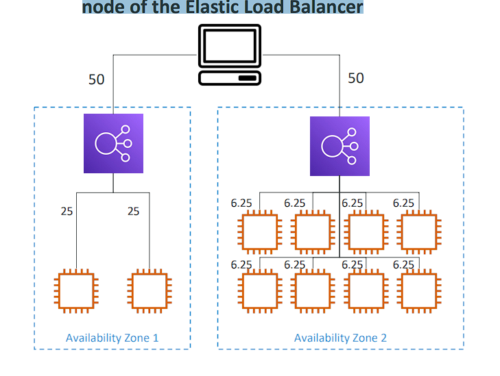

# High Availability & Scalability

# Scalability & High Availability

```plaintext
• Scalability means that an application / system can handle greater loads by adapting. (tải lớn hơn bằng cách thích ứng.)
• There are two kinds of scalability:
    • Vertical Scalability (chiều dọc)
    • Horizontal Scalability (= elasticity) (chiều ngang)
• Scalability is linked but different to High Availability
• Let’s deep dive into the distinction (sự phân biệt), using a call center as an example
```

# Vertical Scalability (chiều dọc)


• Vertically scalability means increasing the size of the instance
• For example, your application runs on a t2.micro
• Scaling that application vertically means running it on a t2.large
• Vertical scalability is very common for non distributed (không phân tán) systems, such as a database.
• RDS, ElastiCache are services that can scale vertically.
• There’s usually a limit to how much you can vertically scale (hardware limit)

# Horizontal Scalability


• Horizontal Scalability means increasing the number of instances / systems for your application
• Horizontal scaling implies (nghụ ý) distributed (phân tán) systems.
• This is very common for web applications / modern applications
• It’s easy to horizontally scale thanks the cloud offerings such as Amazon EC2

# High Availability


(ví dụ này gs building ở new york có gặp vấn đề thì build ở san fransico vẫn hoạt động bình thường thì nói là High Availability)
• High Availability usually goes hand in hand (đi đôi) with horizontal scaling
• High availability means running your application / system in at least 2 data centers (== Availability Zones)
• The goal of high availability is to survive (sống sót) a data center loss
• The high availability can be passive (bị động) (for RDS Multi AZ for example)
• The high availability can be active (for horizontal scaling)

# High Availability & Scalability For EC2

```plaintext
• Vertical Scaling: Increase instance size (= scale up / down)
    • From: t2.nano - 0.5G of RAM, 1 vCPU
    • To: u-12tb1.metal – 12.3 TB of RAM, 448 vCPUs
• Horizontal Scaling: Increase number of instances (= scale out / in)
    • Auto Scaling Group
    • Load Balancer
• High Availability: Run instances for the same application across multi AZ
    • Auto Scaling Group multi AZ
    • Load Balancer multi AZ
```

# What is load balancing?

• Load Balances are servers that forward traffic to multiple servers (e.g., EC2 instances) downstream (xuôi dòng)


# Why use a load balancer?

• Spread load (phân bổ tải) across multiple downstream instances
• Expose a single point of access (DNS) to your application
• Seamlessly handle failures (xử lý thất bại) of downstream instances (của các trường hợp xuôi dòng, bởi vì có healthcheck để gửi lưu lượng đến instance thích hợp)
• Do regular health checks to your instances
• Provide SSL termination (HTTPS) for your websites
• Enforce (thi hành) stickiness with cookies
• High availability across zones
• Separate (tách biệt) public traffic from private traffic

# Why use an Elastic Load Balancer?

```plaintext
• An Elastic Load Balancer is a managed load balancer
    • AWS guarantees (đảm bảo) that it will be working
    • AWS takes care (đảm nhiệm) of upgrades (nâng cấp), maintenance (bảo trì), high availability
    • AWS provides only a few configuration knobs (nút bẩm điều chỉnh)
• It costs less to setup your own load balancer but it will be a lot more effort
on your end
• It is integrated (tích hợp) with many AWS offerings / services
    • EC2, EC2 Auto Scaling Groups, Amazon ECS
    • AWS Certificate Manager (ACM), CloudWatch
    • Route 53, AWS WAF, AWS Global Accelerator
```

# Health Checks

• Health Checks are crucial (chủ yếu) for Load Balancers
• They enable the load balancer to know if instances it forwards traffic to are available to reply to requests
• The health check is done on a port and a route (/health is common)
• If the response is not 200 (OK), then the instance is unhealthy


# Types of load balancer on AWS

```plaintext
• AWS has 4 kinds of managed Load Balancers
• Classic Load Balancer (v1 - old generation) – 2009 – CLB
    • HTTP, HTTPS, TCP, SSL (secure TCP) (tương thích)
• Application Load Balancer (v2 - new generation) – 2016 – ALB
    • HTTP, HTTPS, WebSocket
• Network Load Balancer (v2 - new generation) – 2017 – NLB
    • TCP, TLS (secure TCP), UDP
• Gateway Load Balancer – 2020 – GWLB
    • Operates at layer 3 (Network layer) – IP Protocol
• Overall, it is recommended to use the newer generation (thế hệ mới hơn) load balancers as they
provide more features
• Some load balancers can be setup as internal (private) or external (public) ELBs
```

# Load Balancer Security Groups


# Application Load Balancer (v2)

```plaintext
• Application load balancers is Layer 7 (HTTP)
• Load balancing to multiple HTTP applications across machines (target groups)
• Load balancing to multiple applications on the same machine (ex: containers)
• Support for HTTP/2 and WebSocket
• Support redirects (from HTTP to HTTPS for example)

• Routing tables to different target groups (tới các nhóm khác nhau):
    • Routing based on path in URL (example.com/users & example.com/posts)
    • Routing based on hostname in URL (one.example.com & other.example.com)
    • Routing based on Query String, Headers
    (example.com/users?id=123&order=false)
• ALB are a great fit for micro services & container-based application
(example: Docker & Amazon ECS)
• Has a port mapping feature to redirect to a dynamic port in ECS (• Có tính năng ánh xạ cổng để chuyển hướng đến một cổng động trong ECS)
• In comparison (so sánh), we’d need multiple Classic Load Balancer per application
```

# Application Load Balancer (v2) - HTTP Based Traffic


# Target Groups

• EC2 instances (can be managed by an Auto Scaling Group) – HTTP
• ECS tasks (managed by ECS itself) – HTTP
• Lambda functions – HTTP request is translated into a JSON event
• IP Addresses – must be private IPs
• ALB can route to multiple target groups
• Health checks are at the target group level

# Query Strings/Parameters Routing


# Good to Know

```plaintext
• Fixed hostname (XXX.region.elb.amazonaws.com)
• The application servers don’t see the IP of the client directly
    • The true IP of the client is inserted (trèn) in the header X-Forwarded-For
    • We can also get Port (X-Forwarded-Port) and proto (X-Forwarded-Proto)
```


# ALB - Hands On

(ec2 => instance => name: My first instance => Userdata: copy ec2-user-data.sh => số lượng 2 => launch, rồi đổi tên cái 2 là second)
(loadbalancer => create => alb => name: DemoALB => chọn tối đa subnet => chọn Security group: (tạo một sg riêng name: demo-sg-loadbalance cho phép cổng http) => create target group -> type instance -> name: demo-tg-alb -> add 2 instance vô -> create => chọn tg đó => create)

## ALB - Hands On - P2

(Chỉnh sg của ec2, xóa rule http, add rule http với source: Security group của demo-sg-loadbalance (của ALB vừa tạo)) => save rules => bh chỉ có thể truy cập ec2 qua Alb

(Ec2 => loadblance => DemoALB => listners => click http:80 => add rule -> name: DemoRule -> add condition -> type: Path -> is: /error -> confirm -> next -> actions types: return fixed reponse -> code: 404 -> body: "Not found, custion error" -> next -> priority: 5 -> next -> create) => truy cập xxx/error

# Network Load Balancer (v2)

```plaintext
• Network load balancers (Layer 4) allow to:
    • Forward TCP & UDP traffic to your instances
    • Handle millions of request per seconds
    • Less latency ~100 ms (vs 400 ms for ALB)
• NLB has one static IP per AZ, and supports assigning Elastic IP each AZ
(helpful for whitelisting specific IP)
• NLB are used for extreme performance (hiệu suất cao), TCP or UDP traffic
• Not included in the AWS free tier
```

# TCP (Layer 4) Based Traffic


# Network Load Balancer –Target Groups

• EC2 instances
• IP Addresses – must be private IPs
• Application Load Balancer
• Health Checks support the TCP, HTTP and HTTPS Protocols


# NLB - Hands On

(Ec2 => LB => create => type: Network Load Balancer => name: DemoLNB => subnet: chọn tối đa (IP sẽ mỗi subnet sẽ do AWS gán) => SG: (Securit grup => create => name: demo-sg-nlb => rule: Http => from: anywhere => create) => listener -> protocol: TCP -> port: 80 -> target group (create tg => type instance => name: demo-tg-nlb => protocol: TCP => port: 80 => Health: HTTP => add 2 ec2 vô => create) => create ) => truy cập bằng DNS của NLB

==> Lỗi heath check: add rule HTTP, source: sg(demo-sg-nlb)

==> truy cập bằng dns NLB


# Gateway Load Balancer


(third party là các thiết bị ảo bên thứ ba, tôi muốn tát cả lưu lượng truy cập đi qua trước khi truy cập đến application ophair đi qua gateway loadbalancer then spread that traffic accross a target group of your vitrual application sau đó các application sẽ phân tích lưu lượng truy cập mạng đó và phát hiện kẻ xem nhập có thể drop it nếu hài lòng với nó và nó sẽ đi qua gateway loadbalancer một lần nữa và forward đến application)

```plaintext
• Deploy, scale, and manage a fleet of 3rd party network virtual appliances (thiết bị) in AWS
• Example: Firewalls, Intrusion Detection and Prevention Systems (hệ thống phát hiện và ngăn chặn), Deep Packet Inspection Systems (hệ thống kiểm tra gói sâu   ), payload manipulation (thao tác payload), …
(Điểm mạnh: phân tích lưu lượng mạng)

• Operates at Layer 3 (Network Layer) – IPPackets
• Combines (kết hợp) the following functions:
    • Transparent Network Gateway – single entry (một lối vào)/ ( một lối thoát duy nhất) exit for all traffic
    • Load Balancer – distributes traffic to your virtual appliances
• Uses the GENEVE protocol on port 6081
```

# Gateway Load Balancer –Target Groups

• EC2 instances
• IP Addresses – must be private IPs (Thiết bị chạy trên mạng ảo riêng của mình on your own data center)


# Sticky Sessions (Session Affinity)


• It is possible to implement stickiness so that the same client is always redirected to the same instance behind (phái sau) a load balancer
• This works for Classic Load Balancer, Application Load Balancer, and Network Load Balancer
• For both CLB & ALB, the “cookie” used for stickiness has an expiration date you control
• Use case: make sure the user doesn’t lose his session data
• Enabling stickiness may bring imbalance (mất cân bằng) to the load over the backend EC2 instances

```plaintext
Sticky Sessions (hay còn gọi là Session Affinity) là một kỹ thuật được sử dụng trong môi trường cân bằng tải (load balancing) để đảm bảo rằng một client cụ thể luôn được điều hướng tới cùng một server hoặc instance trong một cụm backend.

Dưới đây là giải thích chi tiết về Sticky Sessions:

1. Khái niệm Sticky Sessions:

- Khi một client (ví dụ: một người dùng trên trình duyệt) gửi yêu cầu đến hệ thống thông qua load balancer, bình thường load balancer sẽ phân phối yêu cầu đó tới các EC2 instances hoặc servers khác nhau để chia tải.
- Tuy nhiên, trong nhiều trường hợp, việc phân phối này có thể gây ra vấn đề nếu dữ liệu session của người dùng không được đồng bộ giữa các servers. Ví dụ: thông tin giỏ hàng của người dùng hoặc trạng thái đăng nhập có thể bị mất.
- Sticky Sessions giúp giải quyết vấn đề này bằng cách đảm bảo tất cả các yêu cầu từ cùng một client đều được gửi đến cùng một server trong suốt thời gian của session.

2. Hoạt động trên các loại Load Balancer:

- Sticky Sessions có thể được triển khai trên các loại AWS Load Balancer như Classic Load Balancer (CLB), Application Load Balancer (ALB), và Network Load Balancer (NLB).
CLB và ALB thường sử dụng cookie để duy trì stickiness. Cookie này có thể được cấu hình với ngày hết hạn mà bạn kiểm soát, tức là sau một khoảng thời gian nhất định, cookie sẽ hết hiệu lực và client có thể được chuyển đến một server khác.
3. Use Case (Trường hợp sử dụng):

- Sticky Sessions rất hữu ích cho các trường hợp mà dữ liệu session của người dùng cần được duy trì, ví dụ như các trang web thương mại điện tử, ứng dụng web, hoặc các dịch vụ yêu cầu người dùng đăng nhập và giữ trạng thái trong suốt quá trình tương tác.

4. Tác động đến Load Balancing:

Khi bật Sticky Sessions, có thể dẫn đến sự mất cân bằng trong phân phối tải (load imbalance). Điều này xảy ra khi một số server hoặc instance có quá nhiều phiên người dùng được liên kết, trong khi các server khác không nhận được nhiều yêu cầu, dẫn đến sự phân phối tài nguyên không đồng đều.

Tóm lại, Sticky Sessions đảm bảo rằng dữ liệu session của người dùng không bị mất khi họ tương tác với hệ thống qua load balancer, nhưng cần cẩn thận với việc làm mất cân bằng tải trên các servers trong backend.
```

# Sticky Sessions – Cookie Names

```plaintext
• Application-based Cookies
    • Custom cookie
        • Generated by the target (generate by your application)
        • Can include any custom attributes required by the application
        • Cookie name must be specified individually (chỉ định riêng) for each target group
        • Don’t use AWSALB, AWSALBAPP, or AWSALBTG (reserved (các biến này đã được sử dụng bới ALB) for use by the ELB)
• Application cookie
    • Generated by the load balancer
    • Cookie name is AWSALBAPP
• Duration-based Cookies
    • Cookie generated by the load balancer
    • Cookie name is AWSALB for ALB, AWSELB for CLB
```


(targetgroup => action: edit attribute => tích vô Stickiness => type: LoadBalancer generated cookie => save change)
Load trang lại nhiều lần vẫn một ip đó (ip của ec2)

Kiểm tra Response cookie có thể thấy AWSALB và AWSALBCORS


# Cross-Zone Load Balancing

- With Cross Zone Load Balancing: each load balancer instance distributes evenly (đồng đều) across all registered instances in all AZ
  

- Without Cross Zone Load Balancing: Requests are distributed in the instances of the node of the Elastic Load Balancer
  

# Cross-Zone Load Balancing

```plaintext
• Application Load Balancer
    • Enabled by default (can be disabled at the Target Group level)
    • No charges for inter AZ data (Cụm từ No charges for inter AZ data có nghĩa là khi sử dụng ALB, bạn không bị tính phí cho việc truyền dữ liệu giữa các Availability Zones (AZs) trong cùng một vùng (region).)
• Network Load Balancer & Gateway Load Balancer
    • Disabled by default
    • You pay charges ($) for inter AZ data if enabled
• Classic Load Balancer
    • Disabled by default
    • No charges for inter AZ data if enabled
```

## Hands On


# SSL/TLS - Basics

• An SSL Certificate allows traffic between your clients and your load balancer to be encrypted in transit (trong khi chuyển tiếp) (in-flight encryption)
• SSL refers to Secure Sockets Layer, used to encrypt connections
• TLS refers (đề cập) to Transport Layer Security, which is a newer version
• Nowadays, TLS certificates are mainly used (được sử dụng chủ yếu), but people still refer as SSL
• Public SSL certificates are issued by Certificate Authorities (CA)
• Comodo, Symantec, GoDaddy, GlobalSign, Digicert, Letsencrypt, etc…
• SSL certificates have an expiration date (you set) and must be renewed

# Load Balancer - SSL Certificates


```plaintext
• The load balancer uses an X.509 certificate (SSL/TLS server certificate)
• You can manage certificates using ACM (AWS Certificate Manager)
• You can create upload your own certificates alternatively
• HTTPS listener:
    • You must specify a default certificate
    • You can add an optional list of certs to support multiple domains
    • Clients can use SNI (Server Name Indication (chỉ định tên máy chủ)) to specify the hostname they reach (chỉ định)
    • Ability to specify a security policy to support older versions of SSL / TLS (legacy clients)
```

# SSL – Server Name Indication (SNI)


```plaintext
• SNI solves the problem of loading multiple SSL certificates onto one web server (to serve multiple websites)
• It’s a “newer” protocol, and requires the client to indicate (chỉ ra) the hostname of the target server in the initial SSL handshake (trong quá trình bắt tay ban đầu)
• The server will then find the correct certificate, or return the default one
Note:
    • Only works for ALB & NLB (newer generation), CloudFront
    • Does not work for CLB (older gen)
```

```plaintext
Server Name Indication (SNI) là một tính năng trong giao thức SSL/TLS giúp giải quyết vấn đề triển khai nhiều chứng chỉ SSL trên một máy chủ duy nhất để phục vụ cho nhiều website khác nhau.

Giải thích chi tiết:
1. Vấn đề trước khi có SNI:

- Trước khi SNI ra đời, một máy chủ web chỉ có thể sử dụng một chứng chỉ SSL cho một địa chỉ IP. Điều này gây ra vấn đề nếu máy chủ cần phục vụ nhiều website với nhiều tên miền khác nhau nhưng chỉ có một địa chỉ IP. Các website này phải sử dụng chứng chỉ SSL chung, điều này không lý tưởng cho bảo mật và quản lý chứng chỉ.

2. Cách hoạt động của SNI:

- SNI cho phép máy chủ web lưu trữ nhiều chứng chỉ SSL và phục vụ nhiều website trên cùng một địa chỉ IP. Khi một client (trình duyệt) kết nối đến máy chủ, trong quá trình bắt tay SSL/TLS (SSL handshake), client sẽ gửi hostname (tên miền) của website mà nó đang yêu cầu.
- Dựa trên hostname này, máy chủ sẽ chọn và gửi về chứng chỉ SSL phù hợp cho tên miền đó. Nếu không tìm thấy chứng chỉ phù hợp, máy chủ sẽ trả về chứng chỉ mặc định.
3. Tính khả dụng và yêu cầu:

- SNI là một giao thức tương đối mới, và không phải tất cả các client đều hỗ trợ nó (mặc dù hầu hết các trình duyệt và thiết bị hiện đại đều đã hỗ trợ).
- Các dịch vụ trên AWS hỗ trợ SNI bao gồm:
    Application Load Balancer (ALB)
    Network Load Balancer (NLB) (phiên bản mới hơn)
    CloudFront (dịch vụ phân phối nội dung của AWS)
- Classic Load Balancer (CLB) (phiên bản cũ hơn) không hỗ trợ SNI. Điều này có nghĩa là nếu bạn sử dụng CLB, bạn không thể sử dụng nhiều chứng chỉ SSL cho các tên miền khác nhau trên cùng một IP.
4. Lợi ích của SNI:

- Tiết kiệm tài nguyên: Không cần nhiều địa chỉ IP cho mỗi website với chứng chỉ SSL riêng biệt.
- Đơn giản hóa việc quản lý chứng chỉ: Bạn có thể lưu trữ và quản lý nhiều chứng chỉ trên cùng một máy chủ mà không phải cấu hình riêng cho mỗi IP.

Tóm lại:
SNI giúp phục vụ nhiều website với chứng chỉ SSL khác nhau trên cùng một máy chủ và địa chỉ IP. Nó yêu cầu client phải hỗ trợ gửi hostname trong quá trình bắt tay SSL, và hiện được hỗ trợ bởi các dịch vụ hiện đại như ALB, NLB, và CloudFront.
```

# Elastic Load Balancers – SSL Certificates

```plaintext
• Classic Load Balancer (v1)
    • Support only one SSL certificate
    • Must use multiple CLB for multiple hostname with multiple SSL certificates
• Application Load Balancer (v2)
    • Supports multiple listeners with multiple SSL certificates
    • Uses Server Name Indication (SNI) to make it work
• Network Load Balancer (v2)
    • Supports multiple listeners with multiple SSL certificates
    • Uses Server Name Indication (SNI) to make it work
```

## SSL Certificates - Hands On


(EC2 => LB => DemoALB => Listener => add listener => Protocol: `HTTPS` => Default actions: Forward -> target group: demo-tg-alb (minh họa thôi))

# Connection Draining


```plaintext
• Feature naming
    • Connection Draining (thoát kết nôi) – for CLB
    • Deregistration Delay (trì hoản hủy đăng ký) – for ALB & NLB
• Time to complete “in-flight requests” while the
instance is de-registering or unhealthy
• Stops sending new requests to the EC2
instance which is de-registering
• Between 1 to 3600 seconds (default: 300
seconds)
• Can be disabled (set value to 0)
• Set to a low value if your requests are short
```

```plaintext
Connection Draining (được gọi là Deregistration Delay cho ALB và NLB) là một tính năng của các load balancer trên AWS, giúp đảm bảo rằng các yêu cầu hiện đang được xử lý (in-flight requests) trên một EC2 instance có thời gian để hoàn tất trước khi instance đó bị gỡ đăng ký hoặc được đánh dấu là không khỏe mạnh (unhealthy).

Giải thích chi tiết:
1. Connection Draining (CLB) và Deregistration Delay (ALB/NLB):

- Tính năng này có tên gọi khác nhau tùy thuộc vào loại load balancer:
    - Connection Draining: Áp dụng cho Classic Load Balancer (CLB).
    - Deregistration Delay: Áp dụng cho Application Load Balancer (ALB) và Network Load Balancer (NLB).
- Mục đích của cả hai tính năng là như nhau: ngừng gửi yêu cầu mới đến một instance đang bị gỡ bỏ khỏi target group hoặc bị đánh dấu là không khỏe mạnh.
2. Hoạt động của Connection Draining / Deregistration Delay:

- Khi một EC2 instance được gỡ đăng ký (do thủ công hoặc không còn khỏe mạnh), tính năng này đảm bảo rằng tất cả các yêu cầu hiện có trên instance đó sẽ có thời gian để hoàn thành. Trong thời gian này:
    - Không có yêu cầu mới được gửi tới instance đó.
    - Các yêu cầu hiện tại (in-flight requests) vẫn được xử lý cho đến khi hoàn tất hoặc cho đến khi thời gian trì hoãn hết hạn.
3. Thời gian trì hoãn (delay time):

    - Bạn có thể cấu hình thời gian trì hoãn từ 1 đến 3600 giây (mặc định là 300 giây tức là 5 phút).
    - Trong khoảng thời gian này, nếu tất cả các yêu cầu đã hoàn tất, instance sẽ được gỡ bỏ ngay lập tức. Nếu hết thời gian trì hoãn mà yêu cầu vẫn chưa hoàn thành, kết nối sẽ bị đóng và instance bị gỡ bỏ.
    - Nếu bạn tắt tính năng này (bằng cách đặt giá trị thời gian về 0), instance sẽ bị gỡ đăng ký ngay lập tức mà không chờ đợi các yêu cầu hoàn tất.
4. Khi nào nên tùy chỉnh thời gian trì hoãn:

- Set to a low value: Nếu các yêu cầu của ứng dụng ngắn và kết thúc nhanh (ví dụ: các API có thời gian phản hồi rất nhanh), bạn có thể giảm thời gian trì hoãn để gỡ bỏ instance nhanh hơn và tránh lãng phí tài nguyên.
    - Set to a higher value: Nếu các yêu cầu thường kéo dài hơn (ví dụ: các giao dịch phức tạp), bạn có thể tăng thời gian để đảm bảo các yêu cầu hiện tại được xử lý hoàn toàn.
Tóm lại:
- Connection Draining / Deregistration Delay giúp các EC2 instances hoàn thành các yêu cầu hiện tại trước khi bị gỡ bỏ khỏi load balancer.
- Trong thời gian trì hoãn, không có yêu cầu mới được gửi đến instance, nhưng các yêu cầu đang xử lý vẫn tiếp tục.
Thời gian trì hoãn có thể được tùy chỉnh từ 1 đến 3600 giây (mặc định là 300 giây), hoặc có thể tắt nếu muốn ngừng ngay lập tức.

```

# What’s an Auto Scaling Group?

```plaintext
• In real-life, the load on your websites and application can change
• In the cloud, you can create and get rid (loại bỏ) of servers very quickly
• The goal of an Auto Scaling Group (ASG) is to:
    • Scale out (add EC2 instances) to match an increased load
    • Scale in (remove EC2 instances) to match a decreased load
    • Ensure we have a minimum and a maximum number of EC2 instances running
    • Automatically register new instances to a load balancer
    • Re-create an EC2 instance in case a previous one is terminated (ex: if unhealthy)
    • ASG are free (you only pay for the underlying EC2 instances)
```

# Auto Scaling Group in AWS


# Auto Scaling Group in AWS With Load Balancer


# Auto Scaling Group Attributes


```plaintext
• A Launch Template (older “Launch Configurations” are deprecated (không được dùng nữa))
    • AMI + Instance Type
    • EC2 User Data
    • EBS Volumes
    • Security Groups
    • SSH Key Pair
    • IAM Roles for your EC2 Instances
    • Network + Subnets Information
    • Load Balancer Information
• Min Size / Max Size / Initial Capacity
• Scaling Policies
```

# Auto Scaling - CloudWatch Alarms & Scaling

```
• It is possible to scale an ASG based on CloudWatch alarms
• An alarm monitors a metric (such as Average CPU, or a custom metric)
• Metrics such as Average CPU are computed for the overall ASG instances
• Based on the alarm:
    • We can create scale-out policies (increase the number of instances)
    • We can create scale-in policies (decrease the number of instances)
```


# ASG Hands On

(EC2 => ASG => create => name: DemoASG => launch template: (create launch template => name: MyDemoTemplate => amazone linux 2023 => ... => subnet: Don't include in launch template => Advanced detail -> User data: copy ec2-user-data.sh => create template) => next => chọn tối đa subnet => next => load balancing: Attach to an exits loadbalance => target group: chọn "demo-tg-alb" => Health checks: tích ELB => next => desired: 1 -> min: 1 -> max: 5 => next => create)

# Auto Scaling Groups – Scaling Policies

```
• Dynamic Scaling
    • Target Tracking Scaling
        • Simple to set-up
        • Example: I want the average ASG CPU to stay at around 40%
    • Simple / Step Scaling
        • When a CloudWatch alarm is triggered (example CPU > 70%), then add 2 units ( units" đề cập đến số lượng EC2 instances sẽ được thêm hoặc bớt)
        • When a CloudWatch alarm is triggered (example CPU < 30%), then remove 1
• Scheduled Scaling
    • Anticipate (đoán trước) a scaling based on known usage patterns (quy mô đã biết trước)
    • Example: increase the min capacity to 10 at 5 pm on Fridays
• Predictive (dự đoán) scaling: continuously forecast (dự báo liên tục) load and schedule scaling ahead (do aws dữ đoán)
```


# Good metrics to scale on


• CPUUtilization: Average CPU utilization across your instances
• RequestCountPerTarget: to make sure the number of requests per EC2
instances is stable (ổn định)
• Average Network In / Out (if you’re application is network bound)
• Any custom metric (that you push using CloudWatch)

# Auto Scaling Groups - Scaling Cooldowns


occurs: xảy ra
(Scaling Cooldowns trong Auto Scaling Groups (ASG) là một cơ chế nhằm ngăn chặn việc mở rộng hoặc thu hẹp thêm các EC2 instances trong một khoảng thời gian sau khi một hoạt động scaling (mở rộng hoặc thu hẹp quy mô) đã xảy ra.)
• After a scaling activity happens, you are in the cooldown period (default 300 seconds)
• During the cooldown period, the ASG will not launch or terminate additional instances (to allow for metrics to stabilize) (luôn cho phép số liệu là ổn định)
• Advice (lời khuyên): Use a ready-to-use AMI (sử dụng AMI có sẵn) to reduce configuration time in order to be serving request fasters and reduce the cooldown period

## Ccaling Policies Hands On

(DemoASG => Automatic scaling => create Dynamic scaling policy => type: Target tracking scaling => name: Target Tracking Policy => Metric type: Average CPU utilization => target value: 40 => create )
(đảm bảo asg có describe: 1, min: 1, max: 3)
(ssh vô ec2 => sudo ym instal stress -y => stress -c 4)

# Câu hỏi

Câu hỏi 3:
Elastic Load Balancers provide a .......................

Only Network Load Balancer provides both static DNS name and static IP. While, Application Load Balancer provides a static DNS name but it does NOT provide a static IP. The reason being that AWS wants your Elastic Load Balancer to be accessible using a static endpoint, even if the underlying (về cơ bản) infrastructure that AWS manages changes.

Câu hỏi 7:
You are working as a Solutions Architect for a company and you are required to design an architecture for a high-performance, low-latency application that will receive millions of requests per second. Which type of Elastic Load Balancer should you choose?

Đáp án: Network Load Balancer provides the highest performance and lowest latency if your application needs it.

Câu hỏi 9:
Application Load Balancers can route traffic to different Target Groups based on the following, EXCEPT:

Giải thích: ALBs can route traffic to different Target Groups based on URL Path, Hostname, HTTP Headers, and Query Strings.

Câu hỏi 11:
For compliance purposes, you would like to expose a fixed static IP address to your end-users so that they can write firewall rules that will be stable and approved by regulators. What type of Elastic Load Balancer would you choose?

Giải thích: Network Load Balancer has one static IP address per AZ and you can attach an Elastic IP address to it. Application Load Balancers and Classic Load Balancers have a static DNS name.

Câu hỏi 15:
You have an Application Load Balancer that is configured to redirect traffic to 3 Target Groups based on the following hostnames: users.example.com, api.external.example.com, and checkout.example.com. You would like to configure HTTPS for each of these hostnames. How do you configure the ALB to make this work?

Giải thích: Server Name Indication (SNI) allows you to expose multiple HTTPS applications each with its own SSL certificate on the same listener. Read more here: https://aws.amazon.com/blogs/aws/new-application-load-balancer-sni/

Câu hỏi 18:
Your boss asked you to scale your Auto Scaling Group based on the number of requests per minute your application makes to your database. What should you do?

Giải thích: There's no CloudWatch Metric for "requests per minute" for backend-to-database connections. You need to create a CloudWatch Custom Metric, then create a CloudWatch Alarm.

Câu hỏi 19:
An application is deployed with an Application Load Balancer and an Auto Scaling Group. Currently, you manually scale the ASG and you would like to define a Scaling Policy that will ensure the average number of connections to your EC2 instances is around 1000. Which Scaling Policy should you use?

Đáp án: Target Tracking policy

Câu hỏi 20:
You have an ASG and a Network Load Balancer. The application on your ASG supports the HTTP protocol and is integrated with the Load Balancer health checks. You are currently using the TCP health checks. You would like to migrate to using HTTP health checks, what do you do?
Đáp án: Migrate the health check to Http
