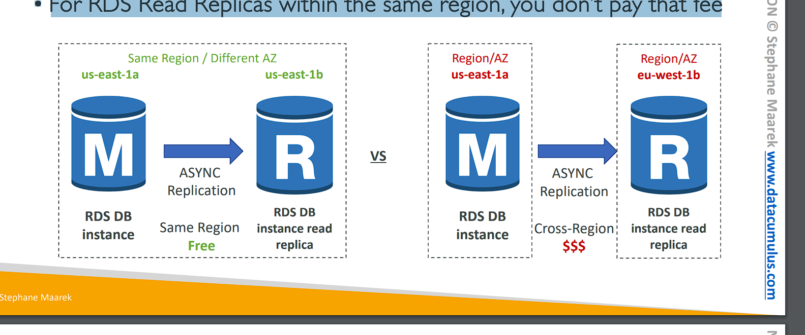
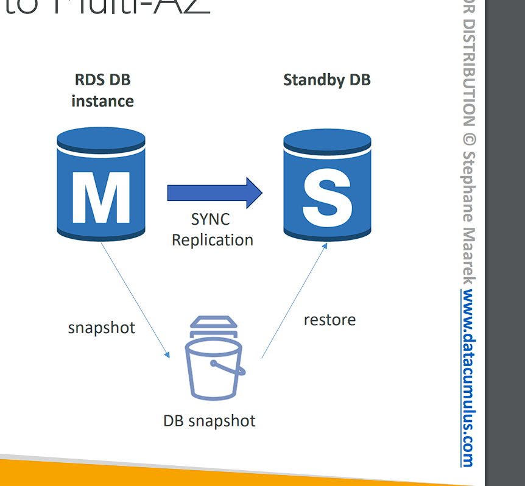

# RDS, Aurora & ElastiCache

# Amazon RDS Overview

• RDS stands for Relational Database Service
• It’s a managed DB service for DB use SQL as a query language.
• It allows you to create databases in the cloud that are managed by AWS
• Postgres
• MySQL
• MariaDB
• Oracle
• Microsoft SQL Server
• IBM DB2
• Aurora (AWS Proprietary database)

# Advantage over using RDS versus (so với) deploying DB on EC2

```
• RDS is a managed service:
    • Automated provisioning (cung cấp), OS patching (vá)
    • Continuous backups and restore to specific timestamp (Point in Time Restore)! (khôi phục điểm trong thời gian)
    • Monitoring dashboards
    • Read replicas for improved read performance
    • Multi AZ setup for DR (Disaster Recovery)
    • Maintenance windows for upgrades
    • Scaling capability (khả năng) (vertical and horizontal)
    • Storage backed by EBS
• BUT you can’t SSH into your instances
```

# RDS – Storage Auto Scaling


```
• Helps you increase storage on your RDS DB instance
dynamically
• When RDS detects (phát hiện) you are running out of free database
storage (hết dung lượng), it scales automatically
• Avoid manually scaling your database storage
• You have to set Maximum Storage Threshold (maximum limit for DB storage)
• Automatically modify storage if:
    • Free storage is less than 10% of allocated storage (Dung lượng miễn phí nhỏ hơn 10% dung lượng được phân bổ)
    • Low-storage (dung lương lưu trữ thấp) lasts at least 5 minutes (tồn tạo lâu dài trong 5 phút)
    • 6 hours have passed (đã trôi qua) since last modification (lần sửa đổi cuối cùng) (dung lượng sẽ tự động tăng nếu bạn kích hoạt nó)
• Useful for applications with unpredictable workloads (khối lượng công việc không thể đoán trước)
• Supports all RDS database engines
```

# RDS Read Replicas for read scalability


• Up to 15 Read Replicas
• Within AZ (ở trong AZ), Cross AZ or Cross Region
• Replication (sao chép) is ASYNC (không đồng bộ) (chúng là bản sao không đồng bộ), so reads are eventually consistent (Sao chép là ASYNC, do đó các lần đọc cuối cùng sẽ nhất quán) (for example, if your application reads from the Read Replica before they had the chance (cớ hội) to replicate (sao chép) the data then you may get all data)
• Replicas can be promoted (thăng chức) to their own DB
• Applications must update the connection string to leverage (tận dụng) read replicas

```
Giải thích ASYNC:
Sao chép không đồng bộ (asynchronous replication) trong Amazon RDS có nghĩa là quá trình sao chép dữ liệu từ primary database đến các read replicas không diễn ra ngay lập tức. Điều này có nghĩa là dữ liệu mới ghi vào cơ sở dữ liệu chính sẽ không được đồng bộ hóa ngay lập tức với các read replicas.

Vì sao chép là asynchronous, các read replicas có thể không có dữ liệu mới nhất ngay lập tức. Điều này dẫn đến hiện tượng mà ta gọi là eventual consistency (nhất quán dần dần), tức là sau một khoảng thời gian ngắn, các read replicas sẽ đồng bộ và trở nên nhất quán với dữ liệu trên primary database.

Do vậy, nếu ứng dụng cần đọc dữ liệu thời gian thực, việc sử dụng read replicas có thể không phù hợp trong một số trường hợp đòi hỏi độ nhất quán cao. Tuy nhiên, nó rất hiệu quả để chia tải cho các tác vụ đọc khi sự nhất quán tức thời không phải là yêu cầu khắt khe.
```

# RDS Read Replicas – Use Cases


• You have a production database that is taking on normal load (đang tải bình thường)
• You want to run a reporting application to run some analytics
• You create a Read Replica to run the new workload there
• The production application is unaffected (không bị ảnh hướng)
• Read replicas are used for SELECT (=read) only kind of statements (not INSERT, UPDATE, DELETE)

# RDS Read Replicas – Network Cost


• In AWS there’s a network cost when data goes from one AZ to another
• For RDS Read Replicas within the same region, you don’t pay that fee

# RDS Multi AZ (Disaster Recovery) (khắc phục thảm họa)


• SYNC replication (Đông bộ replication)
• One DNS name – automatic app failover to standby (tự động chuyển đổi dự phòng tự động sang DB cơ sở dữ liệu dự phong)
• Increase availability
• Failover in case of loss of AZ, loss of network, instance or storage failure
• No manual intervention in apps (không cần can thiệp thủ công)
• Not used for scaling
• Note:The Read Replicas be setup as Multi AZ for Disaster Recovery (DR)

# RDS – From Single-AZ to Multi-AZ



```
• Zero downtime operation (no need to stop the DB)
• Just click on “modify” for the database
• The following happens internally: (nội bộ)
    • A snapshot is taken (lấy)
    • A new DB is restored (khôi phục) from the snapshot in a new AZ
    • Synchronization is established between the two databases (đồng bộ hóa được thiết lập giữa 2 db)
```

# RDS Hands On

(RDS => Create database => method: Standard create => Engine type: Mysql => Version: Mysql 8.0.28 (Mặc định) => Templates: Producntion => Deployment options: Single DB instance => master password: "viettu123" => DB instance class: Burstable classes -> db.t3.micro => Storage type: SSD gp2 => Allowcated storage: 20 GB => Maximum storage threshold (giới hạn vượt ngưỡng): 1000 (GB) => vpc: default => public access: yes => vpc security group -> create new -> name: "demo-database-mysql" => Avaibility Zone: No preference => Addtional configuration -> initial đb name: mydb => create db)
(Dowload sql electron)  

Endpoint instance


Edit Sg chỉnh anywhare


Kết nối vào db


Create table


(Chọn database-1 => Action => Create reade replica)


# RDS Custom


```
• Managed Oracle and Microsoft SQL Server Database with OS and database customization
• RDS: Automates setup, operation, and scaling of database in AWS
• Custom: access to the underlying database and OS so you can
    • Configure settings
    • Install patches (cài đặt bản vá)
    • Enable native features
• Access the underlying EC2 Instance using SSH or SSM Session Manager
• De-activate (vô hiệu hóa) Automation Mode to perform your customization, better to take a DB snapshot before
• RDS vs. RDS Custom
    • RDS: entire database (toàn bộ db) and the OS to be managed by AWS
    • RDS Custom: full admin access to the underlying OS and the database
```

```plaintext
RDS Custom là phiên bản đặc biệt của Amazon RDS, cho phép người dùng có quyền tùy chỉnh nhiều hơn đối với hệ điều hành và cơ sở dữ liệu so với RDS thông thường. Dưới đây là giải thích chi tiết:

1. Cơ sở dữ liệu Oracle và Microsoft SQL Server có thể tùy chỉnh hệ điều hành và cơ sở dữ liệu:

- RDS Custom hỗ trợ hai hệ quản trị cơ sở dữ liệu phổ biến là Oracle và Microsoft SQL Server, cho phép tùy chỉnh sâu hơn vào các thành phần của cơ sở dữ liệu và hệ điều hành.

2. RDS tự động hóa việc thiết lập, vận hành và mở rộng quy mô cơ sở dữ liệu trên AWS:

- Tính năng RDS thông thường sẽ tự động hóa mọi quá trình liên quan đến việc thiết lập, vận hành và mở rộng cơ sở dữ liệu, giúp người dùng tập trung vào ứng dụng thay vì phải quản lý cơ sở hạ tầng.
3. RDS Custom cho phép truy cập vào hệ điều hành và cơ sở dữ liệu để tùy chỉnh:

- Với RDS Custom, bạn có thể tùy chỉnh sâu bằng cách truy cập vào các thành phần như hệ điều hành (OS) và cơ sở dữ liệu. Điều này bao gồm:
    - Cấu hình cài đặt theo nhu cầu của hệ thống.
    - Cài đặt bản vá (patches) hoặc cập nhật cho hệ điều hành và cơ sở dữ liệu.
    - Bật các tính năng gốc (native features) của cơ sở dữ liệu mà RDS thông thường không cho phép.
4. Truy cập EC2 Instance thông qua SSH hoặc SSM Session Manager:

- Người dùng có thể truy cập trực tiếp vào instance EC2 chạy cơ sở dữ liệu thông qua SSH hoặc SSM Session Manager để thực hiện các tùy chỉnh ở cấp hệ điều hành.
5. Vô hiệu hóa chế độ tự động (Automation Mode) để thực hiện tùy chỉnh:

- Để tùy chỉnh cơ sở dữ liệu hoặc hệ điều hành, bạn cần phải vô hiệu hóa chế độ tự động (Automation Mode). Tuy nhiên, tốt nhất là nên tạo một snapshot cơ sở dữ liệu trước khi thực hiện điều này để đảm bảo có thể khôi phục nếu xảy ra sự cố.
6. So sánh giữa RDS và RDS Custom:

- RDS: Tất cả các tác vụ liên quan đến quản lý cơ sở dữ liệu và hệ điều hành sẽ do AWS quản lý. Người dùng chỉ cần sử dụng mà không phải can thiệp vào cấu hình chi tiết.
- RDS Custom: Người dùng có toàn quyền quản trị, bao gồm cả hệ điều hành và cơ sở dữ liệu. Điều này phù hợp cho những tình huống yêu cầu tùy chỉnh sâu hoặc sử dụng các tính năng cụ thể mà RDS thông thường không hỗ trợ.

Tóm lại, RDS Custom mang lại sự linh hoạt lớn hơn, cho phép người dùng can thiệp và tùy chỉnh nhiều hơn, trong khi RDS thông thường tự động hóa và đơn giản hóa toàn bộ quá trình quản lý cơ sở dữ liệu.
```

# Amazon Aurora

• Aurora is a proprietary (độc quyền) technology from AWS (not open sourced)
• Postgres and MySQL are both supported as Aurora DB (that means your drivers will work as if Aurora was a Postgres or MySQL database)
• Aurora is “AWS cloud optimized” and claims 5x performance improvement (cải tiến hiệu suất) over MySQL on RDS, over 3x the performance of Postgres on RDS
• Aurora storage automatically grows in increments of 10GB, up to 128 TB.
• Aurora can have up to 15 replicas and the replication process is faster than MySQL (sub 10 ms replica lag) (độ trể bản sao dưới 10ms)
• Failover in Aurora is instantaneous (ngay lập tức). It’s HA (High Availability) native.
• Aurora costs more than RDS (20% more) – but is more efficient

# Aurora High Availability and Read Scaling


```
• 6 copies of your data across 3 AZ:
    • 4 copies out of 6 needed for writes
    • 3 copies out of 6 need for reads
    • Self healing with peer-to-peer replication (Tự phục hồi với sao chép ngang hàng)
    • Storage is striped (phân giải) across 100s of volumes (Lưu trữ được phân chia thành 100 tập)
• One Aurora Instance takes writes (master)
• Automated failover for master in less than30 seconds
• Master + up to 15 Aurora Read Replicas serve reads
• Support for Cross Region Replication
```

==> One master, multiple read replica and the storage is gonna be replica, self-healing (tự phục hồi) and expanding (tụ mở rộng)

```
Trong ngữ cảnh này, "copies" đề cập đến các bản sao của dữ liệu của bạn trong hệ thống cơ sở dữ liệu Amazon Aurora. Khi bạn sử dụng Aurora, hệ thống sẽ tự động tạo ra 6 bản sao của dữ liệu và phân phối chúng trên 3 Vùng Sẵn Sàng (Availability Zones - AZ) khác nhau trong cùng một khu vực (region). Điều này giúp đảm bảo tính sẵn sàng cao và bảo vệ dữ liệu của bạn trong trường hợp xảy ra sự cố.

Giải thích chi tiết:
1. 6 bản sao dữ liệu (copies):

- Khi bạn lưu dữ liệu vào Aurora, nó sẽ tự động tạo ra 6 bản sao (copies) của cùng một dữ liệu đó.
- Các bản sao này được phân phối qua 3 AZ khác nhau (mỗi AZ có ít nhất 2 bản sao), nhằm đảm bảo an toàn cho dữ liệu của bạn ngay cả khi một AZ gặp sự cố.
2. 4 trong số 6 bản sao cần thiết để ghi dữ liệu:

- Khi bạn thực hiện một ghi dữ liệu (write), Aurora cần có 4 trong số 6 bản sao xác nhận rằng chúng đã nhận được dữ liệu mới này trước khi hoàn thành giao dịch ghi. Điều này đảm bảo rằng dữ liệu được sao lưu đủ an toàn trước khi được xác nhận là đã ghi xong.
3. 3 trong số 6 bản sao cần thiết để đọc dữ liệu:

- Khi bạn thực hiện một đọc dữ liệu (read), Aurora chỉ cần kiểm tra 3 trong số 6 bản sao để trả về kết quả cho bạn. Điều này giúp hệ thống xử lý các yêu cầu đọc nhanh hơn và đảm bảo hiệu suất cao ngay cả khi có bản sao gặp lỗi.

Tóm lại, "copies" ở đây là các bản sao vật lý của dữ liệu mà Aurora lưu trữ và phân phối để tăng độ tin cậy và khả năng phục hồi của hệ thống cơ sở dữ liệu.
```

```
Aurora là một dịch vụ cơ sở dữ liệu được quản lý bởi AWS, nổi bật với khả năng mở rộng đọc và tính sẵn sàng cao (high availability). Dưới đây là giải thích chi tiết về các tính năng chính liên quan đến Aurora:

1. 6 bản sao dữ liệu được lưu trữ trên 3 AZ (Availability Zones)
- Aurora tự động sao lưu dữ liệu của bạn 6 lần và phân phối chúng trên 3 Vùng Sẵn Sàng (AZ) khác nhau, giúp đảm bảo tính toàn vẹn của dữ liệu và khả năng phục hồi cao.
- Điều này bảo vệ dữ liệu khỏi mất mát nếu có sự cố ở một AZ.
2. Yêu cầu 4 trong số 6 bản sao để ghi và 3 trong số 6 bản sao để đọc
- Khi thực hiện ghi dữ liệu (writes), Aurora yêu cầu xác nhận từ ít nhất 4 trong 6 bản sao để đảm bảo an toàn trước khi hoàn thành việc ghi.
- Với các đọc dữ liệu (reads), chỉ cần 3 trong 6 bản sao để trả về dữ liệu, điều này giúp đảm bảo độ tin cậy và hiệu suất đọc cao hơn.
3. Tự động sửa chữa với sao chép ngang hàng (self-healing với peer-to-peer replication)
- Aurora có khả năng tự động phát hiện lỗi và sửa chữa các bản sao bị hỏng. Nếu một bản sao bị hỏng, hệ thống sẽ tự động thay thế nó bằng một bản sao mới thông qua cơ chế sao chép ngang hàng (peer-to-peer replication).
4. Dữ liệu được phân dải (striped) qua hàng trăm volume
- Dữ liệu được chia nhỏ và phân phối (striped) qua hàng trăm volume để đảm bảo tốc độ truy cập nhanh hơn và tối ưu hóa hiệu suất. Điều này giúp Aurora dễ dàng mở rộng khi dữ liệu tăng lên mà không ảnh hưởng đến hiệu suất.
5. Một Aurora Instance nhận nhiệm vụ ghi (master)
- Aurora có kiến trúc chỉ có một instance chính (master) để xử lý các tác vụ ghi. Tất cả các yêu cầu ghi dữ liệu được chuyển đến master instance này.
6. Chuyển đổi dự phòng (failover) cho master tự động dưới 30 giây
- Trong trường hợp master instance gặp sự cố, Aurora sẽ tự động chuyển sang một bản sao khác để đảm nhận vai trò master mới, thường chỉ mất chưa đến 30 giây để quá trình này hoàn thành. Điều này đảm bảo tính khả dụng cao và giảm thiểu thời gian gián đoạn.
7. Master + lên đến 15 Aurora Read Replicas phục vụ đọc
- Aurora cho phép bạn tạo tới 15 bản sao đọc (read replicas). Các bản sao này chia sẻ tải cho các yêu cầu đọc, giúp mở rộng khả năng đọc của hệ thống mà không ảnh hưởng đến hiệu suất của master.
8. Hỗ trợ sao chép giữa các khu vực (Cross Region Replication)
- Aurora hỗ trợ sao chép giữa các khu vực địa lý (cross-region replication), cho phép bạn sao chép dữ liệu đến các khu vực AWS khác nhau. Điều này giúp tối ưu hóa hiệu suất cho người dùng trên toàn cầu và tăng cường khả năng chịu lỗi trong trường hợp sự cố toàn vùng.


Tóm lại, Aurora là một dịch vụ cơ sở dữ liệu có tính sẵn sàng cao, được thiết kế để đảm bảo dữ liệu an toàn, tự động phục hồi khi có lỗi, mở rộng khả năng đọc với nhiều bản sao, và cung cấp hiệu suất cao cho các ứng dụng yêu cầu nhiều tác vụ đọc và ghi.
```

# Aurora DB Cluster


# Features of Aurora

• Automatic fail-over
• Backup and Recovery
• Isolation (cách ly) and security
• Industry compliance (tuân thủ an ninh)
• Push-button scaling
• Automated Patching with Zero Downtime
• Advanced Monitoring
• Routine Maintenance (bảo trì định kỳ)
• Backtrack: restore data at any point of time without using backups

# Aurora - Hands On

(Create db => create method: Standard create => Engine: Aurora (Mysql) => Version: default => Template: Production => identifier: database-2 => master password: "viettu123" => DB instance class -> enable include previous generation classes -> Burstable classes -> db.t3.medium => Multi-AZ deployment: Create an Aurora Replica or Reader node => vpc: default => public access: Yes => VPC security group -> create new -> name: "demo-databgase-aurora" => Monitoring: không tích enable enhanced monitoring => Addtion configuration -> initial database name: mydb (tạo sẵn database) => create database)

Endpint của cluster


# Aurora Replicas - Auto Scaling


# Aurora – Custom Endpoints


• Define a subset of Aurora Instances as a Custom Endpoint
• Example: Run analytical queries on specific replicas
• The Reader Endpoint is generally (nói chung là) not used after defining Custom Endpoints

```
1. Define a subset of Aurora Instances as a Custom Endpoint
- Bạn có thể định nghĩa một nhóm các instance trong Aurora để tạo thành một endpoint (điểm cuối) tùy chỉnh.
- Thay vì sử dụng reader endpoint thông thường (điểm cuối để đọc dữ liệu từ tất cả các replica), bạn có thể tạo các custom endpoint để gán những truy vấn cụ thể vào một nhóm các instance nhất định.
- Ví dụ, nếu bạn có 5 replica, bạn có thể chỉ định 3 trong số đó vào một custom endpoint dành cho các tác vụ đọc nặng.
2. Example: Run analytical queries on specific replicas
- Ví dụ: Bạn có thể sử dụng các custom endpoint để chạy các truy vấn phân tích trên các replica cụ thể.
- Điều này giúp bạn điều phối các tác vụ xử lý nặng (như truy vấn phân tích hoặc báo cáo) vào một vài instance cụ thể, để các replica khác có thể xử lý các truy vấn đơn giản, cải thiện hiệu suất tổng thể.
- Các replica được chọn để chạy các truy vấn phân tích thường sẽ được tối ưu hóa về hiệu suất đọc dữ liệu lớn.
3. The Reader Endpoint is generally not used after defining Custom Endpoints
- Sau khi bạn định nghĩa các custom endpoint, bạn có thể không cần sử dụng reader endpoint chung nữa.
- Điều này bởi vì custom endpoint sẽ cho phép bạn kiểm soát tốt hơn cách mà các truy vấn được phân phối, thay vì để hệ thống Aurora tự động chọn replica từ reader endpoint. Bạn sẽ có khả năng chỉ định chính xác các replica nào sẽ xử lý từng loại tác vụ.

## Lợi ích của Custom Endpoints:
- Kiểm soát tốt hơn: Bạn có thể điều phối các loại truy vấn khác nhau đến những replica phù hợp.
- Tối ưu hóa hiệu suất: Những truy vấn phức tạp sẽ không làm ảnh hưởng đến hiệu suất của các truy vấn nhẹ hơn.

## Trường hợp sử dụng:
Phân tích dữ liệu: Bạn có thể tạo một custom endpoint chỉ cho những truy vấn phân tích, để không làm ảnh hưởng đến các truy vấn thông thường.
Tăng cường hiệu suất đọc: Các truy vấn nhẹ hơn có thể được xử lý trên các replica khác với các truy vấn nặng.
```

# Aurora Serverless


• Automated database instantiation and auto - scaling based on actual usage (trên mức sử dụng thực tế)
• Good for infrequent (không thường xuyên), intermittent (không liên tục) or unpredictable workloads (không đoán trước được wordload)
• No capacity planning needed
• Pay per second, can be more cost -effective

# Global Aurora


```
• Aurora Cross Region Read Replicas:
    • Useful for disaster recovery
    • Simple to put in place
• Aurora Global Database (recommended):
    • 1 Primary Region (read / write)
    • Up to 5 secondary (read-only) regions, replication lag is less than 1 second
    • Up to 16 Read Replicas per secondary region
    • Helps for decreasing latency (giảm bớt độ trễ)
    • Promoting another region (for disaster recovery) has an RTO of < 1 minute
    • Typical cross-region replication takes less than 1 second (mất ít hơn 1s để sao chép toàn bộ cross region)
```

# Aurora Machine Learning


• Enables you to add ML-based predictions (dự đoán) to your applications via SQL
• Simple, optimized, and secure integration between Aurora and AWS ML services
• Supported services
• Amazon SageMaker (use with any ML model)
• Amazon Comprehend (for sentiment analysis) (phân tích dữ liệu nhạy cảm)
• You don’t need to have ML experience
• Use cases: fraud detection (phát hiện gian lận), ads targeting (quản cáo ), sentiment analysis, product recommendations

# RDS Backups


```
• Automated backups:
    • Daily full backup of the database (during the backup window) (thực hiện backup hằng ngày)
    • Transaction logs are backed-up by RDS every 5 minutes
    • => ability to restore to any point in time (from oldest backup to 5 minutes ago)
    • 1 to 35 days of retention (giữ lại), set 0 to disable automated backups
• Manual DB Snapshots
    • Manually triggered by the user
    • Retention of backup for as long as you want
• Trick: in a stopped RDS database, you will still pay for storage. If you plan on stopping it for a long time, you should snapshot & restore instead
```

# Aurora Backups

```
• Automated backups
    • 1 to 35 days (cannot be disabled)
    • point-in-time (bất kỳ thời điểm) recovery in that timeframe
• Manual DB Snapshots
    • Manually triggered by the user
    • Retention of backup for as long as you want
```

# RDS & Aurora Restore options


```
• Restoring a RDS / Aurora backup or a snapshot creates a new database
• Restoring MySQL RDS database from S3
    • Create a backup of your on-premises database
    • Store it on Amazon S3 (object storage)
    • Restore the backup file onto a new RDS instance running MySQL
• Restoring MySQL Aurora cluster from S3
    • Create a backup of your on-premises database using Percona XtraBackup
    • Store the backup file on Amazon S3
    • Restore the backup file onto a new Aurora cluster running MySQL
```

# Aurora Database Cloning


```
• Create a new Aurora DB Cluster from an existing one
• Faster than snapshot & restore
• Uses copy-on-write protocol
    • Initially, the new DB cluster uses the same data volume as the original DB cluster (fast and efficient (hiệu quả) – no copying is needed)
    • When updates are made to the new DB cluster data, then additional storage is allocated (dung lượng mới được phân bổ) and data is copied to be separated (dữ liệu sẽ được sao chép bà phân tách)
• Very fast & cost-effective (tiết kiệm chi phí)
• Useful to create a “staging” database from a “production” database without impacting (không ảnh hưởng) the production database

```

# RDS & Aurora Security

```
• At-rest encryption: (mã hóa dữ liệu ở mức tối đa)
    • Database master & replicas encryption using AWS KMS – must be defined as launch time
    • If the master is not encrypted, the read replicas cannot be encrypted
    • To encrypt an un-encrypted database, go through a DB snapshot & restore as encrypted
• In-flight encryption (mã hóa dữ liệu khi truyền tải): TLS-ready by default, use the AWS TLS root certificates client-side
• IAM Authentication: IAM roles to connect to your database (instead of username/pw)
• Security Groups: Control Network access to your RDS / Aurora DB
• No SSH available except on RDS Custom
• Audit Logs can be enabled and sent to CloudWatch Logs for longer retention
```

```
Thông tin về bảo mật của RDS (Relational Database Service) và Aurora trong AWS mà bạn cung cấp có thể được giải thích như sau:

1. Mã hóa dữ liệu khi lưu trữ (At-rest encryption):
- Mã hóa cơ sở dữ liệu (CSDL) chính và bản sao (replicas) sử dụng AWS KMS (Key Management Service):

    - Khi khởi tạo CSDL (lúc "launch time"), bạn có thể chọn sử dụng mã hóa với KMS để bảo vệ dữ liệu.
    - KMS sẽ giúp quản lý và bảo vệ khóa mã hóa để mã hóa dữ liệu tại chỗ (lưu trữ) của RDS/Aurora.
- Nếu cơ sở dữ liệu chính không được mã hóa, các bản sao đọc (read replicas) cũng không thể mã hóa:

    - Điều này nghĩa là, mã hóa phải được áp dụng từ ban đầu cho cơ sở dữ liệu chính, sau đó các bản sao đọc của nó sẽ được mã hóa tương ứng.
- Để mã hóa cơ sở dữ liệu chưa mã hóa, phải sử dụng snapshot và khôi phục lại dưới dạng đã mã hóa:

    - AWS không hỗ trợ việc mã hóa trực tiếp một CSDL chưa được mã hóa. Thay vào đó, bạn phải tạo một bản sao lưu (snapshot) của CSDL đó, rồi khôi phục lại bản sao lưu này dưới dạng mã hóa.
2. Mã hóa dữ liệu khi truyền tải (In-flight encryption):
- TLS sẵn sàng theo mặc định:
    - Kết nối đến CSDL RDS/Aurora được mã hóa tự động khi truyền tải dữ liệu, đảm bảo an toàn trước các cuộc tấn công trên đường truyền.
- Sử dụng chứng chỉ gốc TLS của AWS trên client-side:
    - Để đảm bảo rằng kết nối của bạn tới RDS/Aurora là an toàn, bạn cần sử dụng chứng chỉ gốc TLS của AWS cho phía client.
3. Xác thực bằng IAM (IAM Authentication):
- Sử dụng IAM roles để kết nối tới cơ sở dữ liệu thay vì username/password:
    - AWS cho phép sử dụng xác thực bằng IAM roles thay vì cách truyền thống là dùng username/password. Điều này giúp tăng cường bảo mật và dễ dàng quản lý quyền truy cập.
4. Nhóm bảo mật (Security Groups):
- Kiểm soát truy cập mạng đến RDS/Aurora bằng Security Groups:
    - Bạn có thể cấu hình Security Groups để chỉ định các nguồn nào được phép kết nối tới RDS hoặc Aurora, hạn chế truy cập chỉ những địa chỉ IP hoặc nguồn đáng tin cậy.
5. Không có SSH, ngoại trừ RDS Custom:
- Không hỗ trợ SSH trừ RDS Custom:
    - Thông thường, AWS không cho phép truy cập SSH vào máy chủ của RDS/Aurora. Điều này giúp tăng cường bảo mật vì không có truy cập trực tiếp tới hệ điều hành dưới tầng. Tuy nhiên, RDS Custom là ngoại lệ, nơi bạn có thể truy cập SSH để tuỳ chỉnh cấu hình.
6. Nhật ký kiểm tra (Audit Logs):
- Nhật ký kiểm tra có thể được bật và gửi đến CloudWatch Logs để lưu trữ lâu hơn:
    - Bạn có thể bật tính năng ghi lại nhật ký hoạt động của RDS/Aurora (Audit Logs) để theo dõi và kiểm tra các hoạt động trong cơ sở dữ liệu. Các nhật ký này có thể được gửi đến CloudWatch Logs để lưu trữ và phân tích trong thời gian dài.
```

# Amazon RDS Proxy


• Fully managed database proxy for RDS
• Allows apps to pool and share DB connections established with the database
• Improving database efficiency (cải thiện hiệu quả db) by reducing the stress on database resources (e.g., CPU, RAM) and minimize open connections (and timeouts)
• Serverless, autoscaling, highly available (multi-AZ)
• Reduced RDS & Aurora failover time by up 66% (giảm thời gian chuyển đổi dự phòng lên tới 66%)
• Supports RDS (MySQL, PostgreSQL, MariaDB, MS SQL Server) and Aurora (MySQL, PostgreSQL)
• No code changes required for most apps
• Enforce (thi hành) IAM Authentication for DB, and securely store (lưu trữ một các an toàn ) credentials in AWS Secrets Manager
• RDS Proxy is never publicly accessible (không bao giờ truy cập công khai) (must be accessed from VPC)

==> RDS Proxy is used to minimize (giảm thiểu) and pool (gộp) connections on your RDS database instance, It's also used to minimize failover time (giảm thiểu thời gian chuyển đổi dự phòng) adn reduce it up to 66%, And also, it's used to enforce (thực thi) IAM authentication Adn to securely store (lưu trữ an toàn)

```
Amazon RDS Proxy
Amazon RDS Proxy là một dịch vụ proxy cơ sở dữ liệu được quản lý hoàn toàn dành cho Amazon RDS. Nó cung cấp các lợi ích về bảo mật và hiệu suất cho các ứng dụng khi kết nối với các cơ sở dữ liệu RDS và Aurora.

Giải thích chi tiết về các tính năng chính:

1. Proxy cơ sở dữ liệu được quản lý hoàn toàn
- RDS Proxy được AWS quản lý hoàn toàn, không yêu cầu người dùng tự thiết lập hay bảo trì cơ sở hạ tầng proxy. AWS sẽ chịu trách nhiệm về việc duy trì, nâng cấp và quản lý các tài nguyên liên quan đến proxy này.
2. Cho phép ứng dụng tái sử dụng kết nối cơ sở dữ liệu
- RDS Proxy giúp ứng dụng tái sử dụng và chia sẻ các kết nối đã được thiết lập với cơ sở dữ liệu.
- Điều này giúp tối ưu hóa tài nguyên và giảm số lượng kết nối mới cần tạo, giúp tăng hiệu suất tổng thể.
3. Tăng hiệu quả cơ sở dữ liệu bằng cách giảm tải tài nguyên
- Bằng cách quản lý các kết nối, RDS Proxy giúp giảm tải cho tài nguyên cơ sở dữ liệu (như CPU, RAM), vì số lượng kết nối trực tiếp đến CSDL được giảm thiểu.
- Điều này cũng giúp giảm các lỗi timeout (hết thời gian kết nối) khi có quá nhiều kết nối đến CSDL.
4. Serverless, tự động mở rộng và khả dụng cao (multi-AZ)
- Serverless: RDS Proxy không yêu cầu bạn quản lý tài nguyên vật lý hay cấu hình máy chủ. AWS sẽ tự động điều chỉnh kích thước và mở rộng để đáp ứng nhu cầu của ứng dụng.
- Tự động mở rộng: Proxy có thể mở rộng hoặc thu nhỏ dựa trên lượng kết nối hiện tại và tải công việc của ứng dụng.
- Khả dụng cao (multi-AZ): RDS Proxy được thiết kế để cung cấp khả năng tự động failover (chuyển đổi dự phòng) giữa các khu vực sẵn sàng (Availability Zones), đảm bảo ứng dụng không bị gián đoạn.
5. Giảm thời gian chuyển đổi dự phòng (failover) của RDS & Aurora lên đến 66%
- Trong trường hợp cơ sở dữ liệu gặp sự cố và cần chuyển đổi dự phòng (failover), RDS Proxy có thể giảm thời gian chuyển đổi này đáng kể, tới 66%.
- Điều này giúp ứng dụng của bạn có thời gian khôi phục nhanh hơn và giảm thời gian ngừng hoạt động.
6. Hỗ trợ nhiều loại cơ sở dữ liệu
- RDS Proxy hỗ trợ các loại CSDL phổ biến như:
    - RDS: MySQL, PostgreSQL, MariaDB, MS SQL Server.
    - Aurora: MySQL, PostgreSQL.
7. Không yêu cầu thay đổi mã nguồn cho hầu hết ứng dụng
- Trong hầu hết trường hợp, ứng dụng không cần thay đổi mã nguồn khi sử dụng RDS Proxy. Bạn có thể thêm proxy vào kiến trúc hiện có một cách dễ dàng mà không cần thay đổi logic ứng dụng.
8. Xác thực bằng IAM và lưu trữ thông tin đăng nhập an toàn trong AWS Secrets Manager
- RDS Proxy hỗ trợ xác thực bằng IAM, giúp bảo mật các kết nối đến CSDL mà không cần sử dụng username/password truyền thống.
- AWS Secrets Manager có thể được sử dụng để lưu trữ an toàn các thông tin đăng nhập cho cơ sở dữ liệu, thay vì phải lưu trữ trực tiếp trong mã nguồn hoặc ứng dụng.

Tóm lại:
Amazon RDS Proxy là một giải pháp tối ưu cho việc tăng hiệu suất và bảo mật khi ứng dụng của bạn kết nối với các dịch vụ RDS/Aurora. Nó giúp giảm tải cho cơ sở dữ liệu, tự động mở rộng và cải thiện tính khả dụng, đồng thời dễ dàng tích hợp mà không cần thay đổi nhiều trong ứng dụng hiện tại.
```

```
Giải thích về "Cho phép ứng dụng tái sử dụng và chia sẻ các kết nối cơ sở dữ liệu đã được thiết lập với CSDL"
"Cho phép ứng dụng tái sử dụng và chia sẻ các kết nối cơ sở dữ liệu đã được thiết lập với CSDL" nghĩa là Amazon RDS Proxy giúp quản lý và tối ưu hóa các kết nối giữa ứng dụng và cơ sở dữ liệu bằng cách:

1. Tái sử dụng kết nối (Connection Pooling):

- Vấn đề: Mỗi lần ứng dụng cần truy cập cơ sở dữ liệu, việc thiết lập một kết nối mới tốn thời gian và tài nguyên.
- Giải pháp: RDS Proxy duy trì một nhóm các kết nối đã được thiết lập sẵn (connection pool) mà ứng dụng có thể tái sử dụng. Khi ứng dụng cần truy cập CSDL, nó sẽ sử dụng một kết nối từ pool thay vì tạo mới.
2. Chia s- ẻ kết nối (Connection Sharing):

- Vấn đề: Nếu nhiều phần của ứng dụng hoặc nhiều ứng dụng cùng truy cập CSDL, số lượng kết nối có thể tăng lên đáng kể, gây tải nặng cho cơ sở dữ liệu.
- Giải pháp: RDS Proxy cho phép nhiều ứng dụng hoặc nhiều thành phần trong ứng dụng chia sẻ các kết nối hiện có từ pool, giảm tổng số kết nối cần thiết và tải lên CSDL.
3. Ưu điểm:

- Hiệu suất cải thiện: Giảm thời gian chờ đợi khi thiết lập kết nối mới, giúp ứng dụng phản hồi nhanh hơn.
- Tiết kiệm tài nguyên: Giảm số lượng kết nối mở đồng thời, giúp giảm tải trên CPU và RAM của cơ sở dữ liệu.
- Ổn định hơn: Giảm nguy cơ gặp phải lỗi timeout do số lượng kết nối vượt quá giới hạn của CSDL.

Ví dụ minh họa:
Giả sử bạn có một ứng dụng web với hàng ngàn người dùng truy cập đồng thời. Nếu mỗi yêu cầu từ người dùng tạo một kết nối mới tới cơ sở dữ liệu, số lượng kết nối có thể vượt quá khả năng xử lý của CSDL, dẫn đến giảm hiệu suất hoặc thậm chí là lỗi. Với RDS Proxy:

- Ứng dụng sẽ sử dụng các kết nối đã được quản lý sẵn trong pool của RDS Proxy.
- Khi một yêu cầu mới đến, nó sẽ sử dụng một kết nối có sẵn thay vì tạo mới.
- Điều này giúp duy trì số lượng kết nối ổn định và tối ưu hóa việc sử dụng tài nguyên của CSDL.
```

# Amazon ElastiCache Overview

• The same way RDS is to get managed Relational Databases… (Được quản lý bởi RD)
• ElastiCache is to get managed Redis or Memcached
• Caches are in-memory databases with really high performance, low latency
• Helps reduce load off of databases (giảm tải cho database) for read intensive workloads (khối lượng đọc công việc chuyên sâu)
• Helps make your application stateless
• AWS takes care of OS maintenance / patching, optimizations, setup configuration, monitoring, failure recovery and backups
• Using ElastiCache involves heavy application code changes (liên quan đến thực hiện một số thay đổi lớn về mã ứng dụng)

```
Amazon ElastiCache Overview
Amazon ElastiCache là một dịch vụ quản lý hoàn toàn của AWS cho hai hệ thống cơ sở dữ liệu lưu trữ trong bộ nhớ: Redis và Memcached. Những hệ thống này hoạt động như một bộ nhớ đệm (cache) và giúp cải thiện hiệu suất của ứng dụng bằng cách giảm tải cho các cơ sở dữ liệu chính.

Dưới đây là giải thích chi tiết:

1. ElastiCache tương tự RDS cho cơ sở dữ liệu quan hệ, nhưng dành cho Redis và Memcached
- RDS giúp quản lý các cơ sở dữ liệu quan hệ như MySQL, PostgreSQL, v.v., trong khi ElastiCache giúp quản lý các bộ nhớ đệm (cache) Redis hoặc Memcached.
- Cả hai đều là dịch vụ quản lý hoàn toàn, tức AWS quản lý cơ sở hạ tầng và vận hành, cho phép bạn tập trung vào logic ứng dụng.
2. Caches là các cơ sở dữ liệu lưu trữ trong bộ nhớ với hiệu suất cao và độ trễ thấp
- Redis và Memcached là các cơ sở dữ liệu trong bộ nhớ (in-memory), có nghĩa là dữ liệu được lưu trữ trực tiếp trong RAM thay vì trên đĩa cứng.
- Điều này mang lại hiệu suất rất cao và độ trễ thấp vì việc truy xuất dữ liệu từ RAM nhanh hơn nhiều so với từ ổ đĩa.
3. Giúp giảm tải cơ sở dữ liệu cho các workload đọc nhiều
- ElastiCache có thể được sử dụng như một lớp bộ nhớ đệm giữa ứng dụng và cơ sở dữ liệu chính.
- Dữ liệu thường xuyên được truy xuất có thể được lưu trữ trong ElastiCache, giúp giảm số lượng yêu cầu đọc gửi tới cơ sở dữ liệu chính, từ đó giảm tải và tăng tốc độ xử lý cho ứng dụng.
4. Giúp ứng dụng không phụ thuộc vào trạng thái (stateless)
- Ứng dụng không phụ thuộc vào trạng thái (stateless) là ứng dụng không cần phải lưu trữ thông tin trạng thái của người dùng hay session trực tiếp trên máy chủ ứng dụng.
- Khi sử dụng ElastiCache để lưu trữ thông tin trạng thái, ứng dụng có thể trở nên "stateless", giúp dễ dàng mở rộng và phân tán hơn.
5. AWS quản lý toàn bộ việc bảo trì hệ điều hành, vá lỗi, tối ưu hóa, cấu hình, giám sát, khôi phục lỗi và sao lưu
- AWS chịu trách nhiệm về:
    - Bảo trì hệ điều hành: AWS tự động vá lỗi và cập nhật.
    - Tối ưu hóa: Tự động thực hiện các tối ưu hóa về hiệu suất và bảo mật.
    - Cài đặt và cấu hình: AWS cung cấp các thiết lập sẵn sàng để sử dụng.
    - Giám sát và khôi phục lỗi: AWS đảm bảo ElastiCache luôn hoạt động tốt và tự động khôi phục khi có lỗi.
    - Sao lưu: AWS có khả năng sao lưu và phục hồi dữ liệu nhanh chóng.
6. Sử dụng ElastiCache đòi hỏi nhiều thay đổi trong mã nguồn ứng dụng
- Vì ElastiCache hoạt động như một lớp cache, bạn sẽ cần thay đổi mã nguồn để:
    - Thêm logic lưu và truy xuất dữ liệu từ cache (Redis/Memcached).
    - Xác định khi nào cần lưu trữ dữ liệu trong cache và khi nào cần làm mới dữ liệu từ cơ sở dữ liệu chính.
    - Điều này có thể yêu cầu thay đổi lớn trong mã nguồn ứng dụng để tích hợp ElastiCache vào quy trình xử lý dữ liệu hiện có.
## Tóm lại:
ElastiCache là một giải pháp mạnh mẽ để tăng tốc ứng dụng bằng cách sử dụng Redis hoặc Memcached làm bộ nhớ đệm. Nó giúp giảm tải cho cơ sở dữ liệu chính, cải thiện hiệu suất và cho phép ứng dụng trở nên stateless. Tuy nhiên, việc tích hợp ElastiCache thường đòi hỏi thay đổi lớn trong mã nguồn của ứng dụng để tương tác với lớp cache.

Amazon ElastiCache Overview
Amazon ElastiCache là một dịch vụ quản lý hoàn toàn của AWS cho hai hệ thống cơ sở dữ liệu lưu trữ trong bộ nhớ: Redis và Memcached. Những hệ thống này hoạt động như một bộ nhớ đệm (cache) và giúp cải thiện hiệu suất của ứng dụng bằng cách giảm tải cho các cơ sở dữ liệu chính.

Dưới đây là giải thích chi tiết:

1. ElastiCache tương tự RDS cho cơ sở dữ liệu quan hệ, nhưng dành cho Redis và Memcached
RDS giúp quản lý các cơ sở dữ liệu quan hệ như MySQL, PostgreSQL, v.v., trong khi ElastiCache giúp quản lý các bộ nhớ đệm (cache) Redis hoặc Memcached.
Cả hai đều là dịch vụ quản lý hoàn toàn, tức AWS quản lý cơ sở hạ tầng và vận hành, cho phép bạn tập trung vào logic ứng dụng.
2. Caches là các cơ sở dữ liệu lưu trữ trong bộ nhớ với hiệu suất cao và độ trễ thấp
Redis và Memcached là các cơ sở dữ liệu trong bộ nhớ (in-memory), có nghĩa là dữ liệu được lưu trữ trực tiếp trong RAM thay vì trên đĩa cứng.
Điều này mang lại hiệu suất rất cao và độ trễ thấp vì việc truy xuất dữ liệu từ RAM nhanh hơn nhiều so với từ ổ đĩa.
3. Giúp giảm tải cơ sở dữ liệu cho các workload đọc nhiều
ElastiCache có thể được sử dụng như một lớp bộ nhớ đệm giữa ứng dụng và cơ sở dữ liệu chính.
Dữ liệu thường xuyên được truy xuất có thể được lưu trữ trong ElastiCache, giúp giảm số lượng yêu cầu đọc gửi tới cơ sở dữ liệu chính, từ đó giảm tải và tăng tốc độ xử lý cho ứng dụng.
4. Giúp ứng dụng không phụ thuộc vào trạng thái (stateless)
Ứng dụng không phụ thuộc vào trạng thái (stateless) là ứng dụng không cần phải lưu trữ thông tin trạng thái của người dùng hay session trực tiếp trên máy chủ ứng dụng.
Khi sử dụng ElastiCache để lưu trữ thông tin trạng thái, ứng dụng có thể trở nên "stateless", giúp dễ dàng mở rộng và phân tán hơn.
5. AWS quản lý toàn bộ việc bảo trì hệ điều hành, vá lỗi, tối ưu hóa, cấu hình, giám sát, khôi phục lỗi và sao lưu
AWS chịu trách nhiệm về:
Bảo trì hệ điều hành: AWS tự động vá lỗi và cập nhật.
Tối ưu hóa: Tự động thực hiện các tối ưu hóa về hiệu suất và bảo mật.
Cài đặt và cấu hình: AWS cung cấp các thiết lập sẵn sàng để sử dụng.
Giám sát và khôi phục lỗi: AWS đảm bảo ElastiCache luôn hoạt động tốt và tự động khôi phục khi có lỗi.
Sao lưu: AWS có khả năng sao lưu và phục hồi dữ liệu nhanh chóng.
6. Sử dụng ElastiCache đòi hỏi nhiều thay đổi trong mã nguồn ứng dụng
Vì ElastiCache hoạt động như một lớp cache, bạn sẽ cần thay đổi mã nguồn để:
Thêm logic lưu và truy xuất dữ liệu từ cache (Redis/Memcached).
Xác định khi nào cần lưu trữ dữ liệu trong cache và khi nào cần làm mới dữ liệu từ cơ sở dữ liệu chính.
Điều này có thể yêu cầu thay đổi lớn trong mã nguồn ứng dụng để tích hợp ElastiCache vào quy trình xử lý dữ liệu hiện có.
Tóm lại:
ElastiCache là một giải pháp mạnh mẽ để tăng tốc ứng dụng bằng cách sử dụng Redis hoặc Memcached làm bộ nhớ đệm. Nó giúp giảm tải cho cơ sở dữ liệu chính, cải thiện hiệu suất và cho phép ứng dụng trở nên stateless. Tuy nhiên, việc tích hợp ElastiCache thường đòi hỏi thay đổi lớn trong mã nguồn của ứng dụng để tương tác với lớp cache.


```

# ElastiCache Solution Architecture - DB Cache


• Applications queries ElastiCache, if not available, get from RDS
and store in ElastiCache.
• Helps relieve load in RDS (giảm tải cho RDS)
• Cache must have an invalidation strategy (chiến lược vô hiệu hóa) to make sure only the most current data is used in there. (đảm bảo dữ liệu mới nhất được sử dụng trong đó)

# ElastiCache Solution Architecture – User Session Store


• User logs into any of the application
• The application writes the session data into ElastiCache
• The user hits another instance of our application
• The instance retrieves (lấy lại) the data and the user is already logged in

# ElastiCache – Redis vs Memcached

## REDIS


```
• Multi AZ with Auto-Failover
• Read Replicas to scale reads and have high availability
• Data Durability (độ bền) using AOF persistence (bền vững AOF)
• Backup and restore features
• Supports Sets and Sorted Sets
```

## MEMCACHED


```
• Multi-node for partitioning (phân vùng) of data (sharding)
• No high availability (replication)
• Non persistent (không phải bộ nhớ đệm liên tục)
• No backup and restore
• Multi-threaded architecture
```

# ElasticCache Hands On

(ElatiCache => Get Started => Redis => Deployment option: Design your own cache => Creation method: Cluster cache => Cluster mode: Disable (the redis cluster will have a single shard) => Cluster info -> Name: "DemoCluster" => Location: AWS Cloud => Multi-AZ: bỏ tích Enable => Node type: cache.t2.micro => Number of relicas: 0 => Subnet groups setting -> Name: "my-first-subnet-group" => next => Backup: bỏ tích enable automatic backups => next => Create)

Endpoint


# ElastiCache – Cache Security


```
• ElastiCache supports IAM Authentication for Redis
• IAM policies on ElastiCache are only used for AWS API-level security
• Redis AUTH
• You can set a “password/token” when you create a Redis cluster
• This is an extra level of security for your cache (on top of security groups)
• Support SSL in flight encryption
• Memcached
• Supports SASL-based authentication (advanced)
```

# Patterns for ElastiCache

Lazy Loading illustrated


• Lazy Loading: all the read data is cached, data can become stale in
cache (dữ liệu có thể trở lên cũ trong bộ nhớ đệm)
• Write Through: Adds or update data in the cache when writtento a DB (no stale data)
• Session Store: store temporary session data in a cache (using TTL features)
• Quote: There are only two hard things in Computer Science: cache invalidation (vô hiệu hóa bộ nhớ đệm) and naming things

```
Các Pattern cho ElastiCache
1. Lazy Loading

- Cách hoạt động:
    - Dữ liệu chỉ được tải vào cache khi có yêu cầu đọc từ ứng dụng.
    - Nếu dữ liệu không có trong cache (cache miss), nó sẽ được lấy từ cơ sở dữ liệu chính (DB) và sau đó được lưu trữ vào cache.
- Nhược điểm:
- Dữ liệu có thể trở nên lỗi thời (stale): Khi dữ liệu trong DB thay đổi, cache vẫn lưu dữ liệu cũ, điều này gây ra vấn đề "cache stale".
- Nếu dữ liệu hết hạn hoặc bị xóa khỏi cache, phải mất thêm thời gian để tải lại từ DB.
- Ưu điểm:
    - Chỉ lưu những dữ liệu thực sự được yêu cầu, giúp tiết kiệm bộ nhớ cache.
2. Write Through

- Cách hoạt động:
    - Dữ liệu được cập nhật đồng thời cả cache và cơ sở dữ liệu khi có yêu cầu ghi.
    - Khi ứng dụng ghi dữ liệu vào DB, nó cũng ngay lập tức cập nhật dữ liệu vào cache.
- Nhược điểm:
    - Có thể làm tăng tải lên cache do mọi dữ liệu đều phải được lưu trữ trong cache, kể cả những dữ liệu không cần thiết cho các lần truy xuất tiếp theo.
- Ưu điểm:
- Không có dữ liệu lỗi thời trong cache: Cache luôn được cập nhật ngay khi có thay đổi trong DB, đảm bảo tính nhất quán giữa cache và DB.
3. Session Store

- Cách hoạt động:
    - Cache được sử dụng để lưu trữ dữ liệu phiên (session) tạm thời của người dùng. Thường sử dụng tính năng TTL (Time-to-Live) để tự động xóa dữ liệu sau một khoảng thời gian.
- Ưu điểm:
    - Giúp các ứng dụng lưu trữ trạng thái phiên người dùng mà không cần lưu trữ trong DB chính, giúp giảm tải và cải thiện hiệu suất.
    - Dữ liệu phiên không cần tồn tại vĩnh viễn, do đó TTL giúp tự động quản lý việc hết hạn dữ liệu phiên.
- Nhược điểm:
    - Nếu cache gặp sự cố, dữ liệu phiên có thể bị mất nếu không có cơ chế lưu trữ dự phòng.
## Câu nói nổi tiếng
- "There are only two hard things in Computer Science: cache invalidation and naming things":
    - Ý nghĩa: Cache invalidation (hủy dữ liệu cache lỗi thời) là một vấn đề khó trong kỹ thuật, vì rất khó để xác định khi nào dữ liệu trong cache cần được xóa hoặc làm mới để đảm bảo tính nhất quán với cơ sở dữ liệu. Vấn đề này phức tạp vì nếu không quản lý đúng cách, cache có thể chứa dữ liệu lỗi thời, gây ra sự không nhất quán và vấn đề hiệu suất.
    - Naming things (đặt tên): Việc đặt tên cho các biến, hàm, hoặc các thực thể trong lập trình tưởng chừng như đơn giản nhưng lại rất quan trọng và thường gây khó khăn trong việc giữ tính rõ ràng và nhất quán trong code.

Tóm tắt:
- Lazy Loading: Cache chỉ tải dữ liệu khi được yêu cầu đọc, nhưng có thể gây ra dữ liệu lỗi thời.
- Write Through: Cache được cập nhật ngay khi có ghi vào DB, đảm bảo tính nhất quán nhưng tốn nhiều bộ nhớ.
- Session Store: Cache lưu trữ dữ liệu phiên tạm thời, dùng TTL để tự động xóa dữ liệu sau một thời gian.
```

# ElastiCache – Redis Use Case


• Gaming Leaderboards (bảng xếp hạng) are computationally complex
• Redis Sorted sets guarantee both uniqueness and element ordering (đảm bảo cả tính duy nhất và thứ tự phần tử)
• Each time a new element added, it’s ranked in real time, then added in correct order

```
Giải thích về Redis Sorted Sets trong ElastiCache và ứng dụng cho bảng xếp hạng trong game:
1. Vấn -  trong game:

- Bảng xếp hạng (leaderboard) trong game thường rất phức tạp về mặt tính toán, vì nó đòi hỏi sắp xếp hàng loạt người chơi theo điểm số trong thời gian thực.
- Khi người chơi mới tham gia hoặc điểm số của người chơi hiện tại thay đổi, hệ thống cần tính toán xếp hạng lại ngay lập tức và chèn điểm số vào đúng vị trí trong bảng.
2. Redis Sorted Sets:

- Redis Sorted Sets là một cấu trúc dữ liệu trong Redis được tối ưu hóa cho các trường hợp cần bảo đảm tính duy nhất của các phần tử và sắp xếp chúng theo thứ tự dựa trên một giá trị "score".
- Mỗi phần tử trong sorted set có hai thành phần chính:
    - Giá trị phần tử: Đại diện cho người chơi hoặc đối tượng.
    - Điểm số (score): Được sử dụng để xác định thứ hạng, ví dụ như điểm số trong game.
- Mỗi khi một phần tử mới được thêm vào set, Redis sẽ:
    - Tính toán thứ hạng (rank) dựa trên score của phần tử.
    - Chèn phần tử vào đúng vị trí trong tập hợp đã sắp xếp.
3. Cách Redis xử lý bảng xếp hạng game:

- Khi có một người chơi mới hoặc một người chơi có điểm số mới, Redis sẽ:
    - Thêm người chơi vào sorted set với giá trị là tên người chơi và score là điểm của họ.
    - Redis đảm bảo tính duy nhất cho từng người chơi (không có người chơi nào bị lặp lại trong set).
    - Redis tự động sắp xếp người chơi theo điểm số, từ cao đến thấp hoặc ngược lại, tùy cấu hình.
    - Khi người chơi yêu cầu hiển thị bảng xếp hạng, bạn chỉ cần yêu cầu Redis lấy danh sách người chơi theo thứ tự đã sắp xếp.
4. Ưu điểm của Redis Sorted Sets cho bảng xếp hạng:

- Hiệu suất cao trong thời gian thực: Redis xử lý các thao tác thêm mới và sắp xếp ngay lập tức, đảm bảo thứ hạng luôn được cập nhật.
- Đảm bảo tính duy nhất: Mỗi người chơi chỉ có thể có một vị trí duy nhất trong bảng xếp hạng, tránh trùng lặp.
- Truy xuất thứ hạng nhanh chóng: Redis cho phép dễ dàng lấy một khoảng từ sorted set (ví dụ: top 10 người chơi) hoặc thứ hạng cụ thể của một người chơi.

## Ví dụ:
- Sử dụng Redis Sorted Sets để quản lý bảng xếp hạng trong game:
    - Người chơi Player1 đạt được 1000 điểm, Redis sẽ thêm Player1 vào sorted set với score = 1000.
    - Người chơi Player2 đạt được 1200 điểm, Redis thêm Player2 vào và chèn vào vị trí cao hơn Player1.
    - Nếu Player1 đạt thêm điểm và tăng lên 1300 điểm, Redis sẽ tự động sắp xếp lại vị trí của Player1.
## Tổng kết:
Redis Sorted Sets trong ElastiCache giúp đơn giản hóa và tối ưu hóa quá trình quản lý bảng xếp hạng trong game bằng cách:

- Đảm bảo tính duy nhất của từng người chơi.
- Sắp xếp tự động theo điểm số.
- Xử lý trong thời gian thực, giúp bảng xếp hạng luôn cập nhật chính xác ngay khi có thay đổi.
```

```
Giải thích về Redis Sorted Sets và ứng dụng trong bảng xếp hạng game:
1. Vấn đề với bảng xếp hạng game:

- Bảng xếp hạng (leaderboard) trong game là một nhiệm vụ tính toán phức tạp. Để duy trì thứ tự điểm số của hàng ngàn hoặc hàng triệu người chơi trong thời gian thực, hệ thống phải thường xuyên thêm, sắp xếp và cập nhật dữ liệu.
- Khi có người chơi mới hoặc điểm số thay đổi, cần phải xác định lại thứ hạng và chèn vào vị trí đúng trong bảng xếp hạng.
2. Redis Sorted Sets là giải pháp tối ưu:

- Redis cung cấp một cấu trúc dữ liệu gọi là Sorted Set (tập hợp có sắp xếp), cho phép lưu trữ các phần tử với điểm số (score) kèm theo.
- Sorted Set có hai đặc tính chính:
    - Uniqueness (tính duy nhất): Mỗi phần tử trong Sorted Set là duy nhất. Điều này đảm bảo rằng không có hai phần tử nào giống nhau (ví dụ: mỗi người chơi chỉ xuất hiện một lần trong bảng xếp hạng).
    - Ordering (sắp xếp theo thứ tự): Redis tự động sắp xếp các phần tử dựa trên score (điểm số), cho phép truy xuất dữ liệu đã sắp xếp rất nhanh chóng.
3. Cách Redis xử lý bảng xếp hạng game:

- Mỗi khi một người chơi đạt được điểm mới, dữ liệu sẽ được thêm vào Sorted Set của Redis với score là điểm số và giá trị là tên người chơi.
- Redis sẽ tính toán thứ hạng ngay lập tức và chèn người chơi vào vị trí chính xác trong tập hợp đã sắp xếp. Điều này giúp bảng xếp hạng luôn chính xác và cập nhật trong thời gian thực.
4. Lợi ích của Redis Sorted Sets cho bảng xếp hạng game:

- Hiệu suất cao: Redis hoạt động hoàn toàn trong bộ nhớ (in-memory), giúp các thao tác thêm, xóa và sắp xếp dữ liệu diễn ra nhanh chóng.
- Tính duy nhất và sắp xếp tự động: Redis đảm bảo rằng mỗi người chơi chỉ có một vị trí duy nhất trong bảng xếp hạng, và thứ tự người chơi luôn được duy trì dựa trên điểm số.
- Truy xuất nhanh chóng: Dễ dàng lấy ra danh sách top người chơi hoặc thứ hạng cụ thể của từng người chơi mà không cần phải tính toán lại.
## Ví dụ:
- Thêm người chơi vào Redis Sorted Set:
    - Khi người chơi Player1 đạt được 2000 điểm, Redis thêm Player1 vào Sorted Set với score là 2000.
    - Nếu người chơi Player2 đạt 2500 điểm, Redis sẽ thêm Player2 vào và sắp xếp trước Player1 trong bảng xếp hạng.
    - Khi điểm số của Player1 thay đổi lên 2700 điểm, Redis sẽ tự động di chuyển Player1 lên vị trí cao hơn trong bảng xếp hạng mà không cần can thiệp thủ công.
## Tóm tắt:
- Redis Sorted Sets là một giải pháp tối ưu cho việc quản lý bảng xếp hạng game nhờ vào khả năng đảm bảo tính duy nhất của các phần tử và sắp xếp tự động theo điểm số. Nó cho phép xếp hạng và cập nhật thứ tự của người chơi theo thời gian thực mà không cần tính toán phức tạp, đồng thời cải thiện hiệu suất nhờ hoạt động hoàn toàn trong bộ nhớ.
```

# List of Ports to be familiar with

Here's a list of standard ports you should see at least once. You shouldn't remember them (the exam will not test you on that), but you should be able to differentiate between an Important (HTTPS - port 443) and a database port (PostgreSQL - port 5432)

Important ports:

FTP: 21

SSH: 22

SFTP: 22 (same as SSH)

HTTP: 80

HTTPS: 443

vs RDS Databases ports:

PostgreSQL: 5432

MySQL: 3306

Oracle RDS: 1521

MSSQL Server: 1433

MariaDB: 3306 (same as MySQL)

Aurora: 5432 (if PostgreSQL compatible) or 3306 (if MySQL compatible)

Don't stress out on remember those, just read that list once today and once before going into the exam and you should be all set :)

Remember, you should just be able to differentiate an "Important Port" vs an "RDS database Port".
