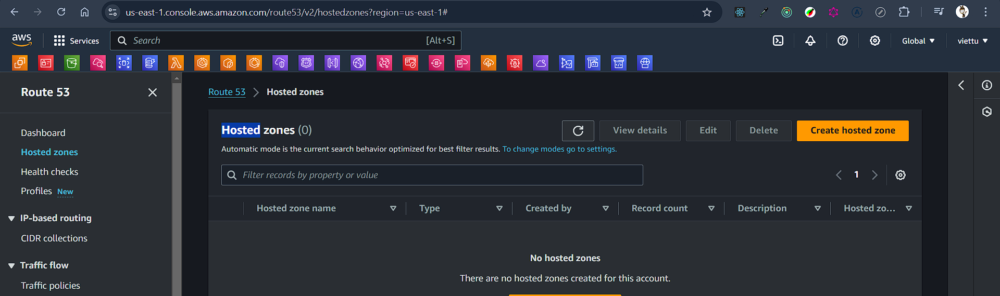
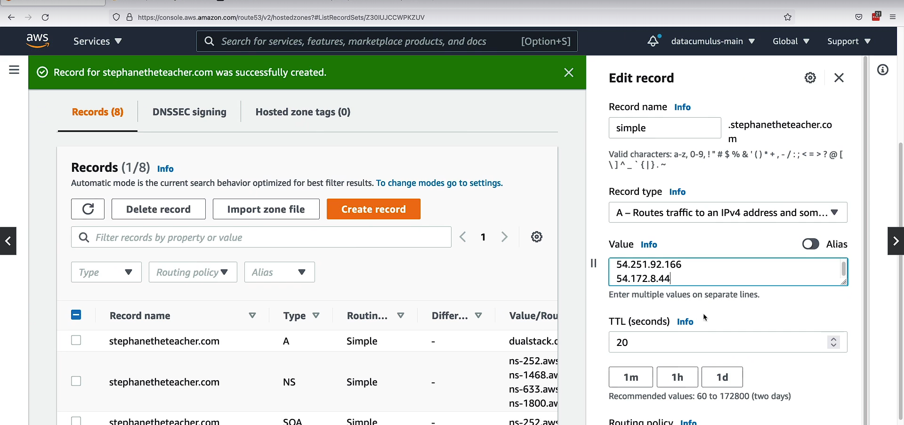
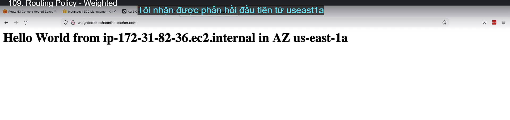

# Amazon Route 53 (`là dịch vụ Global`)



# What is DNS?

• Domain Name System which translates the human friendly hostnames
into the machine IP addresses
• www.google.com => 172.217.18.36
• DNS is the backbone (xương sống) of the Internet
• DNS uses hierarchical (thứ bậc) naming structure
root: .com
example.com
www.example.com
api.example.com

# DNS Terminologies (thuật ngữ)

Domain Registrar (nhà đăng ký tên miền): Amazon Route 53, GoDaddy, …
• DNS Records: A, AAAA, CNAME, NS, …
• Zone File: contains DNS records
• Name Server: resolves DNS queries (Authoritative or Non-Authoritative)
• Top Level Domain (TLD): .com, .us, .in, .gov, .org, …
• Second Level Domain (SLD): amazon.com, google.com, …


# How DNS Works

- Assigned and Managed by your company or assigned by your ISP (Internet Service provider) dynamically (Được công ty của bạn chỉ định và quản lý hoặc được ISP của bạn chỉ định một cách linh hoạt)


# Amazon Route 53


```plaintext
• A highly available, scalable, fully managed and Authoritative DNS (DNS được quản lý đầy đủ và có thầm quyền)
    • Authoritative = the customer (you) can update the DNS records
• Route 53 is also a Domain Registrar
• Ability (khả năng) to check the health of your
resources
• The only AWS service which
provides 100% availability SLA (SLA khả dụng) (SLA (Service Level Agreement) là thỏa thuận mức độ dịch vụ giữa nhà cung cấp dịch vụ (trong trường hợp này là AWS Route 53) và khách hàng. Nó mô tả các cam kết về hiệu suất, tính sẵn sàng, và chất lượng dịch vụ mà nhà cung cấp sẽ đảm bảo cho khách hàng.)
• Why Route 53? 53 is a reference to
the traditional DNS port
```

# Route 53 – Records

```
• How you want to route traffic for a domain
• Each record contains:
    • Domain/subdomain Name – e.g., example.com
    • Record Type – e.g., A or AAAA
    • Value – e.g., 12.34.56.78
    • Routing Policy – how Route 53 responds to queries
    • TTL – amount of time (khoảng thời gian) the record cached at DNS Resolvers
• Route 53 supports the following DNS record types:
    • (must know) A / AAAA / CNAME / NS
    • (advanced) CAA / DS / MX / NAPTR / PTR / SOA / TXT / SPF / SRV
```

# Route 53 – Record Types

```
• A – maps a hostname to IPv4
• AAAA – maps a hostname to IPv6
• CNAME – maps a hostname to another hostname
    • The target is a domain name which must have an A or AAAA record
    • Can’t create a CNAME record for the top node of a DNS namespace (Zone
    Apex)
    • Example: you can’t create for example.com, but you can create for
    www.example.com
• NS – Name Servers for the Hosted Zone
    • Control how traffic is routed for a domain (Kiểm soát cách định tuyến lưu lượng truy cập cho domain)
```

# Route 53 – Hosted Zones

• A container for records (vùng lưu trữ) that define how to route traffic to a domain and
its subdomains
• Public Hosted Zones – contains records that specify how to route
traffic on the Internet (public domain names)
application1.mypublicdomain.com
• Private Hosted Zones – contain records that specify how you route
traffic within one or more VPCs (private domain names)
application1.company.internal
• You pay $0.50 per month per hosted zone

# Route 53 – Public vs. Private Hosted Zones

- Public Hosted Zone
  
- Private Hosted Zone
  

# Route 53 - Regsitering a domain (Hands On)

# Route 53 - Creating out first records - Hands On

(Hosted zone => viettu.id.vn => create record => record name: test => type: A => value: 1.2.3.4 => create)


# Route 53 - EC2 Setup

(EC2 => launch => User data: copy user-data.sh => launch) (frankfurt)
(Tạo thêm 2 instance ở 2 region khác nhau nữa ở Virginia, Singapor)

(LB => ALB => name: DemoRoute53ALB => chọn tối đa subnet => protocol: HTTP => Port: 80 => target group: (create target group => name: demo-tg-route-53 => add 1 instance vừa tạo => create) => create loadbalancer ) (region frankfurt)

3.70.14.253 eu-central-1 (frankfurt)
54.172..8.44 us-east-1 (Virginia)
54.251.92.166 us-southeast-1 (singapor)


# Route 53 – Records TTL (Time To Live)


```
• High TTL – e.g., 24 hr
    • Less traffic on Route 53
    • Possibly outdated records (có thể record lỗi thời)
• Low TTL – e.g., 60 sec.
    • More traffic on Route 53 ($$)
    • Records are outdated for less time
    • Easy to change records
• Except for Alias records, TTL is mandatory (bắt buộc) for each DNS record
```

## Handons

(Create record => record name: demo => type: A => value: 3.70.14.253 => TLL: 120 (2 phút) => create )
truy cập: 
kiểm tra trên cloudshell:  

Edit record: chuyển sang ip: 54.251.92.166 => save

Vẫn trả về Ip cũ vì trên máy tính vẫn còn cache Ip đó: 


Dợi hết thời gian cache: 

# CNAME vs Alias

```
• AWS Resources (Load Balancer, CloudFront...) expose an AWS hostname:
    • lb1-1234.us-east-2.elb.amazonaws.com and you want myapp.mydomain.com
• CNAME:
    • Points a hostname to any other hostname. (app.mydomain.com => blabla.anything.com)
    • ONLY FOR NON ROOT DOMAIN (aka. something.mydomain.com)
• Alias:
    • Points (trỏ) a hostname to an AWS Resource (app.mydomain.com => blabla.amazonaws.com)
    • Works for ROOT DOMAIN and NON ROOT DOMAIN (aka mydomain.com)
    • Free of charge
    • Native health check
```

```
CNAME và Alias là hai khái niệm liên quan đến cách bạn trỏ một tên miền đến một tài nguyên khác, nhưng có sự khác biệt trong cách chúng hoạt động và cách chúng được sử dụng trong Amazon Route 53.

1. CNAME (Canonical Name Record):
- Chức năng: Trỏ một hostname đến một hostname khác.
- Ví dụ: app.mydomain.com trỏ đến example.anything.com.
- Giới hạn:
    - Chỉ áp dụng cho subdomain (tức là các domain dạng something.mydomain.com).
    - Không thể sử dụng CNAME cho root domain (ví dụ: mydomain.com).
- Sử dụng: Thích hợp khi bạn muốn trỏ một subdomain tới một hostname khác mà không phải là tài nguyên của AWS.
2. Alias Record:
- Chức năng: Trỏ một hostname đến một AWS resource như Load Balancer, CloudFront, hoặc S3 bucket.
- Ví dụ: app.mydomain.com hoặc mydomain.com trỏ đến blabla.amazonaws.com.
- Linh hoạt hơn:
    - Hỗ trợ cả root domain và subdomain (tức là mydomain.com và something.mydomain.com đều được).
- Ưu điểm:
    - Miễn phí: AWS không tính phí cho các truy vấn Alias Record.
    - Native health checks: Alias Record có thể được tích hợp với các dịch vụ AWS và cung cấp các chức năng kiểm tra sức khỏe (health check) tích hợp sẵn.
Tóm tắt sự khác biệt:
- CNAME: Chỉ dành cho subdomains, không sử dụng được cho root domain và có thể trỏ tới bất kỳ hostname nào ngoài AWS.
- Alias Record: Dùng được cho cả root domain và subdomains, chỉ dùng để trỏ đến các AWS resources và có các tính năng miễn phí, tích hợp kiểm tra sức khỏe.
```

# Route 53 – Alias Records


```
• Maps a hostname to an AWS resource
• An extension to DNS functionality (là phần mở rộng cho các chức năng của DNS)
• Automatically recognizes changes in the resource’s IP addresses
• Unlike (không giống) CNAME, it can be used for the top node of a DNS namespace (Zone Apex), e.g.: example.com
• Alias Record is always of type A/AAAA for AWS resources (IPv4 / IPv6)
• You can’t set the TTL
```

```
Alias Records trong Amazon Route 53 là một loại bản ghi đặc biệt trong DNS được sử dụng để trỏ một hostname đến một AWS resource như Elastic Load Balancer (ELB), CloudFront, S3 bucket, hoặc các dịch vụ AWS khác. Dưới đây là giải thích chi tiết về Alias Records:

Đặc điểm chính của Alias Records:
1. Maps a hostname to an AWS resource:

- Alias Record giúp bạn trỏ một tên miền (ví dụ: example.com hoặc app.example.com) trực tiếp đến một AWS resource như ELB hoặc CloudFront mà không cần biết địa chỉ IP của tài nguyên đó.
2. An extension to DNS functionality:

- Đây là một phần mở rộng của DNS, cho phép sử dụng DNS để liên kết với các tài nguyên động của AWS. Khác với các bản ghi DNS thông thường, Alias Record có thể tự động nhận diện và cập nhật các thay đổi về địa chỉ IP của tài nguyên AWS mà nó trỏ đến.
3. Automatically recognizes changes in resource’s IP addresses:

- Khi địa chỉ IP của tài nguyên AWS thay đổi (ví dụ: Elastic Load Balancer thường thay đổi IP), Alias Record sẽ tự động cập nhật mà bạn không cần chỉnh sửa thủ công. Điều này đảm bảo rằng hệ thống luôn duy trì sự kết nối mà không gặp gián đoạn.
4. Can be used for the top node of a DNS namespace (Zone Apex):

- Một ưu điểm quan trọng của Alias Record là nó có thể được sử dụng cho tên miền gốc (root domain), ví dụ: example.com. Điều này khác với CNAME, vốn không thể sử dụng cho root domain mà chỉ có thể trỏ đến các subdomain.
5. Always of type A/AAAA for AWS resources:

- Alias Record luôn có loại bản ghi A (cho IPv4) hoặc AAAA (cho IPv6) để trỏ đến các tài nguyên AWS. Điều này khác với CNAME, vốn có thể trỏ đến một hostname mà không phụ thuộc vào loại bản ghi.
6. You can’t set the TTL:

- TTL (Time To Live) là thời gian mà bản ghi DNS được lưu trong bộ nhớ đệm của DNS resolver. Với Alias Record, bạn không thể đặt TTL thủ công. Thay vào đó, Route 53 sẽ quản lý TTL cho Alias Record để phù hợp với các thay đổi của tài nguyên AWS mà nó trỏ đến.

Tóm lại:
Alias Record là một giải pháp mở rộng của DNS để trỏ tới các tài nguyên AWS, hỗ trợ cho cả root domain và subdomains, tự động cập nhật khi có thay đổi về IP, và giúp đơn giản hóa việc cấu hình DNS cho các dịch vụ AWS mà không cần can thiệp thủ công.
```

# Route 53 – Alias Records Targets


• Elastic Load Balancers
• CloudFront Distributions
• API Gateway
• Elastic Beanstalk environments
• S3 Websites
• VPC Interface Endpoints
• Global Accelerator accelerator
• Route 53 record in the same hosted zone
• You cannot set an ALIAS record for an EC2 DNS name

## Hands On - CNAME


(Create record => record name: myapp => type: CNAME => value: demo-alb-route-53-xxx.xxx.amazonaws.com (sử dụng dns của alb) => create record)

Truy cập myapp.xxx.com
Thông tiên hiện thị ở frankfurt có setup alb


## Hands On - Alias

(Create record => record name: myalias => type: A => `enable Alias` => Route traffic: Alias to Application and Classic Load Balancer => Region: eu-central-1(frankfurt) => chọn alb đã tạo => Create record )

Truy cập: myalias.xxx.com


## Hands On - Alias

(Create record => record name: (bỏ trống) => type: A-Routes traffic ... => Enable Alias => Chọn Application and Classic load balancer => region: eu-central-1 => chọn alb đã tạo => Create record)

Truy cập: xxx.com


# Route 53 – Routing Policies

```
• Define how Route 53 responds to DNS queries (trả lời các truy vấn DNS)
• Don’t get confused by the word “Routing” (không lên nhầm lẫn từ Routing)
    • It’s not the same as Load balancer routing which routes the traffic • DNS does not route any traffic, it only responds to the DNS queries
• Route 53 Supports the following Routing Policies (route 53 hộ trợ chính sách định tuyến)
    • Simple
    • Weighted
    • Failover
    • Latency based
    • Geolocation
    • Multi-Value Answer
    • Geoproximity (using Route 53 Traffic Flow feature)
```

```
Routing Policies trong Amazon Route 53 xác định cách mà Route 53 sẽ trả lời các truy vấn DNS (Domain Name System). Khái niệm "routing" trong ngữ cảnh Route 53 không liên quan đến việc chuyển tiếp (route) lưu lượng truy cập như trong trường hợp của load balancer, mà chỉ liên quan đến việc trả lời truy vấn DNS để ánh xạ tên miền đến địa chỉ IP hoặc tài nguyên tương ứng.
```

# Routing Policies – Simple


```
• Typically, route traffic to a single resource
• Can specify multiple values in the same record
• If multiple values are returned, a random one is chosen by the client
• When Alias enabled, specify only one AWS resource
• Can’t be associated with Health Checks
```

```
- Alias Record – Chỉ được phép một tài nguyên AWS:

Nếu bạn sử dụng Alias Record với Simple Routing, bạn chỉ có thể chỉ định một tài nguyên AWS để trỏ đến, như một Elastic Load Balancer hoặc CloudFront distribution.

-Không thể liên kết với Health Checks:

Simple Routing không hỗ trợ kiểm tra sức khỏe (Health Checks). Điều này có nghĩa là nếu tài nguyên bị lỗi, Route 53 sẽ vẫn tiếp tục trả về giá trị đó, ngay cả khi tài nguyên không còn khả dụng, vì không có cách nào để Route 53 kiểm tra trạng thái của tài nguyên.
```

## Simple - Hands On

(Create record => record name: simple => type: A => value: 54.251.92.166 => TTL: 20 => Routeing policy: Simple routing => create record)


Cloudshell

```bash
sudo yum instal bind-utils
```


Edit record: thêm 1 ip nữa chẳng hạn (54.251.92.66,54.172.8.44) => save

Lúc này kiểm tra sẽ thấy 2 IP được cache

Truy cập trình duyệt


# Routing Policies – Weighted


- Control the % of the requests that go to each specific resource
- Assign each record a relative weight (weigh tương đối):
  • traffic(%) = (Weight for a speific record) / (Sum all the weight for all records)
  
  • Weights don’t need to sum up to 100
- DNS records must have the same name and type
- Can be associated with Health Checks
- Use cases: load balancing between regions, testing new application versions…
- Assign a weight of 0 to a record to stop sending traffic to a resource
- If all records have weight of 0, then all records will be returned equally

```
Weighted Routing Policy trong Amazon Route 53 cho phép bạn kiểm soát tỷ lệ (phần trăm) yêu cầu DNS được chuyển đến từng tài nguyên cụ thể. Tính năng này rất hữu ích cho các trường hợp phân phối lưu lượng giữa các tài nguyên khác nhau, thử nghiệm ứng dụng, hoặc triển khai cân bằng tải giữa các regions.

Giải thích chi tiết về Weighted Routing Policy:
1. Kiểm soát tỷ lệ phần trăm (%) của các yêu cầu:

    - Bạn có thể gán cho mỗi bản ghi DNS một trọng số (weight). Tỷ lệ phần trăm lưu lượng truy cập sẽ được phân phối cho từng tài nguyên dựa trên trọng số này.
    - Công thức để tính tỷ lệ phần trăm yêu cầu đến một tài nguyên cụ thể là: traffic(%) = (Weight của một bản ghi) / (Tổng trọng số của tất cả các bản ghi)
2. Không cần tổng trọng số phải bằng 100:

- Trọng số của các bản ghi không cần phải cộng lại thành 100. Route 53 sẽ tự động tính tỷ lệ lưu lượng dựa trên trọng số tương đối của từng bản ghi.

3. Các bản ghi DNS phải có cùng tên và loại:

- Tất cả các bản ghi DNS liên quan đến Weighted Routing phải có cùng tên miền và cùng loại bản ghi (A, AAAA, CNAME, v.v.).

4. Có thể liên kết với Health Checks:

- Weighted Routing Policy có thể được liên kết với Health Checks để chỉ gửi lưu lượng đến các tài nguyên khỏe mạnh. Nếu tài nguyên bị đánh dấu là không còn khả dụng, Route 53 sẽ ngừng gửi lưu lượng đến tài nguyên đó.

5. Use cases (Trường hợp sử dụng):

- Phân tải giữa các regions: Bạn có thể định tuyến một phần lưu lượng truy cập đến các tài nguyên trong các regions khác nhau để cân bằng tải.
- Thử nghiệm ứng dụng mới: Nếu bạn muốn thử nghiệm phiên bản mới của ứng dụng, bạn có thể gán một trọng số nhỏ cho phiên bản mới và phân phối một lượng nhỏ lưu lượng đến đó để kiểm thử.
6. Trọng số bằng 0:

- Nếu một bản ghi có trọng số 0, Route 53 sẽ không gửi bất kỳ lưu lượng nào đến tài nguyên đó. Điều này hữu ích khi bạn muốn tạm thời dừng lưu lượng mà không cần xóa bản ghi.
- Nếu tất cả các bản ghi có trọng số bằng 0, Route 53 sẽ trả về tất cả các bản ghi một cách đều nhau, nghĩa là không có sự ưu tiên cho bất kỳ tài nguyên nào.

Tóm lại:
Weighted Routing Policy cho phép bạn phân phối lưu lượng truy cập dựa trên trọng số được chỉ định cho mỗi tài nguyên, giúp bạn kiểm soát chính xác lưu lượng đến các tài nguyên khác nhau. Nó hỗ trợ Health Checks và có thể được sử dụng cho cân bằng tải hoặc thử nghiệm ứng dụng.

```

## Weighted - Hands On


(Create records => record name: weighted => type: A => Routing policy: Weighted => Value: 54.251.92.166 => Weight: 10 => TTL: 3 (seconds) => Record ID: "SOUTHEAST" => Add another record => record name: weighted => Routing policy: Weighted => value: 54.172.8.44 => Weight: 70 => Record ID: "US EASt" => TTL: 3 => Add another record => name: weighted => value: 3.70.14.253 => Routing policy: Weighted => Weight: 20 => Record Id: "EU" => TTL: 3 => Create record)



==> Kiểm tra bằng cmd: dig weighted.xxx.com


```plaintext
Record ID trong Route 53 là một mã định danh duy nhất cho mỗi bản ghi DNS mà bạn tạo ra. Nó giúp bạn phân biệt giữa các bản ghi khác nhau, đặc biệt hữu ích khi bạn có nhiều bản ghi DNS cho cùng một tên miền hoặc khi bạn cần quản lý và chỉnh sửa các bản ghi này.

Ví dụ:

Nếu bạn có nhiều bản ghi trỏ đến các tài nguyên khác nhau, mỗi bản ghi sẽ có một Record ID riêng để bạn có thể dễ dàng tìm và chỉnh sửa đúng bản ghi cần thiết mà không bị nhầm lẫn với các bản ghi khác.

Nói cách khác, Record ID là để giúp bạn quản lý các bản ghi DNS trong hệ thống của Route 53 một cách có tổ chức và chính xác hơn.
```

# Routing Policies – Latency -based (dựa trên độ trễ)


• Redirect to the resource that has the least latency (độ trễ thấp nhất) close to us
• Super helpful when latency for users is a priority (sự ưu tiên)
• Latency is based (dựa trên) on traffic between users and AWS Regions
• Germany users may be directed to the US (if that’s the lowest latency)
• Can be associated with Health Checks (has a failover capability)

```plaintext
Chính sách định tuyến Latency-based (dựa trên độ trễ) trong Route 53 sẽ chuyển hướng người dùng đến tài nguyên có độ trễ thấp nhất đối với họ. Điều này rất hữu ích khi độ trễ là yếu tố quan trọng, giúp cải thiện tốc độ và trải nghiệm người dùng.

Giải thích chi tiết:

- Độ trễ là thời gian cần thiết để dữ liệu di chuyển giữa người dùng và tài nguyên (như máy chủ hoặc cơ sở hạ tầng AWS) trong các vùng khác nhau.
- Khi một người dùng gửi yêu cầu, Route 53 sẽ kiểm tra độ trễ giữa người dùng và các vùng AWS khác nhau, sau đó chuyển hướng yêu cầu đến tài nguyên có độ trễ thấp nhất.
- Ví dụ, người dùng ở Đức có thể được chuyển hướng đến máy chủ ở Mỹ nếu độ trễ giữa Đức và Mỹ là thấp nhất so với các vùng khác.
- Chính sách này có thể được kết hợp với kiểm tra sức khỏe của tài nguyên, tức là nếu tài nguyên có độ trễ thấp nhất không hoạt động (không qua được kiểm tra sức khỏe), Route 53 sẽ chuyển hướng yêu cầu sang tài nguyên khác có độ trễ thấp thứ hai.

Tóm lại, chính sách này giúp đảm bảo người dùng truy cập tài nguyên nhanh nhất có thể, tối ưu hóa trải nghiệm người dùng.

```

# Latency - Hands On


(Create records => record name: latency => record type: A => value: 55.251.92.166 => Routing policy: Latency => Region: ap-southeast-1 (Singarpor) => Record Id: "ap-southeast-1" => Add another record => record name: latency => Value: 54.172.8.44 => Routing policy: Latency => Region: us-east-1 => Record ID: "us-east-1" => Add another record => record name: latency => value => 3.70.14.253 => Routing policy: Latency => Region: eu-central-1 => Record ID: "eu-central-1" => Create records )


truy cập latency.xxx.com


Sử dụng VPN sang Canada để test (nó sẽ xóa toàn mộ TTL có trọng bộ nhớ đệm)


Cloudshell vẫn đang ở Châu âu là trả về region ở châu âu


Có thể chính IP sang châu á (Hồng Kông)


# Route 53 – Health Checks


```
• HTTP Health Checks are only for public resources
• Health Check => Automated DNS Failover (chuyển đổi dự phòng):
    1. Health checks that monitor an endpoint (application, server, other AWS resource)
    2. Health checks that monitor other health checks (Calculated Health Checks)
    3. Health checks that monitor CloudWatch Alarms (full control !!) – e.g., throttles of (điểu chỉnh) DynamoDB, alarms on RDS, custom metrics, … (helpful for private resources)
• Health Checks are integrated with CW metrics
```

```

Route 53 – Health Checks
Amazon Route 53 Health Checks là một cách hiệu quả để giám sát trạng thái của các tài nguyên (như server, ứng dụng, hoặc dịch vụ AWS) và tự động điều hướng DNS trong trường hợp tài nguyên gặp sự cố. Dưới đây là giải thích chi tiết về các thành phần và cách hoạt động của Route 53 Health Checks:

1. HTTP Health Checks chỉ dành cho public resources:

- HTTP/HTTPS Health Checks của Route 53 được sử dụng để giám sát các tài nguyên có thể truy cập công khai (public). Các tài nguyên này có địa chỉ IP hoặc DNS mà Route 53 có thể gửi yêu cầu HTTP/HTTPS tới để kiểm tra phản hồi.
- Ví dụ: Bạn có một website được lưu trữ trên một server công cộng. Route 53 sẽ liên tục gửi yêu cầu HTTP/HTTPS để đảm bảo rằng trang web hoạt động bình thường. Nếu không nhận được phản hồi hoặc nhận mã lỗi HTTP (ví dụ: 500 Internal Server Error), Route 53 sẽ đánh dấu endpoint này là "unhealthy".
2. Health Checks => Automated DNS Failover: Route 53 Health Checks cho phép tự động thực hiện DNS failover – tức là chuyển hướng lưu lượng tới một endpoint khác nếu endpoint chính không khả dụng. Có ba loại Health Checks chính:

    2.1 Health checks giám sát endpoint:

    - Health checks có thể trực tiếp giám sát tình trạng của một endpoint (máy chủ, ứng dụng, hoặc một tài nguyên AWS như EC2, ELB). Health check sẽ kiểm tra phản hồi từ endpoint đó thông qua giao thức HTTP/HTTPS hoặc TCP.
    - Ví dụ: Nếu một server EC2 không phản hồi đúng cách hoặc server bị "down", Route 53 sẽ tự động chuyển hướng lưu lượng DNS sang một server khác.

    2.2 Calculated Health Checks:

    - Đây là loại health check đặc biệt cho phép theo dõi và kết hợp nhiều health check khác lại với nhau để tạo ra một health check tổng hợp. Bạn có thể thiết lập để Route 53 chỉ đánh dấu endpoint là "unhealthy" nếu một số hoặc tất cả các health check thành phần đều thất bại.
    - Ví dụ: Nếu bạn có ba máy chủ, bạn có thể tạo một calculated health check yêu cầu ít nhất hai trong số ba máy chủ phải thất bại thì hệ thống mới thực hiện DNS failover.

    2.3 Health checks giám sát CloudWatch Alarms:

    - Đây là loại health check linh hoạt nhất, cho phép bạn giám sát dựa trên CloudWatch Alarms. Nó rất hữu ích để giám sát các tài nguyên private mà không thể trực tiếp giám sát qua internet.
    - Ví dụ: Bạn có thể thiết lập health check dựa trên DynamoDB throttling, RDS database errors, hoặc các custom metrics khác trong CloudWatch. Điều này đặc biệt hữu ích cho các tài nguyên không công khai, như các server nội bộ hoặc dịch vụ không có địa chỉ IP công cộng.

3. Health Checks tích hợp với CloudWatch metrics:

- Mỗi health check được tạo ra đều tự động xuất metrics trong Amazon CloudWatch, cho phép bạn theo dõi chi tiết trạng thái của health checks, tạo cảnh báo, và hành động tự động khi cần.
- Ví dụ: Nếu health check thất bại nhiều lần, bạn có thể tạo một CloudWatch alarm để cảnh báo nhóm vận hành của bạn hoặc tự động thực hiện biện pháp khắc phục.

Tóm lại, Route 53 Health Checks không chỉ giúp giám sát các tài nguyên công cộng mà còn cung cấp các công cụ mạnh mẽ để quản lý tài nguyên private thông qua CloudWatch Alarms, đồng thời tích hợp chặt chẽ với hệ thống DNS để đảm bảo tính sẵn sàng cao.
```

# Health Checks – Monitor an Endpoint


```
• About 15 global health checkers will check the endpoint health
    • Healthy/Unhealthy Threshold – 3 (default)
    • Interval – 30 sec (can set to 10 sec – higher cost)
    • Supported protocol: HTTP, HTTPS and TCP
    • If > 18% of health checkers report the endpoint is healthy, Route 53 considers it Healthy. Otherwise, it’s Unhealthy
    • Ability to choose which locations you want Route 53 to use
• Health Checks pass only when the endpoint responds with the 2xx and 3xx status codes
• Health Checks can be setup to pass / fail based on the text in the first 5120 bytes of the response
• Configure you router/firewall to allow incoming requests from Route 53 Health Checkers
```

# Route 53 – Calculated Health Checks


• Combine (kết hợp) the results of multiple Health Checks into a single Health Check (thành một lần kiểm tra sức khỏe duy nhất)
• You can use OR, AND, or NOT
• Can monitor up to 256 Child Health Checks
• Specify how many of the health checks need to pass to make the parent pass
• Usage: perform maintenance to your website without causing (không gây ra) all health checks to fail

# Health Checks – Private Hosted Zones


• Route 53 health checkers are outside the VPC
• They can’t access private endpoints (private VPC or on-premises resource)
• You can create a CloudWatch Metric and associate a CloudWatch Alarm, then create a Health Check that checks the alarm itself

## Health Checks Hands On

(Route53 => Health check => Create health check => name: "us-east-1" => What to monitor: Endpoint => Specify endpoint by: IP address => Protocol: HTTP => IP address: 54.172.8.44 => Port: 80 => next => Create alarm: No => create health check)


(Route53 => Health check => Create health check => name: "ap-southeast-1" => What to monitor: Endpoint => Specify endpoint by: IP address => Protocol: HTTP => IP address: 54.251.92.166 => Port: 80 => next => Create alarm: No => create health check)

(Route53 => Health check => Create health check => name: "eu-central-1" => What to monitor: Endpoint => Specify endpoint by: IP address => Protocol: HTTP => IP address: 3.70.14.253 => Port: 80 => next => Create alarm: No => create health check)

(Region: singapor => Edit security group => Delete rule HTTP => save rule)


(Create health check => name: calculated => What to monitor: Status of other health check (caculated health check) => Health check to monitor: ap-southeast-1,us-east-1,eu-central-1 (các health check đã tạo không phải region) => Report health when: all health check are healthy (AND) => next => Create health check)


Kiểm tra sẽ là unhealth vì có một 1 health check unhealth


# Routing Policies – Failover (chuyển đổi dự phòng) (Active-Passive) (chủ động bị động)

- disaster recovery: khắc phục thảm họa
- mandatory: bắt buộc
  

## Hands On


(Hosted zone => Create record => record name: failover => record type: A => value: 3.70.14.253 => Routing policy: Failover => TTL 60 => Failover record type: Primary => Health check: "eu-central-1" (đã tạo health check ở trên) => Record ID: "EU" => Add another record => Record name: failover => record type: A => value: 54.172.8.44 => Routing policy: Failover => TTL: 60 => Failover record type: Secondary => Health check: "us-east-1" => record ID: "US" => Create record )

Truy cập: faildover.xxx.com sẽ truy cập đến primary

Sửa EC2 ở region (Frankfurt) là primary trỏ tới EC2 => truy cập SG => Xóa hết rule HTTP => save change


Lúc này khi truy cập lại trình duyệt thì đổi sang EC2 ở region Verginia là Secondary


==> Faildover đã thành công

# Routing Policies – Geolocation (địa lý)


• Different from Latency-based! (khác với dựa trên độ trễ)
• This routing is based (dựa trên) on user location
• Specify location by Continent (lục địa), Country or by US State (if there’s overlapping (chồng chéo), most precise (chính xác) location selected)
• Should create a “Default” record (in case there’s no match on location)
• Use cases: website localization (nội địa hóa), restrict (hạn chế) content distribution (phân phôi), load balancing, …
• Can be associated with Health Checks

## Hands On


(bất kỳ người dùng nào ở Asia sẽ được chuyên đến ip ở region ap-southeast-1)
(Hosted zone => Create record => record name: geo => record type: A => Value: 54.251.92.166 => Routing policy: Geolocation => Location: Asia => Record ID: "Asia" => Add another record => record name: geo => Value: 54.172.8.44 => Routing policy: Geolocation => Location: United States => Record ID: "US" => Add other record => record name: geo => value: 3.70.14.253 => Routing policy: Geolocation => Location: Default (nghĩa là không math ở khu vực nào thì trả về IP này) => Record ID: " EU" => create record )

Truy cập, tôi đang ở châu âu nó không match khu vực Châu á, hay Mĩ thì nó trả IP mặc định là Châu âu

Bật VPN , thử sang India thì trả về IP có Ec2 ở singapor


# Routing Policies – Geoproximity

```
• Route traffic to your resources based on the geographic location of users and resources
• Ability to shift (thay đổi) more traffic to resources based on the defined bias
• To change the size of the geographic region, specify bias values:
    • To expand (1 to 99) – more traffic to the resource
    • To shrink (-1 to -99) – less traffic to the resource
• Resources can be:
    • AWS resources (specify AWS region)
    • Non-AWS resources (specify Latitude (vĩ độ) and Longitude (kinh độ))
• You must use Route 53 Traffic Flow to use this feature
```

```
Để giải thích rõ hơn về Geoproximity Routing trong AWS Route 53, hãy xem xét ví dụ sau:

1. Điều hướng dựa trên vị trí địa lý
- Khi người dùng truy cập trang web hoặc ứng dụng của bạn, Route 53 sẽ xác định vị trí địa lý của họ.
- Dựa vào đó, Route 53 sẽ điều hướng người dùng đến tài nguyên (máy chủ hoặc dịch vụ) gần nhất về mặt địa lý.
2. Bias – Điều chỉnh lưu lượng
- Bias là yếu tố cho phép bạn tăng hoặc giảm lưu lượng truy cập vào một tài nguyên cụ thể, ngay cả khi tài nguyên đó không phải là gần nhất.
- Ví dụ:
    - Bias dương (1 đến 99): Mở rộng khu vực mà một tài nguyên nhận lưu lượng, dẫn đến nhiều người dùng được điều hướng đến tài nguyên đó, ngay cả khi có tài nguyên khác gần hơn.
    - Bias âm (-1 đến -99): Thu hẹp khu vực mà một tài nguyên nhận lưu lượng, giảm số lượng người dùng được điều hướng đến tài nguyên đó.
3. Tài nguyên có thể sử dụng
- Bạn có thể điều hướng lưu lượng đến:
    - Tài nguyên AWS: Ví dụ, một máy chủ EC2 ở một vùng AWS nhất định (ví dụ, vùng Singapore).
    - Tài nguyên không thuộc AWS: Ví dụ, một máy chủ vật lý có tọa độ địa lý cụ thể (latitude, longitude).
4. Ví dụ thực tế
- Giả sử bạn có hai máy chủ:

    - Máy chủ 1: Đặt ở AWS vùng Singapore.

    - Máy chủ 2: Là một máy chủ vật lý ở Tokyo, Nhật Bản.

    - Người dùng từ Việt Nam truy cập vào dịch vụ của bạn.

    - Route 53 sẽ điều hướng họ đến máy chủ gần nhất, có thể là máy chủ ở Singapore.

    - Tuy nhiên, bạn có thể áp dụng bias để điều hướng một phần lưu lượng từ Việt Nam đến máy chủ ở Tokyo nếu máy chủ đó có tài nguyên mạnh hơn hoặc ít tải hơn.

5. Tóm tắt
- Geoproximity Routing điều hướng lưu lượng dựa trên vị trí địa lý.
Bạn có thể dùng bias để điều chỉnh lượng truy cập đến tài nguyên mong muốn.
- Phải sử dụng công cụ Route 53 Traffic Flow để thiết lập và quản lý chính sách này.
```

# Routing Policies – Geoproximity

Bias = 0

Thay đổi Bias 2 khu vực


==> Kết luận: The Geoproximity Routing is really helpful when you need to shift (thay đổi) traffic from one region to another, by ỉncreasing the bias

# Routing Policies – IP-based Routing


• Routing is based on clients’ IP addresses
• You provide a list of CIDRs for your clients and the corresponding endpoints/locations (user-IP-to-endpoint mappings)
• Use cases: Optimize performance, reduce network costs…
• Example: route end users from a particular ISP to a specific endpoint

```
IP-based Routing trong AWS Route 53 cho phép điều hướng lưu lượng dựa trên địa chỉ IP của khách hàng. Dưới đây là giải thích chi tiết:

1. Cách hoạt động của IP-based Routing
Điều hướng dựa trên địa chỉ IP của khách hàng: Route 53 kiểm tra địa chỉ IP của người dùng cuối khi họ yêu cầu truy cập vào một dịch vụ.
Bạn cung cấp một danh sách CIDR (Classless Inter-Domain Routing) – phạm vi địa chỉ IP của người dùng. Dựa trên đó, bạn chỉ định các endpoints (máy chủ hoặc vị trí) tương ứng để điều hướng lưu lượng đến.
2. Cách cấu hình
Bạn định nghĩa bản đồ IP-to-endpoint (một danh sách ánh xạ giữa địa chỉ IP người dùng và endpoint tương ứng).
Khi một người dùng từ dải IP trong danh sách yêu cầu truy cập, Route 53 sẽ chuyển hướng lưu lượng đến endpoint mà bạn đã chỉ định cho dải IP đó.
3. Trường hợp sử dụng
Tối ưu hóa hiệu năng: Bạn có thể điều hướng người dùng từ một ISP cụ thể đến máy chủ gần nhất hoặc có hiệu suất cao hơn cho họ.
Giảm chi phí mạng: Giúp giảm thiểu chi phí bằng cách chuyển lưu lượng đến các máy chủ ít tốn kém hơn, hoặc các kết nối mạng có chi phí thấp hơn cho dải IP đó.
4. Ví dụ
Bạn có hai máy chủ, một máy ở châu Âu và một máy ở châu Á.
Người dùng từ một ISP ở châu Âu sẽ được chuyển đến máy chủ châu Âu, còn người dùng từ ISP ở châu Á sẽ được chuyển đến máy chủ châu Á.
Điều này giúp tối ưu hóa tốc độ truy cập và hiệu suất mạng dựa trên IP của người dùng.
5. Tóm tắt
IP-based Routing sử dụng địa chỉ IP của khách hàng để quyết định điểm đến.
Bạn cung cấp danh sách các dải IP và chỉ định endpoints cho chúng.
Các trường hợp sử dụng chính bao gồm tối ưu hóa hiệu suất và giảm chi phí mạng.
Hy vọng giải thích này giúp bạn hiểu rõ hơn về IP-based Routing!

chú thích: ISP được nhắc tới ở trên là viết tắt của Internet Service Provider (Nhà cung cấp dịch vụ Internet).
```

# Routing Policies – Multi-Value

• Use when routing traffic to multiple resources
• Route 53 return multiple values/resources
• Can be associated with Health Checks (return only values for healthy resources)
• Up to 8 healthy records are returned for each Multi-Value query
• Multi-Value is not a substitute (thay thế) for having an ELB


```
Chính sách Multi-Value Routing trong AWS Route 53 cho phép điều hướng lưu lượng đến nhiều tài nguyên cùng lúc, và nó có những đặc điểm như sau:

1. Routing đến nhiều tài nguyên
Multi-Value Routing cho phép bạn định cấu hình để trả về nhiều giá trị hoặc nhiều tài nguyên cho một truy vấn DNS, thay vì chỉ một giá trị (ví dụ: địa chỉ IP của máy chủ).
Các tài nguyên này có thể là máy chủ, dịch vụ hoặc các endpoint khác nhau mà bạn muốn người dùng có thể truy cập.
2. Kết hợp với Health Checks
Bạn có thể kết hợp Multi-Value Routing với Health Checks (kiểm tra sức khỏe của tài nguyên). Điều này có nghĩa là Route 53 chỉ trả về các tài nguyên khỏe mạnh – tức là các tài nguyên đang hoạt động và có khả năng đáp ứng yêu cầu của người dùng.
Ví dụ: Nếu bạn có 10 máy chủ, nhưng chỉ có 8 máy chủ đang hoạt động tốt, Route 53 sẽ chỉ trả về các địa chỉ IP của 8 máy chủ đó.
3. Giới hạn trả về các bản ghi
Lên đến 8 bản ghi (địa chỉ IP hoặc tài nguyên) sẽ được trả về cho mỗi truy vấn DNS. Điều này giúp tăng khả năng cân bằng tải và phân phối lưu lượng đến nhiều tài nguyên khác nhau, giảm tải cho từng tài nguyên.
4. Không thay thế cho ELB
Multi-Value Routing không phải là một giải pháp thay thế cho Elastic Load Balancer (ELB): Mặc dù nó có thể trả về nhiều giá trị và giúp phân phối tải, nhưng không có các cơ chế tiên tiến như ELB, chẳng hạn như cân bằng tải dựa trên thông lượng hay phiên kết nối. Nó chỉ đơn giản trả về danh sách các tài nguyên khỏe mạnh để người dùng có thể kết nối.
5. Tóm tắt
Multi-Value Routing cho phép bạn điều hướng đến nhiều tài nguyên.
Bạn có thể sử dụng Health Checks để đảm bảo chỉ trả về các tài nguyên đang hoạt động tốt.
Mặc dù nó giúp phân phối lưu lượng nhưng không phải là giải pháp thay thế hoàn toàn cho ELB.
```

## Hands On


(Create record => record name: multi => type: A => Value: 54.172.8.44 => Routing policy: Multivalue answer => Health check: us-east-1 => Record ID: US => TTL 60 => Add another record => record name: multi => record type: a => Value: 54.251.92.166 => Routing policy: Multivalue answer => Health check: ap-southeast-1 => Record ID: Asia => TTL: 60 => Add another record => record name: multi => value: 3.70.14.253 => TTL 60 => Routing policy: Multivalue answer => Health check: eu-central-1 => Record ID: "EU" => Create record )

Kiểm tra cloudshell thì thấy trả về 3 IP giống với Simple routing, nhưng mạnh hơn vì có health check

(Route 53 => Health check => chọn health check: eu-central-1 => Edit health check => Advance configuration -> Tích Invert health check status (nó sẽ đang health trở thành unhealth và ngược lại) => save )


Vào cloudshell kiểm tra lại ip trả về xem nó có trả về IP bị unhealth không => kết quả chỉ trả về 2 IP không có IP unhealth


# Domain Registar vs. DNS Service

• You buy or register your domain name with a Domain Registrar typically by paying annual charges (trả phí hàng năm) (e.g., GoDaddy, Amazon Registrar Inc., …)
• The Domain Registrar usually provides you with a DNS service to manage your DNS records
• But you can use another DNS service to manage your DNS records
• Example: purchase the domain from GoDaddy and use Route 53 to manage your DNS records


# GoDaddy as Registrar (nhà đăng ký tên miền) & Route 53 as DNS Service


# 3rd Party Registrar with Amazon Route 53

```
• If you buy your domain on a 3rd party registrar, you can still use Route 53 as the DNS Service provider
1. Create a Hosted Zone in Route 53
2. Update NS Records on 3rd party website to use Route 53 Name Servers
• Domain Registrar != DNS Service
• But every Domain Registrar usually comes with some DNS features
```
