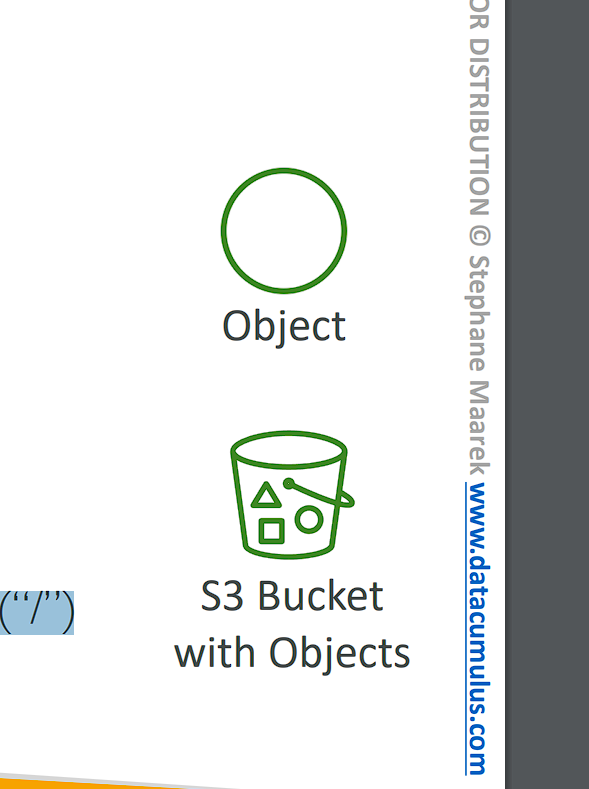
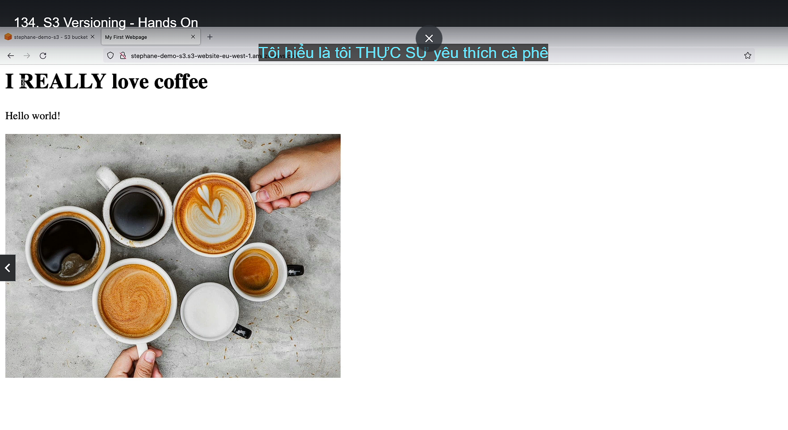
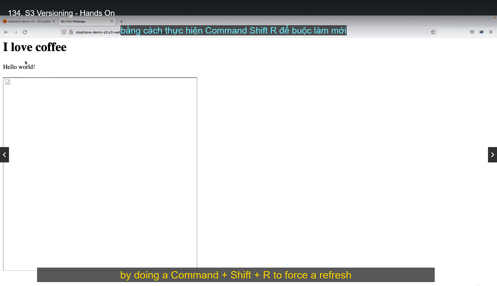
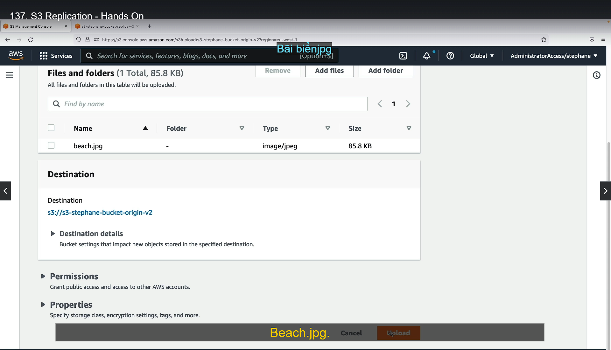
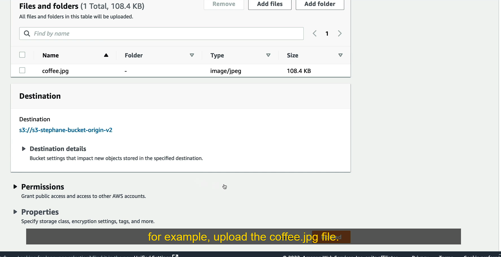

# Amazon S3

# Section introduction

• Amazon S3 is one of the main building blocks of AWS (là một trong nền tảng chính của AWS)
• It’s advertised (nó được quản cáo) as ”infinitely scaling” storage (mở rộng quy mô lưu trữ vô hạn)
• Many websites use Amazon S3 as a backbone (xương sống)
• Many AWS services use Amazon S3 as an integration (tích hợp) as well
• We’ll have a step-by-step approach (tiếp cận) to S3

# Amazon S3 Use cases


• Backup and storage
• Disaster Recovery (khắc phục thảm họa)
• Archive (lưu trữ)
• Hybrid Cloud storage
• Application hosting
• Media hosting
• Data lakes & big data analytics
• Software delivery
• Static website

# Amazon S3 - Buckets

• Amazon S3 allows people to store objects (files) in “buckets” (directories)
• Buckets must have a globally unique name (across all regions all accounts)
• Buckets are defined at the region level
• S3 looks like a global service but buckets are created in a region
• Naming convention (quy ước đặt tên)
• No uppercase, No underscore (không viết hoa, dấu gạch dưới)
• 3-63 characters long
• Not an IP
• Must start with lowercase letter or number
• Must NOT start with the prefix xn--
• Must NOT end with the suffix -s3alias

```
Amazon S3 Buckets là các kho lưu trữ mà bạn có thể sử dụng để lưu trữ dữ liệu (các tệp tin, hay còn gọi là "objects") trên dịch vụ Amazon S3. Dưới đây là giải thích chi tiết cho từng điểm bạn nêu:

1. Amazon S3 cho phép lưu trữ đối tượng (tệp tin) trong “buckets” (thư mục):

- Buckets trong Amazon S3 có thể xem như các thư mục mà bạn dùng để lưu trữ các objects (các tệp tin hoặc dữ liệu).
- Bạn có thể tạo nhiều buckets, và mỗi bucket có thể chứa nhiều objects.
2. Buckets phải có tên duy nhất trên toàn cầu (trên tất cả các khu vực và tài khoản):

- Tên của mỗi bucket phải là duy nhất trên toàn thế giới (nghĩa là không được có 2 buckets trùng tên, dù ở tài khoản hay khu vực khác nhau).
3. Buckets được định nghĩa ở cấp độ khu vực (region):

- Mặc dù Amazon S3 là một dịch vụ toàn cầu, nhưng khi bạn tạo bucket, nó được gán cho một khu vực (region) cụ thể, chẳng hạn như US-West hay AP-Southeast.
4. Amazon S3 trông giống một dịch vụ toàn cầu, nhưng buckets được tạo trong từng khu vực:

- Bạn có thể tưởng tượng S3 là một dịch vụ toàn cầu vì bạn có thể truy cập từ khắp nơi trên thế giới. Tuy nhiên, dữ liệu trong một bucket chỉ được lưu trữ tại khu vực bạn chọn (chẳng hạn: US-East, EU-West, v.v.).

## Quy tắc đặt tên cho Buckets
Amazon S3 có một số quy tắc cụ thể khi đặt tên cho một bucket:

1. Không dùng chữ in hoa, không dùng dấu gạch dưới (_):

- Tên bucket chỉ cho phép dùng chữ thường và không được sử dụng ký tự gạch dưới.
2. Tên có độ dài từ 3 đến 63 ký tự:

- Tên bucket phải có ít nhất 3 ký tự và tối đa 63 ký tự.
3. Tên không phải là một địa chỉ IP:

- Tên bucket không được trông giống như một địa chỉ IP (ví dụ: không thể đặt tên là “192.168.1.1”).
4. Tên phải bắt đầu bằng chữ cái thường hoặc số:

- Tên bucket phải bắt đầu bằng chữ cái thường hoặc số.
5. Tên không được bắt đầu bằng tiền tố "xn--":

- Tiền tố "xn--" là dành riêng cho mã hóa quốc tế hoá tên miền (IDN), vì vậy bạn không thể bắt đầu tên bucket với chuỗi này.
6. **Tên không được kết thúc bằng hậu tố "-s3alias"**:

- Tên bucket không được kết thúc bằng hậu tố "-s3alias", vì đây là một quy ước đặt tên đặc biệt của Amazon.
```

# Amazon S3 - Objects


• Objects (files) have a Key
• The key is the FULL path:
• s3://my-bucket/my_file.txt
• s3://my-bucket/my_folder1/another_folder/my_file.txt
• The key is composed of prefix + object name
• s3://my-bucket/my_folder1/another_folder/my_file.txt
• There’s no concept of “directories” within buckets (although the UI will trick you to think otherwise)
• Just keys with very long names that contain slashes (“/”)

```
Amazon S3 (Simple Storage Service) là dịch vụ lưu trữ đối tượng. Cách quản lý và tổ chức dữ liệu của S3 khác với các hệ thống tệp truyền thống. Dưới đây là giải thích chi tiết:

## Đối tượng và Khóa (Objects và Keys):
- Objects (Đối tượng): Mỗi tệp hoặc dữ liệu bạn lưu trữ trong S3 được gọi là đối tượng.
- Key (Khóa): Mỗi đối tượng đều có một key (khóa), chính là định danh của đối tượng. Khóa này tương đương với đường dẫn đầy đủ của đối tượng.
## Key là gì?
- Key bao gồm hai phần:
    - Prefix (Tiền tố): Là phần trước tên đối tượng. Prefix có thể bao gồm các dấu gạch chéo (/), làm nó trông giống như các thư mục.
    - Object name (Tên đối tượng): Là tên thực tế của đối tượng (tệp) được lưu trữ.
### Ví dụ:

- Key: s3://my-bucket/my_folder1/another_folder/my_file.txt
    - Prefix: my_folder1/another_folder/
    - Object name: my_file.txt
## Không có thư mục thực sự:
- S3 không có khái niệm về thư mục thực sự như trong các hệ thống tệp truyền thống. Mọi thứ đều là đối tượng với khóa là đường dẫn đầy đủ.
- Giao diện UI của S3 có thể làm bạn nghĩ rằng nó có cấu trúc thư mục, nhưng thực chất là các khóa có dấu gạch chéo (/), chỉ tạo ra ảo giác về thư mục.
## Tóm lại, trong S3, bạn chỉ làm việc với keys có thể chứa dấu gạch chéo, nhưng không có thư mục thật. Mỗi khóa đại diện cho một đối tượng với đường dẫn đầy đủ.
```

# Amazon S3 – Objects (cont.)

• Object values are the content of the body:
• Max. Object Size is 5TB (5000GB)
• If uploading more than 5GB, must use “multi-part upload”
• Metadata (list of text key / value pairs – system or user metadata)
• Tags (Unicode key / value pair – up to 10) – useful for security lifecycle
• Version ID (if versioning is enabled)

```
Amazon S3 lưu trữ các đối tượng (objects), và dưới đây là giải thích chi tiết về những đặc điểm của đối tượng trong S3:

## Nội dung của đối tượng (Object values):
- Object value là phần nội dung của đối tượng, chính là dữ liệu bạn lưu trữ (ví dụ: tệp văn bản, hình ảnh, video).
- Kích thước tối đa của một đối tượng là 5TB (tương đương 5000GB).
## Tải lên tệp lớn (Multi-part Upload):
- Khi bạn cần tải lên tệp có kích thước lớn hơn 5GB, bạn phải sử dụng phương pháp "multi-part upload". Phương pháp này chia tệp lớn thành nhiều phần nhỏ để tải lên, giúp quá trình ổn định và hiệu quả hơn.
## Metadata (Siêu dữ liệu):
- Metadata là tập hợp các cặp khóa/giá trị (key/value pairs), dùng để lưu trữ thông tin phụ về đối tượng.
    - System metadata: Thông tin hệ thống, như loại nội dung (Content-Type) và độ dài (Content-Length).
    - User metadata: Người dùng có thể tự tạo cặp khóa/giá trị tùy ý để mô tả đối tượng.
## Tags (Thẻ):
- Tags là các cặp khóa/giá trị dạng Unicode. Mỗi đối tượng có thể có tối đa 10 thẻ.
- Thẻ rất hữu ích trong việc:
    - Bảo mật (security): Gắn thẻ để xác định quyền truy cập.
    - Lifecycle: Gắn thẻ để quản lý vòng đời của đối tượng (xóa hoặc lưu trữ sau một thời gian).
## Version ID (Phiên bản):
- Version ID là mã định danh duy nhất của một phiên bản của đối tượng, nếu tính năng versioning (quản lý phiên bản) được bật.
- Khi bật versioning, mỗi khi đối tượng được sửa đổi, một bản sao với Version ID mới sẽ được tạo ra, giúp bạn có thể khôi phục phiên bản cũ khi cần.
## Tóm lại, các đối tượng trong Amazon S3 có thể chứa dữ liệu lớn (tối đa 5TB), hỗ trợ tải tệp lớn hơn 5GB qua multi-part upload, lưu metadata và tags cho bảo mật, và có thể quản lý phiên bản để theo dõi các thay đổi.
```

# S3 - Hands On

(S3 => create bucket => bucket type: General purpose => Bucket name: "viettu-demo-s3-v1" => create bucket)
(upload)

# Amazon S3 – Security

```
• User-Based
    • IAM Policies – which API calls should be allowed for a specific user from IAM
• Resource-Based
    • Bucket Policies – bucket wide rules from the S3 console - allows cross account
    • Object Access Control List (ACL) – finer grain  (can be disabled) (có thể vô hiệu hóa)
    • Bucket Access Control List (ACL) – less common (can be disabled)
• Note: an IAM principal (nguyên tắc) can access an S3 object if
    • The user IAM permissions ALLOW it OR the resource policy ALLOWS it
    • AND there’s no explicit DENY
• Encryption: encrypt objects in Amazon S3 using encryption keys
```

# S3 Bucket Policies


```
• JSON based policies
    • Resources: buckets and objects
    • Effect: Allow / Deny
    • Actions: Set of API to Allow or Deny
    • Principal: The account or user to apply the policy to
• Use S3 bucket for policy to:
    • Grant public access to the bucket
    • Force objects to be encrypted at upload • Grant access to another account (Cross Account)
```

# Example: Public Access - Use Bucket Policy


# Example: User Access to S3 – IAM permissions


# Example: EC2 instance access - Use IAM Roles


# Advanced: Cross-Account Access – Use Bucket Policy


# Bucket settings for Block Public Access


• These settings were created to prevent company data leaks (Các thiết lập này được tạo ra để ngăn chặn rò rỉ dữ liệu của công ty)
• If you know your bucket should never be public, leave these on (• Nếu bạn biết thùng của mình không bao giờ được công khai, hãy để chúng ở chế độ bật)
• Can be set at the account level (Có thể được thiết lập ở cấp tài khoản)

## Bucket policy Hands On

(s3 => bucket: "viettu-demo-s3" => Permissions => Block public access => edit => bỏ tích Block all public access => save chnage => Bucket policy => edit => policy generator => paste policy => save change)


Bây giờ chỉ cần url bình thường vẫn có thể truy cập được


# Amazon S3 – Static Website Hosting


```
• S3 can host static websites and have them accessible on the Internet
• The website URL will be (depending on the region)
• http://bucket-name.s3-website-aws-region.amazonaws.com
OR
• http://bucket-name.s3-website.aws-region.amazonaws.com
• If you get a 403 Forbidden error, make sure the bucket policy allows public reads!
```

## S3 Website Hands On

(S3 => bucket "viettu-demo-s3" => Properties => Static website hosting => Edit => Enable => index document: index.html => save change => Upload: index.html => truy cập url của static website)

# Amazon S3 -Versioning


```
• You can version your files in Amazon S3
• It is enabled at the bucket level
• Same key overwrite will change the “version”: 1, 2, 3….
• It is best practice to version your buckets
    • Protect against unintended deletes (ability to restore a version) (bảo vệ chống lại việc xóa ngoài ý muốn)
    • Easy roll back to previous version
• Notes:
    • Any file that is not versioned prior to enabling versioning will have version “null” (• Bất kỳ tệp nào không được đánh số phiên bản trước khi bật đánh số phiên bản sẽ có phiên bản “null”)
    • Suspending versioning does not delete the previous versions (nếu tạm dứng phiên bản thì nó không xóa phiên bản trước)
```

## Versioning - Hands On

("viettu-demo-s3" => Properties => Bucket Versioning => Edit => Enable => save change)
==> Sửa file index.html

Upload lại file index.html lúc này sẽ tạo ra một index.html version 2 vì lúc trước đã có file index.html rồi




Rollback lại version cũ

(tích vào index.html => Delete)


Thử xóa một file khi đang bật versioning => Thì file không thực sự được xóa mà được đánh nhãn Delete marker


Khôi public file đã xóa
(tích vào file đánh nhãn delete marker => Delete marker => file sẽ được khôi phục lại)


# Amazon S3 – Replication (CRR & SRR) (CRR: Cross-region replication, SRR: same-region replication)


asynchronous replication: sao chép không đồng bộ

```
• Must enable Versioning in source and destination buckets
• Cross-Region Replication (CRR)
• Same-Region Replication (SRR)
• Buckets can be in different AWS accounts
• Copying is asynchronous
• Must give proper IAM permissions to S3
• Use cases:
    • CRR – compliance (tuân thủ), lower latency access, replication across accounts
    • SRR – log aggregation (tổng hợp log), live replication between production and test accounts
```

```
Amazon S3 Replication cho phép tự động sao chép các đối tượng từ một bucket S3 này sang một bucket S3 khác, dựa trên một số điều kiện nhất định. Có hai loại replication chính là Cross-Region Replication (CRR) và Same-Region Replication (SRR). Dưới đây là giải thích chi tiết về từng loại và các yêu cầu liên quan:

1. Versioning
- Yêu cầu: Phải bật tính năng versioning (phiên bản hóa) cho cả bucket nguồn và bucket đích.
- Versioning cho phép S3 lưu lại nhiều phiên bản của các đối tượng, tránh mất dữ liệu khi có thay đổi hoặc xóa nhầm.
2. Cross-Region Replication (CRR)
- Chức năng: Sao chép đối tượng từ một bucket ở một vùng địa lý khác (region) sang bucket ở một vùng khác.
- Use cases:
    - Tuân thủ quy định về lưu trữ dữ liệu ở nhiều vùng địa lý khác nhau.
    - Cải thiện độ trễ (latency) bằng cách lưu dữ liệu gần người dùng hơn.
    - Hỗ trợ cho việc sao chép giữa các tài khoản AWS để tăng tính bảo mật và quản lý tài nguyên hiệu quả hơn.
3. Same-Region Replication (SRR)
- Chức năng: Sao chép đối tượng giữa các bucket trong cùng một vùng địa lý.
- Use cases:
    - Tổng hợp log: Lưu trữ các bản sao của log ở nhiều bucket để tiện phân tích hoặc bảo trì.
    - Sao chép giữa các môi trường sản xuất và thử nghiệm: Giúp cập nhật dữ liệu đồng bộ giữa các tài khoản AWS sản xuất và thử nghiệm.
4. Asynchronous Copying (Sao chép không đồng bộ)
- Việc sao chép đối tượng không diễn ra ngay lập tức mà có thể mất một khoảng thời gian sau khi đối tượng được tạo hoặc cập nhật.
5. Buckets có thể nằm trên các tài khoản AWS khác nhau
- Bạn có thể thiết lập replication giữa các bucket nằm trên các tài khoản AWS khác nhau, giúp tăng tính linh hoạt trong quản lý và bảo mật dữ liệu.
6. IAM Permissions
- Để thực hiện replication, bạn phải cấu hình quyền truy cập IAM một cách chính xác. Các chính sách IAM cần phải cho phép S3 truy cập và sao chép đối tượng giữa các bucket.

## Use Cases
1. Cross-Region Replication (CRR)

- Compliance (Tuân thủ quy định): Một số tổ chức yêu cầu dữ liệu phải được sao lưu ở nhiều vùng khác nhau để đảm bảo tuân thủ các quy định bảo mật.
- Lower Latency Access (Giảm độ trễ): Cải thiện độ trễ truy cập bằng cách lưu dữ liệu gần với người dùng cuối ở các khu vực khác nhau.
- Replication Across Accounts (Sao chép giữa các tài khoản): Hỗ trợ quản lý dữ liệu và bảo mật khi sao chép giữa nhiều tài khoản AWS.

## Same-Region Replication (SRR)

- Log Aggregation (Tổng hợp log): Dữ liệu log từ nhiều nguồn có thể được sao chép và lưu trữ trong một bucket để phân tích và báo cáo tập trung.
- Live Replication (Sao chép trực tiếp): Tạo các bản sao của dữ liệu trực tiếp giữa các tài khoản khác nhau trong cùng một vùng để thử nghiệm hoặc dự phòng.

```

# Amazon S3 – Replication (Notes)

```
• After you enable Replication, only new objects are replicated (chỉ những đối tượng mới sẽ được sao chép)
• Optionally, you can replicate existing objects (sao chép những đối tượng hiện có) using S3 Batch Replication
    • Replicates existing objects and objects that failed replication
• For DELETE operations
    • Can replicate delete markers from source to target (optional setting)
    • Deletions with a version ID are not replicated (to avoid malicious deletes) (tránh việc xóa độc hại xảy ra)
• There is no “chaining” of replication (không có chuỗi sao chép)
    • If bucket 1 has replication into bucket 2, which has replication into bucket 3
    • Then objects created in bucket 1 are not replicated to bucket 3
```

```
Tôi sẽ giải thích lại từng điểm trong phần Amazon S3 Replication để giúp bạn hiểu rõ hơn.

1. Replication chỉ áp dụng cho các đối tượng mới
- Khi bạn bật Replication, chỉ những tệp tin (đối tượng) mới mà bạn tải lên sau khi bật tính năng này mới được sao chép từ bucket nguồn sang bucket đích.
- Những tệp tin đã có từ trước khi bật Replication sẽ không tự động được sao chép sang bucket đích.
2. Sao chép các đối tượng cũ bằng S3 Batch Replication
- Nếu bạn muốn sao chép các tệp tin cũ (được tải lên trước khi bật Replication), bạn cần dùng S3 Batch Replication. Đây là một tính năng cho phép bạn sao chép toàn bộ tệp tin cũ sang bucket đích.
- S3 Batch Replication cũng có thể sao chép những tệp mà trước đây đã thất bại khi sao chép.
3. Hoạt động xóa (DELETE Operations)
- Khi bạn xóa một tệp trong S3, S3 sẽ không xóa ngay mà sẽ để lại một dấu hiệu xóa gọi là delete marker. Bạn có thể chọn để dấu hiệu xóa này được sao chép sang bucket đích hay không.
- Tuy nhiên, nếu bạn xóa một tệp với version ID (mã phiên bản cụ thể), S3 sẽ không sao chép hành động xóa đó sang bucket đích. Điều này để ngăn chặn việc xóa dữ liệu nhầm lẫn hoặc có chủ đích xấu.

4. Không có cơ chế "chaining" (chuỗi) trong replication
- Replication không hỗ trợ chuỗi: Nếu bucket 1 sao chép sang bucket 2, và bucket 2 tiếp tục sao chép sang bucket 3, thì:
    - Các đối tượng được tạo ra ở bucket 1 sẽ không được sao chép trực tiếp đến bucket 3.
- Điều này có nghĩa là replication chỉ diễn ra trực tiếp giữa hai bucket nguồn và đích đã được chỉ định, mà không tự động lan truyền qua nhiều bucket.

## giải thích rõ hơn
1. Replication Rule (Quy tắc replication):
- Trong Amazon S3, bạn có thể thiết lập nhiều quy tắc replication từ một bucket nguồn (bucket A) sang nhiều bucket đích (bucket B và bucket C).
- Mỗi quy tắc replication hoạt động độc lập, và chúng không phụ thuộc vào nhau.
- Khi bạn thiết lập quy tắc replication từ A sang B, điều này không ngăn cản bạn tạo thêm quy tắc khác từ A sang C. Hai quá trình này hoạt động song song và hoàn toàn độc lập.
2. Chaining (Chuỗi replication):
- Chaining trong replication có nghĩa là dữ liệu được sao chép từ một bucket đích sang bucket khác, nhưng S3 không hỗ trợ cơ chế này.
- Ví dụ: Bạn có bucket A sao chép sang bucket B, và sau đó muốn dữ liệu từ bucket B tiếp tục sao chép sang bucket C. Điều này không khả thi vì bucket B không thể sao chép tự động sang bucket C.
- Nói cách khác, bucket B sẽ không đóng vai trò là nguồn cho việc sao chép tiếp tục sang bucket khác. Replication chỉ hoạt động trực tiếp giữa hai bucket mà bạn cấu hình.

## Tóm lại: Replication không hỗ trợ chaining, vì vậy nếu bạn muốn sao chép từ bucket A đến nhiều bucket, bạn cần tạo quy tắc trực tiếp giữa bucket A và các bucket đích khác nhau (ví dụ: B và C), thay vì dựa vào bucket B để sao chép sang bucket C.

## Ví dụ cụ thể để dễ hiểu hơn:
1. Replication chỉ áp dụng cho các tệp mới:

- Bạn bật replication giữa bucket A và bucket B.
- Sau khi bật, chỉ những tệp mới tải lên bucket A mới được sao chép sang bucket B.
- Các tệp cũ trong bucket A sẽ không tự động sao chép.
2. S3 Batch Replication:

- Nếu muốn sao chép tất cả tệp cũ từ bucket A sang bucket B, bạn phải sử dụng S3 Batch Replication.
3. Hoạt động xóa:

- Bạn xóa tệp trong bucket A. Dấu hiệu xóa có thể sao chép sang bucket B nếu bạn cho phép. Nhưng nếu tệp bị xóa kèm version ID, việc xóa sẽ không được sao chép.
4. Không có chuỗi sao chép:

- Nếu bạn cấu hình sao chép từ bucket A sang bucket B, và từ bucket B sang bucket C, thì tệp từ bucket A chỉ sao chép đến bucket B, chứ không sang bucket C.

```

## S3 Replication - Hands On


(S3 => Create bucket => name: "s3-viettu-bucket-origin-v2" => AWS Region: eu-west-1 (Ireland) => Bucket Versioning: Enable => Create bucket )

(S3 => Create bucket => name: "s3-viettu-bucket-replicat-v2" => AWS Region: us-east-1 (N.Virginia) => Bucket Versioning: Enable => Create bucket )

("s3-viettu-bucket-origin-v2" => upload file)


Setup relication
("s3-viettu-bucket-origin-v2" => Management => Replication rules => create replication => name: DemoReplicationRule => choose a rule scopy: Chonj Apply to all object in the bucket => Destination -> Tích choose a bucket in this account -> bucket name: "s3-viettu-bucket-replicat-v2" => IAM role: Create new role => save => Replicate existing object: No, do not replicate existing object (không sao chép các object hiện có) => submit )


Tiến hành upload file ở bucket "origin" và kiểm tra bucket "replica" xem có được sao chép không
("s3-viettu-bucket-origin-v2" => upload file)



Kiểm tra bucket "replica" và đã thấy nó sao chép file mới upload qua


Kiểm tra bucket replica


("s3-viettu-bucket-origin-v2" => Management => Edit DemoReplicationRule => Tích Delete marker replication (mặc định khi xóa file ở orgin thì replica sẽ không copy file bị xóa) => save)

(Tiến hành xóa file coffe.jpg ở bucket "origin")

Kiểm tra bucket "replica" => lúc này sẽ thấy file coffee.jpg có type Delete marker sẽ được copy sang

(Tiến hành upload lại file beach.jpg (overwrite lại))

# S3 Storage Classes

• Amazon S3 Standard - General Purpose
• Amazon S3 Standard-Infrequent Access (IA)
• Amazon S3 One Zone-Infrequent Access
• Amazon S3 Glacier Instant Retrieval
• Amazon S3 Glacier Flexible Retrieval
• Amazon S3 Glacier Deep Archive
• Amazon S3 Intelligent Tiering
• Can move between classes manually or using S3 Lifecycle configurations

# S3 Durability and Availability

```
• Durability:
    • High durability (99.999999999%, 11 9’s) of objects across multiple AZ
    • If you store 10,000,000 objects with Amazon S3, you can on average expect to incur a loss of a single object once every 10,000 years
    • Same for all storage classes
• Availability:
    • Measures how readily available a service is (Đo lường mức độ sẵn có của một dịch vụ)
    • Varies depending on storage class
    • Example: S3 standard has 99.99% availability = not available 53 minutes a year
```

```
Dưới đây là giải thích chi tiết về Durability và Availability (độ bền và độ sẵn sàng) trong Amazon S3:

1. Durability (Độ bền)
- Durability đo lường khả năng bảo vệ dữ liệu của bạn, tránh mất mát đối tượng.
- Amazon S3 có độ bền rất cao, lên đến 99.999999999% (hay còn gọi là 11 số 9).
    - Điều này có nghĩa là nếu bạn lưu 10 triệu đối tượng trong S3, thì trung bình bạn sẽ mất 1 đối tượng mỗi 10.000 năm.
- Tất cả các lớp lưu trữ (storage classes) của S3 đều có độ bền này, dù bạn sử dụng S3 Standard, S3 Glacier hay S3 Intelligent-Tiering.
- Độ bền này đạt được bằng cách tự động sao chép dữ liệu của bạn trên nhiều Availability Zones (AZ), tức là các trung tâm dữ liệu khác nhau trong cùng một vùng (region). Ngay cả khi có sự cố với một AZ, dữ liệu của bạn vẫn được bảo vệ.
2. Availability (Độ sẵn sàng)
- Availability là thước đo về mức độ sẵn sàng của dịch vụ khi bạn cần truy cập dữ liệu.
- Tùy thuộc vào lớp lưu trữ mà độ sẵn sàng của S3 sẽ khác nhau:
    - Ví dụ: S3 Standard có độ sẵn sàng 99.99%, tức là dịch vụ có thể không sẵn sàng (nghĩa là bạn không thể truy cập dữ liệu) trong khoảng 53 phút mỗi năm.
- S3 Standard-IA (Infrequent Access) và S3 Glacier có độ sẵn sàng thấp hơn một chút vì chúng được tối ưu hóa cho các mục đích khác như tiết kiệm chi phí và lưu trữ dữ liệu lâu dài.

```

# S3 Standard – General Purpose

• 99.99% Availability
• Used for frequently accessed data
• Low latency and high throughput
• Sustain 2 concurrent facility failures (Duy trì 2 sự cố cơ sở đồng thời)
• Use Cases: Big Data analytics, mobile & gaming applications, content distribution…

# S3 Storage Classes – Infrequent Access

```
• For data that is less frequently accessed, but requires rapid access when needed (Đối với dữ liệu ít được truy cập thường xuyên nhưng cần truy cập nhanh khi cần)
• Lower cost than S3 Standard
• Amazon S3 Standard-Infrequent Access (S3 Standard-IA)
    • 99.9% Availability
    • Use cases: Disaster Recovery, backups
• Amazon S3 One Zone-Infrequent Access (S3 One Zone-IA)
    • High durability (99.999999999%) in a single AZ; data lost when AZ is destroyed
    • 99.5% Availability
    • Use Cases: Storing secondary backup copies of on-premises data, or data you can recreate
```

# Amazon S3 Glacier Storage Classes

```
• Low-cost object storage meant for archiving / backup (lưu trữ và sao lưu)
• Pricing: price for storage + object retrieval cost (khi truy suất sẽ mất tiền)
• Amazon S3 Glacier Instant Retrieval
    • Millisecond retrieval, great for data accessed once a quarter
    • Minimum storage duration of 90 days
• Amazon S3 Glacier Flexible Retrieval (formerly Amazon S3 Glacier):
    • Expedited (cấp tốc) (1 to 5 minutes), Standard (3 to 5 hours), Bulk (5 to 12 hours) – free
    • Minimum storage duration of 90 days
• Amazon S3 Glacier Deep Archive – for long term storage:
    • Standard (12 hours), Bulk (48 hours)
    • Minimum storage duration of 180 days
```

```

Dưới đây là giải thích chi tiết về các lớp lưu trữ trong Amazon S3 Glacier, thường dùng cho mục đích lưu trữ dài hạn hoặc sao lưu dữ liệu với chi phí thấp:

1. Tổng quan về S3 Glacier
- Amazon S3 Glacier là một dịch vụ lưu trữ đối tượng chi phí thấp dành cho lưu trữ và sao lưu dữ liệu dài hạn.
- Dữ liệu được lưu trữ trong S3 Glacier thường không cần truy cập thường xuyên, vì vậy chi phí lưu trữ thấp hơn. Tuy nhiên, khi bạn muốn truy xuất dữ liệu, có thể sẽ mất một khoảng thời gian và có chi phí truy xuất.
2. Giá cả
- Chi phí bao gồm hai thành phần:
    - Chi phí lưu trữ: Chi phí để lưu trữ dữ liệu trong thời gian dài.
    - Chi phí truy xuất: Chi phí để lấy lại dữ liệu khi cần. Tùy thuộc vào tốc độ truy xuất mong muốn mà chi phí sẽ thay đổi.
3. Amazon S3 Glacier Instant Retrieval
- Mục đích: Lưu trữ dữ liệu ít được truy cập, nhưng khi cần có thể truy xuất ngay lập tức (trong vài mili giây).
- Truy xuất: Truy xuất dữ liệu trong mili giây. Thích hợp cho dữ liệu cần truy xuất một lần mỗi quý (3 tháng).
- Thời gian lưu trữ tối thiểu: Bạn phải lưu trữ dữ liệu trong ít nhất 90 ngày. Nếu xóa trước thời hạn này, bạn vẫn phải trả phí cho 90 ngày.
4. Amazon S3 Glacier Flexible Retrieval (Trước đây là S3 Glacier)
- Mục đích: Lưu trữ dài hạn với nhiều tùy chọn truy xuất dữ liệu dựa trên yêu cầu thời gian.
- Các chế độ truy xuất:
    - Expedited (Khẩn cấp): Truy xuất dữ liệu trong 1 đến 5 phút. Thích hợp cho các trường hợp khẩn cấp.
    - Standard (Tiêu chuẩn): Truy xuất trong 3 đến 5 giờ. Đây là tùy chọn mặc định, phù hợp với nhiều tình huống.
    - Bulk (Khối lượng lớn): Truy xuất nhiều dữ liệu trong 5 đến 12 giờ, thích hợp cho việc khôi phục toàn bộ dữ liệu với chi phí thấp.
- Thời gian lưu trữ tối thiểu: 90 ngày, nếu xóa sớm hơn, bạn sẽ phải trả phí cho 90 ngày đó.
5. Amazon S3 Glacier Deep Archive
- Mục đích: Dành cho lưu trữ dữ liệu rất dài hạn mà bạn hầu như không cần truy cập, với chi phí cực kỳ thấp.
- Các chế độ truy xuất:
    - Standard: Truy xuất trong 12 giờ.
    - Bulk: Truy xuất trong 48 giờ, phù hợp khi bạn muốn khôi phục toàn bộ dữ liệu.
- Thời gian lưu trữ tối thiểu: 180 ngày, bạn cần lưu trữ ít nhất trong thời gian này, nếu không sẽ bị tính phí.

## Tóm tắt
- Amazon S3 Glacier Instant Retrieval: Truy xuất dữ liệu ngay lập tức (mili giây), yêu cầu lưu trữ tối thiểu 90 ngày, phù hợp với dữ liệu ít được truy cập nhưng cần truy xuất nhanh.
- Amazon S3 Glacier Flexible Retrieval: Có nhiều tùy chọn truy xuất từ nhanh (1-5 phút) đến chậm (5-12 giờ), yêu cầu lưu trữ tối thiểu 90 ngày. Dành cho dữ liệu dài hạn, có thể truy xuất khi cần.
- Amazon S3 Glacier Deep Archive: Truy xuất rất chậm (12 đến 48 giờ), phù hợp với dữ liệu cần lưu trữ lâu dài mà ít hoặc không cần truy cập. Yêu cầu lưu trữ ít nhất 180 ngày.
## Ứng dụng thực tế:
- S3 Glacier Instant Retrieval: Phù hợp với dữ liệu cần lưu trữ nhưng đôi khi cần truy xuất ngay, chẳng hạn như báo cáo hàng quý.
- S3 Glacier Flexible Retrieval: Thích hợp cho việc sao lưu dữ liệu dài hạn, nhưng khi cần có thể khôi phục với nhiều mức thời gian khác nhau.
- S3 Glacier Deep Archive: Tốt cho lưu trữ dữ liệu lâu dài, ít khi cần dùng, ví dụ như lưu trữ hồ sơ pháp lý hoặc dữ liệu cũ.
```

# S3 Intelligent-Tiering

• Small monthly monitoring and auto-tiering fee
• Moves objects automatically between Access Tiers based on usage
• There are no retrieval charges in S3 Intelligent-Tiering
• Frequent Access tier (automatic): default tier
• Infrequent Access tier (automatic): objects not accessed for 30 days
• Archive Instant Access tier (automatic): objects not accessed for 90 days
• Archive Access tier (optional): configurable from 90 days to 700+ days
• Deep Archive Access tier (optional): config. from 180 days to 700+ days

```
Dưới đây là giải thích chi tiết về S3 Intelligent-Tiering, một tính năng tối ưu chi phí của Amazon S3 bằng cách tự động di chuyển dữ liệu giữa các tầng truy cập dựa trên tần suất truy cập:

1. Phí giám sát và tự động phân tầng hàng tháng
- Với S3 Intelligent-Tiering, bạn phải trả một phí nhỏ hàng tháng để Amazon S3 có thể giám sát tần suất truy cập dữ liệu và tự động di chuyển đối tượng giữa các tầng truy cập (Access Tiers) dựa trên mức độ sử dụng của đối tượng đó.
2. Tự động di chuyển đối tượng giữa các tầng truy cập
- S3 Intelligent-Tiering tự động di chuyển các tệp (đối tượng) giữa các tầng dựa trên tần suất truy cập mà không cần can thiệp thủ công.
- Lợi ích: Bạn không cần lo lắng về việc dữ liệu không sử dụng nhưng vẫn tốn phí lưu trữ cao vì S3 sẽ tự động di chuyển các đối tượng sang tầng chi phí thấp hơn nếu chúng không được truy cập.
3. Không có phí truy xuất trong S3 Intelligent-Tiering
- Không giống như các lớp lưu trữ khác như Glacier hay Infrequent Access, S3 Intelligent-Tiering không tính phí khi bạn truy xuất đối tượng.
4. Các tầng truy cập trong S3 Intelligent-Tiering
- Frequent Access Tier (Tầng truy cập thường xuyên):
    - Đây là tầng mặc định, nơi mà các đối tượng được lưu trữ nếu chúng được truy cập thường xuyên.
- Infrequent Access Tier (Tầng truy cập ít thường xuyên):
    - Nếu một đối tượng không được truy cập trong 30 ngày, nó sẽ tự động được chuyển đến tầng truy cập ít thường xuyên để giảm chi phí lưu trữ.
- Archive Instant Access Tier (Tầng lưu trữ truy cập tức thì):
    - Đối tượng không được truy cập trong 90 ngày sẽ được chuyển sang tầng lưu trữ này. Tuy nhiên, khác với Glacier, bạn vẫn có thể truy xuất ngay lập tức các đối tượng này khi cần.
- Archive Access Tier (Tầng lưu trữ thông thường, tùy chọn):
    - Bạn có thể cấu hình để di chuyển đối tượng đến tầng này sau khi chúng không được truy cập từ 90 đến 700+ ngày. Tốc độ truy xuất sẽ chậm hơn và chi phí lưu trữ cũng thấp hơn.
- Deep Archive Access Tier (Tầng lưu trữ lâu dài, tùy chọn):
    - Bạn có thể cấu hình để đối tượng di chuyển đến tầng này sau khi không được truy cập từ 180 đến 700+ ngày. Đây là tầng có chi phí lưu trữ thấp nhất, nhưng thời gian truy xuất dữ liệu sẽ rất lâu (như trong Glacier Deep Archive).

## Kết luận: S3 Intelligent-Tiering là giải pháp lưu trữ thông minh dành cho những dữ liệu mà tần suất truy cập có thể thay đổi theo thời gian. Nó giúp tiết kiệm chi phí mà vẫn đảm bảo khả năng truy cập dữ liệu linh hoạt.
```

# S3 Storage Classes Comparison


# S3 Storage Classes – Price Comparison

Example: us-east-1


## S3 Storage Classes Hands On

(S3 => create bucket => bucket name: "s3-storage-classes-demos" => create bucket)
(Upload file lên bucket đó => Properties => Storage class: Standard-IA =?Upload => Sau khi upload xong ta có thể thay đổi Storage class => bấm vào file => Properties => Storage class => chọn One Zone-IA => Save changes )

(Bucket: "viettu-xxx" => Lifecycle rules => create lifecycle rule => name: DemoRule => Apply to all object in the bucket => Lifecyle rule actions: tích Move current version of object between storage classes => Choose storage class transtitions: Standard-IA => Day after: 30 => add trasition => Intellition-Tiering => day after: 60 => add transition => Glacier Flexible Retrieval => day after: 180 => create rules)


Câu hỏi 5:
You have 3 S3 buckets. One source bucket A, and two destination buckets B and C in different AWS Regions. You want to replicate objects from bucket A to both bucket B and C. How would you achieve this?

Giải thích:

- Tạo quy tắc replication từ bucket A đến bucket B (vùng AWS thứ nhất):

* Thiết lập quy tắc Cross-Region Replication (CRR) từ bucket A đến bucket B.
* Đây là bước đầu tiên trong việc sao chép đối tượng từ A sang B.

Lưu ý: S3 không hỗ trợ "chaining" (chuỗi sao chép), nên bạn không thể sao chép từ A sang B, sau đó từ B sang C. Bạn phải tạo các quy tắc độc lập giữa A và B, A và C.

Vậy tại sao có thể thiết lập replication từ A sang B và từ A sang C?
Replication từ A đến B và từ A đến C không phải là chaining, mà là hai quy tắc độc lập.

Quy tắc 1: Bucket A sao chép trực tiếp đến bucket B.
Quy tắc 2: Bucket A sao chép trực tiếp đến bucket C.
Không có cơ chế chaining nghĩa là bạn không thể:

Sao chép từ bucket A sang bucket B, và sau đó tự động sao chép từ bucket B sang bucket C.
Nếu bạn muốn sao chép đến bucket C, bạn cần thiết lập quy tắc riêng biệt từ A đến C.
